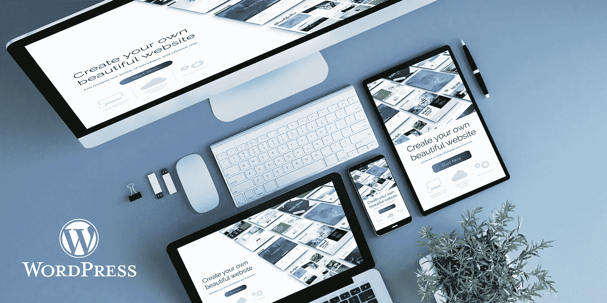
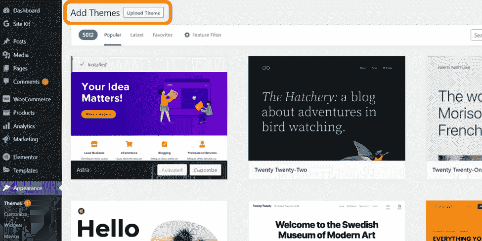
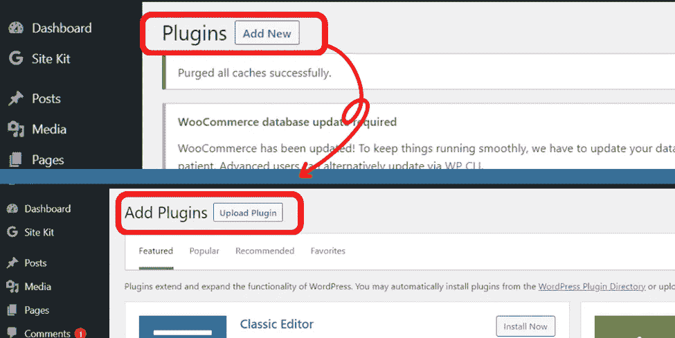
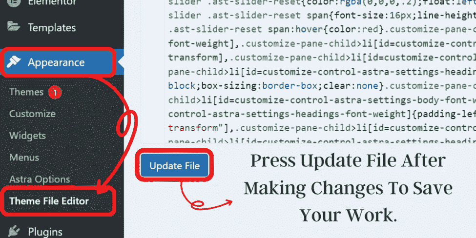
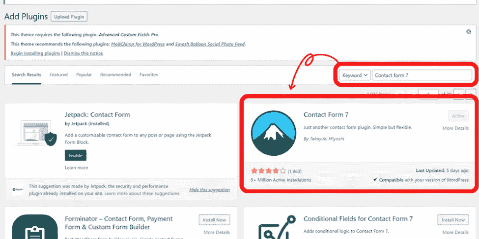

# 定制 WordPress 网站:定制指南

> 原文：<https://medium.com/coinmonks/custom-wordpress-websites-customization-guide-5391b301bc8a?source=collection_archive---------44----------------------->

## 有了 WordPress，你可以完全控制你网站的外观和感觉。您可以更改颜色、字体、布局等。

定制的 WordPress 网站是为特定的客户或企业特别设计和开发的。不像标准的 WordPress 网站，使用预先存在的主题，一个定制的 WordPress 网站是从零开始，使用定制的代码来满足客户的需求。这导致了一个独特的网站，不仅是 100%可定制的，而且高度优化的搜索引擎和转化率。

Business WordPress Websites: Customization Guide

建立定制的 WordPress 网站是一项重大投资，但长期收益远远超过前期成本。你不仅会有一个完美地反映你的品牌和商业目标的网站，而且你还可以不断地改变和更新，而不需要每次都雇佣一个开发者。

**另一个有趣的阅读:** [***学习网络开发成为高收入技能***](https://lifemasterytips.com/learn-web-development-as-a-high-income-skill/)

创建自定义 WordPress 网站有几种不同的方法。一种选择是购买一个预制的主题，然后定制它以满足您的特定需求。另一种选择是从头开始创建一个自定义主题。

如果你不是开发人员，第一种选择可能是最好的。许多很棒的主题可供购买，无需编码知识就可以轻松定制。

***WordPress 主题的好处:***

*   易于使用: WordPress 主题被设计成易于使用
*   灵活性: WordPress 的主题可以定制以满足任何需求。
*   **预制设计:**预制 WordPress 主题可用。
*   支持:主题开发者会在你遇到任何问题时提供支持。

然而，如果你是一个开发者或者有一些编码知识，从头开始创建一个定制主题是可行的。这将让你完全控制你的网站的外观和感觉，让你创造出真正独特的东西。

创建一个定制的 WordPress 网站可能会有很多工作，但最终还是值得的。花时间规划你的网站并确保它满足你的所有需求是很重要的。一旦你有了一个合适的计划，创建网站将变得更加容易。

# 定制和调整

首先，你需要选择一个可以轻松定制的 WordPress 主题。有数以千计的主题可供选择，所以花些时间浏览选项，找到你喜欢的。一旦你找到了一个主题，是时候开始定制它来满足你的需求了。

你需要做的第一件事是在你的 WordPress 站点上安装主题。这可以通过在你的 WordPress 仪表盘的“外观”部分选择“主题”来完成然后，点击“新建”并上传主题文件。

一旦安装了主题，你需要激活它。你可以在你的 WordPress 仪表盘的“外观”部分选择“主题”来做到这一点然后，找到你想激活的主题，点击“激活”按钮。

Custom WordPress Websites: Customization Guide

既然主题已经激活，您就可以开始定制它了。具体的过程会根据你使用的主题而有所不同，但是大多数主题都有一个“定制”页面，允许你改变你的站点的外观和感觉。

您可以在这里更改配色方案、字体、徽标和其他设计元素。您可以在网站中添加或删除部分，如博客或联系人表单。完成所有所需的更改后，单击“保存并发布”按钮保存您的更改。

# 插件的使用

如果你不是开发者，那么你可能想知道如何在你的 WordPress 站点上添加自定义代码。最简单的方法是使用插件。有数以千计的插件可供选择，所以你一定会找到一个满足你需求的。

要安装插件，请转到你的 WordPress 仪表盘的“插件”部分，点击“添加新插件”然后，搜索您想要安装的插件，并单击“立即安装”按钮。一旦安装了插件，一定要激活它。

Custom WordPress Websites: Customization Guide

一旦插件被激活，你需要配置它。具体的过程会根据你的插件而有所不同，但是大多数插件都有一个“设置”页面，你可以在那里输入你想要的设置。

配置完插件后，点击“保存更改”按钮保存您的更改。就是这样！现在你已经向你的 WordPress 站点添加了自定义代码，而不需要你自己编写任何代码。

# 创建一个手机友好的网站

随着超过 60%的网络流量来自移动设备，确保您的网站针对小屏幕进行优化比以往任何时候都更加重要。自定义 WordPress 网站是自动响应的，这意味着它们可以适应任何屏幕尺寸，无论你的访问者使用什么设备，都能给他们最好的体验。

确保你的 WordPress 站点是手机友好的是很重要的。越来越多的人使用他们的智能手机和平板电脑浏览网页，所以你要确保你的网站在所有设备上看起来都很棒。最简单的方法是安装一个插件，为移动设备自动优化你的网站。很多插件都有，找一个符合自己需求的吧。

一旦你找到一个插件，请在你的 WordPress 站点上安装并激活它。一旦插件被激活，它将自动开始为移动设备优化您的网站。您通常可以配置插件设置来满足您的特定需求。例如，您可能希望禁用移动网站上的某些功能，或者更改内容的显示方式。

# 自定义您的网站在脸书上的外观

如果你想控制你的网站在脸书上共享时的外观，你需要安装脸书开放图协议。这是一段代码，允许你控制你的网站如何出现在脸书上。

要安装脸书开放图表协议，请转到 WordPress 仪表盘的“设置”部分，选择“共享”然后，向下滚动到“脸书”部分，并单击“添加打开的图形标签”按钮。

一旦安装了脸书开放图协议，你就可以开始定制你的网站在脸书上的外观了。具体过程将根据您的需求而有所不同，但您通常可以更改标题、描述和在脸书上共享您的网站时显示的图像等内容。

请务必单击“保存更改”按钮来保存您的更改。就是这样！您现在已经自定义了您的网站在脸书上的外观。

# 创建自定义页面模板

WordPress 的一个优点是你可以创建自定义的页面模板。这允许您为页面创建独特的布局，而无需编辑主题的代码。

要创建自定义页面模板，首先在你的 WordPress 主题中创建一个新文件。该文件应该命名为“template-name.php”，其中“name”是您的模板的名称。

接下来，您需要在文件的顶部添加一些代码。这段代码会告诉 WordPress 这是一个定制的页面模板。您需要使用的确切代码将根据您的主题而有所不同，但应该是这样的:

> **<？php**
> 
> **/***
> 
> **模板名称:模板名称**
> 
> ***/**
> 
> **？>**

一旦添加了模板名称代码，就可以开始添加自定义代码了。您需要的确切代码将根据您的需要而有所不同，但是您可以从添加 HTML、CSS 和 JavaScript 代码开始。添加自定义代码后，单击“保存更改”按钮保存您的更改。

# 允许无限滚动

如果你想在你的 WordPress 站点上允许无限滚动，你需要安装一个插件。很多插件都有，找一个符合自己需求的吧。一旦你找到一个插件，请在你的 WordPress 站点上安装并激活它。

一旦插件被激活，它会自动优化你的网站无限滚动。您通常可以配置插件设置来满足您的特定需求。例如，当用户向下滚动时，您可能想要更改已加载帖子的数量。就是这样！你现在已经在你的 WordPress 站点上添加了无限滚动。

# 定制您的颜色

如果你想改变你的 WordPress 站点的颜色，那么你需要编辑你的主题的 style.css 文件。具体的过程会根据你的主题而有所不同，但是你通常可以在你的 WordPress 仪表盘的“外观”部分找到 style.css 文件。

Custom WordPress Websites: Customization Guide

一旦你找到了 style.css 文件，你就可以开始定制你的 WordPress 站点的颜色了。具体的过程会根据你的需要而有所不同，但是你通常可以改变网站背景、文本和链接的颜色。

# 切换到静态主页

如果你想切换到静态主页，你需要进入你的 WordPress 仪表盘的“设置”部分，选择“阅读”然后，向下滚动到“首页显示”部分，并选择“静态页面”选项。

接下来，你需要为你的主页和博客选择一个页面。完成后，单击“保存更改”按钮保存您的更改。就是这样！你现在已经切换到一个静态主页。

# 我如何为我的业务定制 WordPress？

关于定制 WordPress 网站的伟大之处在于，它们可以被定制以适应任何业务，不管你在哪个行业。无论你需要一个电子商务商店，一个简单的小册子网站，还是介于两者之间的东西，WordPress 解决方案都会为你工作。

一些最常见的定制包括:

*   ***添加电子商务商店***
*   ***创建自定义表单和联系人页面***
*   ***与第三方软件集成***
*   ***构建自定义登陆页面***

为你的企业定制 WordPress 是开始网站设计的好方法。从小型企业到大型企业，它都可以使用。最棒的是，这相对来说很容易做到。让我们讨论一些如何为你的业务定制 WordPress 的技巧。

# 1.选择合适的主题

当你为你的企业定制 WordPress 的时候，你需要做的第一件事就是选择一个合适的主题。主题应该是专业的，并且与你网站的整体外观和感觉相匹配。它也应该很容易定制，以添加您的独特风格。

# 2.添加插件

添加插件是扩展你的 WordPress 站点功能的好方法。从电子商务到社交媒体整合，各种插件都有。最重要的是，它们相对容易安装和使用。

# 3.创建自定义页面

创建自定义页面是向你的 WordPress 站点添加更多内容的好方法。您可以使用自定义页面来展示您的产品和服务，或者提供有关您的企业的更多信息。

# 4.定制您的颜色

改变你的 WordPress 站点的颜色是给它一个新的外观的好方法。你可以改变网站背景、文本和链接的颜色。最重要的是，这相对容易做到。

# 5.使用小部件

小部件是向你的 WordPress 站点添加更多内容和功能的好方法。您可以使用小部件来显示您最新的博客帖子、社交媒体订阅源，甚至提供有关您企业的更多信息。

# 6.为搜索引擎优化你的网站

如果你希望你的 WordPress 站点成功，你需要确保它为搜索引擎优化。你可以安装一个插件，像 Yoast SEO 或所有在一个 SEO 包。

# 7.添加电子商务插件

如果你想在你的 WordPress 网站上销售产品或服务，你需要安装一个电子商务插件。WooCommerce 和 WP 电子商务是两个最受欢迎的选择。

# 8.创建自定义徽标

创建一个自定义的 logo 是给你的 WordPress 站点打上品牌的好方法。您可以使用 Adobe Photoshop 或 GIMP 等程序为您的网站创建专业外观的徽标。

就是这样！这些只是为你的业务定制 WordPress 的一些小技巧。通过遵循这些建议，你可以创建一个专业和成功的网站。

# 联系表单、在线商店和社交图标

如果你希望人们能够通过你的 WordPress 站点联系你，那么你需要添加一个联系表单。最好的方法是安装一个像 Contact Form 7 或者 Gravity Forms 这样的插件。

Custom WordPress Websites: Customization Guide

# 创建在线商店

如果你想在你的 WordPress 网站上销售产品或服务，你需要创建一个在线商店。最好的方法是安装一个像 WooCommerce 或 WP eCommerce 这样的插件。

# 添加社交图标

如果你希望人们能够在社交媒体上分享你的内容，那么你需要在你的 WordPress 站点上添加社交媒体按钮。最好的方法是安装一个插件，比如社交媒体羽毛或者简单的分享按钮添加器。

# 最终想法|自定义 WordPress 网站

为你的企业定制 WordPress 是开始网站设计的好方法。从小型企业到大型企业，它都可以使用。最棒的是，这相对来说很容易做到。在这篇文章中，我们给了你一些如何为你的业务定制 WordPress 的技巧。你还在等什么？今天就开始吧！

> 交易新手？试试[加密交易机器人](/coinmonks/crypto-trading-bot-c2ffce8acb2a)或者[复制交易](/coinmonks/top-10-crypto-copy-trading-platforms-for-beginners-d0c37c7d698c)