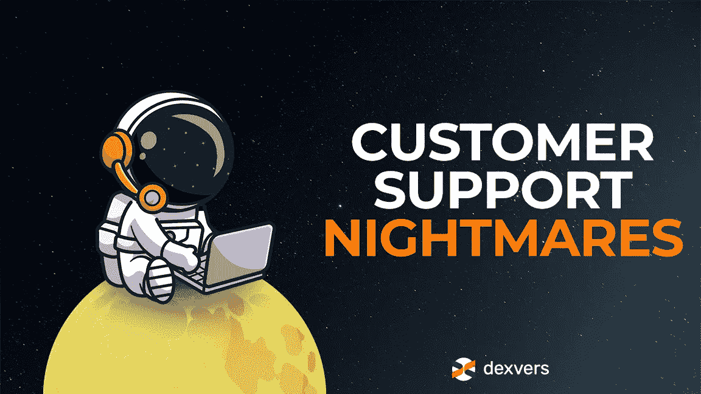

# 加密中的客户支持—我们的社区共享噩梦

> 原文：<https://medium.com/coinmonks/customer-support-in-crypto-our-community-shares-nightmares-324d72fdafac?source=collection_archive---------39----------------------->

crypto 中的客户支持经常被比作 404 错误——无处可寻。默认情况下，集中式加密交换提供客户服务，但通常来的太少或太晚。然而，分散的交易所很少(实际上从不)提供任何类型的客户服务。你是做什么的？

加密新手避免使用 dex 正是因为他们缺乏支持，但是继续使用 CEXs 是有代价的(主要是神经)。在这篇文章中，我们将分享一些我们的社区成员发现自己身处的困境，并尝试提供一个解决方案——是时候从这场噩梦中醒来了！

# 1.锁定资金

我们的一个社区成员与一个最大的密码交易所进行了一场真正的小型战争。他想改账号密码，进入了噩梦。代理人要求他提供一张截图，以证明该账户确实是他的。他发的。交易所不允许电子邮件中包含附件，因为它会自动将其视为垃圾邮件。

过了一小会儿，他友好地再次联系代理，解释说他不能发送任何东西的截图。他得到的回复？和第一封邮件一模一样——“请给我们发个截图”。这种情况持续了几个星期，他的资金一直被锁定！

# 2.无尽的 KYC 烦恼

好吧，没有平稳的 KYC 程序。但是你能想象每天都经历这些吗？！这正是发生在我们社区成员#2 身上的事情。出乎意料的是，他的账户被认为未经验证，并被禁止买卖。他再次办理了 KYC 的手续，账户被解锁了。直到明天。然后他需要再次经历同样的磨难。

最棒的部分？他向客户支持代理提出了一个案例，被告知很快会有人来处理，两个月后收到了一个一般性的回复。

# 3.信用卡被拒

我们的一个社区成员抱怨了另一个著名的集中交易所的情况。她的信用卡虽然状况良好，每天都用来购物，却不断被交易所拒绝。

她很着急(这是 2020 年 3 月的黑天鹅事件)，因为她想以 3400 美元的价格购买这个终极 dip——1 BTC。她联系了客户服务代理，他们说他们正在调查此事，希望很快得到答复。三个星期后，她能够添加她的卡，但蘸没有了。

一个合乎逻辑的问题可能是——她为什么不尝试通过另一个交换？但是如果有人告诉你“很快就会修好”，这看起来是个简单的问题，难道你不会至少等一天吗？问题是，在这种情况下，即使一天也太长了，更不用说三周了。

# 4.密码泄露

某交易所被黑。不仅资金被盗，而且用户的所有个人数据——他们的姓名、地址——全部被盗！很自然，每个人都很恐慌，想要任何关于黑客攻击的信息。我们的社区成员#4 知道在这些时刻有一个危机管理程序，但无法相信他和数百名其他用户从未收到回复。

“我们在 Telegram 上进行了一次群聊，想自己找出答案，或者至少分担一下负担。他说，“这个小组的 200 多名成员中，至今没有人收到回复。”。该成员还补充说，他很幸运，他的资金“只值一顿普通的饭”，但他更关心的是现在谁有他的个人信息。

# 5.不是我们的问题

我们知道客服人员不是巫师，但我们的一些会员抱怨客服人员在沟通中的态度和语气。我认为在加密客户支持中最糟糕的部分是收到普通的回复，但如果你问我，复制粘贴的回复随时都会击败被动的攻击，”一名成员分享并补充道:“所有这些电子邮件都是可以获得的，我只是不明白怎么会有人说“这是你的错，不要再联系我们了”，然后收到他们的薪水！”'

糟糕的响应时间、缺乏解决方案、笼统的响应，甚至粗鲁——许多 crypto 爱好者在 crypto 中处理客户支持时都会遇到这些不愉快的情况。那么，我们能做些什么呢？

# 这个故事的寓意

我们并不是说 crypto 的每个人都有垃圾客户支持。有一两个期望，说实话，这些年来总体反应有所改善。然而，我们离完美还很远。

这里的问题是——如果您想获得(任何)加密客户支持，您必须使用 CEXs。然而，至少可以说，集中式交易所是脆弱的，并且日益显示出越来越多的缺陷。dex 很棒，但是 DeFi 中最大的名字提供 0 客户支持。

见见 dex vers——一个提供两个世界最佳产品的交易所。Dexvers 是一个分散的交易所，但与它的兄弟公司不同，DXVS 将通过聊天和电子邮件提供 24/7 的客户支持。这种分层的客户服务甚至会提供法律和会计建议！

一旦我们启动，您将能够获得您需要的所有支持！

敬请期待！

–

**免责声明** : *本文提供的信息不是法律、会计或财务建议。这些信息不应被解释为投资或交易建议，也不意味着是购买、出售或持有任何加密货币的恳求或建议。*

> 交易新手？试试[密码交易机器人](/coinmonks/crypto-trading-bot-c2ffce8acb2a)或[复制交易](/coinmonks/top-10-crypto-copy-trading-platforms-for-beginners-d0c37c7d698c)