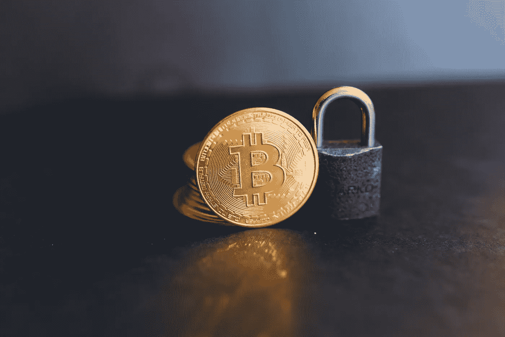
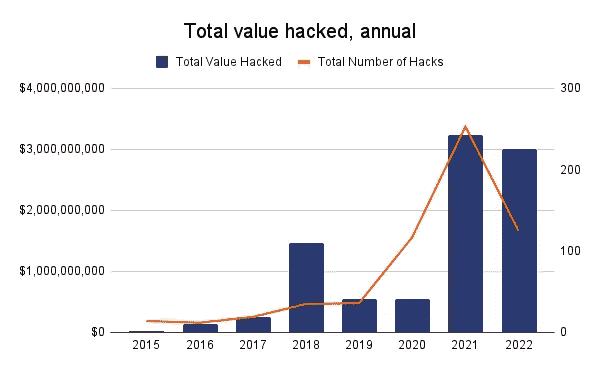

# 网络安全挑战挑战发展

> 原文：<https://medium.com/coinmonks/cyber-security-challenges-defi-development-4b71213b9aee?source=collection_archive---------26----------------------->

2022 年 10 月，价值超过 7 亿美元的黑客攻击和盗窃事件令人难以置信地激增，导致加密货币市场的所有参与者重新审视 Web3 的安全问题。当我谈到 Web3 生态系统时，我指的不仅是加密货币，而是一般的区块链原则，以及建立在它之上的 Metaverses、NFT 和 DeFi。

# 2022 年负记录

此前，就整体损害和黑客攻击总数而言，2021 年是区块链黑客攻击创纪录的一年。然而，按照目前的速度，2022 年很可能会超过去年的数字。

这也是当前攻击的一个特征:2019 年，大多数黑客攻击发生在集中式加密货币交易所，但随着这些公司提高安全性，绝大多数黑客攻击(2022 年约为 90%)发生在 DeFi 协议上。

# 为什么会这样？

DeFi 导致加密货币在 2021 年初快速增长，但自那以后，加密货币市场的价格暴跌。全球市场在这一过程中发挥了作用，但在网络安全和(通常是自私的)象征性通胀模型方面，开发商的鲁莽也发挥了作用。

首先，太多的 DeFi 都是建立在虚无的代币或以高利率为其他代币融资的代币基础上，这两种代币都没有真正的经济基础来提供所提议的(而且往往非常高的)回报。

第二，安全问题:DeFi contract 和 bridge 黑客攻击和利用非常普遍，DeFi 最知名的平台都遭受了某种形式的利用。据知，黑客最重要的目标是跨桥:2022 年 10 月，三座桥遭受了总数的 82%的损害。据 Chainalysis 称，其中最大的黑客攻击是币安 BNB 智能链和信标链之间的桥梁中的 1 亿美元漏洞。

第三，缺乏定义 DeFi 合同的通用标准限制了 DeFi 使用自己的智能合同平台和工具，这也限制了增长潜力、通用客户以及最终的接受度。

# 那是传销吗？

2021 年年中，创建了几个承诺回报但没有任何实际经济基础的项目。一些收益率达到 200%,其中许多是通过铸造更多相同的任意创造的代币来支付的。事实上，金字塔计划被用来确保盈利:一个需要不断增加的新用户数量来创造需求的系统。只有增加新用户，承诺的收益才能维持。毕竟，几个提供高收益代币的 DeFi 操作已经遭受了灾难性的挫折(Terra，Voyager，Celsius)。

DeFi 的未来很可能不在于那些承诺回报但没有代币铸造以外的实际经济活动支持的代币。

# 网络安全:生存还是毁灭

DeFi 的另一个特点是大量项目的储备或用户受到外部和内部的破坏。例子包括 Ronin，Polygon，Blizzard，Wormhole，Meter Bridge，以及最近的币安智能链(BSC)。委婉地说，一些攻击显示了安全措施的薄弱。

这听起来很奇怪，但一些项目已经失去了很大一部分储备，几天或几周过去了，才有人注意到或报告泄漏。也有协议的例子，这些协议被编码为在不检查账户余额的情况下转移金额。一些协议黑客是由显然未经全面身份检查就被雇佣的开发人员所为。这些事件可以成为社区的有益经验，并有助于建立明确的规则和条例。

# 下一步是什么？

当然，区块链科技旨在让财务分享更容易，吸引更多用户。然而，大多数 DeFi 仅仅关注那些已经在加密社区中的金融产品，通过基于借用、借出和洗牌加密令牌来创建这些产品。DeFi 的进一步发展将通过满足现实世界人口的需求而得到支持。

BNPL(现在购买，以后支付)等 DeFi 产品的推出是通过利用实物的令牌化技术实现的，该技术使用类似于 ERC-721 的不可移动令牌标准(NFT)。其中一些产品是基于贷款来为令牌化的现实世界项目融资，如作为工作工具的智能手机，以及最近甚至是抵押贷款融资。

DeFi 产品受到能够为分散的代理和客户服务的真实元素的保护，并基于此类金融交易的实际回报。很可能会继续出现更多的产品来支持现实世界的金融交易并解决银行业的问题。

# 结论

DeFi 能够接触到数百万没有得到传统银行和金融系统服务的人。如果 DeFi 放弃其最初的愿望，这种潜力更有可能实现。最初的愿望是更专注于虚假回报的产品，而这些回报不是由借款人提供的，也不是由借款人创造的实际价值，而是更依赖于简单的印刷无担保代币。

没有必要重新发明轮子。除了更严格和彻底的测试和开发之外，使用已知的方法就足够了:独立的系统监控和警告。DeFi 项目将在未来取得成功，它将从根本上与安全相关，研究前人的问题和经验。

***

如果你喜欢我的文章，请鼓掌并写下评论。

谢谢大家！

*最初发表于*[*【https://www.linkedin.com】*](https://www.linkedin.com/pulse/cyber-security-challenges-defi-development-kiryl-shcharbinin)*。*

> 交易新手？尝试[加密交易机器人](/coinmonks/crypto-trading-bot-c2ffce8acb2a)或[复制交易](/coinmonks/top-10-crypto-copy-trading-platforms-for-beginners-d0c37c7d698c)