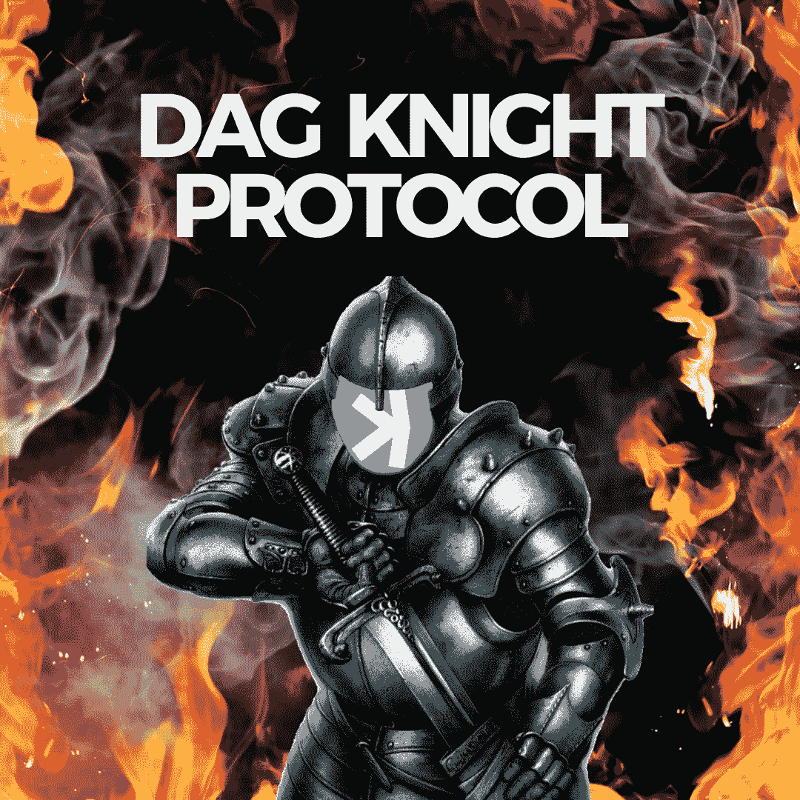

# DAG KNIGHT 协议:对其潜力和挑战的深入研究

> 原文：<https://medium.com/coinmonks/dag-knight-protocol-a-closer-look-at-its-potential-and-challenges-9b84d4ae7c4b?source=collection_archive---------17----------------------->

## 这不是另一个提到$KAS 和抓住几个追随者的机会。我想分享我的观点和想法来帮助你理解为什么我相信 DAGK 之夜有潜力对人类的未来产生重大影响。

***Tl；dr:*** *DAG KNIGHT 是一种分布式分类帐协议，它利用有向无环图(DAG)作为其数据结构。由于其快速的交易速度和低廉的费用，它有可能彻底改变金融、医疗保健和电子商务等行业。仍然有一些挑战需要克服，例如可伸缩性和分散性，但是它的潜力值得那些对加密领域感兴趣的人考虑。*

# 先说为什么“可以这么特别”

DAG KNIGHT 是一种分布式分类帐协议，它利用有向非循环图(DAG)作为其数据结构。Dag 是一种图，其中节点之间的边是有序和有向的，这意味着它们具有特定的方向，并且不能以相反的方向遍历。这使得 DAG KNIGHT 能够比传统的区块链更快、更高效地处理交易，因为交易可以并行而不是串行地进行验证并添加到分类帐中。

DAG KNIGHT 背后的团队由来自各个领域的高技能专业人员组成，包括计算机科学、密码学和分布式系统。他们致力于不断改进和推进该协议，并获得了加密货币行业知名投资者的支持。他们的专业知识和承诺使他们成为 DAG KNIGHT 成功的强大推动力

DAG KNIGHT 的一个主要用例是小额支付。凭借其快速的交易速度和低廉的费用，DAG KNIGHT 非常适合在传统区块链上处理不切实际或过于昂贵的小型金融交易。它还可以用于分散式交易所，允许用户直接相互交易加密货币，而不需要中央机构。此外，DAG KNIGHT 可用于供应链管理，允许企业在货物通过供应链时跟踪和验证货物的来源。

在未来，DAG KNIGHT 有潜力在加密领域和其他领域扮演重要角色。它快速高效地处理交易的能力可以彻底改变金融、医疗保健和电子商务等行业，让企业和消费者更容易交换价值和进行交易。

DAG KNIGHT 也有一些潜在的缺点。该协议面临的最大挑战之一是可扩展性。随着越来越多的用户和事务添加到网络中，DAG 可能会变得拥塞，事务速度可能会降低。为了解决这个问题，DAG KNIGHT 团队正在不断研究新的技术和策略，以提高网络的可扩展性。另一个潜在的问题是缺乏分散性，因为协议依赖于一小组“看门人”来验证交易。然而，DAG KNIGHT 团队正在研究在保持协议效率的同时增加去中心化的方法。

总的来说，DAGKNIGHT 是一个有前途的协议，它为分布式分类帐技术提供了一种独特的方法。虽然它仍有一些挑战要克服，但它有可能彻底改变我们在数字世界开展业务和交换价值的方式，这使得它值得那些对加密领域感兴趣的人考虑。

来 twitter 看我-> https://Twitter . com/crako 01/status/1605515584782876675？s=20&t=FpMrD6nHl80WLwNWJDGR5w

> 交易新手？在[最佳密码交易所](/coinmonks/crypto-exchange-dd2f9d6f3769)上尝试[密码交易机器人](/coinmonks/crypto-trading-bot-c2ffce8acb2a)或[复制交易](/coinmonks/top-10-crypto-copy-trading-platforms-for-beginners-d0c37c7d698c)