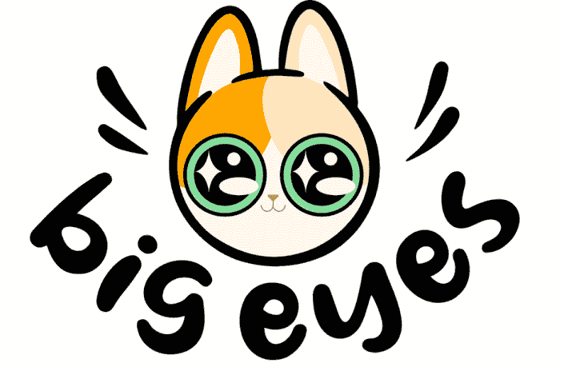
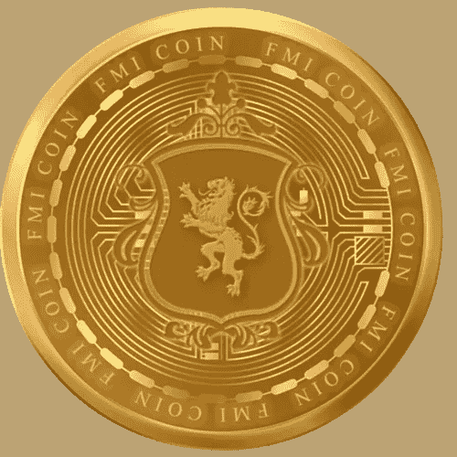

# 每日加密新闻

> 原文：<https://medium.com/coinmonks/daily-crypto-news-3d9375eb866?source=collection_archive---------17----------------------->

1.  **Dogecoin 取代 Cardano 成为第六大密码货币—** 最近，Dogecoin (DOGE)的行为更像一只灰狗，而不太像代表基于模因的密码货币的 Shiba Inu。自周二以来，DOGE 的价格从 0.0594 美元上涨了 150%，至 0.15 美元——仅在过去 24 小时内价格就上涨了 74%， [CoinDesk 数据显示](https://www.coindesk.com/data/)。随着涨势升至六个月高点，DOGE 已经取代 Ethereum 的竞争对手 Cardano 的本地代币 ADA，成为[世界第六大密码货币。在](http://world.at/)新闻发布时间，2013 年作为笑话开始的 DOGE 市值约为 175 亿美元，而 ad a 市值为 145 亿美元。目前，DOGE 的市值超过了 S & P 500 的 120 多个成员。
2.  **ICE 对加密平台 Bakkt 的股份进行 11 亿美元的减记—** 根据证交会周五下午提交的文件，洲际交易所(ICE)对加密平台 Bakkt ( [BKKT](https://finance.yahoo.com/quote/BKKT?p=BKKT&.tsrc=fin-srch) )的股份进行 11 亿美元的减记。总部位于亚特兰大、为机构投资者提供加密和其他数字资产的巴克特公司，除了无形资产损失 1.5 亿至 1.6 亿美元外，还将承受商誉损失 13 亿至 14 亿美元的减值。根据公认会计原则(GAAP)，密码货币被视为无形资产，这意味着它们必须在一定时期内以最低价格减记，并且在出售前不能提价。
3.  **Dogeliens 希望像比特币和 dog econ 一样一路高歌猛进—** Dogeliens 是一种新的密码货币，其灵感来自一直闻名的 dog econ(DOGE)和 Shiba Inu (SHIB)，但增加了实用性，使其成为更忠诚的合作伙伴。Dogeliens 计划通过向地球人提供教育内容、慈善理念和游戏，让世界变得更美好(就像狗经常做的那样)。Dogeliens 是为投资者、持有者和用户提供的分散融资(DeFi)。用户可能通过开源 P2P(点对点)密码货币赚取硬币和股份，这将允许他们匿名安全地进行在线交易或兑换货币，而无需与任何第三方平台打交道。
4.  **比特币蓬勃发展，大眼睛即将推出，法定货币变得炙手可热—** 尽管有很多关于比特币(BTC)及其飙升对其他代币的影响的炒作，但这并不是积极消息的终结。全新的迷因硬币——大眼睛硬币(Big)正在最近的成功和信心浪潮中冲浪，其预售资金飙升至 900 多万美元。这种爆炸性的预售不仅为推出一种新的有趣的迷因硬币展示了非常有希望的迹象，而且也证明了人们对加密的信心正在回归。投资者在新产品和项目中看到了潜力，并将其资产投入到未来的成功中。这些老牌金融家和他们的仆人现在可能正在咬指甲:去中心化的金融卷土重来，准备再次证明加密可以在没有他们监督的情况下重新分配财富。
5.  **生成性艺术 NFT 为加密冬天带来新的热度——**在持续的加密冬天的[严寒条件](https://www.coindesk.com/layer2/2022/08/08/9-survival-tips-for-crypto-winter/)中，[不可替代代币](https://www.coindesk.com/learn/what-are-nfts-and-how-do-they-work/) (NFT)交易量[自去年第三季度以来大幅下降](https://www.coindesk.com/web3/2022/10/13/despite-crypto-bear-market-web3-developers-are-still-building-study-shows/)。虽然 NFT 的繁荣带来了一波受欢迎的 PFP 项目和数百万美元的 JPEG 销售，但随着 NFT 市场似乎失去动力，这些趋势变得不那么活跃了。但是在 9 月下旬，一位艺术家通过出售他的新的生成艺术 NFT 收藏，赚了 1700 万美元——这是一个充满希望的迹象，表明这些基于算法的设计重新点燃了人们对 NFT 市场的兴趣。合作生成艺术实验背后的艺术家泰勒·霍布斯(Tyler Hobbs)卖出了 900 张这种薄荷通行证，每张售价 14 ETH(当时约为 18729 美元)。该项目强调了观众策展成为一个生成性艺术收藏的概念 QQL 算法[向公众](https://qql.art/create)开放，但只有 mint 通行证持有者才能将他们最喜爱的创作铸造为 NFT，并成为[官方收藏的一部分](https://opensea.io/collection/qql)。
6.  **伊隆·马斯克表示，在坎耶·韦斯特的账户恢复后，他将为 Twitter 创建一个“内容审核委员会”——**伊隆·马斯克在以 440 亿美元的交易接管该公司后，于周五宣布了创建 Twitter“内容审核委员会”的计划。推特[的新主人在推特](https://twitter.com/elonmusk/status/1586059953311137792?s=20&t=tsJwiFkJPyY2DNH9xi0VBQ)上写道，该机构将由持有“广泛不同观点”的人组成马斯克说:“在委员会召开之前，不会有重大的内容决定或账户恢复。”他补充道:“非常清楚，我们还没有对 Twitter 的内容审核政策做出任何改变。”
7.  **大眼睛币、Apecoin 和比特币持有者可能是 2023 年的最大赢家之一—** ApeCoin (APE)、比特币(BTC)和大眼睛币(Big)是价格涨幅可能高于其他货币的顶级加密货币，这些加密资产的持有者可能是未来一年的最大赢家之一。加密资产在效用上是独特的，并且具有独特的特征。然而，他们增加你财富的可能性是专家们认为他们共有的一个因素。

还看了关于新币: [*FMI 币*](http://www.fmicoins.com/)

[FMI](http://www.fmicoins.com/) 是建立在币安智能链上的数字货币。FMI 是为公司 FMI 网络而构建的。更具体地说，它包括自己的产品，如投资不同类型的项目，创造新的项目等。FMI COIN (FMI)是一种加密货币，部署在币安智能链(BSC BEP-20)上

合同:[0x9d 427 e 2 Fe 3a D2 CB 93 f 83118d 472 a 6068 b4a 778d 6](https://bscscan.com/token/0x9d427E2fe3ad2Cb93F83118d472A6068B4a778D6)

可以在 [Pancakeswap](https://pancakeswap.finance/) 或者 [Bitkeep App](https://bitkeep.com/download) 上购买 FMI 币。
你可以通过这个来了解详细情况👇

[https://FMI coins . medium . com/how-to-create-FMI-wallet-on-bit keep-app-e 44 a2 a 998 e6a](https://fmicoins.medium.com/how-to-create-fmi-wallet-on-bitkeep-app-e44a2a998e6a)

看看我们的[网站](http://www.fmicoins.com/):[https://fmicoins.com/](https://fmicoins.com/)

给我们接通 https://t.me/fmicommunityofficial 的[电报](https://t.me/fmicommunityofficial):

> 交易新手？尝试[加密交易机器人](/coinmonks/crypto-trading-bot-c2ffce8acb2a)或[复制交易](/coinmonks/top-10-crypto-copy-trading-platforms-for-beginners-d0c37c7d698c)