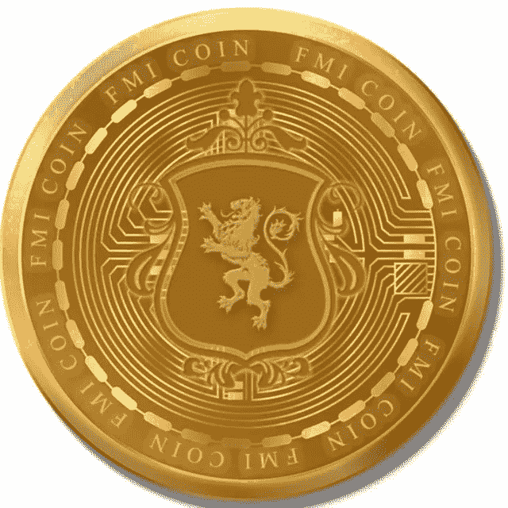

# 每日加密新闻

> 原文：<https://medium.com/coinmonks/daily-crypto-news-7966028af44d?source=collection_archive---------11----------------------->

1.  **Maple Finance 的 5400 万美元不良债务显示了无抵押加密贷款的风险——**总部位于区块链的贷款协议 [Maple Finance](https://www.coindesk.com/markets/2021/03/18/maple-finance-raises-14m-for-its-reputation-based-defi-lending-platform/) 始于 2021 年 5 月，有一个大胆的概念:为加密货币建立一个分散的信贷市场，贷方和借方可以在这里走到一起。与近年来在新兴的数字资产行业涌现的许多其他[分散金融](https://www.coindesk.com/learn/what-is-defi/) (DeFi)贷款平台不同，Maple 的模式不需要额外的加密货币作为抵押品，可以在违约时被没收或迅速清算。相反，各种贷款“资金池”的承销商将决定是否发放贷款——本质上是只根据借款人的信誉来评估他们的支付能力。
2.  **韩国检察官表示，Terra 加密货币逃犯 Kwon Do-hyung 上个月飞往塞尔维亚，韩国检察官告诉*forcast*，证实了当地媒体的报道。首尔南部地区检察官办公室的检察官 Choi Sung-kook 表示，尚未确认新加坡加密货币公司 Terraform Labs Pte 的前负责人。仍在塞尔维亚。Choi 说，韩国司法部正在请求塞尔维亚政府的调查协助，证实了当地联合通讯社的一篇报道。Kwon 是一名韩国国民，通常被称为 Do Kwon，他的护照于上个月被取消，这是寻找并将其引渡到韩国的努力的一部分，他在韩国面临多项指控，包括欺诈和违反资本市场法。国际刑警组织对 Kwon 发出了“红色通缉令”，要求世界各地的执法部门找到并暂时逮捕一个人。据信，他于 9 月离开新加坡的家，前往迪拜，然后前往塞尔维亚。**
3.  **比特币、以太网下跌，因市场为 11 月通胀数据做好准备—** 周一上午，比特币和以太网在亚洲交易中小幅下跌，除莱特币外，其他所有非稳定的比特币加密货币均在前十名。投资者等待着将于周二公布的 11 月份消费者价格指数，这是一个关键的通胀指标，同时为周三的另一次加息做准备。
4.  **凯西·伍德说 FTX 的山姆·班克曼·弗里德不喜欢比特币，因为他“无法控制它”——**上个月，Ark Invest 首席执行官凯西·伍德因坚持看好比特币而掀起波澜。尽管加密货币今年下跌了 60%以上，当时低于 17，000 美元，但她自信地[预测](https://www.bloomberg.com/news/videos/2022-11-22/wood-bitcoin-will-be-1-million-per-coin-by-2030-video)到 2030 年将达到 100 万美元，重申了她的公司在 4 月份做出的呼吁。本周末，她表示继续对比特币充满信心，并分享了数据来支持比特币，同时还批评了加密货币交易所 FTX 的创始人兼前首席执行官萨姆·班克曼-弗里德。上个月，FTX 突然崩溃，动摇了已经从“隐秘的冬天”中挣扎的行业的信心周六，Wood [发推文](https://twitter.com/CathieDWood/status/1601779274192605185)，“在不透明的中央集权玩家造成的危机中，比特币区块链没有漏过一拍。难怪萨姆·班克曼·弗里德不喜欢比特币:它是透明的、去中心化的。他控制不了。”伍德还分享了她的公司的一份比特币报告的链接，该报告称:“尽管市场波动与 FTX 的灭亡有关，但长期持有人持有的供应量——或者说供应量在 155 天或更早之前最后一次移动——在 11 月份持平。我们认为，尽管最近发生了一些事件，但这一数据点表明了持有者的长期关注和高度信念。如今，长期持有者的供应量占比特币总发行量的 72%。"
5.  **Sam Bankman-Fried“愿意作证”，Crypto 的新底层信号，Stablecoin 战争继续—** FTX 的 Sam Bankman-Fried 在国会议员 Maxine Waters (D-CA)和币安首席执行官之间的公开争吵后，继续抓住行业的注意力。与众议院金融服务委员会主席玛克辛·沃特斯的推特聊天实际上是上周[开始的](https://decrypt.co/116308/maxine-waters-thanks-sam-bankman-fried-ftx)，这位加州政治家邀请 SBF 在委员会作证，[甚至称赞](https://decrypt.co/116308/maxine-waters-thanks-sam-bankman-fried-ftx)他围绕 FTX 崩溃的“坦率”讨论。然而，直到本周，她的语气才有所改变。“你必须参加我们 13 日的听证会，”沃特斯写道。在 FTX 于 11 月申请破产保护几天后，第一次宣布的[听证会预计将揭示更多关于该行业最大的加密交易所之一如何崩溃，导致数百万投资者无法获得他们的钱。*您必须参加我们 13 日的听证会，如果稍后有更多信息需要分享，我们愿意继续安排听证会。(3/3)*](https://decrypt.co/114816/house-committee-sbf-binance-testify-ftx-collapse)
6.  **美国参议员表示，他认为“没有理由”存在加密——**在周日出现在 NBC 的“会见新闻界”节目中，蒙大拿州农民兼教师出身的美国参议员乔恩·特斯告诉主持人查克·托德，加密货币“无法通过我的嗅觉测试。”这位在参议院银行、住房和城市事务委员会任职的民主党参议员应邀参加该节目，讨论前民主党参议员 Kyrsten Sinema 的叛逃。“你用了一些丰富多彩的语言来描述密码，”托德在[节目](https://www.nbc.com/meet-the-press/video/full-tester-whether-sen-sinema-is-independent-or-democrat-the-label-doesnt-matter/NBCN184229623)接近尾声时问道。"政府应该监管还是禁止它？"“非此即彼，”特斯回答道。[密码监管并不复杂，密码怀疑论者说](https://wp.decrypt.co/108999/crypto-regulation-is-not-so-complex-crypto-skeptics-say/)“我找不到任何人能够向我解释除了合成品还有什么——这毫无意义，”他继续说道。“问题是……如果我们对它进行监管，它可能会让人们认为它是真实的。”“我不是监管者，也不是负责监管的金融人士，”Tester 否认道，但他总结了自己对加密的看法，说道，“我看不出这种东西存在的理由。真的没有。”
7.  **据报道，由于 FTX 的崩溃打击了其他平台，切尔西失去了 2500 万美元的加密赞助协议——彭博周五报道，加密贷款机构 Amber 将终止其对切尔西足球俱乐部的 2500 万美元赞助。此举是琥珀削减成本的一部分，因为 FTX 的崩溃使加密公司摇摇欲坠。FTX 的破产可能会危及其与迈阿密热火队和梅赛德斯 F1 车队的交易。根据彭博的一份报告，加密领域的压力迹象继续出现，因为贷款人琥珀集团将终止与英国足球巨头切尔西的赞助协议。彭博报道援引知情人士的话称，在二月份的一轮融资中估值为 30 亿美元的 Amber 将终止交易，作为削减成本措施的一部分。其计划包括在这家总部位于新加坡的集团的 700 名员工中裁员约 300 人。今年 3 月，Amber 同意支付 2000 万英镑(2500 万美元)收购其旗舰加密交易所 WhaleFin，成为切尔西的官方赞助商。**
8.  **比特币的闪电网络可能会进行隐私升级—** 比特币的第二层扩展平台闪电网络存在隐私问题。接收支付、请求退款以及打开和关闭支付通道(闪电节点之间的连接)——所有这些都会引起支付网络用户的隐私担忧。这些担忧激发了基于协议的解决方案，如“闪电技术基础 12”([BOLT 12](https://bolt12.org/))，这是一个提议的系统，不仅增强了隐私，还引入了许多其他有用的功能。(螺栓是类似于[比特币改进提案](https://www.coindesk.com/learn/what-are-bips-and-why-they-matter-to-bitcoins-future/)或 BIP 的闪电草案提案。)独立的系统也涌现出来——值得注意的是， [lnproxy](https://lnproxy.org/) ，一个发票隐私工具(发票只是付款请求)，以及 [LNURL](https://github.com/lnurl/luds) ，一套用于在各种 Lightning 应用程序和服务之间通过网络进行通信的工具。那么，一个关注隐私的比特币创造者该怎么做呢，是依靠羽翼未丰的 BOLT 12 规范，还是求助于这些独立工具之一？Rusty Russell 告诉 coin desk:“BOLT 12 和它所依赖的技术最大的优点是，你不需要任何其他东西。”Russell 是比特币基础设施公司 Blockstream 的核心闪电(CLN)的首席开发人员。"默认情况下，闪电节点会给每个人应有的隐私."
9.  币安的首席执行官试图警告山姆·班克曼-弗里德:“你现在造成的伤害越大，坐牢的时间就越长。”— 随着密码交易所的倒闭，首席执行官赵昌鹏警觉到其当时的老板山姆·班克曼-弗里德正在做出可能颠覆整个行业的举动，并试图阻止他，[《纽约时报》报道](https://www.nytimes.com/2022/12/09/technology/ftx-text-messages.html)。周五的报道援引获得的一条短信称，赵敦促班克曼-弗里德不要进行这位老板认为会加剧内爆引发的加密危机的交易。“现在停止，不要造成更多的损害，”赵在与班克曼-弗里德和其他加密高管的群聊中写道。"你现在造成的伤害越大，坐牢的时间就越长."在短信中，赵[指责的姐妹交易机构 Alameda Research 试图将稳定的比特币价格压低至 1 美元以下。分析人士一再警告说，如果系绳崩溃，将导致更大范围的加密崩溃。这位币安老板指出了阿拉米达的一笔 25 万美元的交易，他认为这笔交易是由班克曼-弗里德策划给德佩格·蒂瑟的。但这位 FTX 创始人否认了这些说法，称其“荒谬”，《NYT》报道。“我的忠告是:停止做任何事，”赵告诉他。“穿上西装，回到 DC，开始回答问题。”赵和班克曼-弗里德的代表没有立即回应知情人的置评请求。](https://markets.businessinsider.com/news/currencies/binance-boss-cz-sam-bankman-fried-ftx-alameda-tether-crypto-2022-12?utm_medium=referral&utm_source=yahoo.com)

还看了关于新币: [*FMI 币*](http://www.fmicoins.com/)

[FMI](http://www.fmicoins.com/) 是建立在币安智能链上的数字货币。FMI 是为公司 FMI 网络而构建的。更具体地说，它包括自己的产品，如投资不同类型的项目，创造新的项目等。FMI COIN (FMI)是一种加密货币，部署在币安智能链(BSC BEP-20)上

合同:[0x9d 427 e 2 Fe 3a D2 CB 93 f 83118d 472 a 6068 b4a 778d 6](https://bscscan.com/token/0x9d427E2fe3ad2Cb93F83118d472A6068B4a778D6)

可以在 [Pancakeswap](https://pancakeswap.finance/) 或者 [Bitkeep App](https://bitkeep.com/download) 上购买 FMI 币。
你可以通过这个来了解详细情况👇

[https://FMI coins . medium . com/how-to-create-FMI-wallet-on-bit keep-app-e 44 a2 a 998 e6a](https://fmicoins.medium.com/how-to-create-fmi-wallet-on-bitkeep-app-e44a2a998e6a)

看看我们的[网站](http://www.fmicoins.com/):【https://fmicoins.com/】T4

给我们接通[电报](https://t.me/fmicommunityofficial):[https://t.me/fmicommunityofficial](https://t.me/fmicommunityofficial)

> 交易新手？尝试[加密交易机器人](/coinmonks/crypto-trading-bot-c2ffce8acb2a)或[复制交易](/coinmonks/top-10-crypto-copy-trading-platforms-for-beginners-d0c37c7d698c)