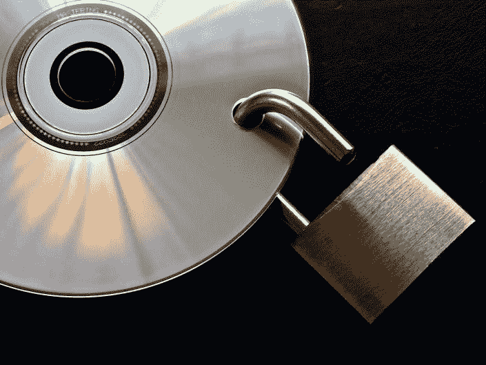
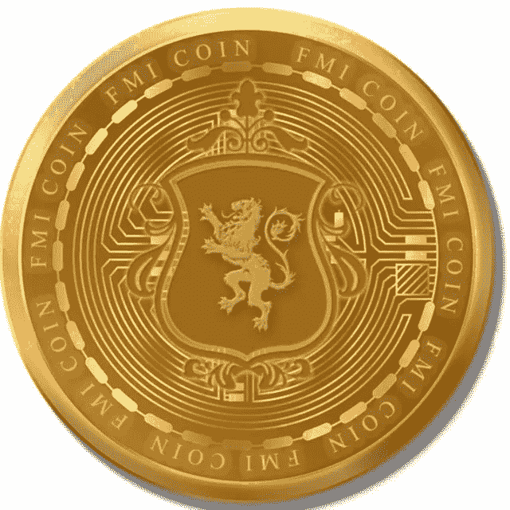

# 每日加密新闻

> 原文：<https://medium.com/coinmonks/daily-crypto-news-9922ae6e6484?source=collection_archive---------18----------------------->

1.  **早期比特币先驱伊恩·弗里曼在新罕布什尔州受审—** 联邦检察官表示，从 2016 年到 2021 年被捕，早期比特币先驱和自由主义活动家伊恩·弗里曼和他的一群同伙通过比特币自动售货机网络以及面对面和虚拟现金兑换比特币交易，帮助骗子和其他犯罪分子洗钱超过 1000 万美元。弗里曼本周在新罕布什尔州接受审判，面临与逃税和无照经营汇款业务有关的联邦指控。弗里曼和他的一群同伙——他们被统称为“Crypto 6”——在 2021 年 3 月的一次突袭中被捕。包括弗里曼的电台主持人同事艾瑞亚·迪梅佐、他的前女友蕾妮·斯皮内拉和她的丈夫安德鲁·斯皮内拉在内的四名“加密 6”成员中，没有人(前理查德·保罗)接受认罪协议。虽然 DiMezzo 直到本月晚些时候才会被判刑，但其他三名被告逃脱了相对较轻的判决，避免了坐牢。另一个人，科琳·福特汉姆，对她的所有指控都被撤销了。
2.  **在加息担忧中，比特币保持了 17K 美元的高位——**按市值计算，比特币是最大的加密货币，最近交易价格略高于 17000 美元，在过去 24 小时内上涨了一个百分点，大致相当于过去两周的水平，因为投资者继续衡量表明美国央行在通胀方面仍有工作要做的经济指标。BTC 仍然紧紧抓住 8 天前抓住的 17，000 美元不放，当时有迹象表明美联储正在从其超级货币鹰派立场上后退。但在 12 月 1 日在布鲁金斯学会的一次演讲中，美联储主席杰罗姆·鲍威尔表示，该行可能会在 2023 年加息高于预期，尽管它考虑在本月晚些时候将下一次加息从目前的 75 个基点(bps)上调至 50 个基点。“市场对鲍威尔讲话的积极反应表明，宏观环境仍将在 BTC 的价格发现中发挥重要作用，”提供数字资产趋势分析的 [Arcane Research](https://arcane.no/research) 周二在一份通讯中写道。
3.  **野村证券的加密部门在 FTX 危机后的重组中寻求两年内盈利—** 野村控股公司(Nomura Holdings Inc .)计划在两年内实现加密部门的盈利，因为 Sam Bankman-Fried 的 FTX 交易所的惊人失败刺激了数字资产领域对更安全交易对手的需求。首席执行官 Jez Mohideen 表示，Laser Digital 将利用总部位于东京的投资银行的支持，赢得机构投资者的支持，并计划在 3 月份前增加 50 名员工。他说，现在雇佣人才和以较低的估值收购资产变得更容易了，并补充说公司已经加强了风险管理。“加密市场的最新事件将为我们提供一个机会，因为它将推动机构投资者转向传统金融机构支持的数字资产公司，”Mohideen 在接受采访时表示。“我们已经进行了所有的压力测试，并假设了市场容量和价格波动方面的最坏情况，我们相信我们可以在两年内实现盈利。”
4.  **比特币在缓慢的交易中上涨，索拉纳在 Web3 游戏合作伙伴关系中获利——**比特币在周三上午的交易中小幅上涨至 17000 美元以上，在过去一周的大部分时间里，比特币一直在这一水平上下波动。在缓慢的交易中，以太网也与大多数其他十大非稳定的加密货币一起走高。索拉纳是唯一涨幅超过 1%的股票。
5.  **前 FTX 老板萨姆·班克曼-弗里德承认，他应该在加密公司倒闭前做更多的压力测试——**萨姆·班克曼-弗里德周二再次公开露面，试图解释他对他领导的加密货币交易所 FTX 倒闭的立场，以及据报道数十亿美元的客户资金从 FTX 转移到他创立的现已破产的对冲基金阿拉米达研究公司。Rekt Tech 的合伙人 Robert Mowry 于 2019 年开始在 FTX 进行交易，他在 Twitter Spaces 上与 Sam Bankman-Fried 进行了长达一小时的对话，最后与其他参与者进行了相对较短但有针对性的问答。Bankman-Fried 被问及他最近关于在不久的将来出现在国会的评论，同时暗示他可能还没有准备好出现在众议院金融服务委员会主席 Maxine Waters (D-CA)定于 12 月 13 日举行的会议上。他周日在推特上写道，“一旦我了解并回顾了发生的事情，我会觉得我有责任出现在委员会面前并做出解释。我不确定 13 号之前会不会发生。但当它发生时，我会作证。”
6.  **比特币矿商 Marathon 预计将从破产的 Compute North 收回不到一半的存款—** 最大的公开交易比特币矿商之一 Marathon Digital(Marathon Digital)预计只能收回其存放在破产的比特币矿商和数据中心提供商 Compute North 的 5000 万美元中的 2200 万美元。马拉松公司并不拥有自己的采矿设施，而是使用第三方数据中心存放电脑。该公司此前表示，T2 公司向 Compute North 支付了约 5000 万美元的运营保证金。在周二的[更新中，该公司表示，现在已经注销了其中的 800 万美元，预计将收回剩余的 4200 万美元中的 2200 万美元。这将使 2000 万美元的存款仍然下落不明，马拉松公司表示，它将继续“与有关各方合作，以确定(其)最终的可收回性。”](https://ir.marathondh.com/news-events/press-releases/detail/1298/marathon-digital-holdings-announces-bitcoin-production-and)
7.  **比特币矿工提供了减少德克萨斯州用电量的方法来帮助电网—** 德克萨斯州为“大型灵活负载(LFL)”提供了一个临时、自愿的限电计划，旨在鼓励比特币矿工在高电力需求期间降低功耗。该计划应该有助于该州的电网运营商德克萨斯州电力可靠性委员会(ERCOT)，缓解对采矿在高系统需求期间增加额外压力的担忧。ERCOT [在一份声明](https://www.ercot.com/services/comm/mkt_notices/M-A120622-01)中表示:“由于预计 ERCOT 地区越来越多的大型灵活负载将相互连接，ERCOT 正在建立一个临时的自愿削减计划，该计划将允许这些负载在高系统需求期间协助 ERCOT 确保可靠性。”。
8.  **对冲基金杉树起诉灰度公司以获取 GBTC 的详细信息——**根据来自彭博的[报道，对冲基金杉树起诉加密投资公司灰度公司以获取其旗舰灰度比特币信托(GBTC)的详细信息，以便调查潜在的管理不善和利益冲突。杉树希望灰度恢复赎回，并削减信托费用，这是世界上最大的公开交易加密基金，拥有 107 亿美元的资产。它允许美国投资者在不购买资产本身的情况下，获得比特币价格波动的敞口。GBTC 以接近创纪录的](https://www.bloomberg.com/news/articles/2022-12-06/hedge-fund-sues-grayscale-for-details-on-battered-bitcoin-trust) [43%的折扣](https://ycharts.com/companies/GBTC/discount_or_premium_to_nav)出售信托中的基础比特币，在比特币大幅下跌和 FTX 等几家知名加密公司倒闭后，今年已经下跌了近 75%。据彭博的消息来源称，杉树希望利用其寻求的信息向灰度施压，以恢复投资者不能立即获得的赎回，并降低目前 2%的费用。杉树因今年早些时候对 stablecoin 系绳下了一大笔空头赌注而闻名。
9.  **Fantom 在 crypto top 100 | The Crypto Mile 中排名最赚钱的代币—** 以太坊的竞争对手 Fantom 股价飙升 36%，成为本周 crypto top 100 中最赚钱的代币。Fantom 的本地网络令牌代号为 FTM ( [FTM-USD](https://finance.yahoo.com/quote/FTM-USD/) )，目前交易价格为每令牌 0.25 美元，本周上涨 36%。上周，该项目的创始人 [Andre Cronje](https://andrecronje.medium.com/fantom-an-inside-financial-peak-at-being-a-crypto-company-323d29fb5e81) ，一位著名的密码开发者，报告了 Fantom 的财务细节。Cronje 在 11 月底写的文章坦率地详细描述了该网络的收入、现金流和储备，以及它与 FTX 交易部门 Alameda Research 的交易。他声称，与其他加密货币网络相比，Fantom 在推出时仅拥有其本地令牌的 3%，自那以来已购买了总流通供应量的约 14%。该文章陈述了与阿拉米达的以下通信，称“2021 年 2 月 23 日，我们宣布向阿拉米达出售 81，500，000 立方英尺，平均价格为 0.428831 美元，售价为 34，949，726.55 美元。2022 年 1 月，阿拉米达要求进一步合作，我们通过了。”
10.  **ConsenSys 将更新 MetaMask Crypto Wallet 以应对隐私反弹——**meta mask Crypto Wallet 背后的公司 ConsenSys 周二表示，它将对该平台发布一系列更新，以应对[用户对其数据收集做法的反弹](https://www.coindesk.com/tech/2022/11/24/ethereum-software-firm-consensys-reveals-it-collects-user-data/)。在一份声明中，该公司解释了它如何以及为什么与 Infura 共享 MetaMask 用户互联网协议信息，in fura 是 ConsenSys 制造的“RPC(远程过程调用)服务”，用于向以太坊区块链读写数据。上月对 ConsenSys 用户协议措辞的修改显示，默认情况下，MetaMask 与 Infura 共享用户的交易数据以及他们的 IP 地址。这一披露在加密社区的一个发声角落引发了愤怒，一些用户大声担心他们的交易数据并不像他们想象的那样隐私。

还看了关于新币: [*FMI 币*](http://www.fmicoins.com/)

[FMI](http://www.fmicoins.com/) 是建立在币安智能链上的数字货币。FMI 是为公司 FMI 网络而构建的。更具体地说，它包括自己的产品，如投资不同类型的项目，创造新的项目等。FMI COIN (FMI)是一种加密货币，部署在币安智能链(BSC BEP-20)上

合同:[0x9d 427 e 2 Fe 3a D2 CB 93 f 83118d 472 a 6068 b4a 778d 6](https://bscscan.com/token/0x9d427E2fe3ad2Cb93F83118d472A6068B4a778D6)

你可以在 [Pancakeswap](https://pancakeswap.finance/) 或 [Bitkeep App](https://bitkeep.com/download) 上购买 FMI 币。
你可以通过这个来了解详细情况👇

[https://FMI coins . medium . com/how-to-create-FMI-wallet-on-bit keep-app-e 44 a2 a 998 e6a](https://fmicoins.medium.com/how-to-create-fmi-wallet-on-bitkeep-app-e44a2a998e6a)

看看我们的[网站](http://www.fmicoins.com/):[https://fmicoins.com/](https://fmicoins.com/)

给我们接通[电报](https://t.me/fmicommunityofficial):[https://t.me/fmicommunityofficial](https://t.me/fmicommunityofficial)

> 交易新手？试试[加密交易机器人](/coinmonks/crypto-trading-bot-c2ffce8acb2a)或者[复制交易](/coinmonks/top-10-crypto-copy-trading-platforms-for-beginners-d0c37c7d698c)