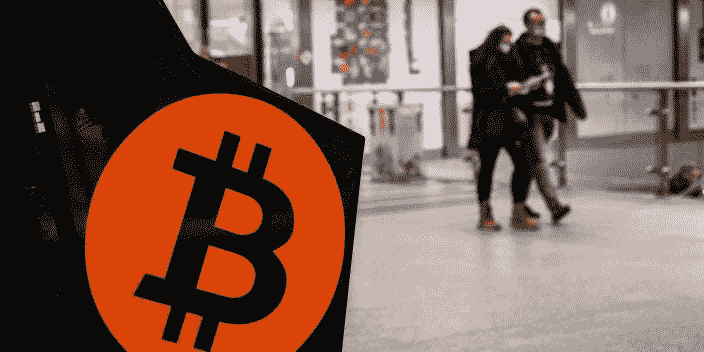
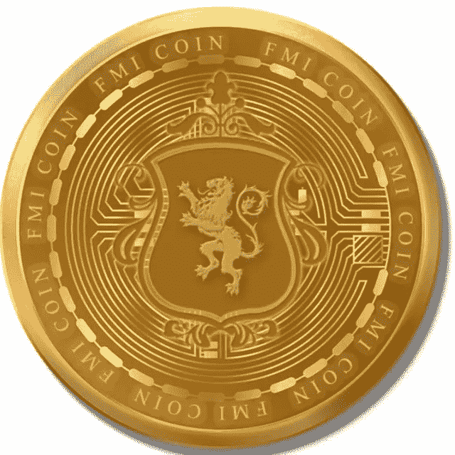

# 每日加密新闻

> 原文：<https://medium.com/coinmonks/daily-crypto-news-d2fc7d1004a3?source=collection_archive---------23----------------------->

1.  **CoinMarketCap 推出加密交易所的预留证明跟踪器—** 全球领先的加密价格跟踪网站 CoinMarketCap (CMC)为集中式加密交易所推出了预留证明[功能](https://coinmarketcap.com/rankings/exchanges/)，旨在提高加密参与者的透明度。这些数据目前可供七家中央加密交易所使用，包括[币安](https://coinmarketcap.com/exchanges/binance/)、[库币](https://coinmarketcap.com/exchanges/kucoin/)和 [Bitfinex](https://coinmarketcap.com/exchanges/bitfinex/) 。储备证明跟踪器提供关于持有储备的代币类型的信息[以及相关钱包中资产的地址、余额和价值。](https://twitter.com/CoinMarketCap/status/1594955634587611136?s=20&t=5jpWfcph71v1-8n9z6qBIw)
2.  **加密采矿公司 Foundry 将从陷入困境的 Compute North 手中收购采矿点—** 加密货币采矿和赌注公司 Foundry Digital LLC 计划从陷入困境的 Compute North 手中收购美国的两个交钥匙加密采矿设施，该公司表示，该公司已于 9 月申请第 11 章破产。Foundry [在周二的一份声明中表示，它也在考虑购买第三个正在开发中的工厂。声明称，Foundry 希望收购的两座工厂分别位于南卡罗莱纳州的北苏城和德克萨斯州的大斯普林斯市。当 Compute North 在 9 月份申请破产保护时，它说它欠至少 200 个债权人多达 5 亿美元。](https://www.prnewswire.com/news-releases/foundry-to-acquire-two-turnkey-mining-facilities-from-compute-north-plus-right-to-acquire-third-facility-under-development-301685734.html)
3.  **纽约州州长签署限制加密开采的法律—** 根据州长凯西·霍楚尔(Kathy Hochul)周二签署的立法，纽约将在全国率先采取措施，遏制加密货币开采的蔓延。
4.  明尼苏达州众议员汤姆·艾默(Tom Emmer)说，FTX 的崩溃“不是一个密码故障”。明尼苏达州众议员汤姆·艾默指责前 FTX 首席执行官班克曼-弗里德(Bankman-Fried)和证券交易委员会主席加里·詹斯勒(Gary Gensler)对 FTX 的[崩溃及其造成的后果负有责任。“这不仅仅是 FTX 的失败，”埃默在周二晚上的福克斯商业广播中说。"这是中央集权金融的失败，也是山姆·班克曼·弗里德的失败."美国国会议员和新任命的共和党多数党党鞭也谴责 FTX 的崩溃是商业道德、政府监督和监管程序的失败，并指出 3 月 23 日在 T4 举行的班克曼-弗里德和詹斯勒之间的会议。](https://decrypt.co/114246/rise-fall-sam-bankman-fried-ftx)
5.  **纽约州通过了对一些加密开采设施为期两年的暂停—** 纽约州成为美国第一个颁布临时禁令禁止化石燃料工厂新加密货币开采许可的州，尽管加密货币行业团体对该措施进行了强烈的游说。这项立法由州长凯西·霍楚尔(Kathy Hochul)签署成为法律，将对寻求许可将该州化石燃料工厂转化为采矿业务的加密采矿公司实施两年暂停。它还将现有操作的电力消耗限制在当前水平。寻求使用可再生能源替代品的矿山不受影响
6.  **密码天堂？萨尔瓦多准备新法律为所有加密铺平道路—** 即使在熊市中，萨尔瓦多也在加密货币上下了双倍赌注。第一个宣布比特币为法定货币的国家目前正在制定数字资产发行法，这将促进任何加密资产的操作。根据萨尔瓦多国民议会官方网站上的一份[文件](https://www.asamblea.gob.sv/sites/default/files/documents/correspondencia/4CCA02DF-7C4F-4B25-9725-821EB3618A5D.pdf)，该法律将规范任何数字资产的转让操作，寻求“促进数字资产市场的有效发展，保护收购者的利益。”这部法律的新颖之处在于，它将加密资产与所有其他资产和金融产品分开，从而为它们创建了一个量身定制的监管框架。该法律没有留下任何疑问的余地:要将数字资产归入这一类别，它必须使用分布式账本或类似的技术。区块链可能是迄今为止最流行的分布式账本技术。
7.  **CZ 发布推文后，比特币基地首席执行官重申持有 BTC 交易所的股份—** 比特币基地首席执行官 Brian Armstrong 向用户保证纳斯达克上市加密交易所的财务健康，此前，全球交易量最大的加密货币交易所的首席执行官赵昌鹏(非正式名称为 CZ)发布了一条具有潜在破坏性的推文——该推文已被删除。在他的[现已删除的推文](https://twitter.com/GRDecter/status/1595180656576925696?s=20&t=kbf9mF2RweuQx3oAkoBk8A)中，CZ 引用了一则新闻报道，称投资部门比特币基地保管公司代表数字资产管理公司[灰度持有 635 万 BTC。](https://forkast.news/headlines/coinbase-custody-635000-btc-grayscale-refuses-proof-of-reserves/)他引用四个月前的另一篇新闻报道结束了这条推文，该报道称比特币基地的 BTC 不到 60 万，并表示他“假设”第二篇报道是针对比特币基地交易所的。
8.  **美国参议员要求富达在 FTX 崩盘后重新考虑比特币 401(k)产品——三名民主党参议员周一在一封信中表示，鉴于 FTX 崩盘，富达应该重新考虑允许零售客户在其退休账户中投资比特币。这家总部位于美国的金融服务公司在 4 月份表示，它希望允许投资者将比特币存入他们的 401(k)账户。富达的退休账户是一笔大生意:根据研究公司 Cerulli Associates 的数据，该公司 2020 年的 401(k)资产估计为 2.4 万亿美元，超过当时美国市场总额的三分之一。参议员理查德·德宾(D-Ill。)，伊丽莎白·沃伦(D-Mass。)和蒂娜·史密斯(明尼苏达州 D-Minn .)曾在 7 月份表达了对该计划的担忧，劳工部也在 4 月份表达了类似的担忧。**
9.  **凯西·伍德正在购买比特币基地的股票，本月增加了 5300 万美元，因为 FTX 的崩溃给加密行业带来了压力——**随着山姆·班克曼-弗里德的 FTX 崩溃的余波蔓延，股价跌至历史最低点，但凯西·伍德看到了一个购买机会。过去一周，比特币基地股价下跌了约 20%，周一收于 41.23 美元。这与该交易所 2021 年 4 月上市后不久股价达到的近 430 美元相去甚远。根据彭博的数据，在暴跌期间，Wood’s ARK Invest 仅在本月就购买了超过 130 万股股票，价值约 5300 万美元。这使得该基金的总持股量达到约 840 万股，约占比特币基地已发行股票总数的 4.7%。方舟比特币基地控股公司的大部分股份是其旗舰基金方舟创新 ETF 的一部分，构成了其第 13 大头寸。
10.  **在 FTX 事件中确认崩溃后，比特币可能会下跌 13%至 2019 年的水平，Fairlead 的凯蒂·斯托克顿表示，根据 Fairlead Strategies 的凯蒂·斯托克顿的说法，FTX 破产的[影响下，比特币的](https://markets.businessinsider.com/news/currencies/ftx-crypto-holdings-fair-value-bankruptcy-filing-sam-bankman-fried-2022-11?utm_medium=referral&utm_source=yahoo.com)大幅下跌可能不会很快结束。斯托克顿在周一的一份报告中指出，在加密抛售中，比特币确认跌破了接近 18，300 美元的关键支撑位。这使得这种流行的加密货币面临更多下行风险，达到 2019 年以来从未见过的水平。具体来说，斯托克顿将 13，900 美元视为比特币的下一个支撑位，这意味着目前水平有 13%的下行潜力。**

另外阅读关于新硬币: [*FMI 硬币*](http://www.fmicoins.com/)

[FMI](http://www.fmicoins.com/) 是建立在币安智能链上的数字货币。FMI 是为公司 FMI 网络而构建的。更具体地说，它包括自己的产品，如投资不同类型的项目，创造新的项目等。FMI COIN (FMI)是一种加密货币，部署在币安智能链(BSC BEP-20)上

合同:[0x9d 427 e 2 Fe 3a D2 CB 93 f 83118d 472 a 6068 b4a 778d 6](https://bscscan.com/token/0x9d427E2fe3ad2Cb93F83118d472A6068B4a778D6)

你可以在 [Pancakeswap](https://pancakeswap.finance/) 或者 [Bitkeep App](https://bitkeep.com/download) 上购买 FMI 币。
你可以通过这个来了解详细情况👇

[https://FMI coins . medium . com/how-to-create-FMI-wallet-on-bit keep-app-e 44 a2 a 998 e6a](https://fmicoins.medium.com/how-to-create-fmi-wallet-on-bitkeep-app-e44a2a998e6a)

看看我们的[网站](http://www.fmicoins.com/):[https://fmicoins.com/](https://fmicoins.com/)

给我们接通[电报](https://t.me/fmicommunityofficial):[https://t.me/fmicommunityofficial](https://t.me/fmicommunityofficial)

> 交易新手？尝试[加密交易机器人](/coinmonks/crypto-trading-bot-c2ffce8acb2a)或[复制交易](/coinmonks/top-10-crypto-copy-trading-platforms-for-beginners-d0c37c7d698c)