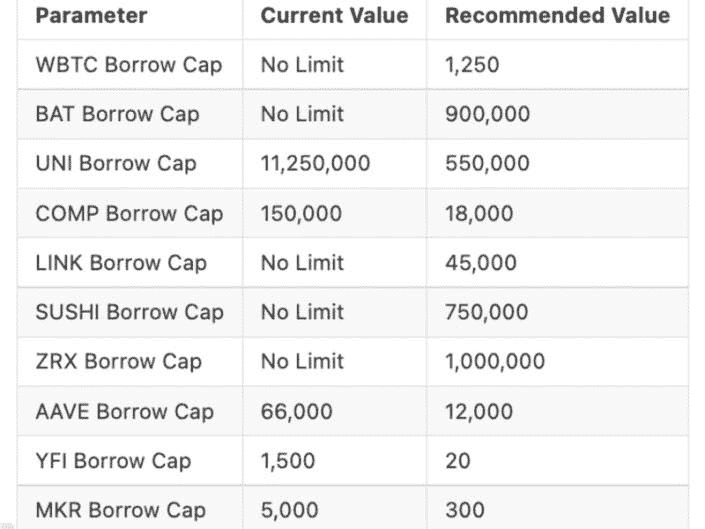

# 每日加密新闻

> 原文：<https://medium.com/coinmonks/daily-crypto-news-eec04e8b3dfc?source=collection_archive---------44----------------------->

1.  彭博新闻[周三援引知情人士的话](https://www.bloomberg.com/news/articles/2022-11-29/genesis-creditors-organize-seek-options-to-avoid-bankruptcy?sref=17Td6NBb)报道，Genesis Global Trading 的债权人聘请了重组律师，以帮助找到防止加密经纪公司申请破产的方法。知情人士称，一些债权人正与律师事务所 [Proskauer Rose](https://www.bloomberg.com/quote/1145L:US) 合作，而其他人则保留了 [Kirkland & Ellis](https://www.bloomberg.com/quote/1132L:US) 。11 月 16 日，加密投资银行的贷款部门在 FTX 崩溃后暂停了赎回和新的贷款发放，临时首席执行官 Derar Islim 在电话中告诉客户， [CoinDesk 当时报道](https://www.coindesk.com/business/2022/11/16/genesis-crypto-lending-unit-is-halting-customer-withdrawals-in-wake-of-ftx-collapse/)。Genesis 和 CoinDesk 共享同一个母公司，数字货币集团。
2.  **巴西国会支持加强加密监管的法律—** 在世界上最大的加密交易所之一于本月早些时候崩溃后，巴西国会下议院周二晚些时候批准了一项旨在加强对该国加密货币行业监管的法案。该提案将由政府任命的联邦机构监管该行业，现在将提交给即将离任的总统雅伊尔·博索纳罗批准。新规将适用于将虚拟货币兑换成本币或外币、交换虚拟资产、进行转账或参与与虚拟资产发行者或供应商相关的金融服务的法人实体。据当地媒体报道，该法案将迫使所有在当地活跃的加密提供商在该国拥有一个实体，违反新规则的人将被罚款甚至监禁。据媒体报道，该法案将给公司一段宽限期来遵守。此前，总部位于巴哈马的 FTX 加密交易所本月倒闭，引发巴哈马和美国当局的调查。
3.  尽管投资者感到不安，比特币仍攀升至 17K 美元 —尽管投资者对 FTX 事件的影响、央行货币政策的鹰派以及中国大规模抗议该国严厉的 covid 限制的潜在影响感到不安，但比特币从周一开始继续飙升。按市值计算，最大的加密货币最近的交易价格超过了 16，979 美元，在此前的 24 小时内上涨了近 4.5%，是大约两周内的最高点。BTC 表现出了非凡的弹性，自 FTX 加密交易所(crypto exchange)在一篇关于其资产负债表违规的报道后开始内爆以来的近一个月里，该股一直保持在 16，000 美元以上。“人们现在很紧张，”加密经纪公司 Floating Point Group 的联合创始人兼首席执行官 John Peurifoy 说。“他们担心危机会蔓延到哪里，会与哪些对手合作。他们能把钱放在不同的地方吗？他们会失去它吗？所以人们都很谨慎。”
4.  **在美联储鲍威尔发表讲话之前，比特币升至两周高点——**截至新加坡时间上午 10 点 41 分，最大的比特币涨幅高达 3.7%，交易价格约为 17010 美元，为两周以来的最高水平。乙醚攀升超过 4%，而像币安硬币和 Dogecoin 也跳涨。鲍威尔将于周三晚些时候在布鲁金斯学会(Brookings Institution)主办的一次活动上发表讲话，并可能在连续四次加息 75 个基点后，在今年的最后一次会议上发出加息 0.5 个基点的信号。快速收紧的货币政策是今年顶级数字资产指数暴跌 63%的主要原因。社交交易平台 Alpha Impact 的首席执行官海登·休斯(Hayden Hughes)说，“一夜之间，越来越多的人认为美联储只会加息 50 个基点。”“由于加密通常领先于其他资产类别，随着 12 月中旬美联储会议的临近，我们可能会看到股市反弹，”他补充道。
5.  **随着中国在抗议声中放松 Covid 规则，比特币获得收益；比特币和以太币在周三上午的亚洲交易中上涨，所有其他非稳定的十大加密货币也在上涨，因为中国周二表示将放松一些 Covid 规则以应对抗议。示威活动始于上周，并蔓延至多个城市，震动了全球资本市场。**
6.  **巴西众议院批准监管加密交易的法案—** 巴西众议院周二批准了一项监管加密行业的法案。该法案于四月由参议院通过，一直滞留在众议院，现在需要行政部门的批准才能成为法律。该法案由众议员奥雷奥·里贝罗(Aureo Ribeiro)起草，设立了一种新的涉及虚拟资产的欺诈罪，处罚为两年至六年外加罚款。它还规定创建一个“虚拟服务提供商”许可证，该许可证将由包括交易所和其他加密公司在内的公司申请。根据文本，在法律实施之前，公司将有 180 天的时间来适应新的规则。该案文规定，被视为证券的加密资产将由巴西证券交易委员会(CVM)监管，而不属于该类别的其他数字资产将由行政部门任命的另一个机构负责。预计将选择央行。
7.  **据报道，卡罗琳·埃里森(Caroline Ellison)在 FTX 崩盘时发了一条短信，称她“有点担心所有人都会辞职/休假”——**[对冲基金阿拉米达研究公司(Alameda Research)时任首席执行官卡罗琳·埃里森](https://www.businessinsider.com/caroline-ellison-ftx-alameda-research-ceo-collapse-2022-11?utm_medium=referral&utm_source=yahoo.com)本月早些时候发了一条短信，称她“有点担心所有人都会辞职/休假”，并在它的兄弟公司 FTX 加密交易所[倒闭时用一个出汗的表情符号表示。据报道，埃里森在 11 月 8 日左右将这条短信发送给了 FTX 的顶级律师莱恩·米勒(Ryne Miller)，此前有报道称，FTX 创始人兼前首席执行官萨姆·班克曼-弗里德(Sam Bankman-Fried)领导的对冲基金阿拉米达研究公司(Alameda Research)持有大量 FTX 的 FTT 代币，这些代币很快贬值，FTX 因此面临客户存款挤兑。阿拉米达研究公司在出版前没有及时回复内部人士的置评请求。埃里森的文本只是《纽约时报》看到的众多交易所之一，反映了 FTX 内部日复一日酝酿的混乱，其高管们争相挽救交易所。据](https://www.nytimes.com/2022/11/29/technology/sam-bankman-fried-ftx-bankruptcy.html)[内部人士](https://markets.businessinsider.com/news/currencies/binance-ftx-acquisition-sam-bankman-fried-insolvency-rumors-contagion-fears-2022-11?utm_medium=referral&utm_source=yahoo.com)透露，埃里森发送短信的当天，加密公司币安宣布，它签署了一份非约束性协议，通过收购该公司来拯救 FTX。但是第二天，币安在 11 月 9 日的一份声明中以政府调查和新闻报道滥用客户资金为由退出了交易。
8.  **Bitfront 是 FTX 崩溃后最新一家陷入困境的加密交易所——**由东京社交媒体巨头 LINE Corp .创办的加密货币交易所 Bitfront 正在关闭，因为数字资产领域的巨大波动导致伤亡人数增加。“尽管我们努力克服这个快速发展的行业中的挑战，但我们遗憾地决定，我们需要关闭 Bitfront，以继续发展区块链线生态系统和链接令牌经济，”根据[的一份声明。该公司表示，客户可以在 3 月 31 日之前提取资金，但新注册和信用卡支付在周一立即停止。Bitfront 在推出仅三年后就关闭了其服务，但表示将把重点放在其他区块链企业上。2021 年，由于监管方面的担忧，该交易所停止了在韩国的运营。](https://www.bitfront.me/notice/20208406)
9.  **山姆·班克曼-弗里德对 FTX 灾难性的崩溃“打破沉默”——**山姆·班克曼-弗里德准备打破沉默，讨论 FTX 交易所戏剧性崩溃背后的细节，据一位有影响力的评论员称，他已经前往巴哈马寻找这位倒下的秘密大亨。加密记者和 Bitboy 加密播客主持人本·阿姆斯壮周二告诉雅虎财经，在世界上最著名的加密交易所之一崩溃的争议中，他已经前往巴哈马与班克曼-弗里德(SBF)对抗。阿姆斯特朗[说](https://www.youtube.com/watch?v=4c5kOAg1O8A):“山姆·班克曼-弗里德已经同意在接下来的两周内和我一起做一个推特空间。”推特空间的讨论小组只有我和萨姆。“Armstrong 长期以来一直是 Bankman-Fried 的反对者，并在该交易所即将崩溃的消息曝光前几周就警告投资者将他们的资金撤出 FTX。在谈到他与 FTX 前掌门人的持续争执时，Armstrong 补充道:“这件事是我和 Sam 之间开始的，它将在我和 Sam 之间结束。阿姆斯特朗补充道，SBF 已经在推特上解封了他，并声明这证实了两人已经说过话。
10.  **DeFi Lender Compound 在有人试图利用 ave 之后收紧借款限额—** 分散式贷款协议 Compound Finance [通过了一项提案](https://compound.finance/governance/proposals/135)实施贷款限额并引入新的借款上限，以降低其平台的风险。社区以压倒性的投票支持引入或降低 10 种加密货币的最大借款额，包括 [wBTC](https://www.coindesk.com/price/wrapped-bitcoin/) 、 [LINK](https://www.coindesk.com/price/chainlink/) 和 [UNI](https://www.coindesk.com/price/uniswap/) 。[提案](https://www.comp.xyz/t/risk-parameter-updates-2022-11-23/3802)写道:“设定借款上限有助于避免高风险的攻击媒介，同时几乎不牺牲资本效率，并允许有机借款需求的门槛。”。投票于周一结束，在记者发稿时正在等待执行。

Compound 采取行动之前，[一个竞争对手贷款平台 Aave](https://www.coindesk.com/markets/2022/11/22/mango-exploiter-gets-liquidated-after-roiling-aave-using-20m-of-borrowed-curve-tokens/) 涉嫌利用漏洞的尝试，引发了对分散金融(DeFi)协议贷款机制中任何潜在漏洞的审查。

剥削者似乎是臭名昭著的 DeFi 交易商 Avi Eisenberg，他在 Aave 上借入了大量非流动性的 CRV 代币，试图在协议上制造坏账。周一，Aave 冻结了 17 项加密资产的借用，以减轻网络升级前潜在攻击的风险。

艾森伯格因他自称的“高利润交易策略”而闻名，他利用了索拉纳芒果市场的一个漏洞，上个月从该协议中抽走了 1.14 亿美元。

还看了关于新币: [*FMI 币*](http://www.fmicoins.com/)

[FMI](http://www.fmicoins.com/) 是建立在币安智能链上的数字货币。FMI 是为公司 FMI 网络而构建的。更具体地说，它包括自己的产品，如投资不同类型的项目，创造新的项目等。FMI COIN (FMI)是一种加密货币，部署在币安智能链(BSC BEP-20)上

合同:[0x9d 427 e 2 Fe 3a D2 CB 93 f 83118d 472 a 6068 b4a 778d 6](https://bscscan.com/token/0x9d427E2fe3ad2Cb93F83118d472A6068B4a778D6)

你可以在 [Pancakeswap](https://pancakeswap.finance/) 或 [Bitkeep App](https://bitkeep.com/download) 上购买 FMI 币。
你可以通过这个来了解详细情况👇

[https://FMI coins . medium . com/how-to-create-FMI-wallet-on-bit keep-app-e 44 a2 a 998 e6a](https://fmicoins.medium.com/how-to-create-fmi-wallet-on-bitkeep-app-e44a2a998e6a)

看看我们的[网站](http://www.fmicoins.com/):[https://fmicoins.com/](https://fmicoins.com/)

给我们接通[电报](https://t.me/fmicommunityofficial):[https://t.me/fmicommunityofficial](https://t.me/fmicommunityofficial)

> 交易新手？试试[加密交易机器人](/coinmonks/crypto-trading-bot-c2ffce8acb2a)或者[复制交易](/coinmonks/top-10-crypto-copy-trading-platforms-for-beginners-d0c37c7d698c)