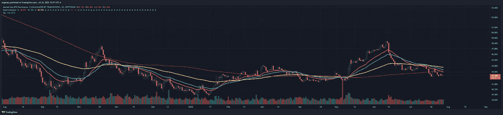
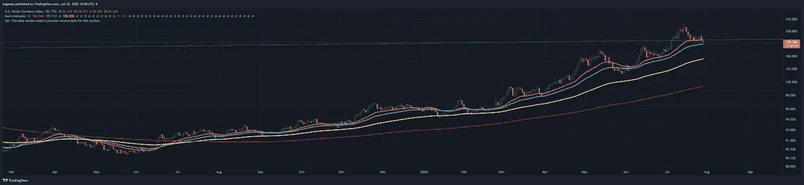
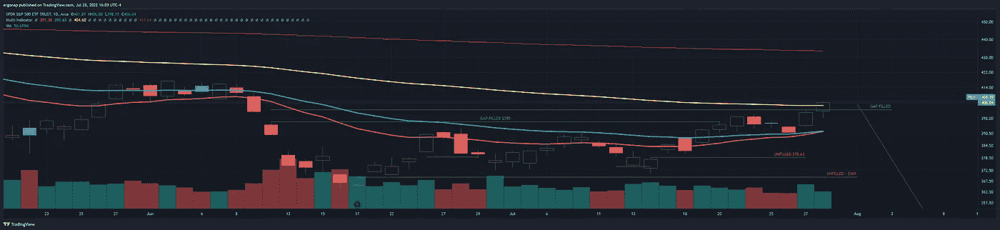

# 危险迫在眉睫，但我们今天就出发。🤔⚠️

> 原文：<https://medium.com/coinmonks/danger-looms-but-up-we-go-for-today-%EF%B8%8F-8cfd243fd98d?source=collection_archive---------38----------------------->

加密货币/比特币分析 7 月 28 日

紧接着昨天，很多事情已经被打破，爆发了对 BTC。比特币的主导地位现在下降了很多，所以这意味着这种替代运行***应该继续下去。这里最大的应该和/或如果是 SPY/DXY 是否合作，尽管[昨天](https://www.forbes.com/advisor/personal-finance/another-75-point-fed-rate-increase/)加息 75 个基点，他们将[在 9 月](http://Federal Reserve Chair Jerome Powell said in a press conference following the latest announcement that another “unusually large” rate hike could “be appropriate” at the next meeting in September.)再次加息(8 月没有会议)。还是否认衰退(LOL)。即使是亲加密或反加密，但 lol 在试图不吓唬人。鲍威尔发出了可怕的警告，QT 将会回归:**

> 鲍威尔说:“这些加息幅度很大，来得很快，很可能经济还没有感受到它们的全部影响。”“可能会有重大的**额外的*收紧*在管道**。”

as long as this remains, we’re probably okay. [https://www.tradingview.com/x/mBrnQybC/](https://www.tradingview.com/x/mBrnQybC/)

我们在这里最薄的薄冰上滑冰。DXY 可能会有一个小的调整，给每个人他们渴望的解脱。当然，你看看什么是解脱，答案就是——lol welp。🤷是不是意味着我们不能上去？我们当然可以上去。但是考虑到什么样的危险，我们从 2021 年 1 月开始就一直看涨 DXY(美元指数),我们还没有显示出任何停止的迹象。最多再过几年**。**

****

**“Correction”. Lol. Remember when people tell you look back at increases in things? Yeah. [https://www.tradingview.com/x/bLkMsXXa/](https://www.tradingview.com/x/bLkMsXXa/)**

**与此同时，现在的真实情况是间谍，这只是差距填补了今天。这很好，如果下面没有缝隙的话——确实有。其中一些差距可以追溯到 2011 年，这是否会填补还不得而知。我预计可能在某个时候会有很多人这样做——那是市场表现最好的时候。但现在不一定是那个时候，还不是时候。我预计下面的缺口将在几周内填补，除非这是底部和我们去了。目前还无法确定。然而，考虑到加密在 3%的间谍移动中上升了约 10%,而在间谍移动中下降了 10%,加密甚至下降了 30%,我们还没有走出困境。**

****

**clearly no gaps to see here! none at all! [https://www.tradingview.com/x/VHxCuwsA/](https://www.tradingview.com/x/VHxCuwsA/)**

****

**this will be the look on retail once we decide to correct, because they will sell it and sell the bottom. and I firmly won’t care. For entertainment, [voice it over with Jason from heavy rain.](https://www.youtube.com/watch?v=PJIsgvTYxII) Jason. Jaaaaason! Jason! 🤣**

**对于之前的分析，请参见:**

** [## 我们中断了频道！📈🤔

### 加密货币/比特币市场分析 7/27

medium.com](/coinmonks/we-broke-up-the-channel-8c675b1235cd)  [## 你还能指望什么数字下降

### 加密货币/比特币分析 7 月 26 日

medium.com](/coinmonks/what-do-you-expect-number-goes-down-3fc933515e04) 

> 交易新手？试试[加密交易机器人](/coinmonks/crypto-trading-bot-c2ffce8acb2a)或者[复制交易](/coinmonks/top-10-crypto-copy-trading-platforms-for-beginners-d0c37c7d698c)**