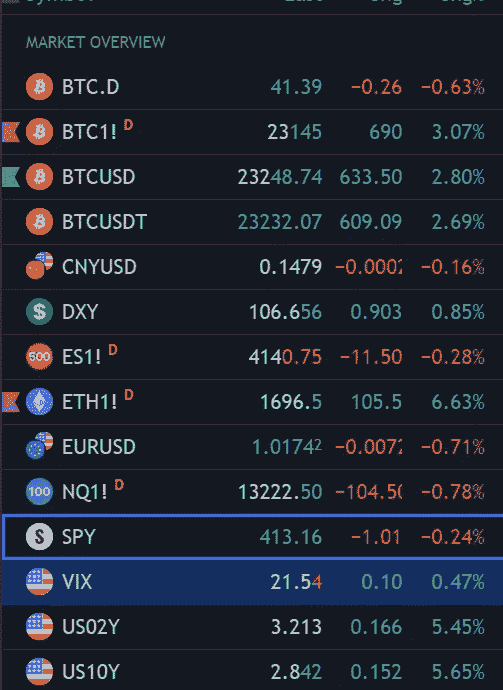
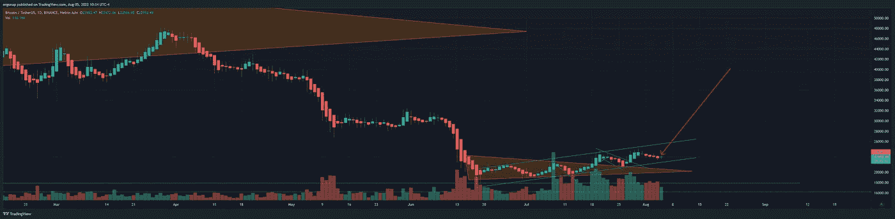
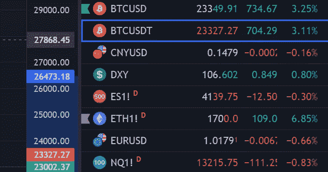
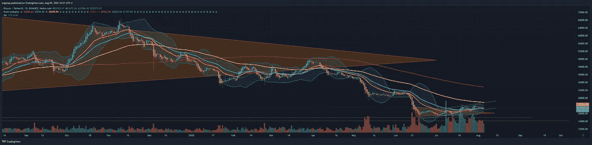
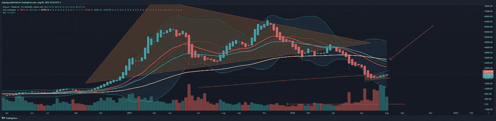
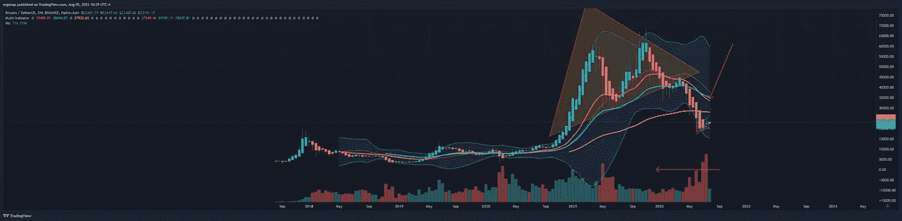
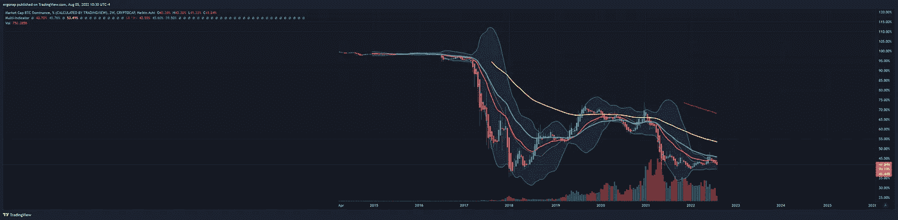
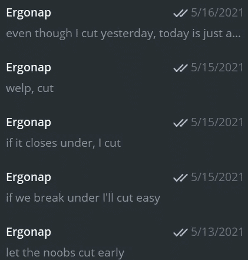

# 危险依然存在，但我们继续向上。

> 原文：<https://medium.com/coinmonks/danger-persists-but-we-continue-up-6f0dc7276d2?source=collection_archive---------31----------------------->

比特币/加密货币市场分析 8/5，休假到 8/10(大概)。

我要去度个短假，我大概周三回来。因为这个原因，我将试图一次总结今天和接下来的几天。

今天的 TLDR 是:比特币小幅上涨，DXY 小幅上涨(这是最近的流行趋势)，收益率反转，间谍接近顶部但还没有到达，alts 爆炸，VIX 上涨。

lots of activity at the same time today

因此，我仍然感到好奇的一件事是，DXY 正在像比特币一样上涨，而比特币的统治地位继续下降(并给了 alt 更多的回旋余地)。我有一种感觉，alt 赛季的结束即将到来，但在我们看到一些疯狂的突破水平之前，我们会得到一个回调。我将使用透明质酸蜡烛使这变得简单，因为我喜欢轮换方法以防止偏差。

The problem with this is in how it can end. [https://www.tradingview.com/x/sCqXlkGk/](https://www.tradingview.com/x/sCqXlkGk/)

所以几天来，我们一直维持这个上升趋势/下降趋势。哈说得很清楚了。我同意 HA 的趋势，但不同意 HA 的精确价格。

this is why I warn of HA. HA says $23002 BTC while BTC is at $23,300.

无论如何，最简短的宏观形式是:我们对 BTC 4h/1d 的看涨已经消退。现在是中性/无趋势。这意味着我们很快就可以转向(这个周末？)等等。显然，这还有待确定。哪个方向？谁他妈的说不准，但是一招很快就要来了。任何自称知道的人反正都是一派胡言。

我们确实从一面熊市旗上下来，只是为了拒绝第二面，但这不会告诉我们这是否结束了。一个提醒是，矿工们的时间不多了，他们被骗了。只是 Mara 和 Riot 要卖多少比特币的问题。如果有人擅长资产负债表，那就检查每一家矿业公司。

Anyone thinking 19–23k is bullish when we’re literally talking *19–23k is just blind.* [https://www.tradingview.com/x/TdUQSGVx/](https://www.tradingview.com/x/TdUQSGVx/)

我们的趋势是看涨，所以是的，这么说是合理的，但我们对加息改变这一观点没有反应。因此，每周宏观观点将在下面继续。

每周可以总结为:越来越丑。

this is not bullish. HA paints it quite clearly that this is a relief rally. [https://www.tradingview.com/x/yTnJGyi4/](https://www.tradingview.com/x/yTnJGyi4/)

2 周可以总结为:越来越丑。

[2 week charts just crossed down = bullish? wtf no. https://www.tradingview.com/x/CCQp16cw/](https://www.tradingview.com/x/CCQp16cw/)

因此人们说。alt 都爆了！是的，是的，他们是。随着比特币统治地位的下降，alt 也在尽可能多地夺回地盘。

2 weeks on BTC.D are indeed bearish. [https://www.tradingview.com/x/XmELI8VF/](https://www.tradingview.com/x/XmELI8VF/)

我会喜欢比特币永远消失吗？是的。完美的策略，让人们进入加密，但删除 BTC？在许多层面上是美好的，但在许多其他层面上也是糟糕的，留下了许多未解决的问题。在这种情况下，每个人都会损失，就像 BTC 成为货币一样。然而，每个人都想引用亚瑟·海斯的话，就好像他是个天才，因为他写了很多文字，引用了很多数据，这些数据意味着“购买密码”。各位，这话出自一个被判金融诈骗的天才之口。为金融诈骗写文章的人。他只是想让你作为退出流动性。在经济分析方面，他和什克里里或 T2·马斯克一样值得追随。说真的，海耶斯成为密码领域的永久多头被视为天才，而马斯克在熊市中被看跌的文章中被引用也被视为天才，这几乎是滑稽的。最后，这是傻瓜希望抓住傻瓜不放。

当我说我会的时候，我切断了我所有的狗屎，回到了大约 46k 的 BTC，再也没有回头。因为我说过我会这么做，我也做到了。结束了。

my old TGlogs

现在是回顾过去的时候了，但这并不意味着我已经完全想要回来了。这个市场没有上涨的必要，但我想如果它会打破世界上每一对愚蠢的组合，我们不跟随它就是愚蠢的。

那么下周的简单答案是什么？**超过/低于 22.5 千米。正好在我们现在的位置。不是因为那个，而是因为 34EMA。**上方是潜在的看涨，下方是明确的看跌。不是说不是 100%甚至，我们是看跌多于看涨。什么叫有些看涨？超过 25，000 美元。什么是相当看涨？超过 33k 美元。如你所知，我们还有很长的路要走。

我还是会骑 LIT 一段时间*以可支配收入为乐*因为 LITBTC 爆发了(1d)而 LITUSDT 即将爆发，但那是我在交易技术指标，因为我知道自己在做什么。我对这件事很满意，可以去度假了。但是记住，伙计们，重力存在，价格上涨是与肉汁相反的。所以东西上来了，但也下来了。

如果我有时间，我会试着在我离开的时候发邮件，但可能不会在周一之前。

> 加入 Coinmonks [电报频道](https://t.me/coincodecap)和 [Youtube 频道](https://www.youtube.com/c/coinmonks/videos)了解加密交易和投资

# 另外，阅读

*   [隐翅虫替代品](/coinmonks/cryptohopper-alternatives-d67287b16d27) | [HitBTC 审查](/coinmonks/hitbtc-review-c5143c5d53c2)
*   [CBET 点评](https://coincodecap.com/cbet-casino-review) | [库币 vs 比特币基地](https://coincodecap.com/kucoin-vs-coinbase)
*   [折叠 App 回顾](https://coincodecap.com/fold-app-review) | [Kucoin 交易机器人](/coinmonks/kucoin-trading-bot-automate-your-trades-8cf0ca2138e0)
*   [如何匿名购买比特币](https://coincodecap.com/buy-bitcoin-anonymously) | [比特币现金钱包](https://coincodecap.com/bitcoin-cash-wallets)
*   [币安 vs FTX](https://coincodecap.com/binance-vs-ftx) | [最佳(SOL)索拉纳钱包](https://coincodecap.com/solana-wallets)