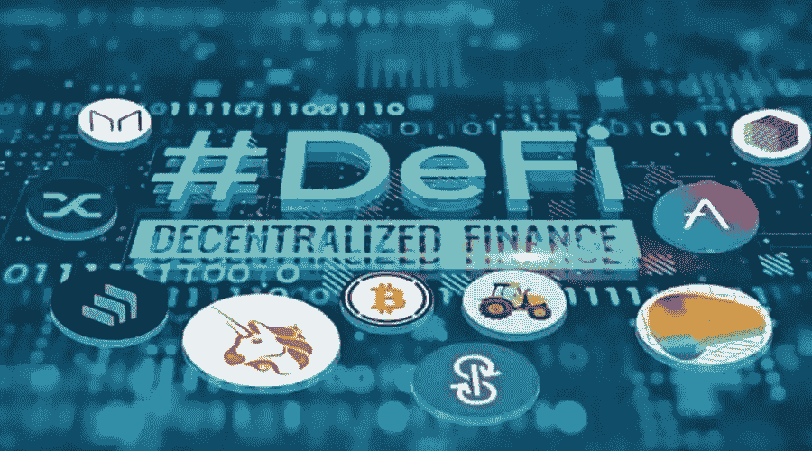
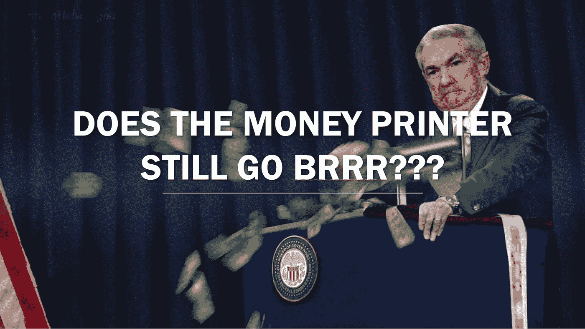
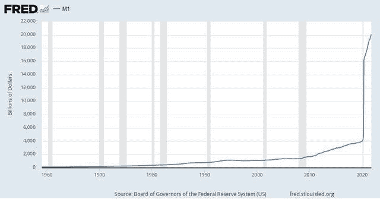
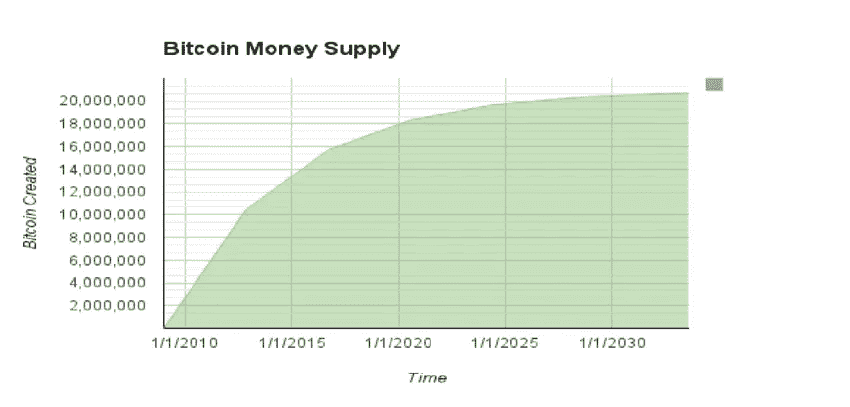
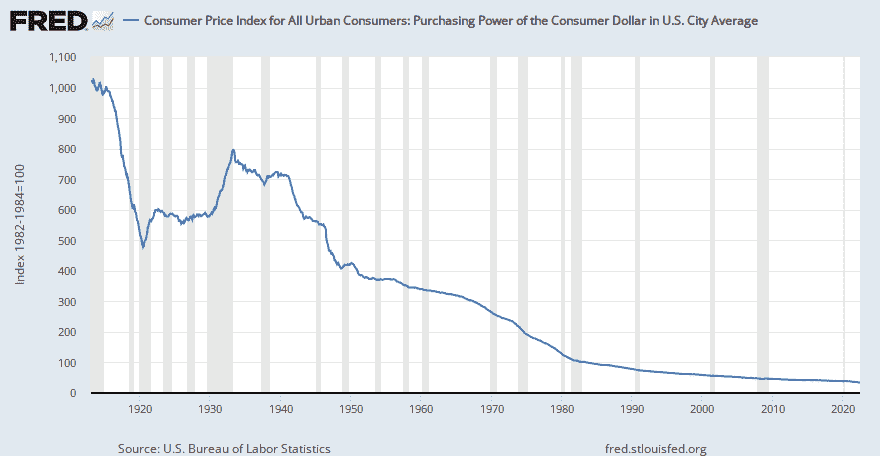
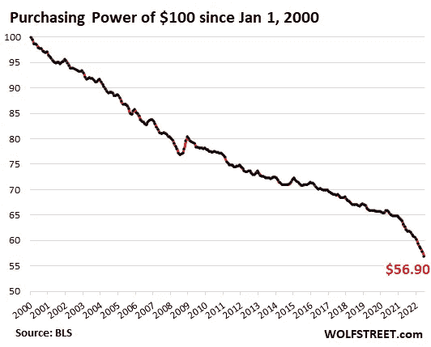
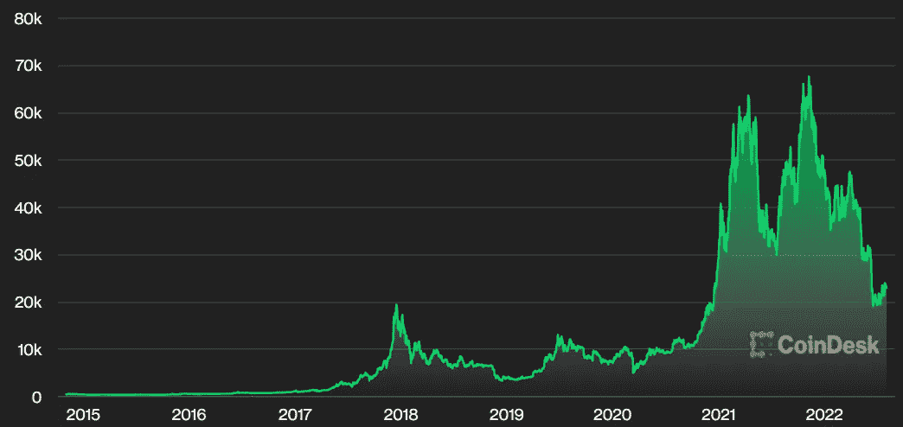

# 道构建器:奥林匹克道协议

> 原文：<https://medium.com/coinmonks/dao-builder-the-olympusdao-protocol-db92305f0a4c?source=collection_archive---------25----------------------->

在 DAOBuilder，我们让人们能够创建他们自己的分散自治组织。

DAO Builder 是一个社区驱动的工具，允许没有技术知识的人在区块链上构建，我们让人们能够创建他们自己的分散自治组织(DAO)。
DAO Builder 也是有技术知识的人不用另起炉灶，用叉子快速上手运行的好工具。

首先，我们决定从一个复杂但有趣的任务开始，让人们有能力建造一个奥林匹克餐叉。这是因为我们发现奥林巴斯道是一个非常强大的道的基础，它后来可以蓬勃发展，涵盖许多方面，而不仅仅是我们在奥林巴斯道看到的作为储备货币的特定变体。

那么，现在，为什么奥林匹克道仍然有趣？不是坠毁了吗？为什么还有那么多人有兴趣买一把奥林巴斯刀的叉子？

为了能够回答这些问题，我们必须后退一步，然后看看 OlympusDAO 协议背后的技术和机制，最重要的是，我们必须能够将该协议的机制放到有助于我们看到更大画面的背景中。

为了创建 OlympusDAO，我们进行了大量的思考、研究和努力，这是一个改变模式的协议，在这篇文章中，我将解释为什么 OlympusDAO 协议是不可思议的，并且显然会继续存在。

# 分析一个分散的金融项目

当我们想要分析一个 DeFi 或加密货币项目时，我们希望始终牢记一些概念。

当我们了解奥林匹克道和其他金融系统时，我们希望记住的指标是:

*   供给:
    -通货膨胀。
    ——通货紧缩。
*   需求:
    -代币的投资回报(ROI)。
    -效用:(支出与持有、现金流、治理)

我们想看看供应，主要是因为我们想知道我们的投资是如何被稀释的，我们想了解为什么对《议定书》的投资有需求，最后但同样重要的是，我们想了解储备货币的效用。

# 储备货币

如果我们把金融货币系统看作孤立的系统。这意味着，如果我们不考虑与系统相关的政治，那么一些人会开始质疑为什么“储备”一词会出现在“美国美联储银行(美联储)”的名称中，而其他人可能会开始质疑为什么“联邦”一词会出现在这个名称中，但我们不会让这个世界上最有影响力的机构成为一个笑话的笑柄，我们只会试图解释我们的全球储备货币系统，以更好地了解我们正在处理的问题，让笑话自己写出来。

如果我们看看美元的发行者，即美联储(美国美联储银行)，我们会看到他们有一些通过利率和商业银行准备金要求来控制美元供应的手段。为了控制货币供应，他们还购买债券，将货币推入市场，或者发行债券，从市场上消除货币供应。

现在，为了简单地了解加密货币协议和美联储之间的基本理解，我们可以简单地看看一个著名项目即比特币的货币发行，然后是美元。

让我们先看一下美联储发行了多少货币的图表。(如果你的眼睛没有保险，你可能应该考虑在看下面的图表之前买一些，因为这不是一个美丽的景象。)

Figure 1\. (USD in excistance.)

正如我们在上面的图表中看到的(图 1。)2020 年以后，80%的美元已经印刷完毕。如你所见，似乎没有疯狂的方法。

现在如果我们看看比特币货币供应量。

Figure 2: (Bitcoin money supply)

正如我们在图 2 中看到的，当谈到比特币时，它几乎看起来像是货币供应的数学函数，并且该图也指向未来。嗯，这是因为比特币的货币供应量实际上是一个几何数学函数，其中提供给系统的比特币数量每 4 年减少 50%，因此我们知道在遥远的未来会有多少比特币存在，因为在加密货币中“代码就是法律”，而在美联储系统中“中央官僚决定的就是法律”。

现在，让我们来看看这两种货币各自的价值，以此来说明问题的关键:

Figure 3: (Purchasing power of USD from 1915 to 2020)

正如我们在图 3 中看到的，我们有 1915 年到 2020 年美元的购买力。现在，让我们把 2020 年以后的时间放大一点。

Figure 4: (Purchasing power of USD from 2000 to 2022)

这里我们看到了 2002 年以后美元的购买力。对于美元来说，两个图表中的比例有点不同，但是我们可以看到持续的下降。请记住，通货膨胀不仅仅是基于印钞，也是基于货币流通速度。

现在让我们来看看比特币在其整个生命周期中的购买力:

Figure 5: (Qualitative graph of bitcoins purchasing power)

图 5 以定性的方式显示了比特币在其生命周期中的购买力，但也许我们应该看看一个更定量的图表:

Figure 6: (Qantitative analysis of bitcoin purchasing power)

因此，在我们看来，比特币是一种通缩资产，因为大部分比特币都是铸造的，因此随着供应的增加，我们拥有了一种增值的资产。

现在，由于美元的通胀通常是缓慢移动的，除了过去两三年，我们通常不会经历波动，但比特币的波动很大，这就是奥林巴斯道的情况。

# 奥林匹克道协议

开源协议是完全透明的，对财务行为具有决定性，这很好，因为作为投资者，你想知道你的投资是如何运作的，以及如何改变未来的方式。然而，一个封闭的官僚机构除了维护你的财富之外，可能还有其他的利益，对让你了解现在或未来的财务活动不感兴趣，这当然会使它成为一项长期风险更高的投资。你可能希望拥有像美元这样的法定货币的唯一原因是，它们在短期内波动性较小，大多数人使用法定货币作为支付方式，但这种情况可能不会在未来很长时间内改变，特别是如果美联储继续做好他们正在做的工作， 如果我们让分散的储备货币成为比法定货币更有效、更有利可图的货币，那么人们意识到他们的财富和购买力会比法定货币得到更多保护，这只是个时间问题。

但首先，我们必须使分散储备货币技术成熟，这来自于该技术的许多不同迭代和改进。

## OympusDAO:财政部

奥林巴斯道是一种储备货币。这意味着它有一个财政部支持每一个铸造的代币(硬币)。财政部包含数字资产，就像当年每一美元都由储备中的黄金略微支持一样。这是一个重要的概念，因为它创造了一个货币不能跌破的最小无风险价值。在奥林匹克，他们的每一个欧姆标记都至少有一个戴支持。既然 1 刀= 1 美元那么 1 欧姆≥ 1 美元。

我们称之为欧姆令牌的 RFV(无风险价值)。如果有一天欧姆降到 1 美元以下，那么奥林匹克协议将开始回购他们自己的欧姆代币，以减少供应，从而提高价格。这种回购将通过财政部的资产来完成。这是一个重要的机制，因为这意味着一个人购买的每欧姆都将价值 1 美元，这降低了投资者持有代币的风险。

现在，由于美元本身的不稳定性，它可能不是最好的衡量单位，所以奥林巴斯道现在慢慢开始接受戴之外的其他类型的数字资产。不难想象，将来他们可能会将欧姆币的 RFV(无风险价值)提高到 1 戴(或 1 美元)以上。

奥林巴斯道可以就此打住，就此收工，做一个稳定的硬币，但这不是他们停下来的地方。因为设定一个下限或下限来衡量货币能走多低可能会很有意思，但他们为什么要限制货币能走多高呢？这就是溢价发挥作用的地方。

事实上，OympusDAO 协议可能不允许代币跌破 1 美元，但它没有对它可以涨到多高设置任何限制，因为他们正处于用户发现该协议的增长阶段，他们不断扩大他们的用户/投资者基础。因此，他们也不回避市场力量。这意味着欧姆代币价值 1 美元，然后是由代币在市场上的需求确定的一些额外费用:

1 欧姆= 1 戴+溢价

因此，我们有一个 1 美元的安全网，但它现在没有上限。但是他们仍然拥有像美联储一样的机制来管理他们的代币供应，这些机制将在下面的章节中描述。

## 奥林匹克道:结合(膨胀)

> 所以现在我们知道，我们有一个财政部和一个协议，可以通过使用财政部的资产回购他们的代币并使他们的货币退出流通，来防止价格跌破特定水平。这是在需求可能下降时管理供应的一种方式，从而管理资产的价值。

但是通货膨胀呢？新代币是如何铸造的？他们能打印多少有限制吗？要回答所有这些问题，我们必须谈谈奥林巴斯道发行的债券，或者说奥林巴斯道协议的债券机制。

铸造美元和欧姆代币的区别在于，当货币管理者决定他们觉得是时候这样做了，然后媒体开始对负责任的财政政策进行强制性的公开讨论时，美元就会被印刷出来。
相比之下，OympusDAO 只在有人想通过将数字资产存入国库来购买一些欧姆代币时发行债券(你可以把它想象成铸造货币)，作为回报，他们得到一些欧姆。这就是协议中提到的绑定。
由于欧姆币价值超过 1 美元，因此 10%的存款资产作为利润进入国库，剩下的 90%用于资助“赌注”机制。财政部的利润将部分用于为 OHM 令牌提供融资支持，以防其跌破(无风险价值)。

> 可能收购 OHM 的资产清单将会扩大，不仅仅包括几个选项。
> 
> 现在我们知道了货币是如何铸造的，以及货币是如何得到国库利润支持的。

当我们有一个带有代币的 DeFi 项目时，在 DEX(分散式交易所)中需要有可用的流动性，这样市场可以用代币进行交易，经济活动可以跟上步伐。在 DEX 中要做到这一点，执行协议的人需要向流动性池提供流动性。这样做的问题是，机会主义交易者会在开始时提供大量的流动性，一旦交易费用和回报到位，他们就会出售代币，取走大量的流动性，从而导致代币价格暴跌。
解决方案是协议自有流动性，这意味着 OlympusDAO 需要通过拥有 LP(流动性池令牌)来拥有自己的流动性。
实现这一目标的方式是发行债券，接受 LP 作为存款资产，并发行 OHM 作为回报。这种方法给了 OlympusDAO > 99%的流动性，这是非常强大和重要的，因为这意味着现在没有人能控制他们的流动性，他们现在控制着它。这是非常强大的，它显示了协议创造者的天才。

OlympusDAO 协议可以通过调节 BCV(债券控制变量)来激励铸造和购买债券，该变量调节人们通过购买债券获得的折扣。这意味着，当从协议中购买债券并获得欧姆回报时，在 5 天的归属期后，以低于市场价格的折扣购买。

## OympusDAO:打桩(通货紧缩)

OlympusDAO 协议中的锁定机制是一种机制，当用户将他们的欧姆锁定特定时间段时，该机制将返回 APY(年百分比收益)。

因此，通过将欧姆标记锁定一段时间，这些欧姆标记将不会被稀释，因为它们被锁定(“锁定”)。那些被下注的欧姆代币的所有者将会收到更多的欧姆代币，从而维持用户自开始下注以来的欧姆代币的当前份额。

> 基本上，赌注是一种保持您拥有的协议令牌的百分比份额的方法，因为当新用户进入系统时，会产生更多的令牌。
> 你可以想象，如果你拥有的欧姆代币数量在价格稳定或上涨时增加，那将会有巨大的利润。

由于 RFV(无风险价值)为 1 DAI，但代币有很大的溢价，因此 OympusDAO 可以使用债券销售的利润来支付为赌注者创建的任何新代币，以确保它们不会随着新债券的发行而被稀释，从而始终确保任何创建的代币都由无风险价值支持。

> 当然，OlympusDAO 财政部不仅通过出售代币获利，还通过控制 DEX(分散交易所)中超过 99%的流动性，从而赚取交易费。
> 
> 随着项目的成熟和发展，这样一个项目将产生的利润可能开始来自许多不同的领域，就像银行一样。

## 反向债券

如果欧姆代币价格跌破 RFV(无风险价值)，会发生什么？
协议如何支持必须保持欧姆令牌值等于或高于 RFV(无风险值)的事实？

实现这一点的方法是发行所谓的反向债券。通过反向债券，人们可以将他们的欧姆令牌卖回给 OlympusDAO 协议，并从财政部获得数字资产作为回报，但价格要高于市场价格。
就像普通的焊接一样，用户在购买时会比在市场上获得更多的欧姆。这是一种激励人们购买欧姆并将资产存入国库的方式。
反之亦然与逆债券。用户将能够以比市场更好的价格向协议出售他们的欧姆令牌，协议这样做是为了激励人们向协议出售他们的欧姆，然后将烧毁欧姆以消除供应，从而提高价格，因为他们从市场上消除供应并烧毁它(记住供应和需求)

> 反向债券和跑马圈地的区别在于，跑马圈地只是在一段时间内消除了流通供应，这也减少了供应，但这种供应可以再次增加到市场上，所以这不是一种抵消抛售压力的直接可靠的方法。而反向绑定是一种激励从市场上移除欧姆代币，然后烧掉它们的方式，从而在技术上抵消销售压力。

# 结论

> 现在我们已经看到了铸造货币的通货膨胀是如何被国库中支持每一欧姆的实际价值所抵消的。我们已经看到 OlympusDAO 如何通过 DEX(分散式交易所)保持其 99%以上自有流动性的所有权。允许人们通过用 LP(流动性池代币)支付来购买欧姆代币，这是一种令人难以置信的机制，它确保了没有人能够倾倒代币并破坏欧姆代币的流动性，但这也为财政部产生了新的利润流，从而使协议更加强大。
> 
> 我们看到，人们可以下注他们的欧姆以维持他们在总欧姆供应中的份额，因为当从流通中移除供应时，他们会获得更多欧姆的奖励(下注/锁定价值一段时间)，其中下注者获得的奖励欧姆由购买欧姆的人产生的利润资助(支持)(将资产存入新欧姆的国库)。
> 
> 最后但并非最不重要的是，我们看到该协议如何在需求下降的情况下鼓励从市场上取消供应，以维持供需平衡，帮助捍卫每欧姆(1 欧姆= 1 刀)的无风险价值

该协议的改进和迭代将引领我们进入一个时代，在这个时代，储存你的财富、获得报酬和消费货币可能更有用、更有效、更有利可图，不是以某种垂死的法定货币，而是以一种可能在核心上是一种类似奥林巴斯道的协议的货币。此外，请记住，没有什么可以阻止我们为不同的目的制定许多不同的分散储备货币协议。

也许有些协议会关注稳定性，有些关注价值储存，有些关注增长。

去中心化是密码和定义新时代的一个非常重要的方面。我们很快就会更加理解任何形式的集权是如何被当局和监管者所利用的。

分散化去掉了抓住公牛的任何角，如果没有人控制协议的任何方面，它就不能被控制，这就是为什么我们想要自治，这就是为什么我们想要分散化，这就是为什么我们想要分散化的自治组织。

DAO Builder 社区期待着帮助社区和开发人员开始派生这个奇妙的协议，并为 DAO building 提供新的自定义功能，这样人们就不必重新发明轮子和分散自治组织的其他组件，我们也期待着看到人们提出什么样的财务结构。我们期待着帮助推动 DeFi 进入下一阶段的创新。

> 在[https://olympusdao.daobuilder.dev/](https://olympusdao.daobuilder.dev/)上手一把奥林巴斯刀叉
> 
> 请登录 [https://daobuilder.dev](https://daobuilder.dev/) 查看我们的网站

> 关注我们:
> 推特:[https://twitter.com/DAOBuilder_dev](https://twitter.com/DAOBuilder_dev)
> 不和:[https://discord.gg/EQMAnz5sEF](https://discord.gg/EQMAnz5sEF)
> 电报公告:[https://t.me/DAOBuilder](https://t.me/DAOBuilder)
> 
> 对作者的任何秘密捐赠将不胜感激。
> 0x 6 C5 b 37 D8 a 217 b 58 f 4 caf DC 07 dfe 40 caf 08 e 59 ff 6

> 交易新手？尝试[加密交易机器人](/coinmonks/crypto-trading-bot-c2ffce8acb2a)或[复制交易](/coinmonks/top-10-crypto-copy-trading-platforms-for-beginners-d0c37c7d698c)