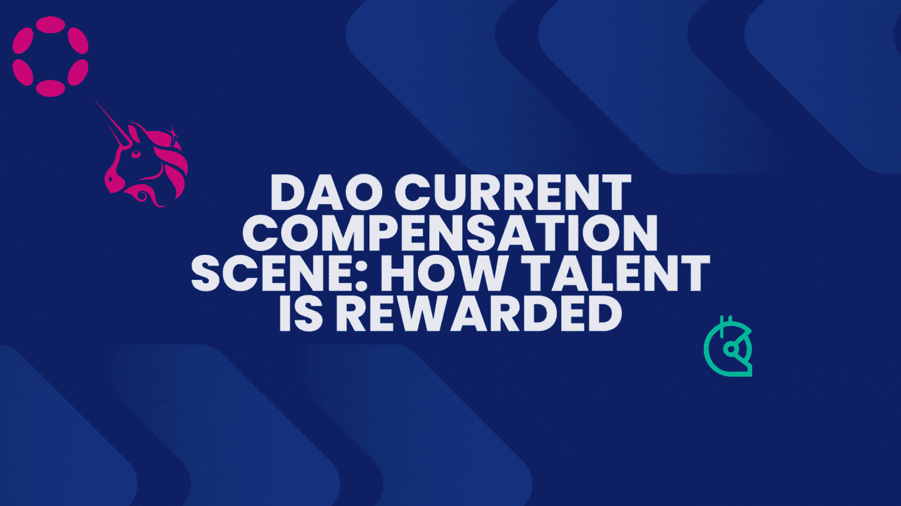

# 道当前薪酬与激励:如何奖励人才

> 原文：<https://medium.com/coinmonks/dao-current-compensation-and-incentivization-how-talent-are-rewarded-d634c5982dda?source=collection_archive---------6----------------------->

这是无银行岛作家群的第三篇，共四篇。

从经验来看，我相信为 DAOs 做贡献是在 Web3 中做有吸引力和有回报的工作的最好方式。也就是说，有一个特性是一致的:适应性和使用灵活的补偿过程来满足 DAO 贡献者的各种需求。

本文涵盖了 DAO 目前的薪酬格局(什么可行，什么不可行)，所使用的薪酬工具，以及对工作组的一点了解。

# DAO 电流补偿结构

许多 DAO 成员受益于 DAO 提供给贡献者的灵活性。这种灵活性是因为，与传统组织不同，Dao 使用多种独特的补偿机制。他们的支付模式从支付治理代币到稳定积分和加密以获得授权、奖金和角色分配任务。

例如，[治理令牌](https://coinmarketcap.com/alexandria/glossary/governance-token)给予成员在 DAO 中的治理权和股权，但通常不能作为贡献者的足够工资，因为它们的市场价值可能低于预期。此外，向贡献者支付治理令牌可能会导致在公开市场上倾销令牌，这可能会进一步压低令牌的价值。

对角色分配任务的拨款、奖金和报酬似乎是更好的激励方法。但是，如果贡献者出现在多个 Dao 中，那么保持他们 Dao 中的角色/任务、奖金和授权可能会导致倦怠。所以你看，虽然灵活性对贡献者有吸引力，但是当他们专注于一个单一的 DAO 和一个他们感到舒适的补偿模型(以避免精疲力尽)时，一些人会感觉更有生产力。当道[注意到](https://twitter.com/0xJim/status/1446317354380578830)与道工作相关的[倦怠](https://twitter.com/_kinjalbshah/status/1432792878951043076)时，他们应该把精力集中在:

*   让贡献者感到受到重视，并欢迎他们留住自己的才华
*   适当奖励贡献者，让他们能够长期投入

下面，我们来看看 DAOs 用来(以及可以用来)实现上述目标的模型和工具。

# 使用的补偿工具

我在道空间看到的最大挑战之一是补偿；知道你什么时候会得到补偿，如何得到补偿，并相信它会到来。一个完整的工具生态系统对此有所帮助，但我们的重点是少数直接影响 DAO 贡献者报酬的工具。

不完整的列表包括:

*   [SourceCred](https://www.daomasters.xyz/tools/sourcecred) :受 Google 的 PageRank 算法启发，SourceCred 根据客观和主观参数来衡量和奖励 DAOs 中的价值创造。在 DAOs 中，跟踪所有贡献并就贡献的价值达成一致是一项挑战。使用 SourceCred 数据，衡量 DAO 贡献者的价值比在传统组织中更容易。
*   [Coordinape](https://www.daomasters.xyz/tools/coordinape) :如果没有 Coordinape，这个列表会不完整，因为它看起来会在列表的最上面。它类似于 SourceCred，因为它帮助 Dao 激励参与并奖励他们最积极的贡献者。但其机理不同。使用 Coordinape，每个成员都会收到固定数量的 [GIVE](https://docs.coordinape.com/get-started/give) 代币(100 GIVE in BanklessDAO)，由他们自己选择在[圈子](https://docs.coordinape.com/welcome/gift_circle)内谁会收到分配的代币。Coordinape 很酷，因为它消除了对做出贡献的 DAO 成员进行经济奖励的耗时过程。它也给了人们权力——社区成员决定谁应该得到奖励。
*   [请求网络](https://messari.io/tool/04d2a7ab-44de-4892-9a68-6b364da3050b):请求网络是一种协议，用于促进贡献者和他们的 Dao 之间的支付请求。用户可以管理和跟踪加密发票，工资和费用。每一笔交易都不可改变地记录在协议上，支付过程没有第三方或网络费用。此外，Dao、组织及其贡献者可以通过以太坊、Polygon、Gnosis Chain、Celo、Fantom 和 Near 等区块链支付。
*   [Parcel](https://www.daomasters.xyz/tools/parcel) : Parcel 是一个资金管理和补偿工具，允许 Dao 在一次性和重复的基础上执行多令牌、多签名的大规模支付。包裹[据说可以和 200 道](https://banklessdao.substack.com/p/charity-daos-state-of-the-daos)一起工作，像 FWB，复合，Aave 授道。其独特的卖点是，它减轻了在一个 DAO 中在多个个人之间手动支付的痛苦。目前，该工具支持以下付款功能:

> 触发转移前的多信号要求
> 
> 使用 CSV 上传进行批量支出
> 
> 支持在瑞士联邦理工学院和 ERC 支付-20 代币
> 
> 能够在自动经常性支出和一次性支出之间进行选择
> 
> 批量支付以节省汽油费
> 
> 个人受益人的支出限额

*   [分散](https://www.daomasters.xyz/tools/disperse):Dao 经常需要以 ETH 或其他代币的形式向多个贡献者支付款项。这个过程需要手动设置、跟踪和支付每笔交易的汽油费。通过 Disperse，DAOs 可以将 ETH 和其他代币付款发送到多个地址，并降低汽油费。它是免费使用的，有一个简单的界面。也就是说，该工具带来了一些挑战。例如，Twitter 上报告了一些软件问题，你需要集成更多的 dApps 才能使用该工具。
*   [Wonderverse](https://www.daomasters.xyz/tools/wonderverse) : Wonderverse 是一款面向 DAOs 的项目管理工具，集成了代币支付和用户钱包。此外，项目可以发布奖金任务，跟踪进展和量化贡献。

> Wonderverse 功能:
> 
> 特点 1:项目管理
> 
> 特点 2:缴款
> 
> 特性 3:加入 DAO
> 
> 功能 4:产品发现
> 
> ‍Feature 5:使用 [Lit 协议](https://litprotocol.com/)进行令牌门控许可，也用于管理社区成员。

# “一体行动”工作组

像 BanklessDAO、Index Coop、CabinDAO、Gitcoin 和 ENS 这样的大 DAO 使用工作组或“公会”来分解报酬。每个工作组都基于才能/技能，有自己的预算、提议和支付模式。付款被分成几个季度，许多 Dao 称之为“季节”

对工作组的一个冷静观察是，他们允许预算和支付直接根据公会中贡献者的个人需求来定制。值得注意的是，利用公会或工作组的 Dao 也使用 coordinape 来分配报酬。相比之下，像 DxDAO 这样的 DAO 使用分层系统，有一套薪酬模型。

# 结果

我认为 Dao 应该努力获得持续的适应性和灵活性。举例来说，拥有多样化国库的 Dao 可以允许贡献者选择他们偏好的补偿模式/组合令牌。例如，贡献者可以选择获得 60-40 的稳定积分和治理令牌。另一个贡献者可能出于个人原因选择以治理令牌的形式获得报酬。

无论是什么，Dao 都应该考虑他们的贡献者的需求，同时确保他们的支付模式/结构有效，以留住人才。

> 交易新手？尝试[加密交易机器人](/coinmonks/crypto-trading-bot-c2ffce8acb2a)或[复制交易](/coinmonks/top-10-crypto-copy-trading-platforms-for-beginners-d0c37c7d698c)