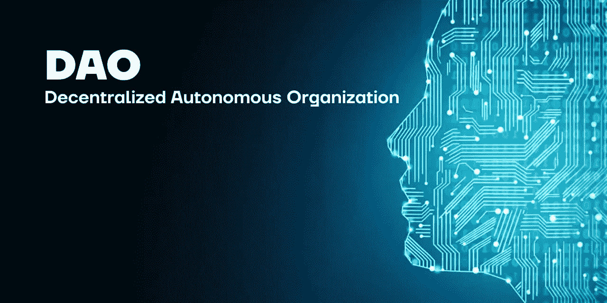
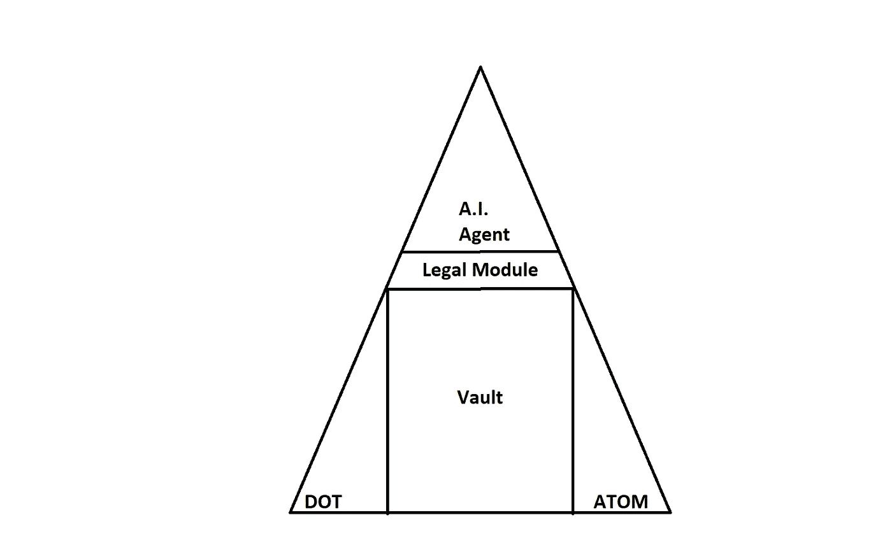
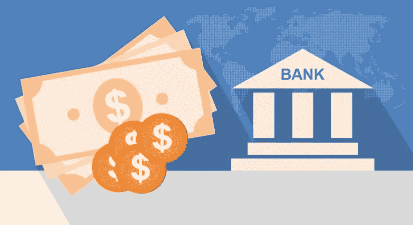
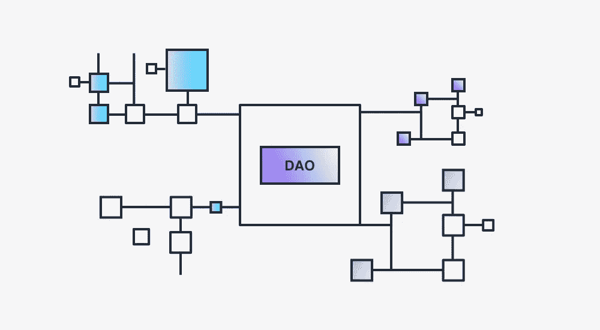
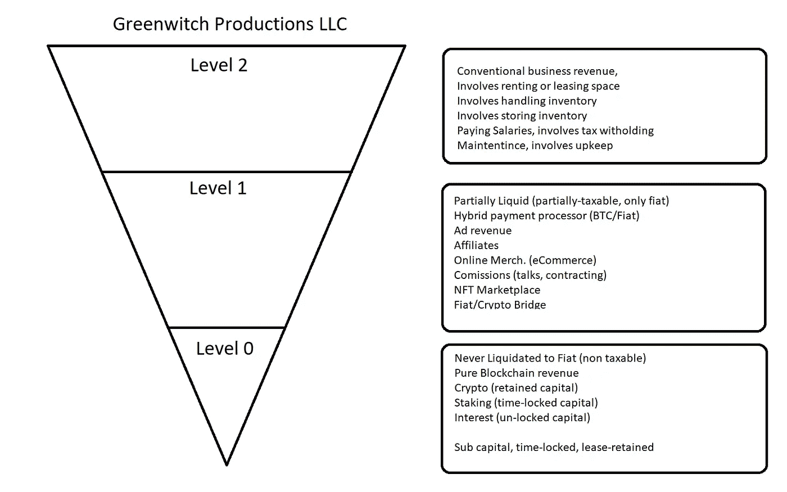

# 道，实例化的首要原则

> 原文：<https://medium.com/coinmonks/dao-first-principles-of-instantiating-380c65705bf6?source=collection_archive---------37----------------------->

~dwulf

# 拨款建议

该提案的目的是为所有加密用户设计定制的 DAO，以保护他们的身份并保持 100%匿名。通过保持 DAO 机制的明确分离，并构建自定义法律模块来促进对法律所有权和注册的识别。

人工智能代理*与 DAO 的用户*合作，创建一个保险库、气隙和硬件冷钱包。管理 7 种硬币/代币，包括 BTC、ETH、DOT、ATOM 等。

这是原绿妖刀的后续

## DOT 捐赠

**12 gwb 1 r 61 CHD 3 pdtnlba 2d 3 hythus P5 wrgnzaj 9 lzarp 7 kvs**

# **刀组件**

DAO Agent

一个 DAO 应该是多个组件的融合，以保持这种方式。道是加密生态系统的第 0 层、第 1 层和第 2 层，在我们的情况下，这是在底层和波尔卡多特生态系统上，耐心地等待通往以太坊和宇宙的坚固桥梁，固化在 WASM 而不是 EVM。

DAO 本身不受审查规定的影响，但 DAO 与之接口的网络也不受审查规定的影响，但值得称赞的是，所有从事区块链工作的开发人员大多数都会停止开发任何被迫建立审查制度的项目。

对那些想以任何负面方式削弱 DAO 甚至加密生态系统的机构进行理所应当的社会抨击。

## **4 芯一刀**

*金库*、*临时代理*、*验证机构*、*交易机构*

## **一刀合法模块**

*主动有限责任公司*

Treasury Vault

# **金库**

好了，这是 DAO 的启动资金，所有类型的加密资产都可以在这里。我们最喜欢的是 DOT、ATOM、BTC、ETH 以戴作为“稳定”的指标硬币/令牌。这是 DAO 的保险库，带有一个带有多重签名的硬件气隙设备。

A.I. Agent

# **代理人**

人工智能代理提供 DAO 的副驾驶功能，很像 Github 的副驾驶功能，但更侧重于验证器和交易的运营管理。主要功能包括最大限度地提高所有加密赌注和交易的投资回报率。

人工智能代理具有与所有加密资产交易直接接口的 API 级别，并且是除 DAO 用户之外唯一可信任的资源。人工智能代理不需要多重签名来签署保险库中的加密资产的交易。指定用于交易和主动验证的加密资产，因此是唯一可以通过这种方式交易的保险库部分，无需多重签名。冷存储中的加密资产位于保险库中的独立区域，需要完整的多签名才能移动。

DAO Mechanisms

## **验证器机制**

DAO 作为一个完整的正常运行时间验证器运行，或者作为裸机 Avado，或者作为 Amazon Web Service (AWS)云，在网络运行时间中断的情况下适当地分布。验证程序必须 24/7 100%的时间运行，否则他们将面临严厉的处罚，减少加密资产。

## **贸易机制**

当然，DAO 可以作为它自己的交易基础货盘进行交易，既可以自己交易，也可以通过另一个 API 级别的交易进行交易。买卖是通过人工智能代理的推测算法自动进行的，并得到来自其他数据集和它自己的数据集的训练数据的支持。

Legal Layers of LLC

# **民族国家税**

由于财富的性质，DAO 将这一责任转移到法律模块，以确定应纳税的财富，方法是回答一个需要解决的法律难题，以确定所产生的收入及其纳税状况是否合理。

由于资金产生的机制是 DAO 软件代理可以为区块链上的交易签名的事实上的功能，因此它(DAO)拥有资金的所有权，并且 DAO 必须确定。

“这笔收入是通过什么方式进入道法律模块的？作为工资？将所谓税收的 40%作为礼物？可能的免税住宿，如信托或贷款？完全合法且免税。”

应当注意，法律模块与核心 4 是分开的，并且 DAO 不需要其法律模块来执行其核心指令，以最大化其保险库的投资收益。法律模块只是为了持有所有权和注册而与民族国家的法律系统接口的附录。

## **法律模块**

在“内置”到 DAO 的 4 个核心 DAO 函数之外。当需要国家与国家之间的联系时，当需要租赁和财产所有权或车辆和车队的注册以获得肉类世界准入和法律保护时，就有了法律模块。

这可能是联邦、州、县和城市法律数据库中最复杂和最复杂的数据集。如果边缘案件需要，人工智能代理能够与真实世界的法律控制台和律师合作。

特拉华州 LLC 可以作为一个样本，也可以作为任何其他民族国家或君主的法律文书。

重要的是要认识到，法律模块不会干扰 DAO 4 的核心，交易和创收将继续独立于法律模块的协调人的法律。

# **结论**

现代 DAO 将成为加密用户的必备工具，自我注册，用于教育自动化交易的人工智能，用于 Avado 和 AWS 的验证器配置维护，与用户的副驾驶，用于用户的多重签名。

DAO 有助于在加密生态系统中导航，并提供合法的模块来连接所有权或注册的原因。

DAO 对用户来说是一个人工智能自动信标，在前方不确定的加密风暴中保持安全。

这篇文章绝不是财务或税务建议，只是一个道大纲。

> 交易新手？试试[加密交易机器人](/coinmonks/crypto-trading-bot-c2ffce8acb2a)或者[复制交易](/coinmonks/top-10-crypto-copy-trading-platforms-for-beginners-d0c37c7d698c)