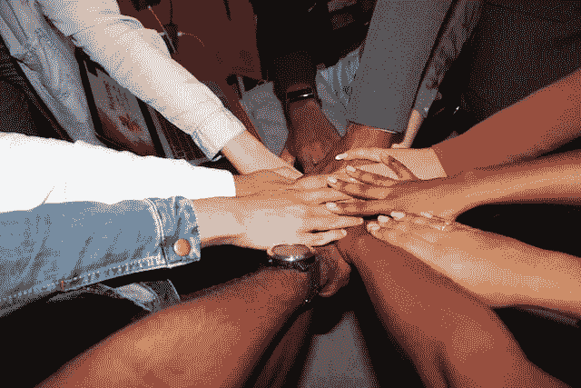

# 道组织效率？

> 原文：<https://medium.com/coinmonks/dao-organizational-efficiency-12f0b05c98a2?source=collection_archive---------44----------------------->

photo by [CHUTTERSNAP](https://unsplash.com/@chuttersnap?utm_source=unsplash&utm_medium=referral&utm_content=creditCopyText) on [Unsplash](https://unsplash.com/es/s/fotos/organizacion?utm_source=unsplash&utm_medium=referral&utm_content=creditCopyText)

## 什么是刀？

其首字母缩略词的意思是去中心化的自治组织，它指的是一种组织和运行组织的革命性方式，利用智能合同和区块链技术来提供透明性、不变性、自治性和安全性。

photo by[GuerrillaBuzz Blockchain PR Agency](https://unsplash.com/@guerrillabuzz_blockchain_pr_agency?utm_source=unsplash&utm_medium=referral&utm_content=creditCopyText) on [Unsplash](https://unsplash.com/es/s/fotos/descentralizado?utm_source=unsplash&utm_medium=referral&utm_content=creditCopyText)

## 道的起源

提出这一概念的人是德国计算机科学教授 Werner Dilger，他在 1997 年发表了一篇题为“根据免疫系统原理的智能家庭的分散自治组织”的论文。在这本书里，他处理了一个自我维持和自治的系统，由于人的本性，这个系统在当时是不可行的，然而，在区块链出现后，这个项目获得了成为现实的力量。

## 刀有什么特点？

*   该组织由一组编码在称为智能合同的软件中的规则管理。
*   没有董事、经理或员工；一切都是由计算机完成的。
*   这个组织不是由一个人控制的；其决策由所有令牌持有者做出。

## 一把刀是如何工作的？

“一体行动”是一个在没有任何人类管理、运作或行政参与的情况下运作的组织。这是未来工作和管理的模式。
它是根据完全由计算机算法控制的定义规则构建的，并通过智能合同进行管理，其成员主导的投票流程支持了中央权威的缺失，这意味着如果没有其他人的批准，任何人都不能代表 DAO 行事。当智能合约已经生效时，没有人可以更改它，因为一切都是公开记录的，并且可以在区块链上验证。
同样，这些智能合约可以简单，也可以复杂，由您选择编程。但是一旦在区块链上发布，它们将是透明的和不可改变的。这将使每个人都有可能审查他们的操作和已经编入他们程序的规则，并确信他们在未来不能被修改。

photo by [Rineshkumar Ghirao](https://unsplash.com/@throwingjungle?utm_source=unsplash&utm_medium=referral&utm_content=creditCopyText) on [Unsplash](https://unsplash.com/es/s/fotos/trabajo-en-equipo?utm_source=unsplash&utm_medium=referral&utm_content=creditCopyText)

Dao 依赖于一系列的机制来保证它们在任何时候的运行。这些机制中的第一个与对动作进行编程并根据某些参数执行它们的能力有关。这样，DAO 就获得了自主执行动作的能力。更简单地说，这种编程就是管理 DAO 的一组规则，对这种操作进行编程的最常见方式是通过智能契约。

第二种机制是共识协议。其职能是确保在"一体行动"内作出的决定由各方协商一致作出。网络之外的任何因素以及直接参与其中的人都不能改变或促使他们做出决策。

其次，Dao 有第三种机制，它依赖于令牌或交换媒介的发行。这一机制的目的是保证在财政上维持道的手段。它还允许用户获得投票权，同时成为一种交换和经济回报的机制。

最后，他们有第四种机制，其目的是记录在 DAO 中发生的所有事情。这项任务落在了区块链身上，所有的信息都存储在那里，供公众访问并保证其安全性。这四个元素的结合使得一个 DAO 可以一直工作。

## 什么是治理令牌？

治理令牌是代表组织未来利润份额的数字资产。治理令牌通常用于激励分散自治组织(DAO)中的特定行为或动作。治理令牌最常见的用例是通过向利益相关者提供分享项目财务成功的机会来调整他们之间的激励。这样，治理令牌可以被认为是公司的股票，只是它们不是由传统的股票市场发行的，并且它们的价值不取决于二级市场的供求动态。

## 优势

1.  它使得创建没有任何层级的组织成为可能。作为组织的一部分，每个人都可以贡献想法并投票支持，从而分散了组织的权力。
2.  它的透明度非常高。这是因为 DAO 从区块链技术继承了记录所有执行的操作并公开记录的能力，以及查看其操作的源代码的能力。
3.  分散化使 Dao 能够在全球范围内提供服务，这消除了边界并使许多人无法获得的服务的获取民主化。
4.  它们极大地方便了组织的创建，因为它们只需要在区块链中编程，从那一刻起，它就开始工作了。这节省了资金、时间和文书工作，而这些对于组织或公司的传统注册来说是必要的。

## **劣势**

1.  DAO 的编程是一项责任重大的任务，必须在没有错误和假设的情况下进行编程，它必须是数学和逻辑上没有漏洞的东西，因为任何差异都可能导致大量资金的损失或项目的失败。
2.  DAO 与传统组织决裂，所以它不被许多国家的法规所接受，这在很大程度上是由于区块链技术和加密货币仍然没有一个明确的法规。

## 在哪里使用 DAO 组织？

事实是，它可以用于任何项目或组织，因为它不是基于一种工作方式，重点是管理一项活动、项目或组织的方式，即使它的许多特征与我们习惯于在传统公司中看到和参与的相违背。假设我们要应用这个理论来控制一个拥有会员和设施的体育俱乐部的组织。
传统上，体育俱乐部的成员是聚集在一起享受他们喜欢的设施或娱乐活动的人。这些设施需要经常维护。每个成员支付半年或一年的费用，以维持法院和服务的运作。
俱乐部将有标准和规则来决定运营和支付，所有这些功能都将被编入智能合同，所有成员都将生成一份合同来发送资金，使他们成为组织的一部分(治理令牌)，反过来，这些资金将不会掌握在一个人或两个人手中，而是掌握在每个人手中，而不是同时掌握在任何人手中。
智能合同将阻止他们等待民主决策，以透明的方式保持可见。
维修或改进将通过请求产生，之后合作伙伴可以在一段时间内以民主方式决定他们感兴趣的预算，只将资金发放给得票最高的预算。
通过这种方式，不仅费用预算，而且改进项目、锦标赛，甚至利益的管理和分配以及共享区域的使用都可以通过一种民主、透明和不可改变的方式进行管理，并遵守所有人都知道的规则。

## 我的想法

因此，DAOs 代表了一种强大的技术创新。一个寻求重新定义不同党派合作方式的组织。这是因为它们允许创建自主、自我管理、透明和更高效的组织。

DAO 成员以透明和分散的方式做出决策，智能契约执行这些决策。

成员可以创建一个建议财政部投资或计划改进的提案。DAO 成员随后开会对提案进行投票。

如果预先定义的法定人数投票赞成该提案，它将被 smart 契约接受并执行。

因此，DAO 结构提供了一种线性组织结构。每个 DAO 成员在社区中都有同等的分量，并有机会领导和决策。

> 交易新手？尝试[加密交易机器人](/coinmonks/crypto-trading-bot-c2ffce8acb2a)或[复制交易](/coinmonks/top-10-crypto-copy-trading-platforms-for-beginners-d0c37c7d698c)