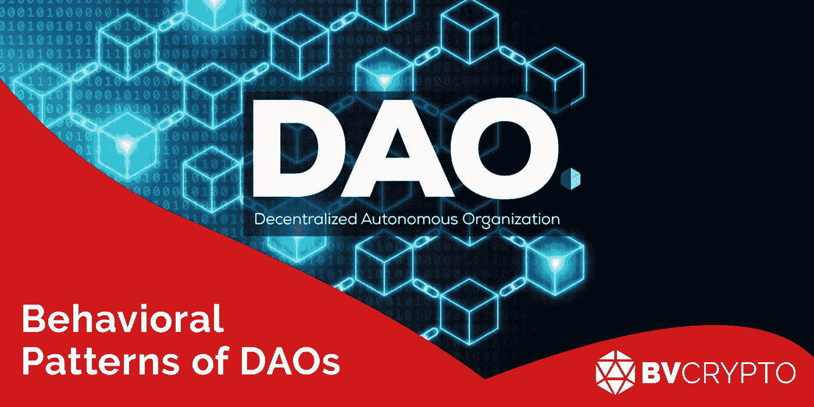

# Dao 的行为模式

> 原文：<https://medium.com/coinmonks/daos-behavior-models-bdbcf7594729?source=collection_archive---------16----------------------->

大多数加密货币公司都是由加密货币所有者投票管理的，如 [DAO](/@BV_Crypto/next-generation-crypto-companies-1d9bc01978a8) s(去中心化自治组织)。由于加密货币是在自由市场上交易的，任何拥有足够数量代币的用户都可以在平台上拥有投票权。因此，对于决定一个平台，需要说服成千上万的用户，而不是一小群高管。正因如此，一个社区的特色非常重要。在这个充满挑战的时期，面临各种问题的 Dao 一直试图根据其结构做出决策，并通过现有的流程。

为了从一个普遍的角度来看这些决定，我们将通过关注 MakerDAO、Solend、Yield Guild Games (YGG)和功德圈 DAO 社区，调查 DAO 如何产生解决问题的方案以及他们表现出什么样的性格；因此，我们将调查他们的行为模式。

**屈服帮会游戏(YGG)和功德圈刀**

众所周知，风险资本通过为早期阶段的项目提供资金进行投资。传统经济和加密世界的加密货币市场中都有风险投资公司。YGG 是一家来自加密市场的风险投资公司，成立于 NFT 游戏的兴起时期。

在这个题目下我们要解释的事件，是从投资项目功德圈道开始的。在项目的早期阶段进行投资，YGG 实际上在没有任何实质性发展的情况下实现了这一投资，并承担了风险。投资价值增加了 x30，回报超过了承担的风险水平。然而，在这一点上，事情并不顺利，YGG…

在 4 月 28 日的声明中，Merit Circle 要求其早期投资者具体说明他们对该项目的贡献类型。YGG 分享了一份回应声明，宣布 YGG 为功勋圈所做的工作。

5 月 20 日，[提交了一份关于 MeritCircle DAO 的提案](https://vote.meritcircle.io/#/proposal/QmT71tWtTwk6q5Cd2kvhoLzxm76SpNaQGBR9RE7pCxBM58&quot)，提出虽然是早期投资方，但对该项目的投入不足，且已经获得了大量利润；因此建议将投资金额返还给 YGG，并且不赠送任何代币。这个行动计划意味着注销 YGG 大约 30 英镑的利润。

YGG 对此事的反应是指责性的，有些咄咄逼人。声明中指出，根据与 Merit Circle Ltd. (Merit Circle DAO 的组织，具有正式公司地位，并以合法形式开展活动)签署的投资协议，没有义务为该项目开展任何工作，但仍开展了此类工作，并列举了这些工作；不可能忽视 YGG 对目前状况的贡献。

Merit Circle Ltd .证实协议中没有这样的条款。但他们表示，唯一的酌处权是在价值圈道，他们必须坚持投票结果。

就在这个时候，事情变得有趣了。因为从法律上讲，功德圈没有权利终止协议。但既然社区做出的决定是决定性的，法务部也就无计可施了。他们必须执行做出的决定。

那么，当 Dao 做出违法的决定时会发生什么呢？让这场争论变得有趣的主要观点是这个问题。例如，如果将争端提交法院，法院的判决如果不为道社区所接受，如何能够确定？让我们假设功绩圈有限公司的经营因判决未能执行而终止。在这种情况下，功德圈刀可以继续经营。但由于它失去了公司的合法地位，它将不得不通过分散的平台运营所有业务。因此，当涉及到 DAOs 以及智能合约的设计时，社区的特征也是非常重要的。因为道是一种新的、试验性的公司结构。因此，尽管这种创新所带来的改进很有吸引力，但它仍然存在许多结构性问题。

> 交易新手？试试[加密交易机器人](/coinmonks/crypto-trading-bot-c2ffce8acb2a)或者[复制交易](/coinmonks/top-10-crypto-copy-trading-platforms-for-beginners-d0c37c7d698c)

5 月 28 日，在关于功圈道的议案表决中，“同意”票数占总票数的 83%，确认退还投资款并取消其早期投资人身份。但是紧接着这次投票之后，在 7 月 7 日的另一次[投票](https://vote.meritcircle.io/#/proposal/QmanW7dTyF2LvvU9iAGwj3i9D4F3TS7ZbxR33jVCmKMrgR&quot)中，做出了一个相对负责任的决定。有人提议向 YGG 返还约 30%的当前面值，而不是投资金额；意思是用功德圈刀买代币。据称，在这种情况下，将与 YGG 签署一项回购协议，并保证不会采取任何法律行动。可能机构群体怀疑此事可能造成的挫折，该提议以 100%的赞成票被接受。因此，价值 520 万美元的 YGG 代币被 Merit 以 170 万美元回购。

6 月 14 日，与功德圈道共同[发表声明](/yield-guild-games/yield-guild-games-official-statement-regarding-merit-circle-proposal-b684ec2336fd&quot)，宣布纠纷已解决。该声明指出，Merit Circle DAO 不同意关于没有参与该项目的意见，该建议属于 Merit 的一个股东，该声明似乎旨在不诋毁，并表明该问题使 Merit 陷入困境。

看来和功德圈有限公司的谈判为第二个方案打开了一条道路，并说服道社区在法律范围内做出决定。通过同意以 10 倍的利润而不仅仅是初始投资金额来支持，YGG 似乎已经同意避免一个充满不确定性的漫长审判过程。虽然这两家公司之间的争端已经解决，但可以预计，在未来，风险资本公司可以为它们投资的项目要求更精确的担保。由于这样的决定，投资任何 DAO 的公司都可以表现得更加谨慎。其中一个主要原因是 Dao 还没有合法的基础设施。

此外，我们已经看到了那些可以操纵 Dao 社区的人的惊人影响。提出初步提议的股东也可能支持 4 月 28 日的声明，该声明要求核心投资者提交他们的出资。显然，这一声明为反对 YGG 的提案创造了基础。而且似乎不难引导那些由于熊市已经过于压抑和激进的用户进行这样的操纵。从 100%的投票率中可以清楚地看到，在第二次投票中，人们采取了谨慎的态度，出于保护项目的本能而行动。因此，手法是另一个需要研究和防范的课题。

**马克尔道的行动**

作为最古老的 DAO 之一，MakerDAO 是一个提供抵押贷款的 DeFi 平台。除此之外，唯一一个长期正常稳定运行的算法稳定币，戴，是马克道所有。该平台的成功归功于其分散的结构和专业的管理形式。流动性危机是过去一个月最严重的问题，马克尔道在流动性危机期间的举措也非常重要。

作为一个像银行一样被认真管理的公司，MakerDAO 值得称赞，因为它多次证明了它有一个长期稳定的可靠社区。

由于 DAI 和信贷都是在高抵押率的情况下发放的，因此该平台从未出现过任何流动性危机。但由于任何提供银行服务的平台都会影响到其他平台，因此马克道显然提前采取了预防措施。其中一个注意事项就是 MakerDAO 在 Aave 平台上做出的决定。

由 [Celsius 和 3AC](/coinmonks/an-overview-of-the-liquidity-crisis-through-the-lead-actors-celsius-and-3ac-6deecc959ae9) 领导的关于出现的流动性危机的最重要的主题之一是 stETH 令牌的平价池没有足够的流动性，因此这些公司无法通过出售足够数量的 stETH 来获得足够的流动性以偿还债务。由于 Aave 是接受 stETH token 作为抵押品的平台之一，并且由于 stETH token 的流动性平衡有问题(实际上是不平衡)，MakerDAO 决定停止 Aave 的直接链接，因为 Aave 有权直接创建 DAI。

这种直接联系的原因是允许希望从 AAVE 上的和戴资金池获得贷款的用户以固定利率持续交易。例如，如果获得戴贷款的利率每天从 6%变化到 4%，这将对投资者的长期计划产生负面影响；因此，它的目的是提供一个固定的利率。利率是根据池中的平价余额决定的。例如，如果用户获得太多的 DAI 贷款，池中的 AAVE 量增加，而 DAI 量减少。在这种情况下，借款的成本，也就是要支付的利息，增加了。为了避免利率上升，Aave 被授权直接创建 DAI，直到资金池达到平衡。当债务清偿后，Dai 又回来了，通过收回 Dai，余额就产生了，这样就有可能获得固定利率的贷款。系统以这种方式运行，直到链接被暂时停止。

虽然通过这种直接链接创建的池没有问题，并且 Aave 在其操作系统中有足够的流动性，但 MakerDAO 暂时停止这种链接的原因是为了避免通过 stETH 在 Aave 的池中可能发生的潜在问题。因此，放慢其行动，不冒高风险，并采取预防措施；马克尔道社区因拥有非常专业的道管理而受到称赞。

MakerDAO 最近做出的另一个重要决定是将其一部分余额转移到短期美国国债。这一决定被接受后，价值 5 亿美元的国库券被购买，可以说该平台试图保护其收入免受通货膨胀的影响。由于这种票据类型流动性极强，万一有什么急用，可以快速返还给平台。因此，据观察，遵循了极其平衡的管理战略，并投入了正确的努力来度过当前时期。

**索伦德**

以太坊并不是唯一受到流动性危机影响的网络。Solend platform on Solana 也遭遇了这场危机。被管理为道，通过表决；索伦德因其处理这场危机的方法而受到严厉批评。

像 MakerDAO 或者 AaveSolend 平台是另一个提供抵质押品信用的加密货币平台。但是，这里的问题是，Solend 没有其他平台那么深的池子。也就是说，平台能给的额度相对有限。

一位匿名用户向 Solend 平台提供了 570 万 SOL 令牌作为抵押，并获得了价值 1.08 亿 USDC 的信用。用这种贸易；这个用户可以被描述为一条鲸鱼，他购买了 Solend 可以借出的 USDC 量的 88%。因此，平台用光了 USDC 来支付想要提取他们的 USDC 余额的用户。用户唯一能做的就是等待鲸鱼偿还债务…

但迫使 Solend 社区就此事投票的主要原因是，该信贷接近流动性阈值。由于市场前景不佳，索尔代币的价格持续下跌，作为抵押品的 570 万索尔的价值也随之下跌。如果抵押品接近无法覆盖信贷的水平，智能合约会自动扣押抵押品，并通过出售 SOL 令牌，将借入的美元债券放回池中。在一个正常的市场中，让这样的机制发挥作用不会有任何问题。但是在这样一个需求太低的时期，立即卖出 570 万索尔价值的代币可能会大幅降低索尔代币的价格，并构成风险。

在提交给机构群体的[提案](https://realms.today/dao/7sf3tcWm58vhtkJMwuw2P3T6UBX7UE5VKxPMnXJUZ1Hn/proposal/HuaL6cDtuNtfnJgvwMnYiZDHVCoLAuDtVFgJD8kYChJ4&quot)中，建议在接近关键流动性限额时，通过 OTC 而非自由市场手动扣押信贷并出售作为抵押品的 SOL 令牌，以防止对价格的影响。

尽管这个提议在操作上有意义，但它与 DeFi 的原则完全相反。像锁定智能合约的抵押品和自动清算这样的系统是针对传统银行系统创建的系统，它们背后的主要原则是去中心化。这样的人工扣押会导致 Solend 成为传统银行，并有可能严重动摇对平台的信任。

由于 DeFi 原则被忽视，社区对投票有严重的批评。然而，由于只有一个拥有%88 投票权的帐户投了“是”票，该提议被自动接受。通过这种方式，可以看出 Solend DAO 非常集中，社区的意见只取决于一个账户的批准。

提出这一建议后，联系了信贷所有人，并采取了中间路线，通过各种调整降低了 Solend 承担的风险。由于社区的反应，手动信用扣押决定被取消。然而，索伦德道没有被分散的事实造成了一种极其消极的观点。

— — — — — — — — — — — — — — — — — — — — — —

在 MakerDAO 案和功德圈 DAO 案中，我们看到了社区的投票是如何作出决定的，这些决定可能产生积极和消极的影响。然而，在这两件事上，我们不能谈论集权。当一个 DAO 处于一个人或一个团体的控制之下时，该平台几乎变成了一个透明运营的私人公司。然而，DAO 的目标是创建没有老板或决策者的公司，让社区自己管理自己。

而像功德圈道案这样的操纵，就是这类群体可能面临的潜在问题的一个重要例子。如果 YGG 采取法律行动，我们可能会看到新的问题和新的经验。

每个人都互相控制，每个决定都是经过长时间讨论后投票决定的，没有广泛共识的提案不会被接受的 DAO 模型，就像比特币一样，代表了现有 DAO 希望达到的理想点。然而，尽管这种长时间的讨论和广泛的共识可以最大限度地减少错误，但它们会妨碍快速决策。这种差异的基础是本文开头提到的特征和行为模式。

对比特币等系统的信任，以及对该系统未来成功的信念，在投票中优先考虑项目的长期目标。那些通过连接到比特币网络投票的人，因为矿工信任比特币系统，并成为这个系统的一部分。因此，在这一点上，我们可以说，系统创造了社区的特征，参与者使自己适应了这一系统的特征。

在索伦德的例子中，我们看到分散经营原则被单一投票所忽略；在功绩圈的例子中，我们面临着当功绩圈不再需要投资时，投资者被“解雇”的情况。这些 Dao 使用的这种捷径方案表明，与比特币不同，社区的特征塑造了系统本身。

总之，重要的是要记住，这个全新的管理系统中的每一个新问题都提供了一个重要的经验。这样的问题也可以让 Dao 通过智能合约来规范自己。这里重要的是不要把做出集中和不道德决策的 Dao 放在眼里，而是让社区对这样的 Dao 做出反应。

编制人:Berkay Aybey

*此处表达的观点和评论归 BV Crypto 所有。BV Crypto 不能对基于此帖子的任何金融交易负责。每一次投资和交易都有风险。当你做决定时，你应该自己做调查。*

> *加入 Coinmonks* [*电报频道*](https://t.me/coincodecap) *和* [*Youtube 频道*](https://www.youtube.com/c/coinmonks/videos) *了解加密交易和投资*

# 另外，阅读

*   [3 商业评论](/coinmonks/3commas-review-an-excellent-crypto-trading-bot-2020-1313a58bec92) | [Pionex 评论](https://coincodecap.com/pionex-review-exchange-with-crypto-trading-bot) | [Coinrule 评论](/coinmonks/coinrule-review-2021-a-beginner-friendly-crypto-trading-bot-daf0504848ba)
*   [莱杰 vs n rave](/coinmonks/ledger-vs-ngrave-zero-7e40f0c1d694)|[莱杰 nano s vs x](/coinmonks/ledger-nano-s-vs-x-battery-hardware-price-storage-59a6663fe3b0) | [币安评论](/coinmonks/binance-review-ee10d3bf3b6e)
*   [加密交易机器人](/coinmonks/crypto-trading-bot-c2ffce8acb2a) | [Bingbon 评论](https://coincodecap.com/bingbon-review)
*   [Bybit Exchange 审查](/coinmonks/bybit-exchange-review-dbd570019b71) | [Bityard 审查](https://coincodecap.com/bityard-reivew) | [Jet-Bot 审查](https://coincodecap.com/jet-bot-review)
*   [3 commas vs crypto hopper](/coinmonks/3commas-vs-pionex-vs-cryptohopper-best-crypto-bot-6a98d2baa203)|[赚取加密利息](/coinmonks/earn-crypto-interest-b10b810fdda3)