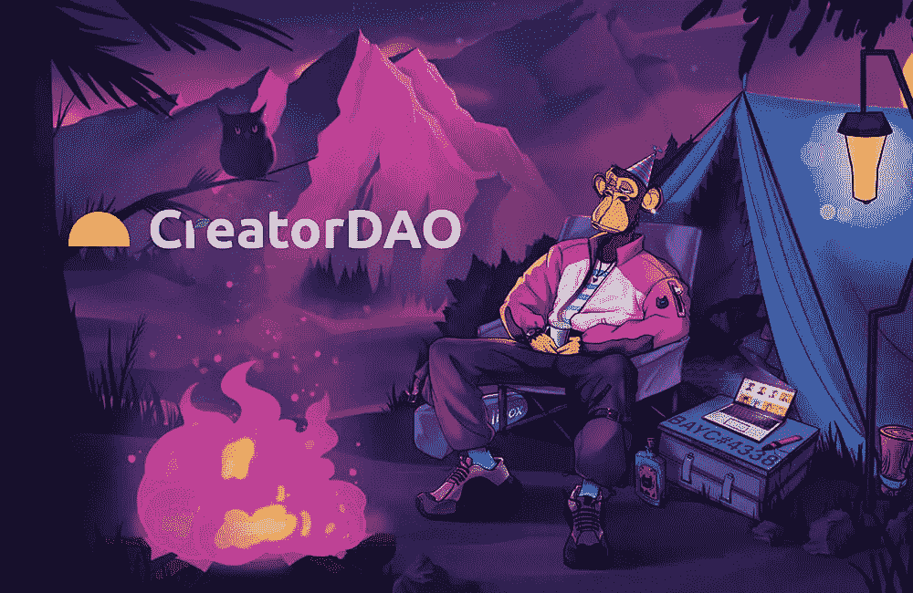

# Dao 在短短一年内从 700 人增加到 6000 人。

> 原文：<https://medium.com/coinmonks/daos-have-gone-from-700-to-6-000-in-just-1-year-2d3979673f61?source=collection_archive---------22----------------------->

A decentralized autonomous organization called EmpireDAO is leasing a property in New York City to create a coworking space for crypto builders.

有质量内容的才是王道。

当有蛋糕和五彩纸屑时，Web3 比孩子的生日聚会更疯狂。

硬币打破了到达月球的最快时间记录，并坠落在地球上。

web3 中的诈骗和欺诈数量也翻了 100 倍。

想知道还有什么暴涨？

道的数量。

短短一年时间从 700 到 6000 多。

这种增长令人震惊。

DAOs 快速复习。

他们是自治的分散组织，任何人都可以加入，贡献，他们都集体分享一个数字钱包。

任何事情都有道理。

从拥有宪法和购买高尔夫球场，到管理怀俄明州的城市，当然还有 DAOs 购买和拥有最近市场上最热门的东西——NFTs。

闻起来像淘金热？

可能是吧。

CreatorDAO raised $20m with backing from big names like a16z, Initialized Capital, Paris Hilton, Garry Tan, and the Chainsmokers.

所以一个聪明的人会告诉你去开始一把刀，乘风破浪。

大量的工作，大量的宣传营销，研究治理将如何工作，并努力为 DAO 找到有意义的实用程序。

但因为内容为王，一个聪明的投资者会告诉你投资于帮助内容创作者的人。

像 a16z，Initialized Capital，Paris Hilton，Garry Tan 和 the Chainsmokers 这样的大牌都给了 creator Dao 2000 万美元。

简单来说，道给予其成员独一无二的机会去播种和支持高潜力的创造者。

如果你认为内容创造者或有影响力的人会爆炸，这是你早期介入并投资他们的机会！

一点也不差。

这在一定程度上解决了人们的一个痛点，他们一直钦佩并看到影响者变得多么大，并希望有机会尽早投资他们。

MrBeast, the top YouTuber of all time, has a burger brand bringing in the big bucks now.

福布斯 2021 年十大赚钱 YouTube 明星:

野兽先生——5400 万美元。

杰克·保罗——4500 万美元。

马克普利埃——3800 万美元。

瑞特&林克——3000 万美元。

无法形容——2850 万美元。

比如纳斯蒂亚——2800 万美元。

《瑞安的世界》——2700 万美元。

完美的家伙——两千万美元。

你明白了。

听起来很棒，对吧？

行得通吗？

我当然希望如此。

但是我觉得会很难。

在创造者的海洋中很难选出赢家。

**Launched in January, Prime Hydration is already the sixth-largest sports drinks brand in the US, with more than 110 million drinks sold and nearly $200 million generated in revenues**

天赋很难被发现、发现和挑选，尤其是在它们最早的时候，就像未加工的宝石一样。

从开始到成功，创作者经历了比青春期更多的考验和磨难，起起落落，打击和失误。

这是没有公式的。

但我很高兴有人正在尝试。

这是一件有趣的事情，人们可以参与其中，他们可以直接支持他们的新兴内容创作者，并获得一些所有权。

谁知道呢，也许有一个神奇的公式来识别超级巨星的影响力呢？

-

你会投资早期内容创作者吗？

-

#创业#商业#创业#成长#成功#社交媒体#文化#网络# eth # btc #加密#影响者#创造者#内容创造者#创造者道#道#去中心化#内容

> 交易新手？试试[加密交易机器人](/coinmonks/crypto-trading-bot-c2ffce8acb2a)或者[复制交易](/coinmonks/top-10-crypto-copy-trading-platforms-for-beginners-d0c37c7d698c)