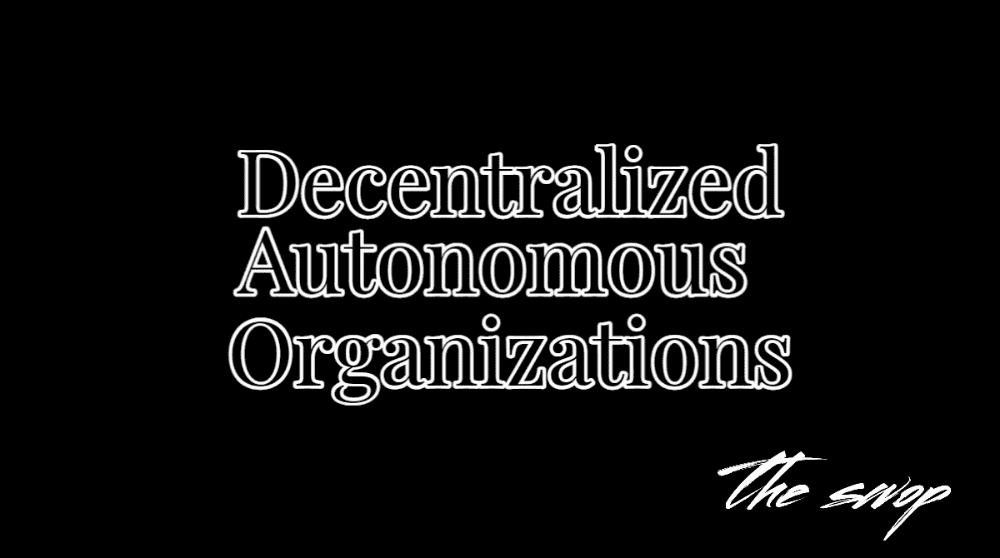
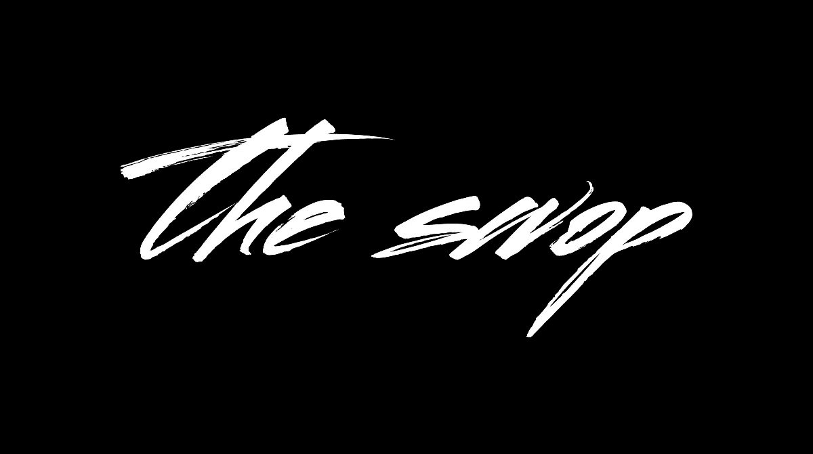

# 道斯:商业的未来？

> 原文：<https://medium.com/coinmonks/daos-the-future-of-business-b563111001c2?source=collection_archive---------36----------------------->

分散自治组织(Dao)作为一种在数字世界中组织和运营业务和项目的新方式，正在获得越来越多的关注。这些组织完全由代码运行，没有中央权威或层级。相反，它们由一套编码在智能合约中的规则管理，这些规则在区块链上执行。

Dao 有可能彻底改变我们做生意的方式，提供一种分散的、透明的、自治的组织和管理项目的方式。它们允许公开参与，任何人都可以在决策过程中做出贡献并拥有发言权，只要他们遵守智能合同中概述的规则。

DAO 最著名的例子之一是 DAO，它于 2016 年在以太坊区块链推出。DAO 是一个分散的风险资本基金，允许任何人对项目投资进行提议和投票。DAO 在首次硬币发行(ICO)中筹集了超过 1.5 亿美元，成为当时历史上最大的众筹活动之一。

> 交易新手？在[最佳密码交易所](/coinmonks/crypto-exchange-dd2f9d6f3769)上尝试[密码交易机器人](/coinmonks/crypto-trading-bot-c2ffce8acb2a)或[复制交易](/coinmonks/top-10-crypto-copy-trading-platforms-for-beginners-d0c37c7d698c)

然而，DAO 也遭受了一次高调的黑客攻击，攻击者能够利用智能合同中的漏洞，从组织中抽走数百万美元。这一事件凸显了使用智能合同治理 Dao 的潜在风险和挑战。

从那以后，人们一直在努力提高智能合约的安全性和可靠性，DAOs 的概念也在不断发展。如今，Dao 被广泛用于各种目的，包括分散金融(DeFi)、治理和社区驱动的决策。

Dao 的主要好处之一是它们允许分散决策和透明治理。道采取的所有行动都记录在区块链上，让任何人都可以很容易地看到他们做了什么决定，以及这些决定是如何达成的。这种透明度有助于在组织内建立信任和问责制。

Dao 的另一个好处是它们可以是无边界和分散的，没有控制或权威的中心点。这使它们成为需要跨多个司法管辖区运营的全球项目和组织的理想选择。

然而，DAOs 也有相关的挑战和风险。一个问题是恶意行为者操纵决策过程或利用智能合同中的漏洞的可能性。还有一个可伸缩性的问题，因为随着规模和复杂性的增长，一些 Dao 可能会变得很麻烦，并且做出决策很慢。

尽管面临这些挑战，Dao 的潜力是巨大的，它们可能在未来几年继续获得牵引力。随着构建和操作 Dao 的技术和最佳实践不断成熟，我们可以期待看到更多的组织采用这种创新的操作模式。

