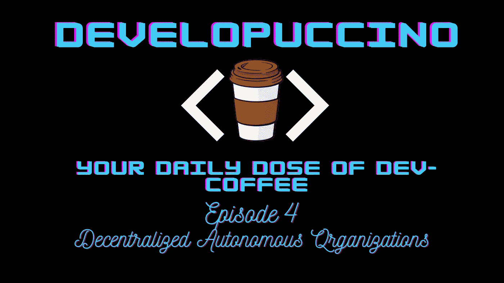
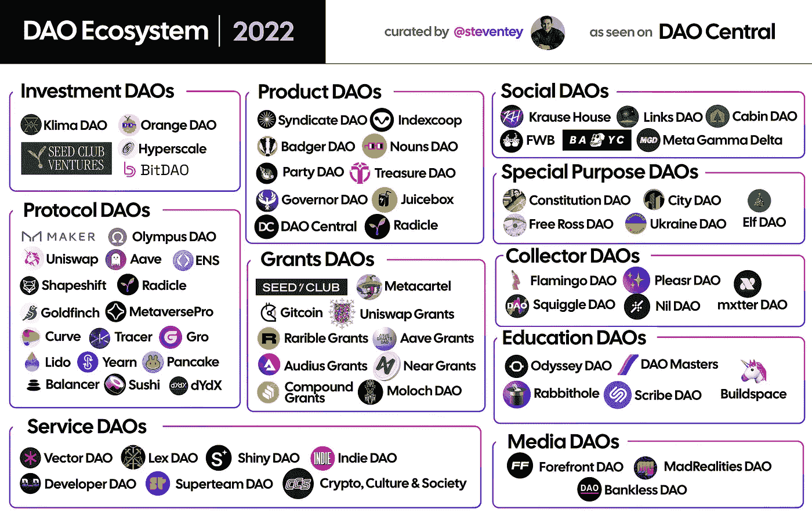

# DAOs——探索新世界组织。

> 原文：<https://medium.com/coinmonks/daos-the-unseen-pillars-of-web3-2f93ad081e98?source=collection_archive---------22----------------------->

Developuccino is Back! And this time we talk about DAOs.

再次问候！这里是第四集**【发展中国家】，** 根据系列的目标，我们已经围绕前几集的 Web3 的介绍部分，在这一集中，我们将更深入地探讨道的发展，在我看来，这是这个领域中最重要、最完整和最令人兴奋的部分之一。

# 什么是刀？

我们已经看到了太多对此的解释，我不会在这里逗留太久，而是非常准确地说出我对道的看法。

***“道(分散自治组织的缩写)是一个社区领导的实体，这是一个组织中决策的新兴法律结构形式，由志同道合的人组成，为共同的目标而努力。”***

没有未来规划的独裁者，没有可以在财务上欺骗你的权威，没有多数人的支持，什么都没有。一切都是公开的，关于消费的规则通过代码嵌入到 DAO 中。最终，一个 DAO 完全由它的个体成员治理，这些成员共同做出关于项目未来的关键决策，例如技术升级和财务规划。

# 我们为什么需要 DAOs？

创办一个组织并管理它是一项艰巨的任务，资金的支出或决策，一切都应该透明。Dao 支持扁平的治理结构，而不是通用的层次丰富的结构。“一个道”不是依靠一个人或一小群人来指导实体的方向，而是打算给予每个成员发言权、投票权和提出倡议的机会。

" ***“道”也力求有严格的治理，这是由区块链上的法典规定的。"***

Dao 的存在保证了空间的基础完好无损，我们在一定程度上已经习惯了等级制度的错误，但是有了 Dao，我们获得了必要的自由。我们拥有以分散方式提供给我们的服务，以及贯穿始终的透明温暖。

# 一把刀是如何工作的？

Another Generic Meme to lighten the mood.

DAO 的规则是由使用智能契约的社区成员的核心团队建立的。这些智能契约奠定了 DAO 操作的基础。一旦这些规则正式写入区块链，下一步就是获得资金，DAO 需要弄清楚如何获得资金以及如何开始治理。解决方案在于生态系统本身，协议通过出售令牌来筹集资金和填充 DAO 金库。

DAOs 的投票过程发布在区块链上。用户必须经常在互斥的选项中进行选择。投票权通常根据用户持有的令牌数量在用户之间分配。这种做法确保了任何人都不能根据自己的判断将刀置于危险之中，因为在这个过程中，他将成为沉船的一部分！作为道牌的主要持有者之一。

# 道生态系统

Image Source: The DAO Central (The best informative resource about the DAOs)

目前该领域中存在大量 Dao，其中一些非常流行的类型如下-

*   协议 DAO
    协议 DAO 是一种 DAO，它被设计用来管理一个分散的协议，例如借贷应用、分散的交换或另一种类型的 dApp。
    [变形刀](https://shapeshift.com/)算是这一类中相关且活跃的刀之一。
*   Grants DAO
    Grants DAO 旨在促进非营利捐赠，在整个 web3 生态系统中战略性地部署资本资产，或者是更大项目的慈善扩展，或者是 DeFi 领域中完全独立的实体。
    该类别的 og 有 [Gitcoin](https://gitcoin.co/) 和 [Aave Grants](https://aavegrants.org/) 两者都负责为一些非常知名的项目播种种子。
*   **Media DAO** Media DAO 通过创造由社区驱动的内容来重塑传统媒体平台。
    [无银行刀](https://banklesshq.com/)在我看来，就是五毒这一类。凭借他们积极主动的社交媒体存在，从他们受欢迎的播客中获得的保留是值得学习的。
*   **服务道** 服务道是人才聚合器，同一领域的专业人士聚集在一起，形成一个链上联盟，作为一个集体整体提供服务。
    [超级团队刀](https://superteam.fun/)是空间中流行的职业和雇佣服务刀之一。
*   **产品 DAO** 与服务 DAO 类似，产品 DAO 是个体联合起来构建产品/项目以实现某个目标。这些产品产生的收入随后被归入由 DAO 令牌持有者管理的国库。
    [刀中央](https://daocentral.com/)，试试这个，你会找到几乎所有现存相关刀的信息和卡片。
*   **教育道** 这些教育道承担起教育现有人才和吸引有前途的人才进入太空的责任，它们主要是代替一些费用，这些费用主要是象征性的。
    [BuildSpace](https://buildspace.so/) 在我看来已经在这里称王，我可以说相当活跃和受欢迎！

# 结论

道可以被称为空间的基石，不断提升他们的游戏并帮助发展空间的所有维度是道的永恒责任。我希望这个概述在本质上是精确而简洁的，我在仔细阅读之后使用了一些原始资料。欢迎建议！
如果你想快速了解这个领域的一些项目，请关注我的 [Twitter](https://twitter.com/MuktanshuM) 。

> 再见！你的发展已经送达。
> 
> 交易新手？尝试[加密交易机器人](/coinmonks/crypto-trading-bot-c2ffce8acb2a)或[复制交易](/coinmonks/top-10-crypto-copy-trading-platforms-for-beginners-d0c37c7d698c)