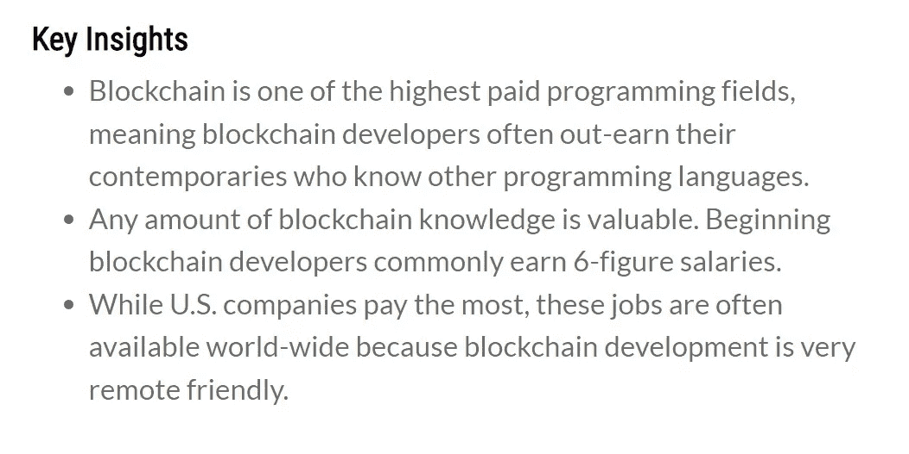
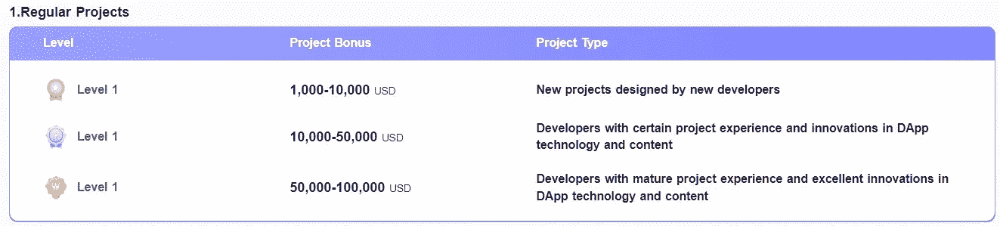
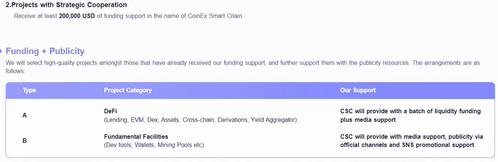
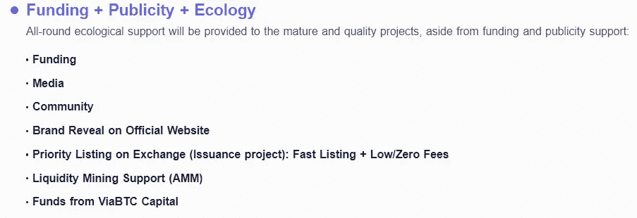

# DApp 发展:百万美元产业

> 原文：<https://medium.com/coinmonks/dapp-development-the-million-dollars-industry-a9e8d06e0274?source=collection_archive---------25----------------------->

## DApp 发展的 CoinEx 智能链

最近，区块链和加密货币让世界嗡嗡作响。这并不奇怪，因为全球区块链市场预计到 2027 年将达到 690.4 亿美元。对分散式账本技术的需求明显上升。

今天，DApps 是我们将要谈论的话题。他们可能还没有太多的媒体关注，但了解他们是什么，他们的利弊，以及你的企业是否需要他们是必不可少的。希望帮助公司利用创新技术的专业人士需要跟上最新的发展。所以，让我们开始深入去中心化应用的世界吧

## 什么是 DApps

简而言之，DApps 全称为分散式应用程序，类似于传统的软件应用程序，但它们是建立在像 CSC 这样的分散式网络上的。因此，要完全掌握 DApps 的概念，您应该首先了解它们的底层技术——区块链。[看我之前的文章对什么是](/coinmonks/csc-an-efficient-blockchain-technology-for-smart-and-secure-applications-a944a5d0ce89)区块链有一个清晰的认识。

CSC — CoinEx 智能链是基于 PoS 共识协议的第 1 层公共高效区块链，CoinEx 智能链是去中心化和节能的。CSC 使构建您自己的(DApps)分散式应用程序变得容易。

DApps 通过智能合约连接到区块链，而不是像传统应用程序那样链接到集中式数据服务器。智能合同是 DApp 的核心，因为它有助于自动执行各方之间的协议。

## DApps 的主要特点

现在您对 DApps 有了一个大致的了解，让我们更具体地了解一下实际构成它们的关键特性。

*   **开源。**DApp 必须是开源的，没有单一实体控制它。它必须是自主的，代码必须可供检查。
*   **分散。其操作记录必须存储在分散的区块链上。**
*   **赏罚分明。它必须能够生成代币作为价值证明，并在网络上分发这些代币作为奖励。**
*   **符合协议。** DApp 的股东必须就加密算法达成一致，以证明其价值。例如，比特币和以太坊目前都使用工作证明作为其共识协议。然而，后者正计划在未来几年转向股权证明。

最终用户甚至可能无法将 DApps 与传统应用区分开来，因为主要的区别在于底层的区块链协议。

## DApps 的优势:为什么它在全球范围内被采用

这是 DApps 越来越受欢迎的原因。事实上，不止一个。看看分散式应用程序的优势，并决定它们是否能让您的公司受益。

**抵制审查。**任何政府或实体都不能阻止用户操作 DApp。没有一个人有足够的权力控制网络，阻止用户提交交易、部署应用程序或从区块链读取数据。基本上，如果 Instagram 或 Twitter 在以太坊上，没人能屏蔽你的帖子或阻止你发微博。

**隐姓埋名。**大多数 DApps 不需要你的真实身份。你只需要有一个以太坊登录和一个数字钱包，而不是经历一个漫长的注册过程。

**零停机。**由于其对点对点系统的依赖，即使部分网络架构崩溃，DApp 仍将继续运行。一旦上线，如果区块链平台也是基于迷恋的话，它只会崩溃。

**数据完整性。加密技术确保存储在区块链上的数据不会被黑客伪造。此外，用户可以访问公共区块链来验证交易，从而使数据记录更加可靠。**

**内置支付。**无需将您的应用与第三方支付提供商集成。这大大加快了支付处理时间。

## 经济统计

区块链一直是薪酬最高的编程领域之一，开发者作为受薪员工的平均年薪在 15 万美元至 17.5 万美元之间。虽然决定薪酬的因素很多，但即使是刚开始在区块链工作的开发人员也能拿到高薪。

据招聘公司 Hired.com 称，区块链开发人员的平均工资高得惊人，从每年 15 万美元到 17.5 万美元不等！虽然这个高数字代表平均工资，但根据领先的管理咨询公司提供的数据，平均年薪高达 127，000 美元

据 Hired.com 称，区块链需求正以每年 517%的速度快速增长。这很好地说明了区块链薪资如此之高的原因:需求激增，但供给却没有。换句话说，根本就没有足够的具备合适技能的人来满足对区块链人才的需求。

大约三分之一的区块链开发者年收入超过 18 万美元，这使得平均工资有所上升。

大约 80%的区块链开发者年收入超过 115，000 美元，年收入低于 100，000 美元的不到 10%。

作为一名区块链开发商，你显然有机会获得 6 位数的高收入。

## DApp 开发商 CSC

2021 年后，数十亿美元流入 DApps，该类别显示出一个进化和更成熟的空间。由于以太坊曾经主导 DApp，众所周知的高交易成本和低可伸缩性问题使得其他区块链如 CSC 可以让他们的 DApp 足迹可见。DeFi 也看到了一个显著的趋势，即有影响力的 DeFi 协议将其功能扩展到了一个以上的链，即所谓的多链范式。

有各种各样的 DApp 开发平台，你需要确定哪一个最适合你。每个区块链平台都有其优势和局限性，因此您需要花一些时间来确定哪一个适合您的需求。

由于对这种新技术的高需求，新开发人员很难在行业中导航并获得首选平台。开发商往往会面临各种问题，如低效率的区块链和高开发费用(在区块链部署和执行智能合同的费用)。

## CoinEx 智能链-CSC:DApp 开发平台。

CSC 致力于产品开发和服务改进，为区块链和去中心化原则构建基础设施，是一个去中心化的高效公共链，为开发人员提供高效、低成本的链上环境，以运行去中心化智能合约应用(DApps)和存储数字资产。

## 为什么选择 CSC 作为开发平台。

CSC 拥有各种增值服务和优势，是 DApp 发展的合适选择，以下是几个例子:

*   与以太坊生态系统完美兼容。开发者可以很容易地将 Dapp 迁移到 CSC，这是基于以太坊虚拟机(EVM)，使用成熟的开发工具，用户也可以快速访问 CSC 网络。
*   效率极高，交易费用低。通过 POS consensus 协议，CSC 可以在几秒钟内生成一个块，支持极高的每秒交易量(TPS)，同时将交易费用保持在较低的水平。
*   不需要块提议者的许可。CSC 最多支持 101 个 block proposers，按照 CET 赌注的多少排序确定。它不需要集中机构的审查，使网络更加分散

## CSC 努力支持 DApp 开发商

**CoinEx 智能链数百万美元支持计划:**为了完善 CoinEx 智能链(CSC)的高性能智能链生态，改善基础赛道设施，丰富 CSC 开发者的赛道环境，成立了数百万美元的 CSC 种子基金，招募全球优秀开发者在 CSC 上构建去中心化应用。

根据表现，项目将获得 CSC 基金会的资助。

CATEGORY 1

CATEGORY 2

CATEGORY 3

不管区块链如何宣传，分散化的运营方式在未来将不可避免地成为业务标准。然而，大部分正在进行的 Dapp 发展计划仍然发生在金融领域。这个行业的本质所设定的初始条件非常受欢迎，足以让企业充满信心地走向基于区块链的数字化转型。

> 交易新手？试试[加密交易机器人](/coinmonks/crypto-trading-bot-c2ffce8acb2a)或者[复制交易](/coinmonks/top-10-crypto-copy-trading-platforms-for-beginners-d0c37c7d698c)