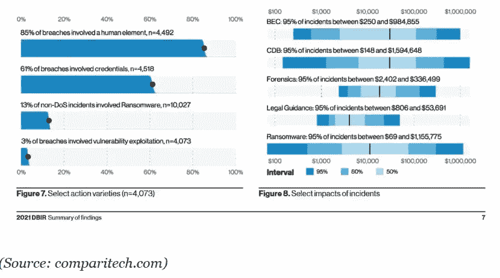
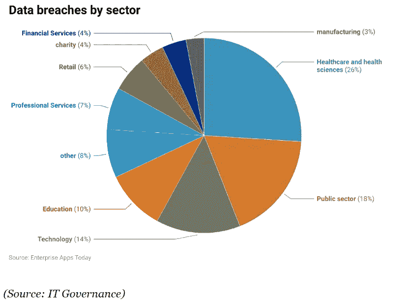
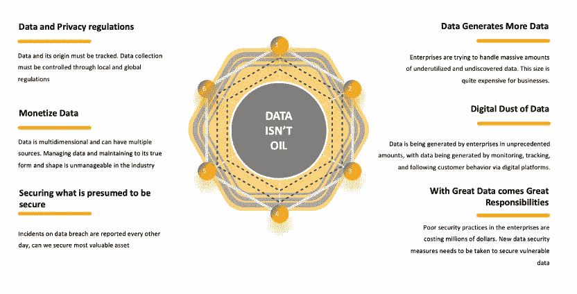

# 数据不仅仅是石油

> 原文：<https://medium.com/coinmonks/data-isnt-just-an-oil-b76846fbdc4c?source=collection_archive---------16----------------------->

数据是新的石油；你在业内一遍又一遍地听到它。每个人都深信不疑，并开始将数据的资产价值与石油进行比较。如果你和 CMO 或 CDO 交谈，他们就是这么看事情的。需要极其小心地保管数据，并且必须制定明确的程序和政策，以确保没有数据泄漏和数据溢出。

最近的趋势表明，行业领导者正在努力获取最有价值的资源

大约 45%的美国公司遭遇数据泄露

2022 年，数据泄露的全球平均成本达到 435 万美元

发现数据泄露平均需要大约 206 天

物联网设备和智能手机的广泛使用导致了数据泄露的增长趋势

2020 年至少有 4 起数据泄露事件影响了超过 10 亿条记录

近 82%的数据泄露都与人为因素有关

近 75%的公司表示，数据泄露给他们的业务流程带来了重大损失

*资料来源:2021 年 DBIR 调查结果*

一份基于对近 79000 起安全事故和 5200 起已确认的数据泄露的分析的报告显示，在超过 60%的安全事故中使用了被盗凭据。

2022 年第一季度的一份数据泄露报告显示，医疗保健行业和健康科学面临的泄露数量最多，占 65 起数据泄露的 26%。

我毫不怀疑数据是有价值的，但如果未经提炼，就无法使用。它必须转变为推动盈利活动的有价值的实体；因此，必须对数据进行分解和价值分析。企业中的大型数据集未被使用，通常保存在冷库中，以备将来使用。让我们尝试从不同的角度来理解数据和企业管理成本

**数据生成更多数据**

数据倍数。它一直在增长，你对数据研究得越多，最终产生的数据就越多。

互联网用户每天产生大约 2.5 万亿字节的数据。

95%的企业认为管理非结构化数据的需求是其业务的一个问题。

WhatsApp 用户每天交换多达 650 亿条信息。

到 2025 年，全球将产生略超过 180 的数据。

这些是每天生成的数据量的一些趋势。每个企业都有这样一个观念:无论数据的形式如何，它都是有价值的。他们已经开始存储许多数据集，希望将来能派上用场。这给企业带来了一个新问题

**从数据中创造价值**

企业正在努力证明数据的价值，这些数据以日志、原始数据、非结构化数据和许多其他形式存在于冷存储中。解释这些大型数据集并驱动有意义的信息是一项繁琐的任务，需要大量投资。

从如此庞大的数据规模中产生价值将是一个庞大的转型计划，需要巨大的投资和大量的时间。

**处理或解除与大数据的关联**

企业正在努力寻找大块数据的一部分，无论他们是完全分离还是在日常运营中处理大数据集。这两种方法都提出了一个问题

如果大量数据需要去链接，那么为什么要捕获和存储呢

在快节奏的数字世界中，客户行为是不可预测的，这有什么意义吗

如何处理大量数据，是否不需要持续的巨额投资

**数据的数字尘埃**

每个企业都在数据的数字尘埃中挣扎。数据正以前所未有的方式跨数字平台生成、整理并存入云存储。混合云中存在大量重复数据。

一些被用来监控客户互动

有些被用来追踪顾客

有些是为了了解客户

有些用于提高运营效率

数据无处不在。企业正在寻求向客户提供个性化体验。提供个性化体验需要捕捉客户的行为、互动、意图和在数字渠道中的移动，并实现企业捕捉一切。没有留下任何东西。但这些数据需要与来自其他渠道和设备的数据融合，这就是数字灰尘发挥作用的地方。

我们采用编程方法，并根据用例、业务需求和当时的需求来拼接数据。我们留下大量未使用的数据，随着时间的推移，它们变成了数字尘埃。

企业需要一个企业范围的数据策略来最大限度地减少数字灰尘，否则，很快企业将无法理解数字灰尘

**大数据带来大责任**

在受监管的环境中管理数据是一项艰巨的任务。我们之前讨论了数据泄露事件在不同行业领域的上升趋势。数据集越大，问题就越大。问题不仅在于存储或数据量，还在于存储的数据类型、数据跟踪实践、PII 数据暴露水平等等。

企业需要确保数据在静止模式和飞行模式下都不会受到保护，他们已经确保数据在安全可靠的同时，还符合当地和全球快速变化的法规。这是有代价的，一个小事故就能让一个品牌名誉扫地。

我们正处于一个不断发展的数字时代，数据实践也在不断发展，因此根据法规，企业需要随时准备采取更安全的网络实践来保护宝贵的客户数据。企业已经从 VPN 主导的生态系统发展到代理设置，再到零信任架构，这是数据安全实践方面的真实发展情况。

企业必须引入文化变革，以确保数据在其最后一英里连接中的安全性。

**数据和隐私条例**

长期以来，企业一直在客户不知情或不同意的情况下收集他们的数据。因为这种数据收集的潜在目的对客户是隐藏的，并且深藏在条款和条件中，许多客户在没有意识到其含义的情况下点击“接受条款和条件”复选框。他们不知不觉地让企业获得了大量的个人信息。

因为用户数据具有很高的市场价值，企业大规模地聚集和出售个人数据。世界各地的网站以各种方式收集和保留这些信息:

个人信息，如姓名、性别、IP 地址和位置

文本消息、电子邮件、移动应用和社交网络页面都是参与度数据的例子。

购买历史和产品使用信息是行为数据的例子。

消费者幸福感、购买标准和产品吸引力是行为数据测量的例子。

隐私法规允许企业提高数据处理标准，促进跨境数字交易。数据隐私规则将会给企业带来两大变化。首先，顾客对隐私有一个基本的期望。其次，隐私政策的明确性将不再是可有可无的。

另一方面，从业务角度来看，合规性成本将会飙升，因为企业可能会被迫投入额外的员工和财务资源来满足这些要求。由于严重的不合规处罚和品牌价值的可能损失，组织将不得不花钱实现合规。政策的过度管制对企业有另一个影响。对于每个数据处理过程，客户都承受着源源不断的同意书的负担。

**货币化数据**

随着每天传输和处理的数据量不断增加，一些企业已经发现了这些信息的非传统和新颖用途，如数据货币化。

数据货币化是利用公司生成的数据创造可衡量的经济效益的过程。由于将数据货币化，企业通常会获得收益增加或支出减少等优势。

企业正在利用数据为其更大的业务构建新的收入流。在过去，我们已经看到企业推出了交易平台和其他选项来利用数据为自己带来优势。该行业正在利用数据货币化来

获得竞争优势

创造新的收入来源

简化操作

创建战略联盟

**保护假定被保护的东西**

在现代技术时代，保护您的组织免受网络安全威胁的重要性不容忽视。平均花费高达 330 万€，其中 33%的费用在攻击后持续两年之久，网络入侵对措手不及的组织来说是一笔巨大的开支。

现代是关于混合云的时代，这意味着数据将无处不在。任何组织都不能认为当前的安全实践是理所当然的，他们需要重新发明、重新投资并采用更安全的标准，以确保静态或动态模式下的数据安全

**结论**

我敢肯定，很明显，数据不仅仅是数据，也不仅仅是石油。它更珍贵，如果处理不当，企业将会为钱而跑。当企业投资保护数据安全时，他们必须扪心自问

他们为什么要捕捉数据

在一段时间内如何利用数据

他们将如何管理数据规模

不仅需要存储数据，还需要进行有意义的解释，这需要多少投资

他们将如何保护每秒钟的数据

数据基础策略有助于充分利用数据，毕竟，数据不仅仅是一种石油

> 交易新手？试试[密码交易机器人](/coinmonks/crypto-trading-bot-c2ffce8acb2a)或[复制交易](/coinmonks/top-10-crypto-copy-trading-platforms-for-beginners-d0c37c7d698c)
> 
> 加入 Coinmonks [电报频道](https://t.me/coincodecap)和 [Youtube 频道](https://www.youtube.com/c/coinmonks/videos)获取每日[加密新闻](http://coincodecap.com/)

## 另外，阅读

*   [复制交易](/coinmonks/top-10-crypto-copy-trading-platforms-for-beginners-d0c37c7d698c) | [加密税务软件](/coinmonks/crypto-tax-software-ed4b4810e338)
*   [网格交易](https://coincodecap.com/grid-trading) | [加密硬件钱包](/coinmonks/the-best-cryptocurrency-hardware-wallets-of-2020-e28b1c124069)
*   [密码电报信号](/coinmonks/top-3-telegram-channels-for-crypto-traders-in-2021-8385f4411ff4) | [密码交易机器人](/coinmonks/crypto-trading-bot-c2ffce8acb2a)
*   [最佳加密交易所](/coinmonks/crypto-exchange-dd2f9d6f3769) | [印度最佳加密交易所](/coinmonks/bitcoin-exchange-in-india-7f1fe79715c9)