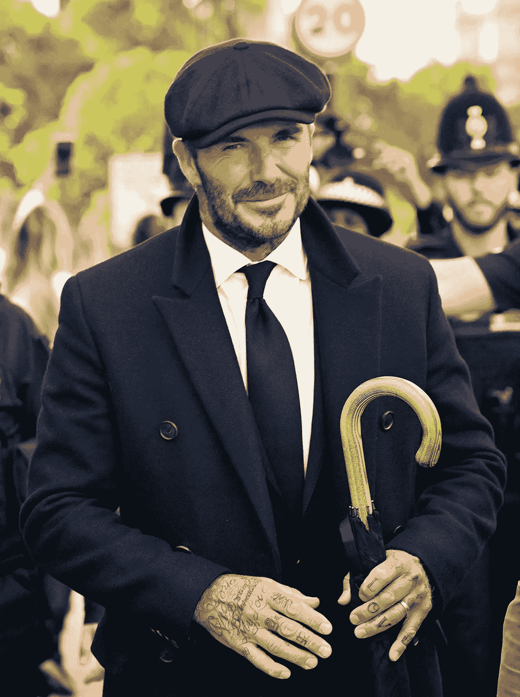

# 大卫·贝克汉姆排队 13 个小时向女王致敬。

> 原文：<https://medium.com/coinmonks/david-beckham-stood-in-line-for-13-hours-to-pay-respects-to-the-queen-b01e6713a531?source=collection_archive---------28----------------------->

David Beckham, looking like a million bucks.

当 wifi 慢了几毫秒时，我们会感到焦虑。

47 岁的他仍然是数百万铁杆粉丝心中的英国偶像。

“英格兰最帅的足球运动员”大卫·贝克汉姆被发现排队等候向最近去世的伊丽莎白女王致敬长达 12 个小时。

整整 13 个小时。

我无法想象那是什么感觉。

我在百老汇等了 20 分钟的演出，我已经烦到耳朵了。

成千上万的人加入队伍，向在威斯敏斯特大厅安葬的女王致以最后的敬意。

从那以后，排队和等待的时间越来越长。

它延伸了 8 公里，甚至还有一个排队的队伍。

我一直喜欢大卫温和的举止和谦逊的个性。

但这只是小菜一碟。

David met the queen quite a few times before.

他凌晨两点就开始等了！

“我以为凌晨 2 点来会更安静一点——我错了。”

即使在 13 个小时的等待后，和普通人肩并肩地站在风雨中，他在接受采访时仍然沉思而愉快。

他独自一人。

他独自等待，没有家人，没有吵闹的粉丝，没有随从，没有架子，没有不安。

我对这个人的尊敬瞬间倍增。

很确定附近有几个武装的秘密保镖。

我是说，这家伙值 4 . 5 亿美元。

必须有一些安全措施，以防有人袭击他或粉丝靠得太近。

“我们都想一起在这里，我们都想体验我们庆祝女王惊人生活的事情，我认为今天这样的事情应该一起分享。”

所以事实上，我们一起在这里，我们吃品客薯片，我们吃柠檬果子露，我们吃三明治，我们喝咖啡，吃甜甜圈。

他等了这么久，只是为了在继续前进前花几秒钟向女王鞠躬。

他没有加入超级明星和重要人物的快速通道队列。

他没有抱怨，也没有哀叹。

我是说，还有什么好说的？

There was a line to the line of people waiting to pay their respects to the queen.

他为什么这么做？

他说他的整个家庭都是保皇党，如果他的祖父母还活着，他们也会这样做。

他尊重自己的根、成长经历和祖父母的愿望。

为他鼓掌好吗？

奇怪的是，大卫既不是“先生”，也没有被女王封为爵士。

他为足球、女王和国家所做的比他的大多数同胞都多，但由于他的税收违规，他已经被禁止提名十年了。

我确信他很快就会获得爵士头衔。

只是可惜不是女王本人。

我最喜欢引用大卫的话。

“膝盖没事，是背”。

同一个大卫。

我们也绝对有同感。

=)

-

名人和重要人物完全不排队公平吗？

-

#创业#商业#创业#成长#成功#社交媒体#文化#企业家#大卫贝克汉姆#女王#伊丽莎白女王#英格兰#国王和国家#大卫足球

> 交易新手？试试[加密交易机器人](/coinmonks/crypto-trading-bot-c2ffce8acb2a)或者[复制交易](/coinmonks/top-10-crypto-copy-trading-platforms-for-beginners-d0c37c7d698c)