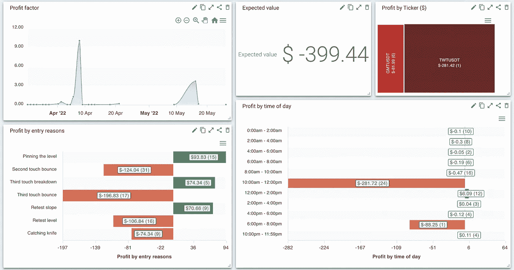
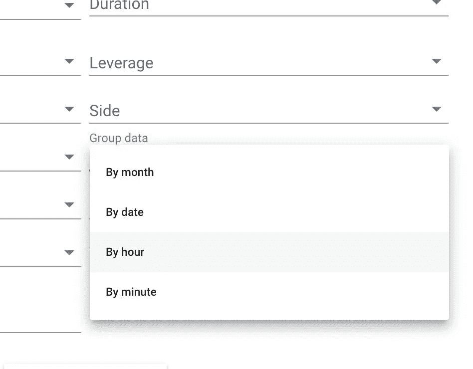

# 日内交易策略:刷单与摇摆交易

> 原文：<https://medium.com/coinmonks/day-trading-strategies-scalping-vs-swing-trading-6ef83dd2f664?source=collection_archive---------42----------------------->

[提示&招数](https://tradermake.money/blog/tag/tips-tricks/)

随着加密货币臭名昭著的波动，源于传统市场的许多类型的交易技术继续蓬勃发展。例如，许多密码交易者仅仅通过在几分钟内赌上最微小的价格变化，就收获了数百万，这与市场上大量的黄牛党相对应。然后，也有跟随价格明显方向的兼职交易者，对应的是大量的散户摇摆交易者。

所以，如果你是一个初露头角的加密交易者，想学习更多的摆动交易基础知识或刷单策略，这本书适合你。

# 什么是倒票？

采用黄牛策略的交易者，通常被称为黄牛，通过低价买入高价卖出来赚取利润。然而，他们甚至从资产价格的最小差异中赚钱。因此，即使是最小的加密价格波动也被视为机会。

然而，这样做的缺点是每次交易的利润很少。因此，一些交易是在很短的持有时间内(通常只有几分钟)进行的，以积累大量的利润。黄牛党行动迅速，很少跟踪一致的日内交易指标。黄牛党在一笔交易中做空，在下一笔交易中做多，寻找频繁但微小的机会。原则上，黄牛党通过利用买卖差价赚钱。与巨大的价格变化相比，这些机会之窗更加普遍，因为即使相对平静的市场也会经历有规律的波动。

大多数黄牛党使用的图表时间窗口大约是一分钟左右。黄牛党可能会从图表中获益，即使是最微小的价格“点子”。交易量用于显示 24 小时内的价格变动，其中新的棒线(或烛台，线部分等。)是在达到某个阈值(刻度)后绘制的。

# 什么是摇摆交易？

摇摆交易定义:阅读趋势并从中获利。例如，这一类的交易者通常会在价格调整或巩固后投资一个飙升的密码，然后在价格开始再次攀升前套现。摇摆交易者不时监控图表，他们根据当前的价格趋势建仓。

例如，当突然跌破资产的支撑位时，摇摆交易者很可能会开始[借款来做空资产](https://tradermake.money/blog/what-is-crypto-short-squeeze/)。另一方面，当技术指标显示即将上涨时，这些交易者会抓住机会。大多数摇摆交易者跟随市场趋势的方向。他们在上升趋势时成为日内交易者，在下降趋势开始时成为短线交易者。当有人押注市场趋势时，他们通常会根据趋势提供的机会建仓几天或几周(甚至几个月)。像黄牛党一样，摇摆交易者受益于一定程度的市场波动，因为这给他们创造了机会。摇摆交易者能够保持很高的利润潜力，同时把经纪费降到最低。

只有很少时间定期监控市场的交易者可以实施摇摆交易策略。在摇摆交易中，实时或及时的决策是不必要的。这种方法在[兼职交易员](https://tradermake.money/blog/trade-crypto-on-weekends/)中很流行，他们利用午休时间查看市场。有效的交易策略需要耐心，持有资产过夜(或更长时间),并在交易前和交易后查看市场。这就是为什么它不是在高压环境下变得紧张的人的好选择。

# 最佳摇摆交易指标

趋势骑手使用简单的图表技术来识别有利的买入或卖出信号。这里有一些技术指标，许多波段交易者用来帮助他们做决定:

摆动交易最好的指标之一是[斐波那契回撤](https://www.investopedia.com/terms/f/fibonacciretracement.asp#:~:text=Fibonacci%20retracements%20can%20be%20used,starts%20to%20go%20up%20again.)。交易者使用斐波纳契回撤来发现任何方向突破的潜在触发点。通常，当价格在支撑位或阻力位被突破后盘整时，交易者会监控反转。

交易者用这个指标来发现潜在的反转或上涨趋势。例如，当较短的均线与较长的均线重叠时，方向可能会发生变化。相反，当长期移动平均线重叠在短期移动平均线之下时，可能会出现上升趋势。当交易者在图表上发现一个“黄金十字”时，移动平均线指标特别有用，它预示着看涨的上涨。

使用这个波动交易指标，当 RSI 上升到 70 附近时，交易者能够预测[即将到来的价格下跌](https://tradermake.money/blog/bear-market-trading-strategy/)。当它低于 30 时，它表明超买和潜在的上涨。

这是一个波动交易指标，当加密价格低于低波段时，它有助于设置进场点。他们可能会等待价格回到波段上方，然后开始交易。这是应用均值回归策略时的一种确认形式。当资产回升到移动平均线时，均值回归就完成了。一些投资者将此作为退出点。

# 哪一款最符合你的风格？

摆动交易比刷单交易的主要优势是交易量低。这通常意味着订单减少，从而降低交易费用。交易者在从事摇摆交易时，并不总是需要密切关注他们的头寸，因为头寸可能是在几天或几周内形成的。

摆动交易涉及较少的交易，但通常会产生较高的净利润。因此，摇摆交易者有时可以赚到和黄牛党一样多的钱，同时从事风险更低、耗时更少的交易，从每笔交易中获得更大的利润。

刷单包括购买一项资产，然后在同一个交易日卖回给市场。虽然关闭当天的所有交易可能会给一些交易者带来安全感，但这种策略也可能会吸引那些寻求更有趣交易体验的人。

黄牛党不会因为一次交易而遭受[的巨额损失](https://tradermake.money/blog/what-is-stop-loss-and-take-profit/)，因为在黄牛党手中，每笔交易的利润率都要低得多。刷单交易是指在短期内连续多次进行小额交易，比摇摆交易更不容易遭受灾难性损失。

你需要考虑一些具体的观点，然后再决定你要采取的交易策略。刷单的节奏非常快，所以你需要在开始之前确定你能承受多大的压力。刷单是一种更费力的交易形式，因为它需要长时间的专注。这是因为倒票的机会要小得多。相比之下，摆动交易允许交易者在采取任何行动之前等待许多天，但它给了交易者更大的自由。在摇摆交易者开仓之前，必须有明确的迹象表明趋势开始出现。

了解你对压力的承受能力、偏好的步调、空闲时间和灵活性将会减少你实施这些策略的风险。

# 在交易前考虑这个

没有简单的策略来进行交易或刷单。大量的奉献、努力和教育总是需要的。然而，这不仅仅是了解概念的含义，这将有助于你成功。实践经验是最重要的部分。找到持续产生积极结果的交易技术是成为成功交易者的关键。

**专业提示:**你可以选择参与所谓的“纸上交易”，这需要通过使用试用/演示账户来模拟实际交易的执行。你可以使用许多交易所免费提供的模拟账户来评估平台，将你的交易方法付诸实践，磨练你的交易能力。

所以，“日内交易你能赚多少？”你的策略的成功取决于各种各样的市场条件，这需要大量的实践。你可以通过交易加密货币一天赚 100 美元，或者一次交易赚几十万美元，但这需要耐心和投入。因此，在拿现金冒险之前，你应该先在模拟账户上做几百笔交易。

# 使用自动交易日志进行刷单或摆动交易

对于铁杆交易者来说，根据既定数据和客观分析来做决定总是很重要的。这就是自动交易日志派上用场的地方。

《交易者赚钱》是黄牛党和摇摆交易者最好的自动化交易杂志之一。这是一个直观的交易日志，允许交易者使用非常有用的工具个性化他们的分析仪表板。

利润因素对黄牛党来说是一个重要的因素，因为他们的账户交易量很大。用电子表格分析所有这些交易者是不可能的。然而，自动交易日志可以很容易地记录所有交易，分析它们，并提供易于理解的结果。

现在，使用利润因子小工具，一个黄牛可以决定他的交易策略的成功率。盈利率可以通过评估交易的总利润除以总损失来计算。高于 1.6 的值(表示更有信心)是一个很好的指示。

这个部件显示了你每 100 笔交易的潜在利润值。如果是负面的，这意味着你目前使用的交易策略需要改变。然而，你不能把这个数字作为未来利润的保证。期望值更像是一个“利润因子”，被认为是一个正/负值。

当黄牛党在一天内交易时，情绪因素会影响他们的表现。有时，他们可能使用了错误的风格或遵循了错误的指标。有了这个小工具，可以发现模式，黄牛可以决定是停止还是继续。

有些黄牛分几个时段交易，这些时段可以和不同的时区重合，比如亚洲、欧洲、美洲。然而，重要的是要知道市场行为会随着一天中的不同时间而变化。使用“按时间盈利”小工具，黄牛可以找到他们理想的工作时间。想利用自己最赚钱时间的黄牛，可以通过一天中的时间利润分配，进一步分析自己的表现。

通常，许多交易者被绑在他们“最喜欢的”硬币上，一直交易。有了这个工具，交易者可以识别他们投资组合中最赚钱的硬币，包括亏损最严重的。

基本上，它是一个盈亏热图。地图显示了交易者亏损最多的地方，这需要改变策略。值得注意的是，如果这个小部件分析更多的交易，它会变得更加准确。因此，交易者需要在交易了至少几周(或几个月)后得出结论。

但是，对这份交易日志的黄牛党来说，最重要的优势是能够按分钟或小时对插件进行分组。

一个非常重要的小工具，可以让你识别成功的策略，排除失败的进场原因。要使用这个小工具，您必须在*我的交易*部分填写“进入原因”。这个小工具允许交易者看过去的数字，分析支持他们每个策略的逻辑。

最大不利偏移(MAE)衡量在交易期间价格对你不利的程度。它反映了价格从你的进场点向相反方向上涨了多少。所以，这表明你有多倾向于“袖手旁观”止损。平均值适用于选择最佳止损限额。

平均 MAE (%)可与平均 MFE (%)和进场原因结合使用，以优化获利目标和止损限额。

最大有利波动(MFE)衡量交易中观察到的最大利润。MFE 是交易的峰值利润值。如果您的 TP 水平比这个值高得多或低得多，您可能没有将其置于最佳水平。不知道把 TP 放在哪里的波段交易者可以从这个小工具中受益。

[*交易者赚钱*](https://www.youtube.com/watch?v=dT41LasIwdw&t=76s) *是一个自动化的交易杂志，提供了各种各样的小工具，可以帮助所有类型的交易者。所以，不管你是黄牛党、摇摆交易者、套利交易者、市场计时者、基本面交易者、动量交易者还是日内交易者，写这种交易日记肯定会增加你的利润，减少你的损失。*

*原载于 2022 年 10 月 7 日*[*https://trader make . money*](https://tradermake.money/blog/swing-trading-vs-scalping/)*。*

> 交易新手？尝试[加密交易机器人](/coinmonks/crypto-trading-bot-c2ffce8acb2a)或[复制交易](/coinmonks/top-10-crypto-copy-trading-platforms-for-beginners-d0c37c7d698c)