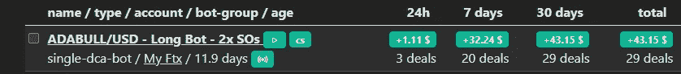

# DCA 机器人每天使用完全免费和可信的工具赚取 1%!—这是可持续的吗？

> 原文：<https://medium.com/coinmonks/dca-bot-making-1-per-day-using-completely-free-and-trusted-tools-is-this-sustainable-b036cd87acc2?source=collection_archive---------5----------------------->

几周前，我写了一篇关于如何在 FTX 上免费使用 3Commas 的文章，我还介绍了一些示例 bot 设置，其中我提供了 14 对超过 18，600 种不同 DCA bot 变体的回溯测试数据。你可以在这里找到那篇 6 分钟的文章。

写完这篇文章后，我决定为我在文章的例子中包含的 ADABULL bot 分配一些资金。这是 FTX 的一个 3 倍杠杆的长期令牌，鉴于我们已经处于下降趋势数月，结果令人印象深刻。所以我想我应该写一篇关于自从那篇文章以来的进展的快速文章。

我已经运行这个机器人 12 天了，每次交易后它都会自动复利。我存了 332 美元，余额 12 美元，总共 344 美元。这个机器人在运行的 12 天里赚了 43.15 美元(12%)，我总共赚了 387 美元。

鉴于这是 1%的复利，从现在起大约需要 63 天，直到我的初始投资达到 100%的回报(336 美元)。

如果你想知道这是如何进展的，请关注我的每月被动收入报告，其中将详细介绍这一点！

今天就到这里吧！

**附属链接**

更多优惠还可以在这里找到:【https://linktr.ee/RealisticCrypto】T4

还有，如果你想请我喝杯咖啡或者啤酒:) :

BTC—BC 1 qaxaq 2 q 9 js 89 gyzhr 0202 sxt 6 hgchprqjga 5 px

基于 ETH、BNB、AVAX、SOL 和 FTM 的令牌—0 x3b 7b 843d 8125 Fe 7 EBA 541 e 1d 751 a4 a 73 f 0 cfad 4c

**免责声明**

这不是财务建议，我不是财务顾问或会计或税务专家。这是我对帮助过我的软件工具的体验，以及我使用它们的经历。

我在本指南中使用了推荐链接。使用这些工具有助于以后的文章，所以如果你觉得这篇文章有用，并且想看看我提到的工具，请使用它们。我还会叫出你在哪里打折——双赢对吧？

> 交易新手？尝试[加密交易机器人](/coinmonks/crypto-trading-bot-c2ffce8acb2a)或[复制交易](/coinmonks/top-10-crypto-copy-trading-platforms-for-beginners-d0c37c7d698c)