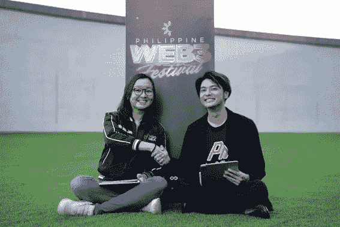

# PlayMining 运营商 DEA 与 YGG 海洋签署战略合作伙伴关系，拓展东南亚 GameFi 市场

> 原文：<https://medium.com/coinmonks/dea-operator-of-playmining-signs-strategic-partnership-with-ygg-sea-to-expand-gamefi-market-in-36798574e4a1?source=collection_archive---------34----------------------->

*Irene Umar, Co-Founder and Indonesia Country Manager of Yield Guild Games Southeast Asia (YGG SEA, left) and Tatsuya Kohrogi, CSO of Digital Entertainment Asset (DEA, right) announce their partnership at Philippine Web3 Festival on November 18.*

*此次合作将会看到 DEA 的 GameFi 平台 PlayMining 的整个游戏目录被加载到 yggsea.io 游戏平台上，以及两家公司在东南亚地区的推广和慈善活动上的合作。*

***新加坡，2022 年 12 月 8 日* —** [数字娱乐资产](https://dea.sg) (DEA)， [PlayMining](https://playmining.com) GameFi 娱乐平台运营商，与全球最大的 P2E 游戏公会 [Yield Guild Games](https://yieldguild.io) (YGG)旗下的 [Yield Guild Games 东南亚](https://yggsea.io) (YGG 海)达成战略合作关系。11 月 18 日在马尼拉举行的菲律宾 Web3 节上正式宣布了这一合作伙伴关系 DEA 是该会议的官方赞助商——这两家公司将共同努力扩大和促进东南亚的 GameFi 市场。

作为合作伙伴关系的一部分，整个 PlayMining NFT 游戏目录将被载入 YGG 海的游戏平台 [yggsea.io](https://yggsea.io) 。DEA 和 YGG SEA 还将在东南亚合作开展 PlayMining 服务的联合营销和推广活动，包括通过在线和线下活动接触到尚未体验 GameFi 的人。

两家公司还将在东南亚贫困地区的慈善活动中合作，提高对数字资产所有权所能带来的社会和经济影响的认识，并为 GameFi 在该地区的传播奠定基础。合作公司已经在 10 月份联合起来为印度尼西亚的贫困地区运送午餐盒饭，并计划在未来进行类似的合作。

*DEA 与 YGG 海* [*签约视频*](https://youtu.be/NCAjkWKYO1U) 。

> *“我们很荣幸能与 YGG 海洋合作，并很荣幸能在他们的平台上玩到 PlayMining 的游戏，”DEA CSO*[*Tatsuya KOH rogi*](https://www.linkedin.com/in/tatsuya-tats-kohrogi-a97a8953/)*说道。"****Digital Entertainment Asset 致力于使用我们的游戏平台，通过公平的数字资产所有权将价值回馈给人们，从而在整个东南亚和世界其他地区促进社会公益。*** *我们也全心全意地帮助那些需要帮助的人，并期待着很快再次与 YGG 海洋合作开展另一项慈善活动。”*
> 
> *“很高兴有 DEA 作为我们的合作伙伴，并为我们的社区提供 PlayMining 游戏目录。由于我们的价值观如此一致，我们确信 YGG 海洋与 DEA 之间的这种伙伴关系将是富有成效的，”YGG 海洋的联合创始人 Irene Umar 说。“* ***我们以友好的面孔欢迎大家加入 Web3 游戏世界而自豪。每个人都喜欢游戏——所以我们免费出借游戏 NFT，让每个人都能体验玩区块链游戏的乐趣，并获得他们的第一个加密令牌！*** *当社区进入元宇宙时，他们会有许多“第一次”,我们希望在那里简化这个过程。我们已经接触了许多边缘社区，如 10 月份 PlayMining 和 YGG 海联手提供帮助的社区，我们致力于接触类似的社区，以传播 GameFi 必须提供的平等机会。”*

YGG 海作为全球最大的 DAO(分散自治组织)游戏公会 YGG 的第一个子 DAO 推出，其全球扩张战略专注于东南亚国家，包括新加坡、印度尼西亚、泰国、马来西亚、越南和缅甸。YGG 海洋目前提供 18 个 Web3 游戏，5 个 PlayMining 游戏很快将被添加到平台上。该公司的使命是通过一系列基层活动，包括本地化和慈善，引导来自东南亚的新学者安全地导航 Web3 空间。

**PlayMining:通过 GameFi 带来社会公益**

PlayMining GameFi 平台包括 NFT 游戏标题[工作部落](https://jobtribes.playmining.com/en/)、[烹饪汉堡](https://www.cookinburger.com/en/)、 [Menya Dragon Ramen](https://dragonramen.flypenguin-games.com/en/) 、[涂鸦赛车](https://graffitiracer.playmining.com/en/)和[幸运农民](https://luckyfarmer.playmining.com/en/)，这些游戏都吸引了休闲游戏玩家。该平台也是 PlayMining 市场的所在地，该市场为他们所有的游戏以及日本视频游戏和动漫行业一些最受欢迎的创作者的作品提供 NFT。元宇宙平台 PlayMining Verse 也正在开发中。

PlayMining 市场由 DEAPcoin ( [$DEP](https://coinmarketcap.com/currencies/deapcoin/) )代币提供动力，这是日本金融服务机构正式批准的首个 P & E 代币。DEP 也被整合到 PlayMining 游戏标题中，允许玩家通过各种方式获取令牌。

除了为穷人创造经济机会之外，PlayMining 还致力于帮助独立游戏工作室实现知识产权(IP)货币化。小游戏开发公司在分销渠道和其他利益相关者身上损失了大量价值——最大的分销商，如苹果、任天堂、Playstation 和微软，臭名昭著地大幅降价 30%——这使得独立的 IPs 很难在多种渠道上高效发展。另一方面，在 PlayMining 上推出 NFT 游戏的第三方工作室支付的费用要合理得多，而且可以进入 PlayMining NFT 市场、即将推出的 PlayMiNing Vestment 平台和日本唯一的 P & E 令牌，这为新的 IPs 提供了多种盈利方式。

**关于游戏挖掘**

PlayMining 是一个 GameFi 和元宇宙平台，它赋予创作者权力，否则他们在传统的知识产权创作行业中受益甚微。PlayMining 平台是一种新的内容创作商业模式，以 DEP 的 PlayMining DEAPcoin 为动力的 NFT 市场为特色，搭配 NFT 游戏和元宇宙平台。PlayMining 平台拥有 260 万用户和一系列 P&E 游戏，包括 Job Tribes、Cookin ' Burger、Menya Dragon Ramen、Graffiti Racer 和 Lucky Farmer。

**关于数字娱乐资产**

数字娱乐资产有限公司。Ltd. (DEA)是一家总部位于新加坡的全球 Web3 娱乐公司，成立于 2018 年 8 月。DEA 是 Play and Earn (P&E)游戏的开发商，还运营着 PlayMining NFT 游戏平台、PlayMining NFT 市场、PlayMining Verse 元宇宙项目和 deap coin——日本金融厅批准的第一个 P&E 代币。该团队由两位联合首席执行官领导——nao hito Yoshida 和 Kozo Yamada——他们共同带来了数十年的成功创业经验(3 次 IPO)，创造了热门视频游戏，制作了网络电视节目，并对 NFT 游戏有着深刻的理解。

**官方渠道**

PlayMining 网站:【https://playmining.com 

不和谐:[https://discord.com/invite/xWeHGdt](https://discord.com/invite/xWeHGdt)

推特:[https://twitter.com/PlayMining_SG](https://twitter.com/PlayMining_SG)

https://www.facebook.com/PlayMining/脸书采矿公司:

play mining Youtube:[https://www.youtube.com/channel/UCGWmK0RLV4SB_PSXpj2j6dw](https://www.youtube.com/channel/UCGWmK0RLV4SB_PSXpj2j6dw)

DEA 网址: [https://dea.sg](https://dea.sg/jp/)

**关于 YGG 海**

YGG 海，屈服公会游戏的第一个子 DAO，是一个去中心化的自治组织(DAO ),用于获取和管理元宇宙的 NFT。YGG 海洋的使命是通过优化其社区拥有的资产以实现最大效用，并与代币持有者分享其利润，来创建最大的虚拟世界经济。YGG 海是亚洲区块链游戏联盟的创始成员，并有专门的本地化团队，包括国家经理和社区团队，他们在每个关键市场都有经验，包括马来西亚、印度尼西亚、越南、泰国、新加坡和缅甸。

**官方渠道**

YGG 海网站:[https://yggsea.io/](https://yggsea.io/)
YGG 海推特:[https://twitter.com/yggsea](https://twitter.com/yggsea)
YGG 海不和:[https://discord.com/invite/yggsea](https://discord.com/invite/yggsea) YGG 海电报:[https://t.me/yggsea](https://t.me/yggsea)
YGG 海脸书:[https://www.facebook.com/yggseaofficial/](https://www.facebook.com/yggseaofficial/)
YGG 海 insta gram:[https://www.instagram.com/yggsea/](https://www.instagram.com/yggsea/) YGG 海 LinkedIn:[https://www.linkedin.com/company/ygg-sea/](https://www.linkedin.com/company/ygg-sea/)
YGG 海媒:[https://medium.com/@yggsea](/@yggsea)

> 交易新手？尝试[加密交易机器人](/coinmonks/crypto-trading-bot-c2ffce8acb2a)或[复制交易](/coinmonks/top-10-crypto-copy-trading-platforms-for-beginners-d0c37c7d698c)