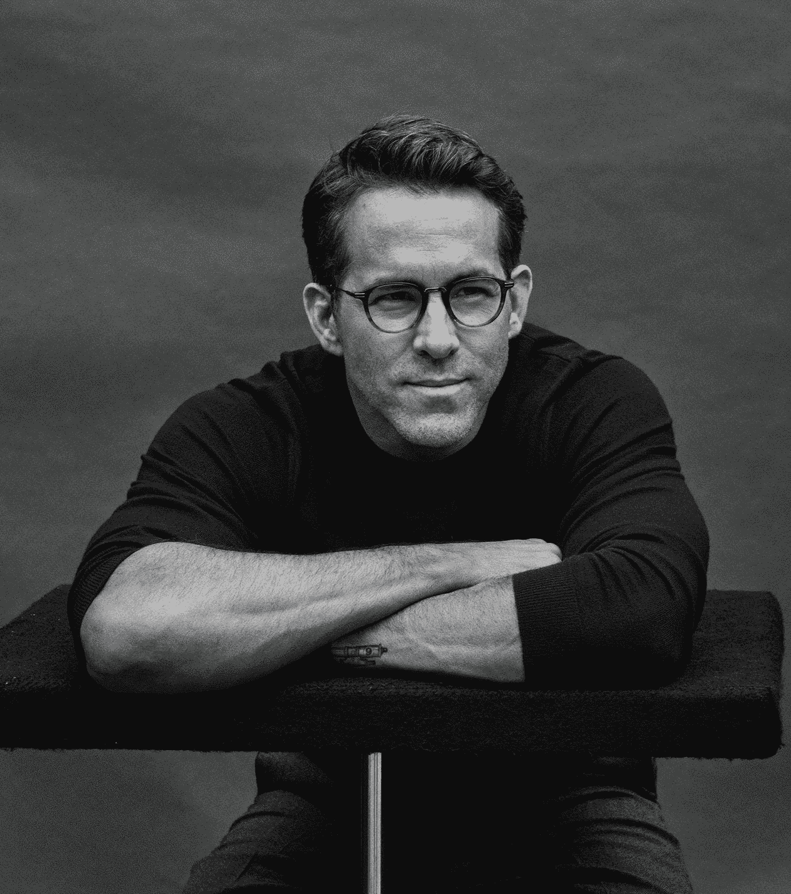
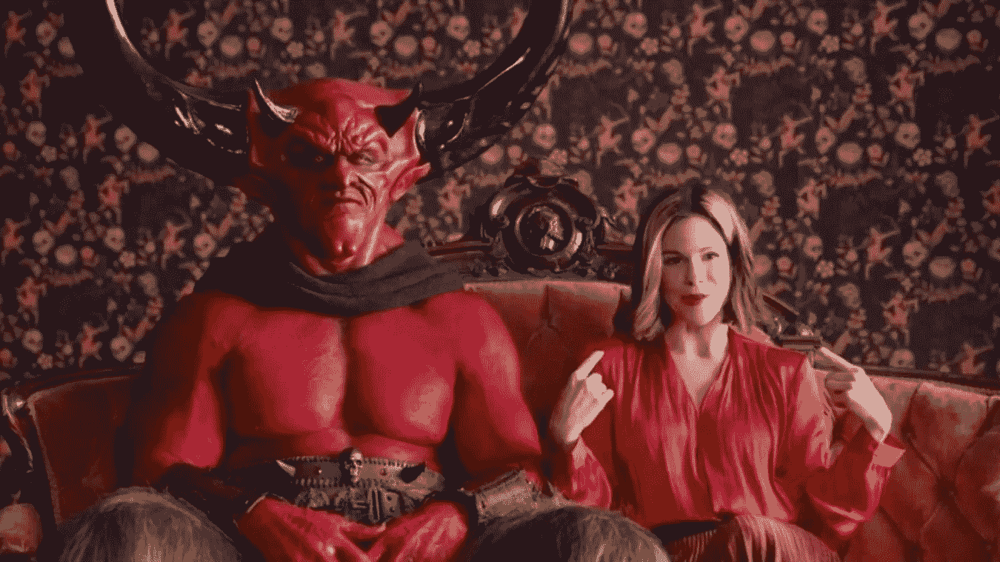
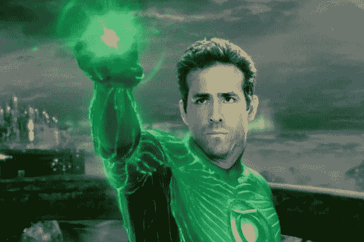
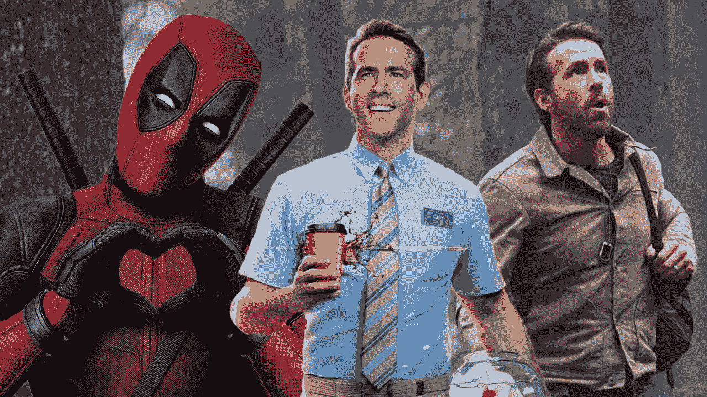

# 死侍不是英雄，他是世界级的营销人员

> 原文：<https://medium.com/coinmonks/deadpool-aint-a-hero-he-is-a-world-class-marketer-d41626dd5776?source=collection_archive---------22----------------------->

Hate it or love it, Ryan Reynolds is a world-class businessman who understandings marketing.

我们都知道瑞安·雷诺兹是死侍。

但是你知道他现在是业内最受欢迎的营销人员之一吗？

他的营销代理做了一系列成功的广告。

你可能看过《Match.com 与撒旦和一位名叫“2020”的女士》。

多么贴切。

团结观众对 2020 年的集体仇恨，给了我们 covid，死亡，毁灭，痛苦和不幸。

还有薄荷手机和航空杜松子酒。

更不用说他主演的广告《死侍》(Deadpool)，这个反英雄角色以机智的复出和血腥的滑稽动作而闻名。

The infamous satan ad that everyone loved.

为什么他的广告如此受欢迎？

真诚坦诚。

他就是他自己，真实可信。

他的营销简单、粗糙且切中要害。

我们明白了！

他体现了人们给他的所有刻板印象。

老土，笨拙，可笑的英俊，有时社交无能。

他甚至承认了粉丝们多年来一直在谈论的事情。

他在绿灯侠电影上做得不好。

这很有趣，但却是真的。

Green lantern wasn’t something Ryan was particularly proud of.

他倾听他的粉丝和市场的脉搏，有时还能出色地配合曲调演奏。

他重复和发挥自己的音乐和幽默。

是的，有时他的幽默有点干涩和重复。

不知何故，感觉就像你以前在别的地方听过他讲同样的笑话或愚蠢的滑稽动作。

但是，总的来说，Ryan 真的很努力，而且很成功。

它没有创造性，就像莫扎特创作杰作一样让你大吃一惊

但在吸引观众和让我们发笑的意义上，它仍然是创造性的。

他是“最大杰克曼”广告的幕后推手，在该广告中，休·杰克曼为 R.M .威廉姆斯的皮鞋表演裸体短剧。

他用一系列搞笑的广告出色地推销了他的电影《自由人》。

The many faces of Ryan Reynolds.

他是雷克瑟姆足球俱乐部的股东之一。

那到底在哪里？

不要问我为什么。

2020 年，他以 6 亿美元的价格将航空杜松子酒卖给了帝亚吉欧。

他拥有 Mint Mobile 大约 25%的股份，价值**6 亿到 8 亿美元。**

这两部《死侍》的总票房超过了 6.87 亿美元，第三部正在筹备中。

多么聪明、勤奋、有事业心的超级巨星啊，他知道如何将自己的名气、影响力和技能结合起来，扩大自己的产出和收入。

我只能想到在他的游戏中还有一个名人做得更好。

道恩·强森，那块岩石，也在粉碎它。

-

瑞安·雷诺兹是一个好的营销者吗？

-

#创业#商业#创业#成长#成功#社交媒体#文化#网络 3 #战略#黑客# Dwayne Johnson # the rock # ryanreynolds # Ryan #死池#航空# mintmobile #营销

> 交易新手？试试[密码交易机器人](/coinmonks/crypto-trading-bot-c2ffce8acb2a)或[复制交易](/coinmonks/top-10-crypto-copy-trading-platforms-for-beginners-d0c37c7d698c)