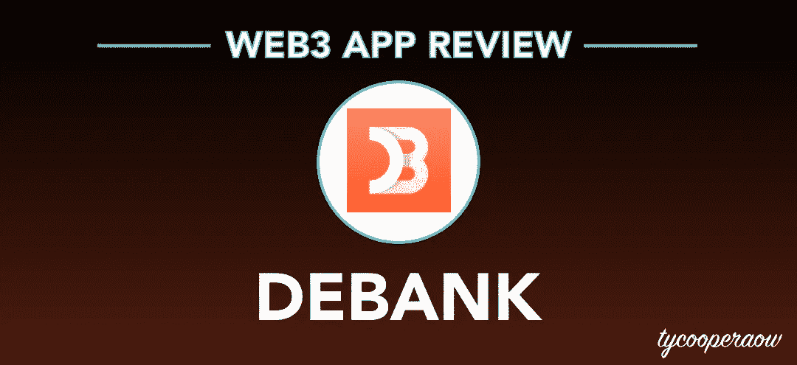

# debank—DeFi | web 3 应用审查中最强大的工具

> 原文：<https://medium.com/coinmonks/debank-most-powerful-tool-in-defi-web3-app-review-e9e3d5f5e4d2?source=collection_archive---------4----------------------->

我们都去过那里，你在那里搜索密码空间，左买右买，交易硬币。在这个过程中，有些人会比其他人更容易收集到规模可观、结构良好的投资组合。然而，当涉及到跟踪资产时，追踪它们所在的每一个交换、协议和 dapp 是一件可怕的苦差事。钱包是一种像 Metamask 这样的工具，可以跟踪交易所并与之互动…