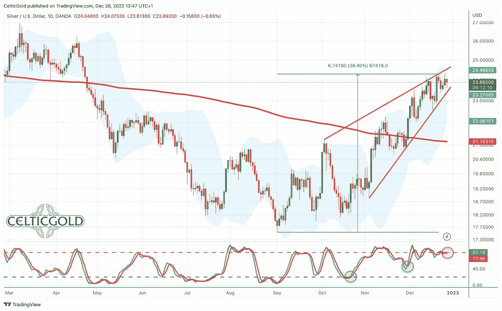
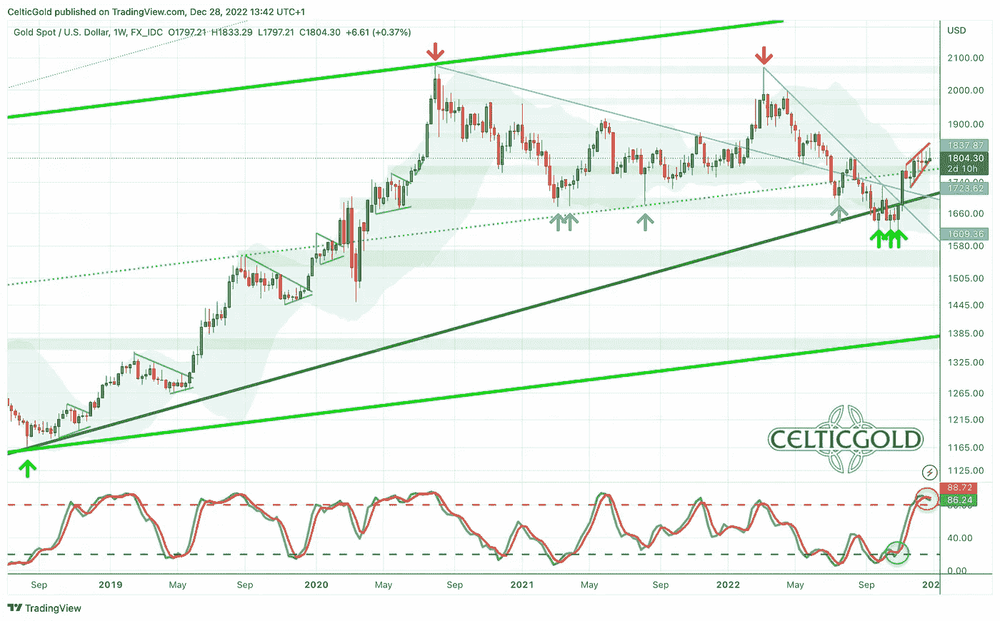
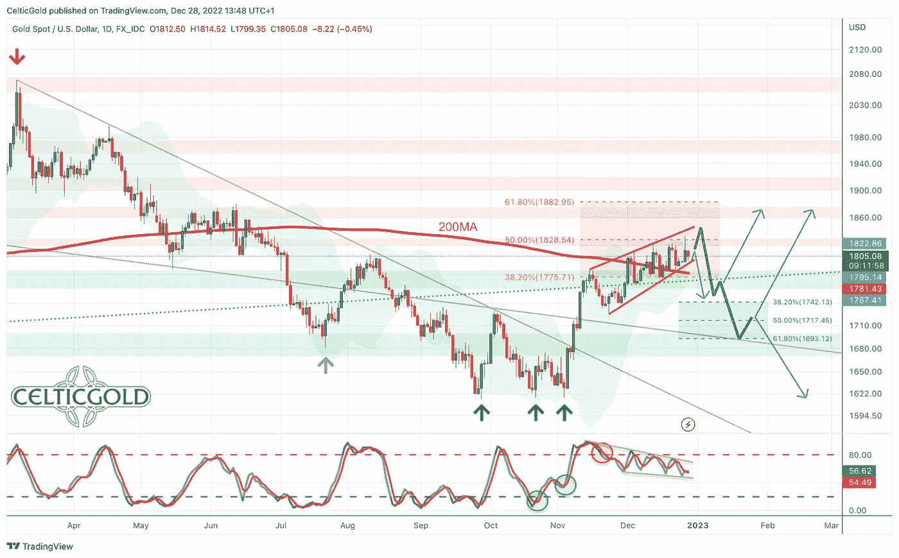
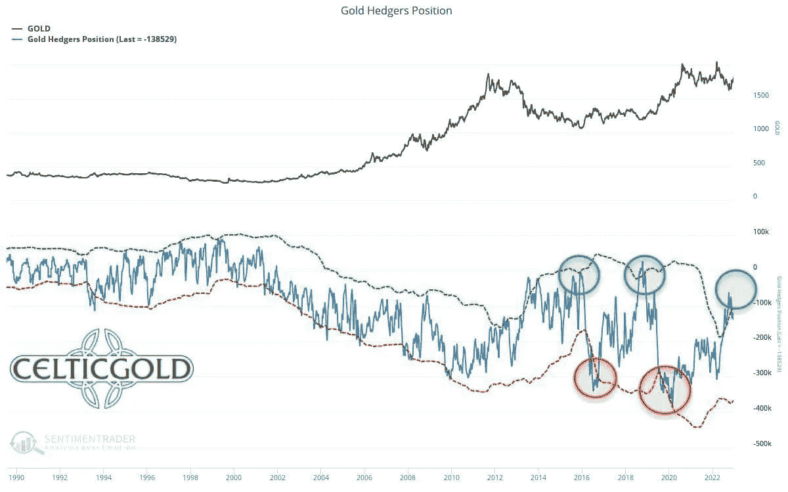
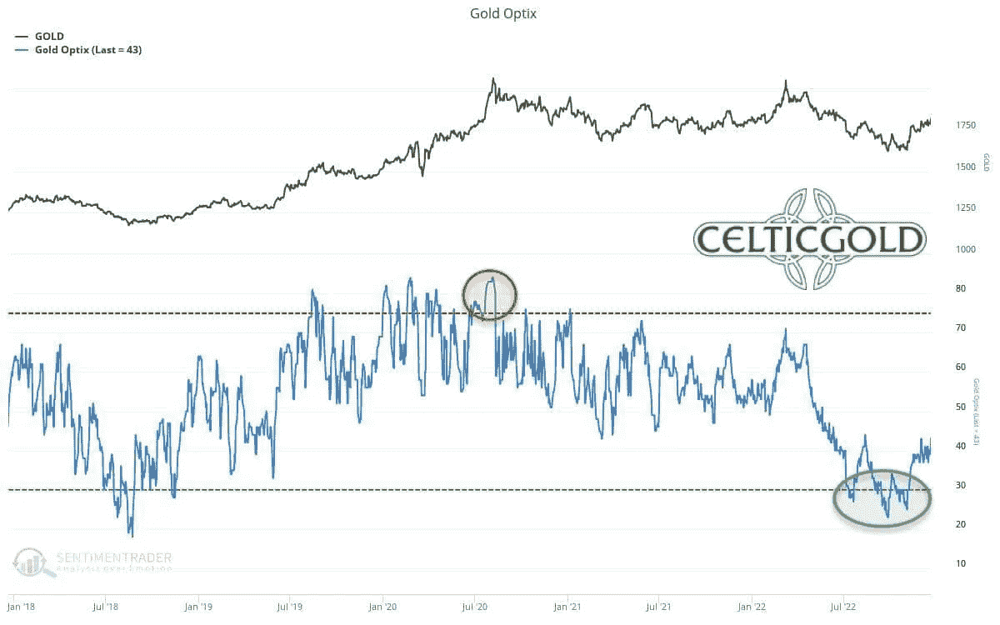
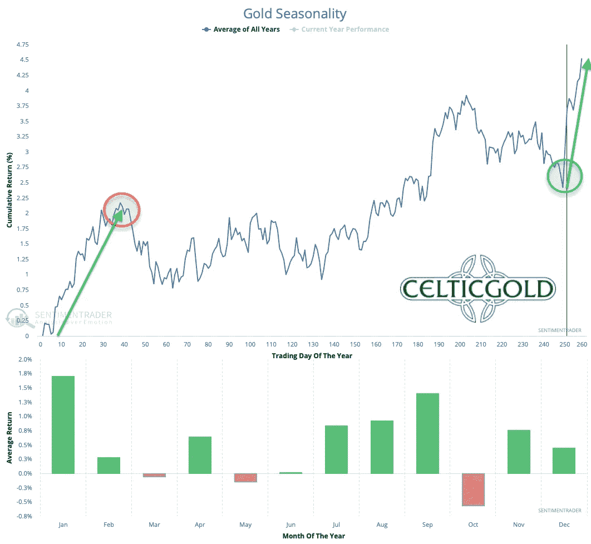
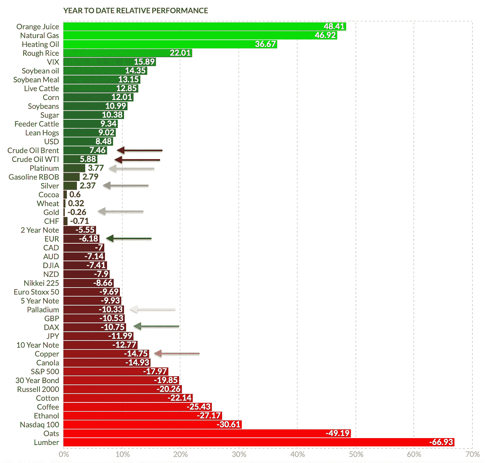

# 2022 年 12 月 28 日:黄金——围绕 200 天移动平均线的战斗尚未决定

> 原文：<https://medium.com/coinmonks/december-28th-2022-gold-fight-around-the-200-day-moving-average-not-yet-decided-19b4f31ef618?source=collection_archive---------65----------------------->

自 11 月中旬以来，黄金市场的反弹变得越来越顽强和拉锯。过去几周，黄金一直在横盘整理。事实上，我们只看到了轻微的新高和四次大幅回调。总的来说，我们认为黄金会在 200 毫安附近震荡一段时间的假设已经实现了。但是这种起伏和重叠的发展会持续多久呢？**黄金——围绕尚未决定的 200 日均线战斗**

> 不知道什么时候买卖 cryp，试试[复制交易](http://coincodecap.com/go/bityard)。

## 回顾

从 1，615 美元左右的三重底部开始，黄金在过去八周内强劲反弹。到目前为止，这种“反弹”在 12 月 27 日达到了 5 个月高点 1833 美元左右。最初，这种反弹看起来像是一种剧烈的“短暂挤压式反弹”。然而，自 11 月 15 日达到约 1，786 美元的第一个中期高点以来，持续的上涨变得越来越缓慢和不稳定。

最终，黄金多头和黄金空头自 12 月 1 日以来一直围绕仍在下跌的 200 天移动平均线(1，782 美元)激烈来回战斗。这导致了 12 月份的横盘交易区间，主要在 1，770 美元和 1，820 美元之间。由于价格目前交易在 1805 美元左右，还没有做出明确的决定。然而，昨日(周二)重新反弹至近 1，833 点，似乎多头还不愿意为健康的回调腾出空间。然而，此后的急剧逆转是一个警告信号。

**自 9 月 1 日以来，银价回升了 38%！**

*Silver in US-Dollar, daily chart as of December 28th, 2022\. Source:* [*Tradingview*](https://www.tradingview.com/?aff_id=1321)

相比之下，同期白银表现极为强劲。总体而言，自 9 月 1 日创下 17.56 美元的低点以来，白银已成功反弹超过 38%。由于目前的双顶在 24.30 美元附近，白银多头已经在四周内夺回了 200 天移动平均线(21.12 美元)。然而，日线图上的警告信号正在增加，预计很快会回调到下跌的 200 天移动平均线。

贵金属行业的全面复苏得益于美元的调整。从年初到 9 月底，美元几乎一直在升值。例如，欧元兑美元从 1.136 美元下跌至 0.953 美元，跌幅超过 16%。然而，在过去的三个月里，强烈的超买局面导致欧元大幅反弹，美元大幅回调。

在新年即将到来之际，问题仍然是贵金属和股票市场的反弹是否仅仅代表一种反向运动，或者今年秋季所有市场领域是否已经达到一个重要的长期转折点。

## 图表分析黄金以美元计价

**周线图:价格运行成看跌楔形**

*Gold in US-Dollar, weekly chart as of December 28th, 2022\. Source:* [*Tradingview*](https://www.tradingview.com/?aff_id=1321)

在黄金市场持续八周的反弹后，周图上的设置当然有所改善。然而，自 2020 年 8 月以来一直在进行的调整还不能宣布结束。为此，需要一个高于 2075 美元的历史新高作为最终确认。在那之前，大约有 275 美元或 15%的资金丢失。

无论如何，自 11 月初以来的三重底部带来了显著的复苏。然而，自 12 月初以来，这波涨势越来越停滞，正在失去势头。因此，我们仍然需要假设这次反弹可能仅仅是一次逆势运动。另一方面，如果三重底部确实是持续两年多的调整的结束，那么黄金应该已经在向 2000 美元的关口前进了。

**下一次回调将带来更多的清晰**

为了寻求更多的信息，黄金市场的下一次回调应该会提供重要的信息。如果黄金能够保持在 1，730 至 1，750 美元左右，或最迟在 1，680 美元左右，两年调整结束仍是首选情景。另一方面，如果黄金价格再次跌破 1，680 美元，调整将持续下去，甚至可能在中期内创下 1，600 美元左右和 1，600 美元以下的新低。

展望未来几周，超买的随机指标和出现的空头楔形是警告信号，建议谨慎。原则上，回调是健康的，甚至是可取的。只有这样，黄金才能重新充电，重新获得进一步上涨的力量。在最乐观的情况下，黄金可能会在春季前迅速突破 2000 美元左右的阻力。然而，更现实的情况是大幅回调，这将很快发生，并将明显推迟对 2000 美元的反弹。

**总体而言，周线图仍然看涨，但警告信号正在增加。过热的情况只有在回调到 1750 美元左右才会有所缓解。**

## 日线图:围绕 200 日均线的战斗尚未决定

*Gold in US-Dollar, daily chart as of December 28th, 2022\. Source:* [*Tradingview*](https://www.tradingview.com/?aff_id=1321)

在其日线图上，自 12 月初以来，黄金一直围绕其下跌的 200 天移动平均线(1，782 美元)振荡。尽管多头大多能够将价格保持在这个备受关注的经典平均水平之上，但他们尚未做出决定。同时，随机振荡指标在其超买区下方拉锯，表明动量不清晰。此外，布林带上轨(1，824 美元)提供的上行空间很小。

总而言之，目前风险/回报比率对多头相当不利。基于复苏势头的不断增强(低点 1，616 美元，高点 1，833 美元)，健康的调整应该很快就会到来。一个潜在的目标是 38.2%的回撤位，至少在 1，747 美元。但只有低于 1680 美元，空头才会重新掌权。

## 黄金交易商的承诺——中性

*Commitments of Traders (COT) for Gold as of December 20th, 2022\. Source:* [*Sentimentrader*](http://www.sentimentrader.com/)

根据最近的 CoT 报告，12 月 13 日商业市场参与者的净空头头寸为 138，529 份累积空头合约。因此，期货市场的情况略有恶化。只有低于 100，000 份空头合约，才可以说是可持续的看涨 CoT 报告。

**总之，CoT 的报告是中立的。**

## 黄金情绪——中性

*Sentiment Optix for Gold as of December 20th, 2022\. Source:* [*Sentimentrader*](http://www.sentimentrader.com/)

由于过去两个月的强劲复苏，黄金市场的情绪已经明显改善。但从长期来看，市场情绪仍处于相当悲观的水平。然而，反向投资的机会目前已不复存在。然而，重要的是要记住，黄金能够在两年内从 2018 年 8 月类似的暴跌情绪中上涨 900 多美元，或约 80%。

**总体来说，情绪是中性的。**

## 黄金的季节性——看涨至二月底

*Seasonality for Gold over the last 54-years as of December 20th, 2022\. Source:* [*Sentimentrader*](http://www.sentimentrader.com/)

从季节性角度来看，黄金价格的一个非常有希望的阶段始于 12 月中旬。过去，这一时期通常会在 2 月下旬出现大幅上涨。

因此，黄金和白银的季节性明显看涨，直到二月底。

## 宏观更新—极其困难的一年接近尾声

*Year-to-date relative performance as of December 22nd, 2022\. Source:* [*finviz*](https://finviz.com/futures_performance.ashx?v=17)

极其困难和具有挑战性的 2022 年即将结束。俄乌战争、高企的能源价格和极高的通胀率、电晕危机的余波以及中国的动荡，给金融市场带来了巨大压力。40 年低利率环境的结束首先在债券市场感受到，债券市场经历了残酷的抛售。10 年期美国政府债券的利率从 1.5%飙升至 4.33%，目前为 3.82%，自今年年初以来上涨了一倍多。

在某些情况下，股市回报也是灾难性的。自 1 月 1 日以来，Meta(脸书)下跌了 64%，亚马逊下跌了 48%，苹果下跌了 24%。比特币的交易价格下跌了 58%。另一方面，实体经济正在缓慢但肯定地感受到这些糟糕发展的影响，但这种感受有很大的延迟。来年还有很多要赶(比如“大规模裁员”)。衰退已经来了，但是主流的被美化的数据仍然掩盖了真相。目前没有迹象表明限制性货币政策会有持续的改变！无论是在美国还是在欧元区。相反，日本的利率现在也在上升，这意味着全球金融体系中的整体流动性将继续下降。

贵金属的表现相当不错

然而，在这种艰难的环境下，贵金属价格一直保持良好。尽管今年达到了 2070 美元的高点和 1615 美元的低点，但最终金价目前的交易价格接近年初(1828 美元)。白银和铂金甚至领先，还有小幅度的加成。另一方面，对经济十分敏感的铜，全年下跌 14.75%。

总体而言，从中长期来看，许多行业的低估值肯定是一个机会。尽管如此，我们仍然认为，在未来几个月中，暂时还存在重大风险。立即回到繁荣时期是乌托邦式的。相反，热空气继续从有史以来最大的泡沫中逃逸。谁也说不准美国美联储的激进货币政策还能持续多久。我们仍然怀疑美国货币政策将在明年(2023 年)发生急剧逆转，因为他们将被迫限制对崩溃的经济的损害。然而，自 10 月中旬以来的强劲复苏，很可能略微推迟了货币政策的转向。因此，我们的“规避风险”立场仍然是原则上的。

## 结论:黄金——围绕 200 日均线的战斗尚未决定

总而言之，最近所有市场的复苏给这一年划上了一个和解的句号。然而，根本的问题还没有解决。鉴于假期期间的交易量通常较低，从现在到 2023 年新年的头几天，不太可能发生什么。然而，新的一年的前两周引领潮流，应该会再次令人兴奋和重要。

我们怀疑黄金市场的空气越来越稀薄，短期内会有回调。只有稳定的每日收盘价高于 1，830 美元，才有可能进一步向 1，850 美元甚至 1，900 美元释放上行潜力。鉴于积极的季节性和相当怀疑的情绪(“担忧之墙”)，黄金肯定会在 1 月和 2 月继续走高。然而，似乎重要的是，只有通过较低的价格和重新回到 1750 美元附近的区域，中期方向的决定才是可能的。

不管中短期前景如何，我们不仅对明年下半年，而且对未来两到三年都持乐观态度。一旦黄金市场的典型 8 年低点明确确立，一个创历史新高的强劲上升趋势应该随之而来。

*分析最初发表于 2022 年 12 月 22 日，作者*[www . Celtic gold . de](https://celticgold.de/blog/gold-und-bitcoin-analysen-von-florian-grummes-32/gold-kampf-um-die-200-tagelinie-noch-nicht-entschieden-201)*。翻译成英文，2022 年 12 月 28 日部分更新。*

*随时加入我们的* [*我们的免费电报频道*](https://www.midastouch-consulting.com/services/newsletter-telegram) *获取每日实时数据和一个伟大的社区。如果您喜欢定期了解我们的黄金模型、贵金属和加密货币，您还可以订阅我们的* [*免费简讯*](http://bit.ly/1EUdt2K) *。*

## 披露:

*本文及其内容仅供参考，不包含投资建议或推荐。每一次投资和交易都有风险，读者在做决定时应该进行自己的研究。此处表达的观点、想法、看法，均为作者个人观点。它们不一定反映或代表 Midas Touch Consulting 的观点和意见。*

> 加入 Coinmonks [电报频道](https://t.me/coincodecap)和 [Youtube 频道](https://www.youtube.com/c/coinmonks/videos)了解加密交易和投资

# 另外，阅读

*   [Bookmap 评论](https://coincodecap.com/bookmap-review-2021-best-trading-software) | [美国 5 大最佳加密交易所](https://coincodecap.com/crypto-exchange-usa)
*   [加密交易机器人](/coinmonks/crypto-trading-bot-c2ffce8acb2a) | [造币评论](https://coincodecap.com/coingate-review)
*   最佳加密[硬件钱包](/coinmonks/hardware-wallets-dfa1211730c6) | [Bitbns 评论](/coinmonks/bitbns-review-38256a07e161)
*   [新加坡十大最佳加密交易所](https://coincodecap.com/crypto-exchange-in-singapore) | [购买 AXS](https://coincodecap.com/buy-axs-token)
*   [红狗赌场评论](https://coincodecap.com/red-dog-casino-review) | [Swyftx 评论](https://coincodecap.com/swyftx-review)