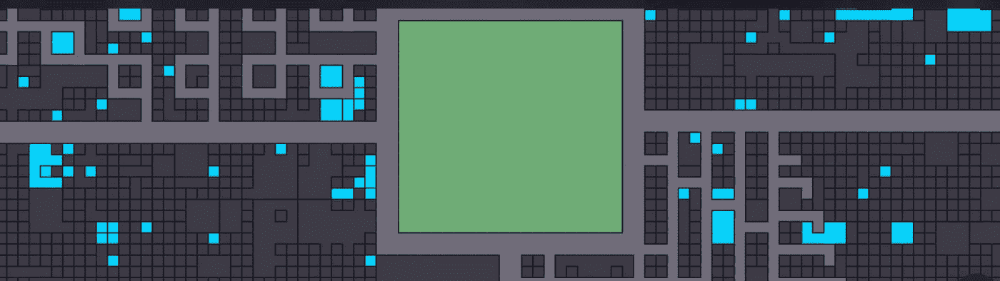

# 元宇宙的分散土地

> 原文：<https://medium.com/coinmonks/decentral-land-in-metaverse-bfc30962388e?source=collection_archive---------31----------------------->

在元宇宙，我们需要土地来建造房屋、购物中心、美术馆、博物馆等。像真实世界一样，元宇宙的房地产空间有限。例如:在分散的土地上，我猜有九万块土地。去中心化自治组织(DAO)同意这个共识，不要拥有无限的土地。只有在社区投票支持的情况下，这一数字才能增加。这使得土地变得稀缺，大多数时候，土地会随着时间的推移而增值，就像现实世界中的房地产一样。

让我们考虑一个[分散土地](https://decentraland.org/)的例子，你可以在下面看到它的地图。所以，我们在这里看到的是分散地图，所以你可以浏览地图，浅蓝色的点是待售的地块。在中间我们有创世纪广场，它属于社区，然而，如果你想在创世纪广场附近买一块地，它的价格比你在远离它的地方买的要高得多(与现实世界非常相似)。类似于现实世界的房产中介，我们有[元宇宙房产](https://metaverse.properties/)——促进元宇宙虚拟房产的买卖。

Decentralized Land snapshot Source: [Decentraland](https://decentraland.org/)

还有其他类似 [Rentabyl](https://www.rentabyl.com/) 的平台。这是一个房产中介出租土地。所以，如果你不买，你想租出去，你想举办一个活动，你需要一块土地一个月。

> 交易新手？尝试[加密交易机器人](/coinmonks/crypto-trading-bot-c2ffce8acb2a)或[复制交易](/coinmonks/top-10-crypto-copy-trading-platforms-for-beginners-d0c37c7d698c)

如何在元宇宙购买土地？

如果我想买这块地，我只需点击购买并登录，基本上，我们所做的就是使用我们的 [MetaMask](https://metamask.io/) 钱包。记住，这是 Web 3.0，Web 3.0。你不需要使用你的电子邮件或谷歌账户。你用你的区块链钱包，你的以太坊钱包。这些去中心化的土地大多接受的加密货币是法力。你需要在钱包里保留足够的法力来进行交易。然而，这里有一个有趣的用例，你可以用你的 NFT 贷款购买土地(和你在现实世界中做的一样)。您可以签署智能合同并保留您的 NFT(例如 crypto kitty 等)。)作为抵押，并贷款购买土地。要了解更多关于贷款人，你可以查看[典当。fi](https://www.arcade.xyz/) 、 [drops.io](https://drops.co/) 等。

> 加入 Coinmonks [电报频道](https://t.me/coincodecap)和 [Youtube 频道](https://www.youtube.com/c/coinmonks/videos)了解加密交易和投资

# 另外，阅读

*   [币安 vs FTX](https://coincodecap.com/binance-vs-ftx) | [最佳(SOL)索拉纳钱包](https://coincodecap.com/solana-wallets)
*   [如何在 Uniswap 上交换加密？](https://coincodecap.com/swap-crypto-on-uniswap) | [A-Ads 审查](https://coincodecap.com/a-ads-review)
*   [加密货币储蓄账户](/coinmonks/cryptocurrency-savings-accounts-be3bc0feffbf) | [YoBit 评论](/coinmonks/yobit-review-175464162c62)
*   [Botsfolio vs nap bots vs Mudrex](/coinmonks/botsfolio-vs-napbots-vs-mudrex-c81344970c02)|[gate . io 交流回顾](/coinmonks/gate-io-exchange-review-61bf87b7078f)
*   [CoinFLEX 评论](https://coincodecap.com/coinflex-review) | [AEX 交易所评论](https://coincodecap.com/aex-exchange-review) | [UPbit 评论](https://coincodecap.com/upbit-review)