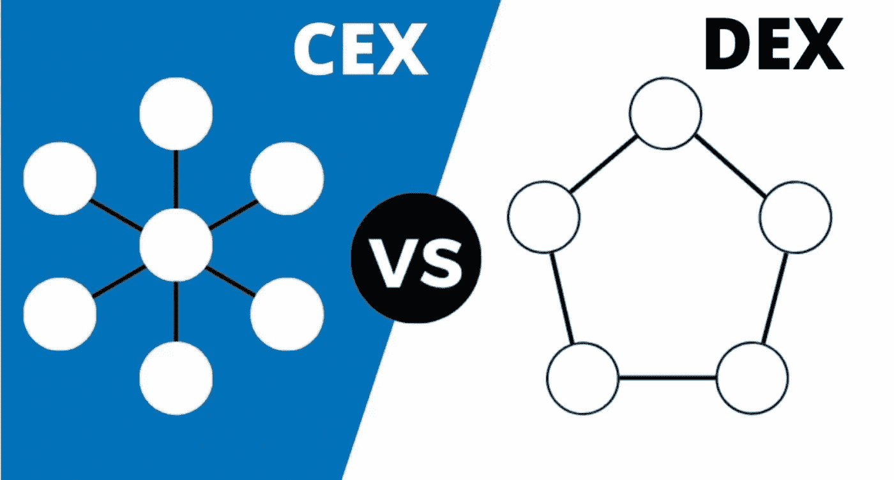
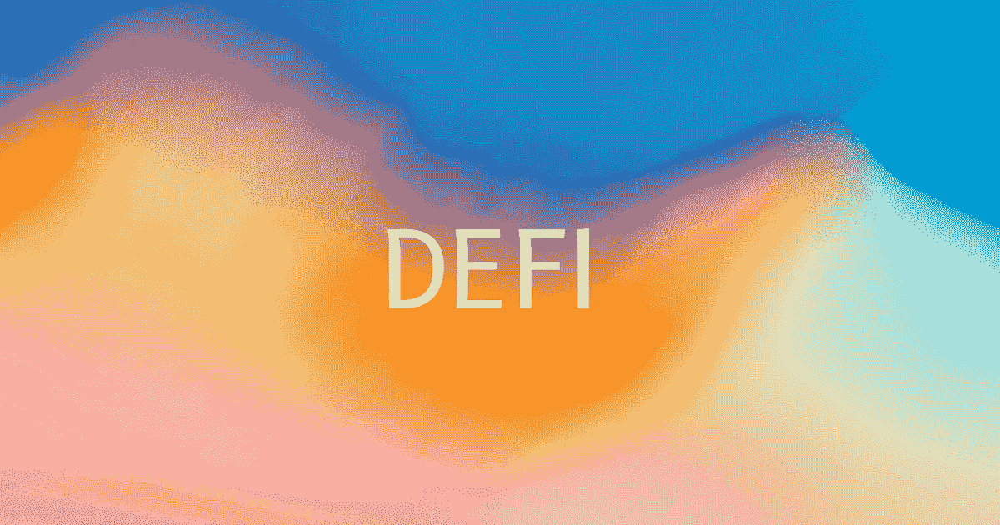

# 分散式与集中式加密钱包

> 原文：<https://medium.com/coinmonks/decentralised-vs-centralised-crypto-wallets-b506a6aef4c8?source=collection_archive---------22----------------------->

## 什么比较安全方便？优势和

使用分散式钱包就像:

这不是一个笑话。一个分散的钱包给了你对资产的实际所有权，但也让你承担了保护种子短语安全的责任。虽然有一个集中的钱包就像有一个银行账户——如果你丢失了种子短语，你将能够重新获得你的资产。

# 摘要

## 集中优势

1.  您可以恢复密码，重新访问您的资金。
2.  更安全的资产存储。
3.  钱包生态系统内的交易通常几乎是即时和免费的。
4.  允许持有不同区块链的资产。
5.  通常，由于 KYC 和反洗钱，集中式钱包更受信任。

## 分散的优势

1.  不能冻结资产(某些情况除外)。只有你拥有你的资产。
2.  不需要 KYC，你的钱包不是个性化的，它只是区块链上的号码。
3.  所有的 DeFi 平台都可用。
4.  没有停机时间。任何人都可以随时进行交易。

# 概述

1.集中式钱包

1.1 KYC 和反洗钱

1.2 安全性

1.3 交易速度和成本

1.4 支持多区块链

2.分散钱包

2.1 没有 KYC

2.2 访问 DeFi 平台

2.3 全天候可用性

# 集中式钱包

集中式钱包也可以被称为保管钱包。托管人是代表客户持有资产的金融机构。就区块链而言——他们有私人钥匙或**把你的资产存放在他们的钱包里，并允许你使用它们**。保管人的主要作用是保护资产安全，防止丢失和被盗，妥善清理和结算业务，并为所有者提供一个与他的资产进行交互的简单界面。

## KYC 和反洗钱(了解您的客户和反洗钱)

通常，保管人**需要文件** **来创建账户**和存放资产。发生这种情况是因为他们会:

1.  在凭据丢失的情况下，需要确定实际所有者。
2.  对所有通过他们处理的非法资金负责。
3.  遵守政府和税法不被禁止。此外，他们可能会向政府透露你的账户信息，政府会向你征税。

## 安全性

安全优势来自于保管人保护资产安全的责任、多种信息安全工具和降低失窃概率的安全策略。与分散式相比，当用户是唯一负责保持其计算机安全和私钥或种子短语安全的人时。

## 交易速度和成本

通常，集中式钱包属于加密交易所，允许在其平台内交易和发送加密货币。从技术上来说，平台上的所有资产都属于平台，所以当用户发送或交易资产时——平台只改变其数据库中的数字，而没有区块链上的交易费。

## 支持多区块链

正如我前面提到的，一个集中的钱包通常由交易所控制，所以他们让交易不仅在一个区块链内加密。它由属于不同区块链上的交易所的多个钱包提供，因此它们充当加密桥。例如，用户可以将钱存入以太坊上的中央钱包 USDT(ERC 20)，并从币安智能连锁店(BEP20)提款。此外，他们可以交易来自不同区块链的加密货币，例如，BTC 和瑞士联邦理工学院。

# 分散钱包

分散钱包是非保管钱包，这意味着它们不持有任何资产。这种钱包是区块链的一个接口，具有易于理解的用户界面，使用户能够创建和导入钱包，并显示和管理存储在链上的加密资产。

很高兴知道没有人可以让您的钱包离线或将资产放在闪存驱动器上并存储在那里，**所有资产都存储在链上，私钥允许您签署交易以管理资产**。

分散钱包可以是以下几种:

1.  **软件钱包**(hot wallet)——一个将你的私钥保存在电脑内存中的程序。按下钱包界面上的一个按钮就可以完成交易。
2.  **硬件钱包**(冷钱包)——一种物理设备，保存你的私钥，按下按钮就能进行交易。

资产发行者可以在你的钱包上屏蔽它们。例如，USDT 可能会被其发行方——香港公司 iFinex Inc .封杀。

## 没有 KYC

没有 KYC，因为没有能够检查文件的交易对手。这些钱包允许创建没有名字的字母数字序列，所以它们是匿名的。

但是，由于所有的交易都在链条上，因此有机会建立关系树。一些失主公开了他们的钱包，或者交易所正在这样做，因此有可能找到朋友、亲戚和其他交易对手之间的联系，并确定钱包的主人。这里的一个危险的事情是，如果有人给你发送 gal 活动，你会受到怀疑。

## 访问 DeFi 平台

[https://cryptotesters.com/blog/what-is-defi](https://cryptotesters.com/blog/what-is-defi)

我认为这是一个显著的优势，因为他们的平台允许现在做几乎所有的事情。用户可以借钱，赚取回报，购买 NFT 并使用。

## 全天候可用性

或者不是。这几乎总是正确的，尤其是当你考虑比特币或以太坊的时候。但是有些网络可能由于每秒的大量请求而不可用(Solana 就是一个典型的例子)。

# 页脚

关注我更多关于 crypto 和 VC 的文章。

我愿意讨论。请随时通过 LinkedIn 联系我。

并在 [Twitter](https://twitter.com/kmolodykh) 上订阅关于 crypto 和 VC 的每日新闻。

> 交易新手？试试[密码交易机器人](/coinmonks/crypto-trading-bot-c2ffce8acb2a)或[复制交易](/coinmonks/top-10-crypto-copy-trading-platforms-for-beginners-d0c37c7d698c)