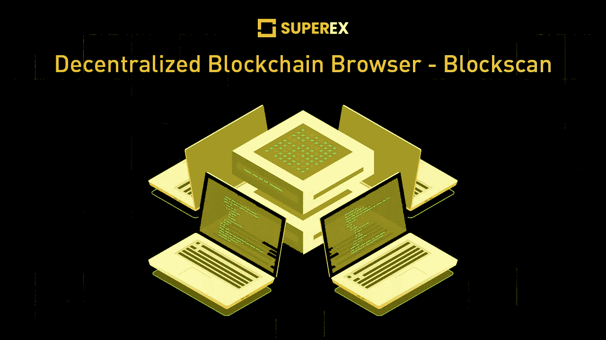

# 去中心化的区块链浏览器——block scan

> 原文：<https://medium.com/coinmonks/decentralized-blockchain-browser-blockscan-e6c413ea480e?source=collection_archive---------25----------------------->

www.superex.com

Blockscan 是一个响应现代网络技术要求的分散式互联网搜索引擎。在 blockscan 上，用户可以输入钱包地址来搜索他/她的交易历史。

以太坊首先开发了 Blockscan。这是一个分散的互联网搜索引擎，可以搜索当前数据库的数据，不包括所有的 3.0 网络。如果您想向 blockscan 提交缺失的信息，您可以在 blockscan 中单击“提交您的链接”来完成该过程。

**分散式浏览器最早出现在 IPFS。**

**IPFS** 是一个分布式系统，用于存储和访问网站、文件、数据和应用程序。IPFS 要求从不受一个集中组织管理的许多地方下载一个文件。

**星际文件系统**是一个跨遥远目的地工作的系统，这些目的地互不连接，或者像不同的星球一样遥远。这是一个理想主义的目标，但它让我们在未来努力工作和思考，以实现最终目标。

**IPFS 协议与互联网平台完美集成，支持新的创意和功能性网络解决方案。**

其中一个就是[**unstopped domains**](https://unstoppabledomains.com/)——一个网站开发和管理的工具。不可阻挡的领域是基于以太坊区块链，而领域**。zil** 基于区块链 [Zilliqa](https://www.zilliqa.com/) 。

应当注意，由上述解决方案创建的页面比传统网站更难访问。某些页面需要适当的扩展才能执行。

更多密码相关内容、市场分析、superex 更新，请转到 medium 页面。(【medium.com】[**【你的故事】**](/me/stories/drafts) **)** 它会以不同的内容迎合你每周的隐秘品味；你将能够阅读文章写得简洁，充满了加密更新。学习密码，掌握未来金融知识。

[www.superex.com](http://www.superex.com/)

SuperEx 是第一个拥有完整 DAO 社区治理的去中心化加密交易所。 SuperEX crypto exchange 在其交易区拥有数千个代币，使用户能够进行从现货到杠杆和衍生品的不同交易。没有 KYC 条款是超级交易所的焦点，该交易所为用户资产提供终极保护和严密防御。该交易所在建立其高清钱包的发展过程中取得了指数级的突破，这保证了加密服务的轻松访问和分散安全性。超级链预计将于 2022 年第三季度推出，将 ET 令牌迁移到其链中。

为了与项目方和应用服务有更密切的联系，我们推荐用户访问 SuperEx[T3 官方页面 T5。新的空投活动，项目跟进，相关的加密新闻，以及伙伴间的讨论欢迎在官方](http://superex.com/) [**电报群**](https://t.me/SuperExOfficial) 。在 [**官方邮箱**](http://business@superex.com/) 接收业务邮件、合作建议、问题报告。用户可以进入**[**官方 Twitter 页面**](https://twitter.com/SuperExet) 查看最近上市的代币和不同的空投活动或后续营销公告。**

> **交易新手？试试[加密交易机器人](/coinmonks/crypto-trading-bot-c2ffce8acb2a)或者[复制交易](/coinmonks/top-10-crypto-copy-trading-platforms-for-beginners-d0c37c7d698c)**