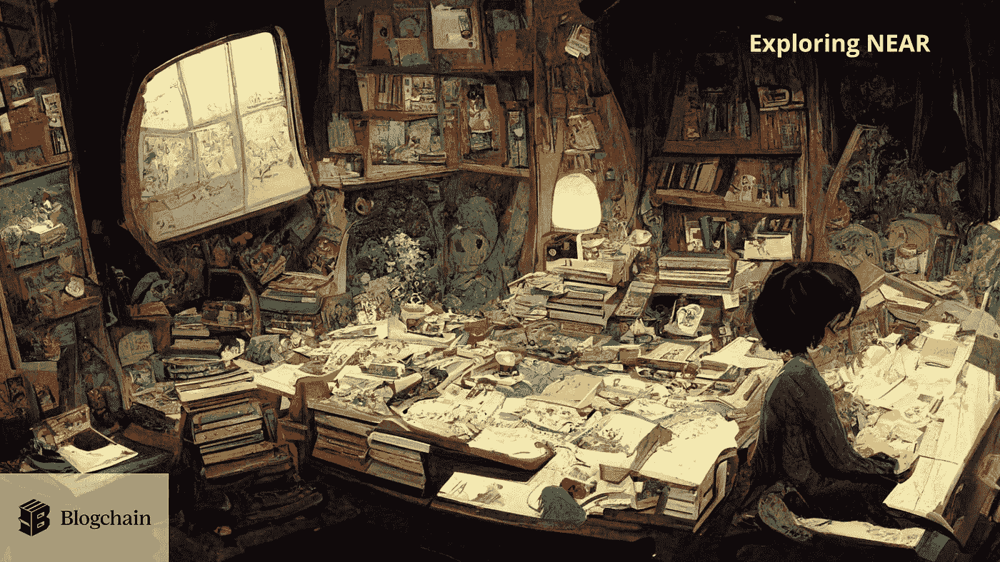
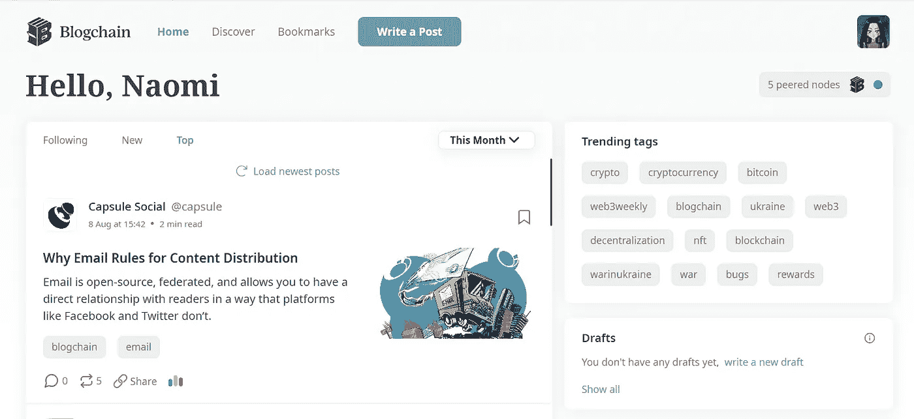
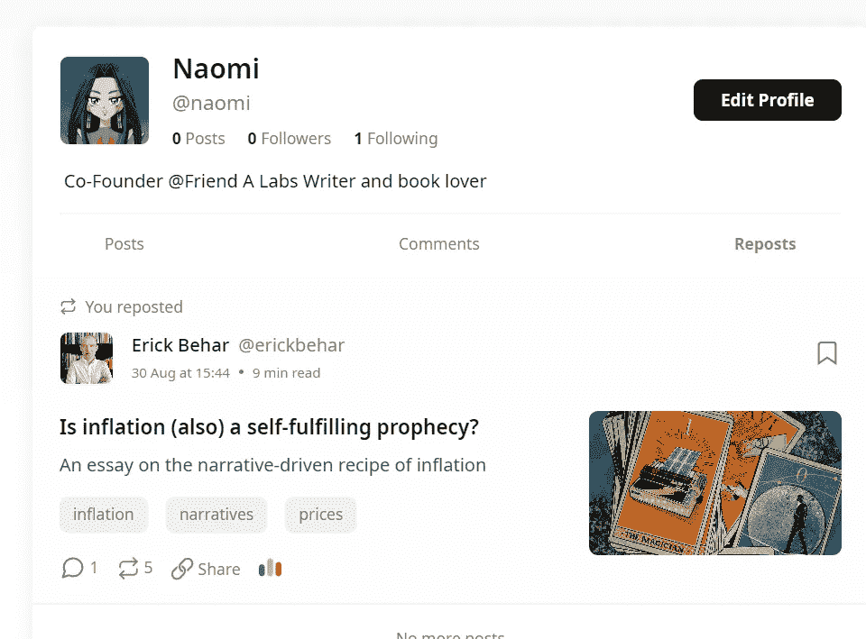
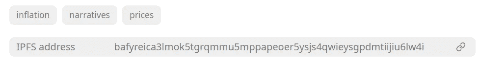

# Blogchain 的分散式博客

> 原文：<https://medium.com/coinmonks/decentralized-blogging-with-blogchain-e17b31392d3d?source=collection_archive---------6----------------------->

作为一名作家，我总是对了解更多基于区块链的博客平台很感兴趣。当我四年前开始我的旅程时，media 似乎是一个完美的选择，而且——邀请我为他们的出版物投稿的人也在 media 上。

有趣的是，我所有的媒体帖子都没有直接为我赚钱。很多，我写这些只是为了好玩，也是为了教育自己(希望还有其他人)。当然，在任职期间，我也为公司的出版物写作。但我从未尝试过中等收入的选择，我也不认为我会。

尽管如此，虽然我并不直接依赖于通过思考产生现金流，但其他创作者是这样的。不仅仅是那些作家分享他们对生活的想法，我们也应该思考；也是全世界的记者。

Blockchain 在改进现有的发布和内容共享机制方面有着巨大的潜力。在谈论 Blogchain 之前，我认为有必要先探索一下权力下放对在线写作和出版的好处。

## 记者和作家的时事

虽然数字时代也被认为是新闻业的黄金时代，因为它使记者能够建立更广泛的数据网络并进行跨国合作，但广告的出现不仅损害了新闻媒体，还可以说损害了更广泛的社会。

如今，媒体机构不再依靠用户购买报纸产生的现金流，而是依靠广告收入。不幸的是，这引发了一场追根究底的竞赛，因为每个人都试图抓住尽可能多的注意力——而不一定考虑这可能对媒体作为一个机构的信任产生的更广泛的后果。

*我会用一整篇文章来讨论广告对社会的负面影响，所以我会把它留在这里*😏

**审查/媒体自由**

与真正重要的新闻相比，除了写作之外，另一个最值得关注的问题是，世界各地的记者越来越感受到审查制度。当出版公司分享对政权至关重要的报道时，许多国家将彻底关闭出版公司；有些人走得更远，监禁记者。根据保护记者委员会的一项调查，仅在 2021 年，就有 293 名记者被监禁，24 人被杀害。

**货币化 s*cks**

面对现实吧。如果你想成为一名独立作家，赚钱可能是你最大的挑战。如果你开始在你的内容上贴广告，你就有疏远你的观众的风险；没有人真的想被卖给(除非是可爱的鸭子或猫灯，那我就全买了😸)付费墙也可能具有挑战性，因为它们要求人们预先付费。任何一种网络 2 赚钱的方式都会有所权衡，包括必须达到最低赔付金额(对于像 AdSense 这样的平台)或者长时间等待现金。

然后，根据你写的内容，总有一个挥之不去的风险，那就是你已经获得的读者平台可能会让你关门大吉。

## 输入博客链

问题有很多。幸运的是，我们有惊人的技术和有远见的公司来解决这些问题。其中有一个名为博客链的胶囊社交平台。

Capsule Social 于 2021 年由纳迪姆·科贝西创立，他是一名巴黎的密码学家，他关于建立一个去中心化的博客和社交平台的想法在发布推文的头 24 小时内吸引了 10 万美元的投资。最终，该公司从 Polychain 的 crypto fund 等顶级投资者那里筹集了 260 万美元来建立 Blogchain。

> “我们建立 Blogchain 是因为我们相信思想自由和广泛的知识话语应该成为常态，而不是例外。”
> 
> —纳迪姆·科贝西

Blogchain 是一个出版平台，对言论自由的保护是传统媒体无法比拟的。它完全在区块链附近运行

Blogchain 不像传统的托管和博客平台那样依赖于集中式服务器，它是无服务器的，完全在 OrbitDB/IPFS 上运行。IPFS 代表星际文件系统，是一个点对点网络，用于存储和共享任何人都可以利用的数据。

这种架构的一个巨大好处是它对停机时间更有弹性，更重要的是对审查更有弹性。

Blogchain 是透明的，它根据用户的客观偏好向用户展示内容，而不是根据试图最大化你在网站上的时间的算法。

该团队再次采取强硬立场销售广告，因为这是导致大型科技公司垮台的原因。

**使用博客链**

你可以通过 Discord、谷歌或类似钱包的网站相当容易地注册 Blogchain。如果你不想让一个集中的提供者知道你在使用它，后者可能是最好的选择。注册并登录后，你会看到主屏幕。

一个漂亮、实用的界面，显示最近的文章、标签和草稿(如果你有的话)。用户可以直接阅读提要，或者通过 discover 部分发现新的内容和作者。当前类别包括技术、密码、政治和文化。

你可以根据自己的喜好定制个人资料——匿名或匿名——甚至在自己的订阅源上分享或引用他人的故事。一个非常酷的功能。

所有创建的内容都存储在 IPFS 上。如果你访问任何一篇文章，你会在它的底部找到一个 IPFS 链接。这有助于更持久地保存文章，并降低文章被审查的风险。

总的来说，我觉得界面很整洁，设计也很棒。尤其是精美的插图。同样好的是，你可以为自己定制“登陆”页面，或者显示编辑器——可能从一开始就让你陷入作者的困境😆——或者说饲料。

就在 Blogchain 上实际写作而言，编辑器拥有编辑器需要的一切(我怀疑它是 markdown ),包括创建列表、引用、指定标题和添加图像的简单能力。

我还没有找到太多关于 Blogchain 的治理功能和实际的技术架构的信息，blog chain 被认为是一种调节平台的方式(我认为这在假新闻方面很有用)。

尽管如此，总的来说，我认为这是一个很棒的平台，UX 优于许多其他区块链平台。我希望有更多的人开始运行 nodes，因为到目前为止我看到的最大值是 5，对于一个应该经得起审查的架构来说，这似乎有点低。

话虽如此，我会考虑开始在 Blogchain 上添加我的一些帖子。显然，人们甚至可以开始为他们给我小费😊

> 交易新手？试试[加密交易机器人](/coinmonks/crypto-trading-bot-c2ffce8acb2a)或者[复制交易](/coinmonks/top-10-crypto-copy-trading-platforms-for-beginners-d0c37c7d698c)