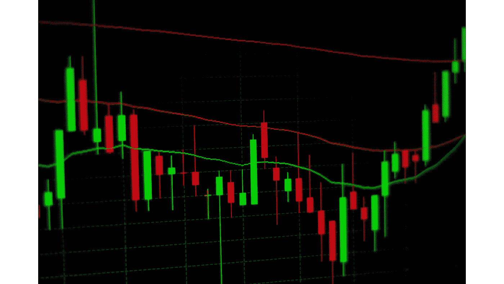
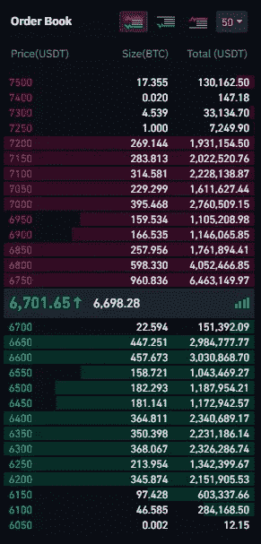

# 分散交换(DEX) — 1 语义

> 原文：<https://medium.com/coinmonks/decentralized-exchanges-dex-1-semantics-38ae0031a425?source=collection_archive---------23----------------------->

从人类的历史来看，人们过去常常交换不同的东西。它可以从食物、衣服、宝石、黄金、货币、手表或任何基于兴趣的东西。

技术越来越先进，同时，通过在线交易平台进行的货币交易和资产交易在社区中变得流行起来。

DEFI 和 DEX 可能是过去几年金融领域最热门的词汇之一。

> 交易新手？试试[加密交易机器人](/coinmonks/crypto-trading-bot-c2ffce8acb2a)或者[复制交易](/coinmonks/top-10-crypto-copy-trading-platforms-for-beginners-d0c37c7d698c)

# 集中交易所(CEX)

交易平台是一个交易所。纳斯达克或伦敦证券交易所是基于法定货币的集中交易。这意味着用户必须在进行交易/交换之前将他们的流动资金交给交易所公司保管。流行的加密货币交易所币安是基于加密货币的 CEX 的另一个例子。

大多数时候，他们都遵循托管订单模式来执行交易。交易所维护着一份以买入或卖出方式执行的订单日志。如果买单和卖单一致，交易将被执行。

Binance order book. Green color is for buy orders

# 分散交易所

随着加密货币交易的成功，分散式交易所开始崭露头角。流行的集中式加密交换，如币安，有其局限性。一个这样的限制是交易执行的等待时间，因为它需要等到买入订单找到匹配的卖出订单。
与此不同，就执行交易而言，分散式交易所是即时退出的。我们称之为“交换”也就是交换资产。

*如果您不熟悉 DEX 概念，请阅读一篇关于*[*DEX vs CEX*](https://www.coindesk.com/learn/centralized-exchange-cex-vs-decentralized-exchange-dex-whats-the-difference/)*的文章，以获得更详细的概述。*

最受欢迎的、成功运营的 DEX 是以太坊第一层网络上的 uniswap。允许交换任何 ERC20 令牌对。货币互换的价格计算遵循一个非常简单的数学公式，再加上需求和供给。

我们将回头看看 CEX。如上所述，一个用户的买入订单必须与另一个用户的卖出订单相匹配，才能在 CEX 执行交易。这暗示着集中交易促进了资产的 P2P 交易。一个用户与另一个用户进行交易。

与此不同的是，分散的交易所有利于流动性池的交易。因此，用户根据特定加密资产对创建的池进行交易，而不是 P2P 交易。

# 自动做市(AMM)

AMM 是 DEX 中使用的驾驶概念。市场交易价格仅随着流动性池中代币的准备金率的变化而变化，这发生在有人对其进行交易/互换时。

构成 AMM 概念的恒量积公式定义如下。

> X * Y = K

为了保持“K”不变，X 和 Y 的价格必须基于流动性池中的流动性变化而相互妥协。就这么简单。

DEX 基于在区块链网络中编写和部署的智能合同工作。该契约安全可靠地处理传入和传出令牌。

智能合约中包含的交换、添加/移除流动性和管理操作。

(在我的下一篇文章中，我将深入研究基于流行的第 1 层区块链 zilliqa 的 DEX 合同)。

# 流动性池

持有特定第 1 层协议的加密货币范围的任何用户，都能够创建新的池，或者在相同第 1 层上操作的 DEX 中贡献现有的流动性池。例如，如果您持有 2 个不同的 ERC 20 代币，您可以在以太坊的 uniswap 中贡献流动性池。你的贡献百分比将得到奖励。这个奖励金额是一种妥协，让你把你的密码锁定在交易所的协议中，以支持交易/交换。在通常情况下，我们称之为流动性代币奖励(LP 代币)。

一个池可以有成千上万的参与者。他们的奖励是基于一个特定群体的表现和他们的贡献百分比。

一个特定池的表现通常是基于对它的交易数量来考虑的。

用户可以随时添加流动性或从池中移除增加的流动性。

# 交易/互换

加密用户可以交换令牌对。如果代币“A”与代币“B”交换，交换功能以用户向池提供代币 A 并从池中取出代币 B 给他/她的钱包的方式操作。

仅关注上述情况，在给定的池中，对令牌 B 的需求将上升。这最终会影响 A/B 价格汇率。

整个理论简单来说就是基于契约会收到多少代币，契约会出多少代币。

## 贸易中的重要因素

**交易截止日期(Trade Transaction Deadline )**

特定交易必须有执行的最后期限保证金。否则，由于汇率不稳定，这对交易者来说将是不利的。对于在区块链智能合约级别执行的实际交易，交易者从 UI 执行交易的时间不能太长。

deadline = current block+n；

“n”是一个特定交易必须执行的临界块数。n 越小，交易越安全。

*(我将在下一篇技术文章中详细解释区块时间和区块时间的作用)*

**滑移**

滑点是预期交易值和实际交易值之间的差异。这是由于汇率波动造成的。从交易者“发送”交易到交易在区块链上执行总会有延迟。汇率是不稳定的，每秒钟都在变化。因此，为了保护交易者免受巨大的损失，指数交换函数必须考虑滑动容忍度边界。

如果交易会有很大的边际亏损，交易就会失败。这是交易者的安全验证规则。

(期望值，实际值)必须在滑动范围内勉强操作。

预期值是在 UI 级别根据当时读取的汇率计算的。

实际价值是在交易执行时在智能合约级别计算的。滑点验证也是智能合约级别的规则。

滑动公差通常设置为%值。比如用户可以设置 1-3%。

**交易平台费**

这是 DEX 对每笔交易收取的平台费。大部分热门平台的收费都是输入值的 0 . 3%左右。这通常可以由 DEX 控制。

**区块链燃气费**

油费将从交易者处扣除，作为对未成年人的奖励。如果 DEX 运行的第 1 层区块链的天然气费用较低，则交易商具有优势。Zilliqa (ZIL)是一个第 1 层协议的理想例子，具有更少的气体和更高的性能。

**套利**

每个交易平台都有套利的风险。多家交易所不同的资产交易价格为套利者创造了机会，他们可以在一家交易所低买高卖。

如果 DEX 继续跟随 AMM，并与外部交易所产生巨大的边际汇率差异，这将影响创造明显的套利机会。

因此，即使 AMMs 不根据外部价格变动来更新它们的价格，交易者仍然可以期望 AMM 的报价与全球价格率密切相关。

*免责声明:本文旨在对 DEX 和重要元素有一个大致的了解。这一系列文章基于我在 zilliqa 区块链平台上构建 DAPPS 的亲身经历。
在*[*LinkedIn*](https://www.linkedin.com/in/hasithaariyarathna)*找我。*