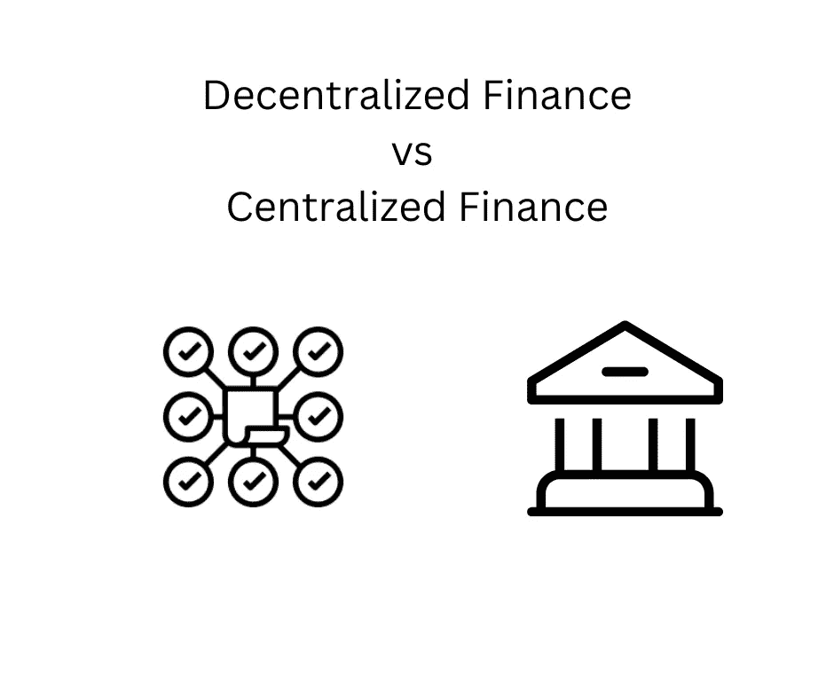

# 分散金融与集中金融

> 原文：<https://medium.com/coinmonks/decentralized-finance-defi-vs-centralized-finance-cefi-c47fc628c0c6?source=collection_archive---------41----------------------->

为什么 DeFi 更好？

分散金融(DeFi)是最近随着区块链技术和加密货币出现的一项创新。DeFi 本质上是金融行业的一种新方法，在这种方法中，你可以与某人进行交易，以分散的方式(第一次)向某人付款，简而言之，就是用集中金融做你能做的一切。

集中金融(CeFi)被认为是银行、汇款服务和提供卡商品服务的商家持有的货币。

> 集中融资的问题在于，相关的交易费用和成本很高，有一家公司在运行这个系统，只要你或你的账户出现问题，他们就可以在没有任何通知的情况下冻结或删除你的系统，最后，在我们的世界中还有银行和政府在没有任何通知的情况下就从你那里拿走你的钱的情况(希腊和塞浦路斯)。

以上都可以用分权财政来解决。

在 DeFi 中，你不需要 KYC 创建任何帐户，它是分散的，没有人控制系统，所以他们不能禁止你使用它。你可以毫无疑问或延迟地向任何账户汇款，交易成本更低。你不需要离开你的椅子而浪费时间，因为一切都在互联网上数字化，最后，它每天 24 小时，每周 7 天不间断地工作。

DeFi 并不完美，但它是从旧的传统系统向新系统前进和过渡的一种好的(也是更好的)方式。

如果您丢失了钱包的私人钥匙，您的资金将永远消失，也没有客户支持来帮助您。如果你不小心把钱寄到了另一个地址，钱就没了。

但这就是权力的原因，它是分散的，你可以完全控制你的资金和账户。

我对这篇文章的最后一个想法是关于“没有银行账户的人”。我们当中没有银行账户的人无法参与当前的金融系统(CeFi ),因为他们没有任何银行账户，并且由于缺乏适当的身份证件而无法开立账户。这些人依靠汇款服务来发送或接收资金。

这些人现在可以进入全球金融体系。这些人可以用 DeFi 解决他们的问题。

离开这里的主要想法是，你可以做你在集中金融、银行、交易、支付等领域所做的一切。通过分散融资。

如果你喜欢阅读并学到了一些东西——关注更多！

你可以在推特上找到我——[https://twitter.com/pinadefi](https://twitter.com/pinadefi)

https://pinadefi.substack.com/[子栈](https://pinadefi.substack.com/)

发布时间 0x—[https://www.publish0x.com/@Pina-DeFi](https://www.publish0x.com/@Pina-DeFi)