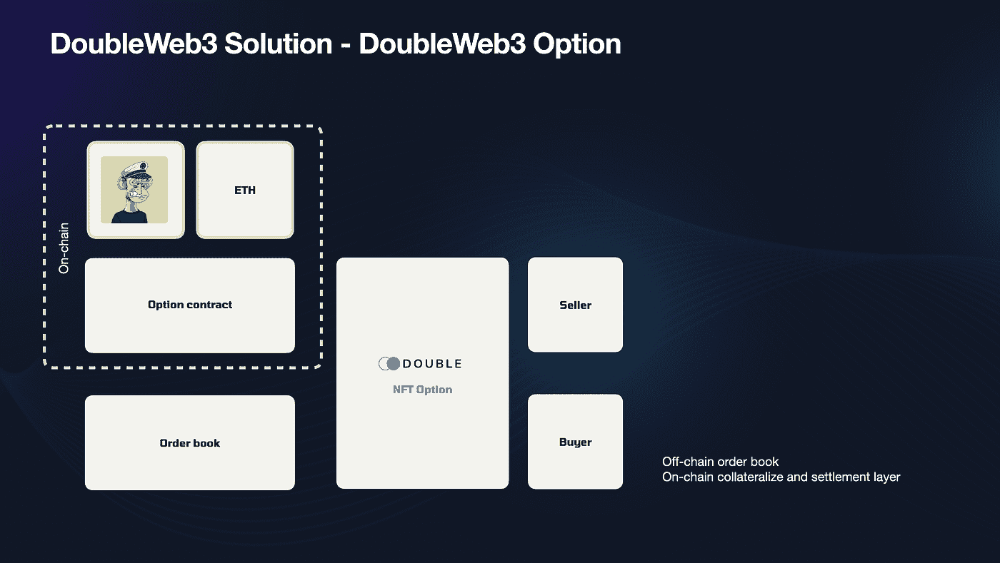

# 分散式 NFT 期权交易平台

> 原文：<https://medium.com/coinmonks/decentralized-nft-option-trading-platform-bb81eb400cef?source=collection_archive---------40----------------------->

> 让 NFT 更具投资价值！
> 在 DoubleWeb3 上对冲、抵押、买卖 NFT 期权。

# 什么是 NFT 期权？

期权一词指的是基于基础 NFT 价值的金融工具。期权合约为买方提供了买卖标的资产的机会。与期货不同，持有者不需要购买或出售资产，如果他们决定反对的话。

期权是多用途的金融产品。这些合同涉及买方和卖方，买方为合同授予的权利支付溢价。

向持有者传递以指定价格购买的权利的期权被称为**看涨期权**，而传递以指定价格出售的权利的期权被称为**看跌期权**。

看涨期权通常只有在执行价格低于标的资产的市场价值时才会被行使。相比之下，看跌期权通常只有在执行价格高于市场价值时才会被行使。

[DoubleWeb3](https://doubleweb3.com/) 分散式 NFT 期权交易平台提供美式期权；它可以在购买日和到期日之间的任何时候行使。

Doubleweb3 NFT 期权合约有三个主要部分:

**溢价** 买方为获得购买或出售 NFT 的权利而向卖方支付的费用。

**执行价格** 它是一个固定的价格，期权的拥有者可以在这个价格上买入(在看涨的情况下)或卖出(在看跌的情况下)基础 NFT。

**期限** 行使期权合约的时间范围。我们提供 3 天、7 天和 30 天的合同。

多头买入、空头买入和多头卖出、空头卖出

# 为什么我们需要 NFT 期权

衍生品在金融市场中起着非常重要的作用，投资者利用衍生品来对冲他们的投资。事实上，加密衍生品市场比 NFT 市场更具流动性，例如，世界领先的 NFT 交易平台 OpenSea 每天的交易量约为 7000 万美元，而币安加密衍生品的日交易量为 430 亿美元。

通过将衍生产品引入 NFT 市场，创造了新的机会来吸引投资，并通过二级市场为 NFT 市场提供更大的流动性。它允许投资者对冲市值损失的风险，也提供了做空 NFT 和利用杠杆投资 NFT 的机会。

**作为持有者**

保护我们在 NFT 的投资免受市场波动的影响。如果你持有一个当前底价等于 80ETH 的 BAYC，你可以购买一个执行价为 78ETH 的看跌期权。如果底价跌至 70ETH，你可以行使期权，以 78ETH 的价格卖出你的 BAYC。

如果你认为楼面价短期内不会上涨，可以卖出一个看涨期权，赚取溢价，赚取额外收入。

**作为投资者**

投资蓝筹股 NFT 可能代价高昂。DoubleWeb3 NFT 期权允许投资者以比直接购买 NFT 更低的成本持有 NFT 的杠杆头寸。

举个例子，如果你认为 BAYC 的地板价格会在一个月内上涨 10 ETH。你可以用 0.5ETH 买一个 BAYC 看涨期权，在价格上移时行使合约。

另一方面，如果你认为 BAYC 的价格会向下移动，你也可以购买看跌期权，在价格下跌时赚钱。

# 它是如何工作的？

DoubleWeb3 NFT 期权平台由一个离线订单簿和一个在线抵押/结算层组成。

通过引入预先签署的报价，它允许买方发送一个没有支付天然气的报价。

您可以在我们的平台上采取 4 项行动:

1.  看涨期权(购买看涨期权，支付溢价)
2.  卖空(卖出看涨期权，赚取溢价)
3.  长期看跌期权(购买看跌期权，支付溢价)
4.  看跌期权(购买看跌期权，赚取溢价)

为了购买期权，你可以购买现有的合约或提出报价。它像 opensea 提供的那样工作。您需要授权 doublweb3 使用您的 WETH 访问权限进行报价。(提出报价不需要加油)

如果你想卖出期权，你可以接受现有的报价。或者，你可以用你想要的执行价格、溢价和期限来标上 NFT，从而开始一个合约。你可以随时根据市场情况修改设置。

你可以看看我们的演示视频。

【https://doubleweb3.com/video/option-demo.mp4 

> 交易新手？尝试[加密交易机器人](/coinmonks/crypto-trading-bot-c2ffce8acb2a)或[复制交易](/coinmonks/top-10-crypto-copy-trading-platforms-for-beginners-d0c37c7d698c)