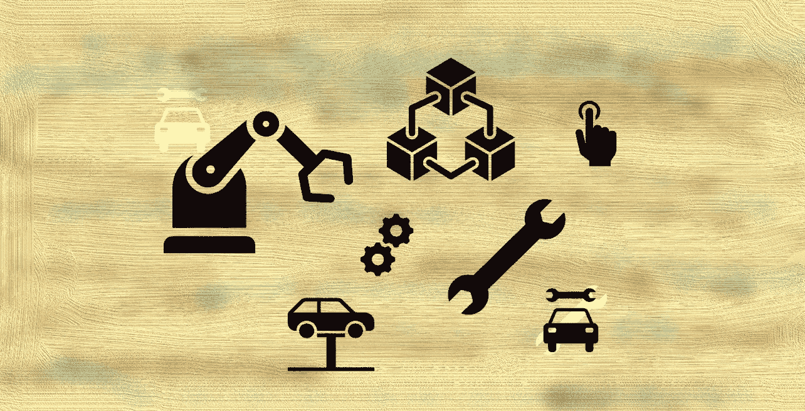

# 去中心化生产:区块链如何改善企业维护？

> 原文：<https://medium.com/coinmonks/decentralized-production-how-can-blockchain-improve-enterprise-maintenance-ea2a9d039dc5?source=collection_archive---------22----------------------->

如今，我们被许多复杂的设备和机器所包围。我们每天都在使用它们。看看你的厨房用具:冰箱、微波炉、烤面包机、水壶。其中一些是智能设备。如果我们看看任何行业，如石油和天然气，我们会看到许多不同的工具，用于钻探生产井，以生产碳氢化合物。一台复杂的设备或机器由数百个不太复杂的零件组成。随着时间的推移，它们都需要一些定期维护或维修工作。

当你从经销商那里购买一个全新的产品时，它是在保修期内的。但是，作为买家，您必须在官方经销商中心进行任何技术服务，否则您的保修期将会终止。

如果设备发生故障并需要维修(例如，您需要更换损坏的零件)，经销商从制造商处订购零件，制造商致电生产该零件的其他第三方公司，要求他们制造新零件，第三方公司联系原材料供应商，购买制造该零件所需的供应品。

你能想象整个“了解我的设备坏了，需要修理”的过程需要多长时间吗？由于漫长的后勤和复杂的协调过程，这很容易需要 6 个多月的时间。

当然，这种停机时间对任何企业来说都是不可接受的，尤其是当你在钻新井或管理你的风力涡轮机时。一些公司试图保持备用零件的库存，但是你经常不知道你到底需要更换哪个零件。大量备件库存的维护将影响产品或服务的最终成本。为了最大限度地减少停机时间，重要的是通过使用数字双胞胎来预测未来的故障，数字双胞胎是从多个传感器读取机器状态的数学模型。因此，最终用户可能能够尽早订购备件，从而大大减少停机时间。

然而，区块链技术的快速发展，以及 3D 打印，可能会在未来极大地改善目前的维护挑战。区块链技术允许在没有中间人的情况下在交易对手之间进行可信和透明的价值交换。区块链的第一个应用是比特币或加密货币。自 2020 年中期以来，分散金融(DeFi)经历了巨大的增长。想象一下分散生产(DePro):当制造商将维修零件的图纸发送到位于这个损坏设备的最终用户附近的 3D 打印节点时。为了保护知识产权，可能可以实现零知识证明的一些变体。这是指 3D 打印机或当地车间知道如何制作一件产品，但不知道它如何工作以及如何组装。

每个备件可以有一个数字克隆或 NFT 令牌。与这一部分的每一次互动:从制造开始到处理(或回收)都可以记录在一个不可变的区块链中，没有能力伪造或更改任何部分的信息。通过将与备件的所有交互保存在区块链中，可以非常容易地检查更换了哪个部件、由谁更换以及更换的原因。如果审核确认在维护工作中仅使用了经过验证的 3D 打印节点和经批准的本地车间，则保修将延长，机器将获得证书供将来使用。

分散生产可能会彻底改变我们目前对制造过程的看法。它将为当地车间和原材料供应商带来许多机会，改变供应链流程，优化物流路线。

基于区块链的维护管理系统将大大加快维护周期，减少停机时间，并以非常准确的方式跟踪所有服务工作。当然，该技术将节省组织成本，并使最终产品或服务更实惠。

> 交易新手？试试[加密交易机器人](/coinmonks/crypto-trading-bot-c2ffce8acb2a)或者[复制交易](/coinmonks/top-10-crypto-copy-trading-platforms-for-beginners-d0c37c7d698c)