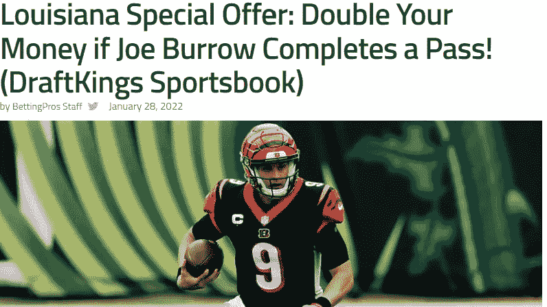
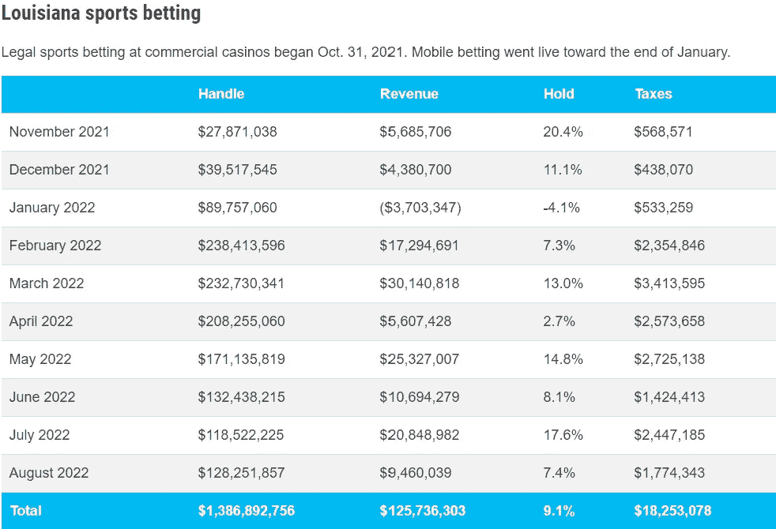
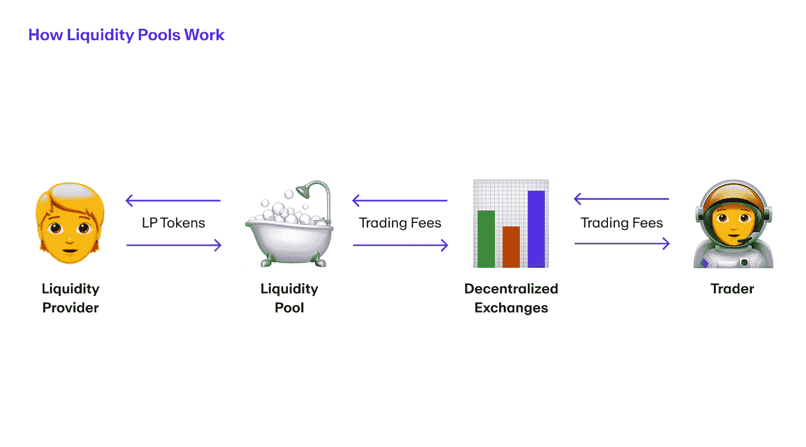
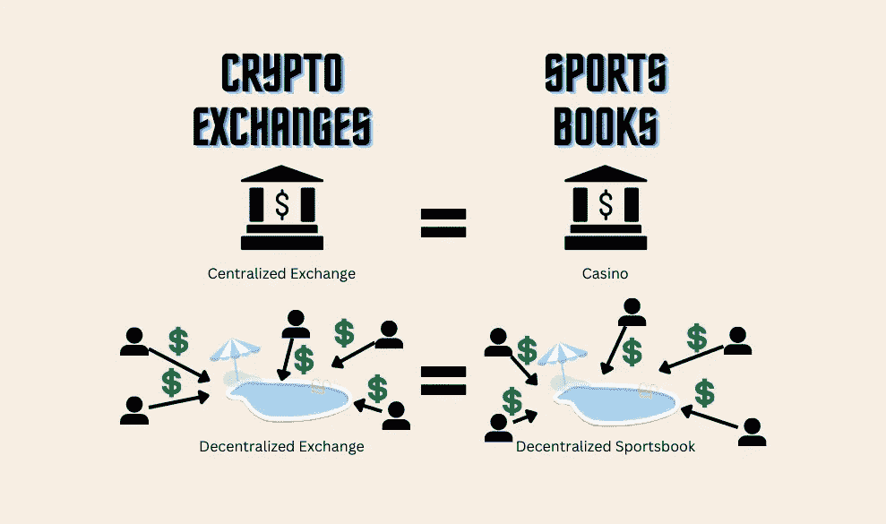
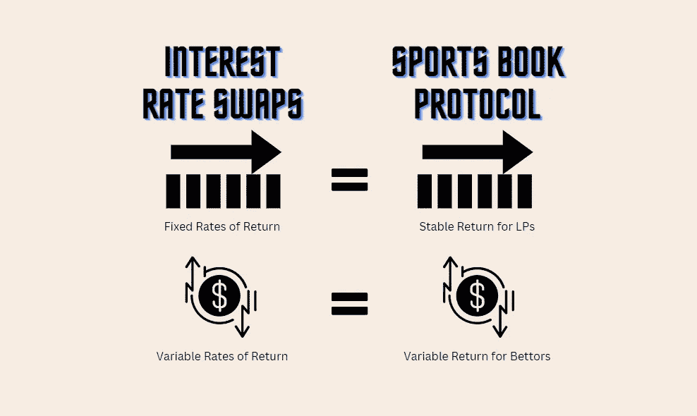

# 分散式体育博彩——体育博彩的未来？

> 原文：<https://medium.com/coinmonks/decentralized-sports-betting-the-future-of-sports-gambling-2dd362452b60?source=collection_archive---------20----------------------->

嘿大家好，

希望每个人都有一个愉快的周末！我的经历无疑是多事之秋:周五，我执教的高中球队[击败了我们的对手](https://www.nola.com/multimedia/photos/collection_fcc39770-51f6-11ed-a113-ebfaa0150c93.html#1)，杜兰绿波队和路易斯安那州立大学老虎队都取得了巨大的胜利，推动他们[在大学足球排名中上升](https://wgno.com/sports/ap-top-25-lsu-re-enters-at-no-18-tulane-jumps-to-23/)，周日没有圣徒队的比赛让我在接下来的一周处于痛苦的状态中(我们已经在周四晚上的足球赛中输了)。我终于能够在幻想中赢得另一场比赛，但我也无意中发现了这条完美概括了我这个赛季的推特:

我也是第一次在婚礼上做伴郎(恭喜迈尔斯！)我对未来十年我必须参加的婚礼感到兴奋。

现在，关于你读这篇文章的真正原因。通过我的求职(仍在继续，哈哈)和探索 Web 3.0 世界的一堆新发展(以及与我的一些德根体育博彩朋友交谈)，我为本周的博客提出了一个想法，所以让我们开始吧！

今年 1 月 28 日，在 NFL 季后赛期间，路易斯安那州许多狂热的体育迷等待多年的日子终于到来:**合法在线体育博彩**。晋升、奖励等的总数。体育书籍提供让人们上船的消息到处都是，最好的一个是你可以加倍你的钱(最大 25 美元，不幸的是，正要把我的租金放在上面)让乔·伯罗在亚足联冠军赛对阵酋长队的比赛中完成一次传球。

They were handing out money. What a time to be alive.

很明显，这种营销策略奏效了。看看仅 1 月份的负收入有多深，以及在线体育博彩合法化后增加了多少体育博彩收入:

The casino truly does always wins.

体育博彩市场规模巨大，自 2018 年 6 月以来，sportsbooks 的总收入为 89 亿美元。目前只有 21 个州将网上赌博合法化&更多的州计划在明年使其合法化。其他一些关于体育赌博的疯狂统计数据:

*   12%的美国人每周至少赌一次
*   平均下注额是 172 美元，中位数是 50 美元
*   自 2018 年联邦禁令解除以来，39.23%的美国人押注体育运动
*   超过 50%的人表示，如果体育运动在他们的州是合法的，他们可能会赌一把

关键是，这个行业将继续增长，而且很可能以指数速度增长。

另一个以惊人的速度增长的行业是 Web 3.0，几乎每天都有新项目出现。人们仍在探索区块链技术影响和改善当前系统的所有方式，如供应链、银行等。尽管在线体育博彩远非过时的系统，但区块链的技术已经成熟，足以颠覆(金融服务、法律等)。)，我觉得它有彻底革新体育博彩行业的力量。以下是方法。

Fictional name and logo I made for a potential protocol using two AI tools: [Looka](https://looka.com/) & [Namelix](https://namelix.com/)

# **Sportbook 流动性池**

如果你是 Web 3.0 的新手，流动性池的概念可能对你来说是新的，所以我会试着用一种像杰克逊五兄弟解释学会爱一个人的过程一样容易理解的方式来解释它。

Never knew this song was about love until writing this blog.

流动性池是锁定在智能合约中的数字资产的集合，该合约允许在分散式交易所(简称 DEX)进行交易。与中央交易所(想想比特币基地或币安)不同，DEX 不是一个拥有能够处理人们交易的资金的大型实体。相反，dex 使用来自流动性池的资产，由许多不同的人/实体提供资金，以获得促进交易所需的流动性。当流动性提供者(LP)将他们的代币发送到流动性池时，他们会收到 LP 代币作为回报&这些代币代表他们在池中的资产份额。有限合伙人可以选择在任何时候从池中收回他们的代币，因此有限合伙人这样做的唯一损失是与退出池相关的费用。作为提供 DEX 运营所需流动性的回报，有限合伙人将获得 DEX 用户在交换加密货币时支付的一部分交易费用。希望这张图有助于澄清我的解释:

Graphic from MoonPay. Learn more about Liquidity pools [here](https://www.moonpay.com/blog/what-are-liquidity-pools).

现在你已经对流动性池以及集中和分散交易所的区别有了基本的了解(希望如此)，你将能够更好地理解下面的类比。就像一个集中的加密交换，主要的体育书籍(即选秀国王，球迷决斗，凯撒等。)手头有很多现金。这为体育博彩公司提供了所需的流动性，以支付决定从其平台套现并带着利润离开的少数赢家(如果你是少数带着利润离开的人之一，请拍拍自己的背)。

用中学时代的老比喻来说:**集中交换对于赌场，就像分散交换对于分散体彩协议一样。**为了使类比更加清晰，请参考以下内容:

I can see a rivalry between LPs and Bettors. Lot of fun Twitter banter going back and forth

就像 DEX 一样，分散的体育博彩将使用流动性池中的资金来兑现那些决定兑现奖金的人的支出。与 DEX 使用的流动性池中的有限合伙人收取交易费不同，sportsbook 使用的流动性池中的有限合伙人将从 sports book 长期获得的大约 4.5%的利润率中获得一部分。剩下的没有分配给 LP 的钱将分配给一个社区运营的 DAO，就像其他主要协议一样，如 [Uniswap](https://uniswap.org/) 或 [Compound](https://compound.finance/) 。

# 为什么人们会使用这个？

在对新的 Web 3.0 产品或服务的大肆宣传中，有时会忽略一个考虑因素，即“所述产品/服务如何改进市场上现有的产品和服务？”嗯，首先，有这样一个协议将允许用户“成为赌场”,将可变的长期负回报换成稳定的正回报。这种交换回报的想法类似于 Voltz 所做的利率互换，用户可以根据自己的风险偏好用固定回报率交换可变回报率。这里有另一个完全不同的图形来帮助解释:

Bettors probably have the largest volatility of any “investment” out there, even more than crypto.

随着 DeFi APY 利率在这个加密冬天显著下降，我甚至可以看到这样的协议提供比顶级 DeFi 协议(如 Aave 或 Compound)更好的回报？Lol)。

这将是对当前体育书籍的一个改进的另一个原因是由于这本书本身的透明度，因为它在区块链上。人们可以看到所有已结和未结的赌注，以确保 sportsbook 正常运行，而不是对他们有利的事情。此外，由于没有中间人中央权威机构控制这本书，从用户那里收取的费用**将会减少**，而体彩协议可以利用这些费用为自己谋利。协议可以用这笔额外的钱做三件事(至少我是这么认为的):

1.  将节省下来的资金发送到 DAO
2.  将节省下来的资金交给有限合伙人
3.  用节省下来的资金帮助覆盖为用户提供更好线路的成本(我个人比较喜欢的选择；给予协议竞争优势)

如果一个体育博彩协议能够为点差下注提供-105 的下注线(比你看到的典型的-110 更好)，下注者就会蜂拥而至，就像人们为 Krispy Kreme 提供免费甜甜圈以接种新冠肺炎疫苗一样。

My degen sports betting friends would definitely want in on improved lines.

# 结论

所以，在我写完这篇博客后，我才发现分散式体育博彩已经存在于诸如 [Azuro](https://azuro.org/) 、 [BetDex](https://www.betdex.com/) 、[auger](https://augur.net/)等公司。我的百万美元想法泡汤了！不幸的是，这些产品目前在美国都没有，所以我不能像我想的那样在随机的冠军联赛比赛上扔几美元。然而，我仍然非常喜欢这个概念，并相信这些公司中的一家(或者我没有提到的一家)将会胜出，并继续挑战 Draft Kings、FanDuel 和其他主导当今市场的集中式体育书籍。

就像上周一样，我不知道接下来我会写些什么。希望我想出另一个疯狂的想法，有人以前没有想到过，并提交给 [a16z 的加密创业学校](https://az.swoogo.com/a16zcryptostartupschool/home)申请。如果你，现在正在读这句话的人，有什么想法要写，请告诉我。否则，祝你一周愉快！

如果你有兴趣，这里有我的链接:

*   [安装](https://www.instagram.com/wreynoir/)
*   [推特](https://twitter.com/reynoir_will)
*   [领英](https://www.linkedin.com/in/william-reynoir/)

> 交易新手？尝试[加密交易机器人](/coinmonks/crypto-trading-bot-c2ffce8acb2a)或[复制交易](/coinmonks/top-10-crypto-copy-trading-platforms-for-beginners-d0c37c7d698c)