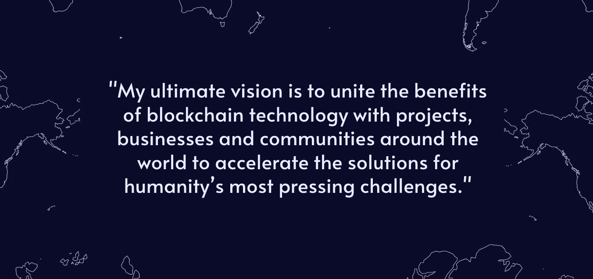

# 面向更光明未来的分散技术解决方案

> 原文：<https://medium.com/coinmonks/decentralized-technology-solutions-for-a-brighter-tomorrow-1e49f54ec108?source=collection_archive---------33----------------------->

在这一点上，对我来说，不可否认的是，分散经济正在赋予人类力量，并将在未来几年甚至几十年继续赋予人类力量。区块链技术解决方案的出现，正在切断全球金融体系长期以来束缚人类自由的沉重链条。

在过去的几千年里，一个超级男性化的能量体一直在掠夺和掠夺我们的人民和我们的星球，我相信潮流正在改变。我把这些全球精英与加密和去中心化经济相遇的竞技场视为光明与黑暗的精神之战的前线。我相信我们正在进入一个黄金时代，旧的规则让位于团结与和平。

我们如何赋予自己力量来扭转我们根深蒂固的政治、社会和行星系统的趋势？通过改革他们拥有的最强大的奴役工具之一——金融和治理系统。

对我来说，加密不仅仅是财务自由。这是关于数据主权，拆除集中的权力结构，并赋予人类建立支持地球及其人民的再生系统所需的资源。

我认为现在是时候了解区块链，用分散的技术解决方案进行建设了。

因为自由、富足和繁荣是我们与生俱来的权利。

## **想了解更多信息吗？在这里关注我的作品:**

关于我和我的服务:【https://theconsciouscontinuum.com/decentralized-finance/ 

YouTube:【https://www.youtube.com/channel/UCyxO9oaOeiUvaTVgTqg08Vg 

电报社区:[https://t.me/+5N6rCbb0BYgyODQx](https://t.me/+5N6rCbb0BYgyODQx)

免费加密扫盲课程:[https://flow-state-activation . aweb . page/p/0f 873307-6ce 2-4e 02-b53d-ff 603899 c645](https://flow-state-activation.aweb.page/p/0f873307-6ce2-4e02-b53d-ff603899c645)

> 交易新手？尝试[加密交易机器人](/coinmonks/crypto-trading-bot-c2ffce8acb2a)或[复制交易](/coinmonks/top-10-crypto-copy-trading-platforms-for-beginners-d0c37c7d698c)