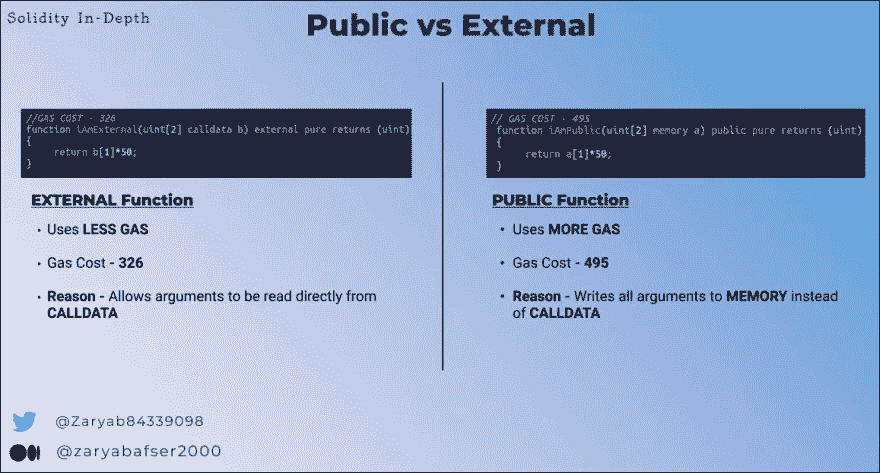

# 解读可靠性中的可见性说明符:从基础到优化再到安全性

> 原文：<https://medium.com/coinmonks/deciphering-visibility-specifiers-in-solidity-from-basics-to-optimizations-to-security-b0ea0a03aa1f?source=collection_archive---------16----------------------->

source: [https://riotactstudios.com/](https://riotactstudios.com/)

嘿，范姆👋🏻

欢迎阅读解密系列的另一篇文章，我们将选取一个特定的智能合约/Web3 主题并深入了解它。

在学习使用 Solidity 语言进行智能契约开发时，一个必不可少的部分是很好地掌握可见性说明符。

solidity 中的可见性说明符为开发人员提供了额外的能力来控制智能契约中函数或状态变量的可访问性(*或可见性*)。

它们主要有 4 种不同的类型-> ***外部、公共、内部和私有。***

好吧！现在，我们将快速复习基础知识，以便更好地理解本文接下来的部分。

> 然而，如果你已经了解了基础知识，请随意进入[优化部分](#1e52)。

# 基本面

1.  **公共:**

*   具有 **public** 可见性的函数是所有函数中最容易访问的。它可以从任何地方访问，即，在协定内、在协定外，甚至通过继承协定。
*   有趣的是，当一个公共说明符被赋给状态变量时，这个特定状态变量的 getter 函数会自动生成。

**2。外部**

*   与公共可见性不同，外部说明符 ***不能从契约*** 内部调用，而只能从契约外部或由第三方调用。
*   而且， ***外部*** 可见性只能赋给函数而不能赋给状态变量。

> 关于**公共&外部**函数的气体消耗差异，一个非常有趣的事实在本文的**优化**部分解释。

**3。内部**

*   顾名思义，具有内部可见性 ***的函数只能从定义该函数的契约*** 中或从继承它的契约中访问。
*   这同样适用于带有 ***内部*** 可见性说明符的状态变量。

**4。私人**

*   私人可见性是最受限制的一个。一旦分配给一个函数，它只允许从定义它的契约中访问该函数。
*   与 ***内部*** 不同，具有私有可见性的函数即使通过继承契约也无法访问。
*   当与*状态变量一起使用时，**私有可见性**的类似规则也适用。私有的*状态变量不能被任何其他契约访问或修改，除了包含它的契约。

> ***❓Quick 质疑❓***
> 
> 如果**私有可见性**限制任何第三方契约或用户对状态变量的访问，这是否意味着我们可以在智能契约的私有状态变量中存储秘密信息？
> 
> **🤔** 考虑一下，我们会在 [**安全**一节回到这个问题。](#fb5d)

# 优化: ***外部函数比公共函数耗费更少的汽油***

虽然具有外部可见性和公共可见性的函数的行为几乎相似，但必须记住两者之间有一些重要的 gas 优化差异。

例如，快速看一下下图。👇

A clear difference in Gas Consumption between External & Public visibility function

你有没有注意到 ***公共*** 功能比 ***外部*** 一个 ***多费油？***

## 为什么呢？

在*公共*函数的情况下，函数的参数被复制到𝐌𝐄𝐌𝐎𝐑𝐘.而另一方面，具有外部可见性的函数可以直接从𝐂𝐀𝐋𝐋𝐃𝐀𝐓𝐀.读取参数

**现在，由于 *CALLDATA* 比*内存*便宜，所以外部函数的执行成本比公共函数低。**

这可能会引出另一个问题:

> 为什么公共函数会把参数复制到**内存**而外部函数不会？

如前所述，公共函数既可以在契约内部调用，也可以从外部调用，即*内部调用*。

内部调用通过操作码**跳转**来执行，因为数组参数是由指向内存的指针在内部传递的。

因此，当编译器为内部函数生成操作码时，该函数希望它的参数位于内存中。

然而，在外部函数中完全不是这样。他们根本不关心内部电话，因此最终节省了一些汽油。

# 可见性说明符周围的安全指针

1.  **私人并不是真正的私人⚠️**

> 还记得*快速*题，在 ***基本面*** 部分吗？

是时候回答这个问题了。⏰

智能契约开发人员，尤其是初学者，通常会有一种误解，认为 ***私有*** 可见性说明符实际上会使状态变量不可读或完全不可访问。

嗯，没有。💡

带有**私有关键字**的状态变量仍然可以在链上读取。

此外，即使您的契约没有得到验证，任何第三方参与者都可以查看它的事务，以计算出存储在契约状态中的值。

*你会问，具体是怎样的？*🤔

查看这个快速的[惊人的视频](https://www.youtube.com/watch?v=Gg6nt3YW74o&list=PLO5VPQH6OWdWsCgXJT9UuzgbC8SPvTRi5&index=5)，它清楚地解释了这是如何做到的基本细节。

因此，如果任何未加密的命令性数据存储在链上，即使具有**私有**可见性，也会成为安全问题。

> **敏感或关键数据应完全离线存储，或在链上进行充分加密。**

**2。默认可见性会变得非常危险🔴**

*仍然使用小于 0.5 的实度版本？*

那么您可能需要小心默认可见性。

在低于 0.5.0 的 solidity 版本中，默认情况下，没有显式指定可见性关键字的函数被认为是公共的。

如果具有关键状态修改的函数没有被错误地分配任何可见性关键字，这可能导致潜在的利用场景。

由于默认可见性 **public** 将被分配给这个重要的函数，任何恶意的参与者都可以通过触发该函数来进行无意的状态修改。

这个安全问题清楚地描述了可见性类型在 solidity 中的重要性，以及为什么应该为特定的功能非常仔细地选择它们。

**3。对于全世界都可以访问的功能，访问控制无疑是非常重要的⚠️**

考虑到前面的指针，重要的是要注意，任何具有外部/公共可见性的函数基本上对任何用户都是可见的、可读的和可访问的。

一个简单的例子来说明**不充分的访问控制**或**在*外部或公共函数*中缺少输入验证**会导致[**200 万美元的黑客攻击**](https://twitter.com/BlockSecTeam/status/1579843881893769222) **。🥷**

TempleDao hack due to inadequate access controls

因此，在开发或审计此类功能时，必须记住两个要点。

**世卫组织能调用这些函数吗？**

*   由于外部/公共可见性关键字使得第三方参与者可以完全访问函数，因此为这些函数分配足够的 ***访问控制修饰符*** 变得极其重要。
*   访问控制修饰符帮助我们在这样的函数上增加了一层安全性，因为可见性说明符本身并不能阻止它们被钱包或契约访问。

> 在这里阅读更多关于不同类型的访问控制机制[。](https://docs.openzeppelin.com/contracts/3.x/access-control#delayed_operation)

**如何调用这些函数？**

*   虽然访问控制肯定有助于提供额外的安全性，但它可能并不总是我们想要的。
*   一些公共的或外部的函数被链上的每个用户调用。
*   因此，在这一点上，不再是谁可以调用这些函数，而是应该如何调用这些函数(*，即在调用函数*时传递正确的参数)。
*   简单来说，对于开放函数，确保包含正确的输入验证 是非常重要的。
*   这是为了确保虽然每个人都可以访问该函数，但是传递给该函数的参数在有效范围内，并且符合契约的预期。

## 关于可见性说明符的附加注释

1.  接口中函数的可见性应该总是*外部*
2.  “自由功能”的可见性应始终在*内部。点击* 了解更多免费功能
3.  *solidity 中的 [**receive()和 fallback()**](https://blog.soliditylang.org/2020/03/26/fallback-receive-split/) 功能必须始终被赋予*外部*可见性。*
4.  ***功能布局顺序:**在合同中包含适当的功能布局可以增强其可读性。在可靠性方面，按照以下顺序安排不同的功能(*基于它们的类型和可见性*)被认为是更好的做法👇*

*   **建造师**
*   **接收或回退功能(如果需要)**
*   **外部功能**
*   **公共功能**
*   **内部功能**
*   **私有函数**
*   **视图或纯函数(如果有的话)**

# *关于我自己*

## *我是谁？*

*𝙃𝙞, 𝙄 𝙖𝙢 𝙕𝙖𝙧𝙮𝙖𝙗 👋🏻*

*   *在[推送协议](https://medium.com/u/7e1cbe74a9a4?source=post_page-----4b3decc52b46--------------------------------)的智能合同工程师和开发团队负责人*
*   *我从事智能合同开发以及智能合同的安全审计。*

## *打声招呼，保持联系🤝*

*[***我的社交|关注我的每周简讯| Web3 演讲&演讲***](https://linktr.ee/zaryab2000)*

> *交易新手？尝试[加密交易机器人](/coinmonks/crypto-trading-bot-c2ffce8acb2a)或[复制交易](/coinmonks/top-10-crypto-copy-trading-platforms-for-beginners-d0c37c7d698c)*