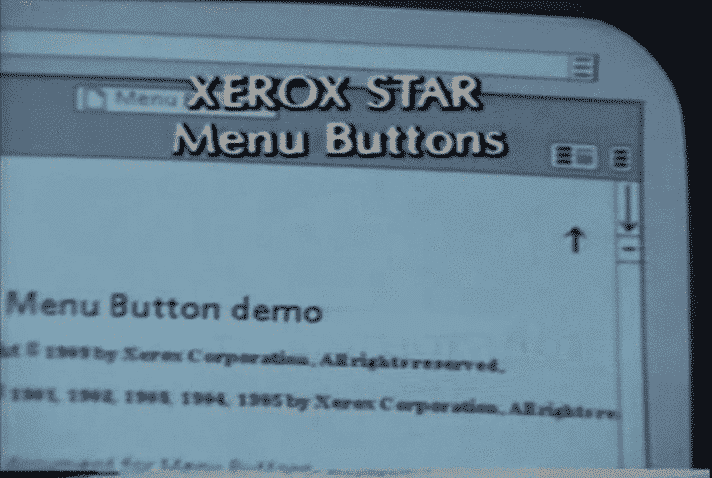
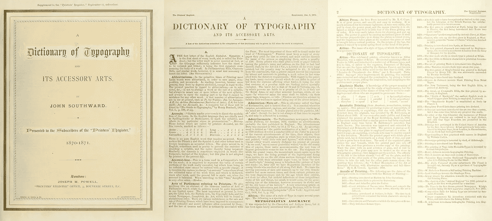
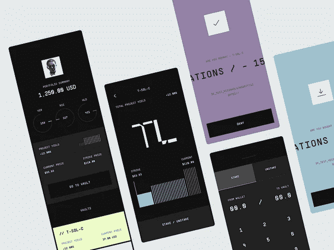
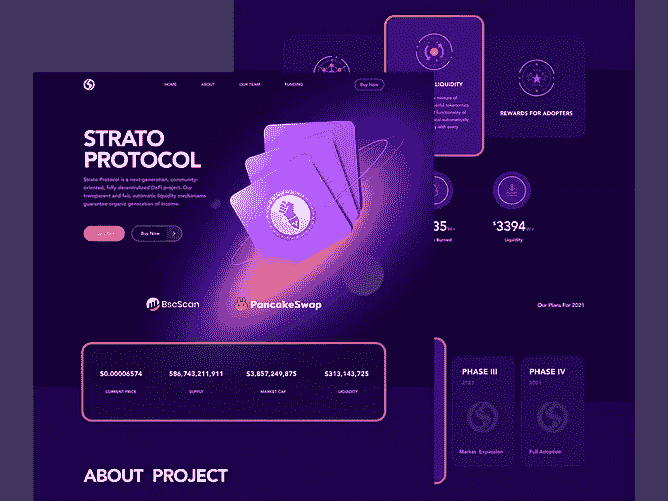
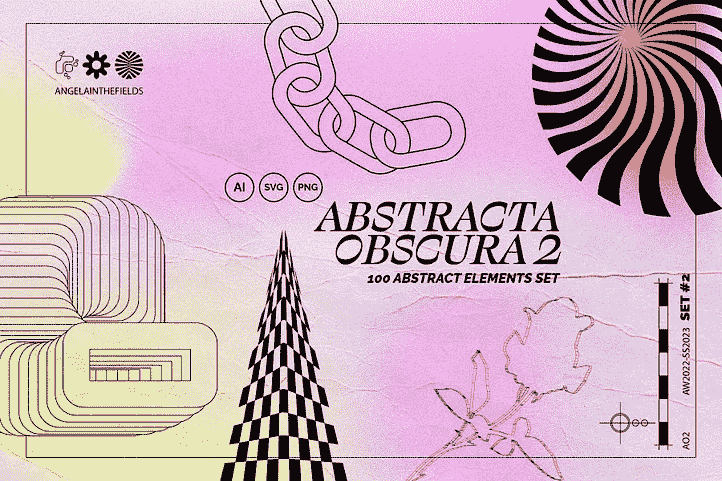
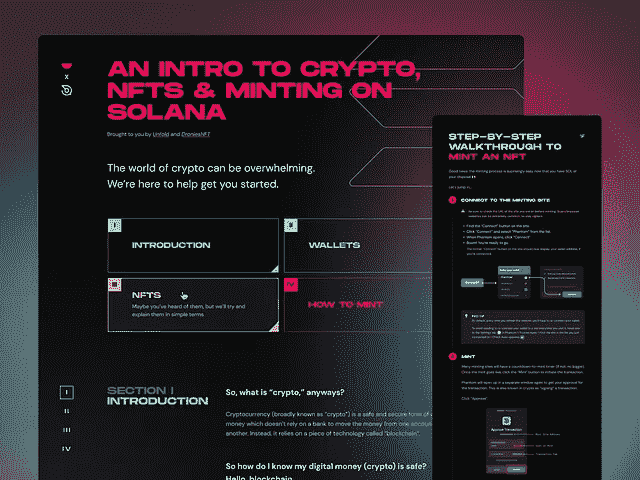
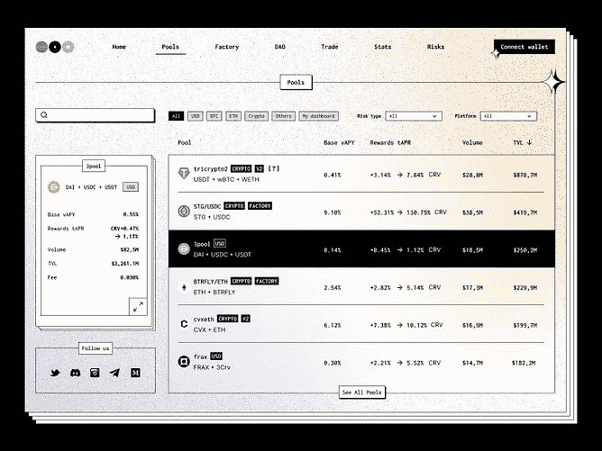
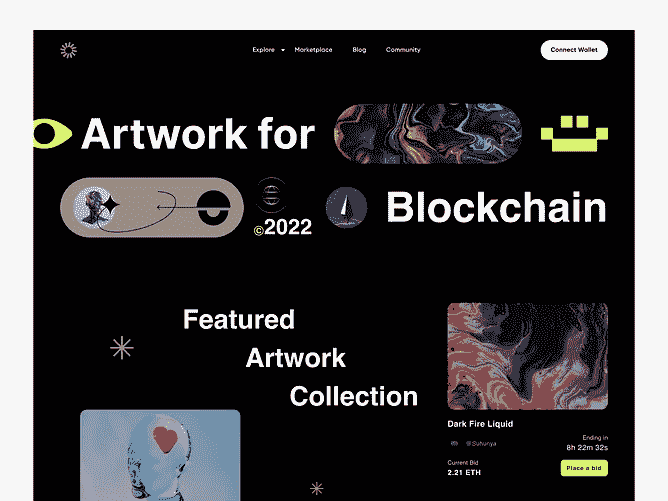
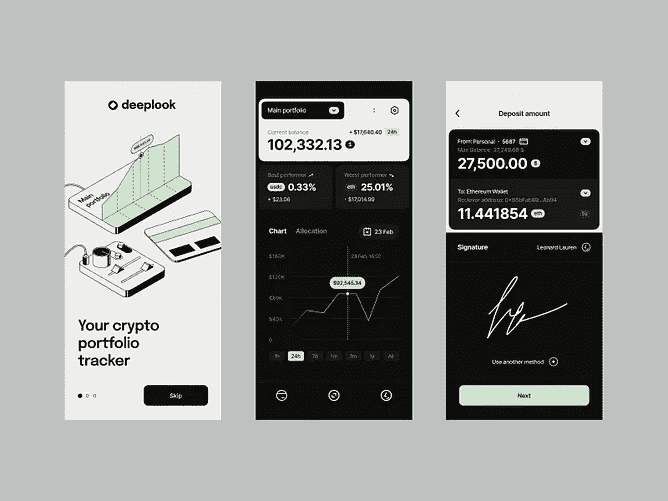
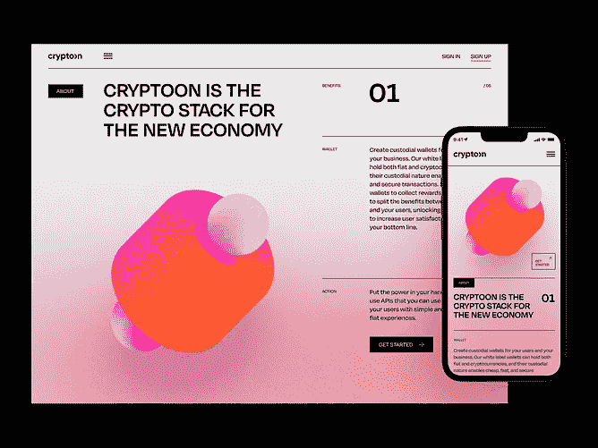

# 解密 Web3，为全人类设计，以及消失的设计师

> 原文：<https://medium.com/coinmonks/deciphering-web3-designing-for-all-humans-and-the-vanishing-designer-167e93788905?source=collection_archive---------40----------------------->

## 设计师和产品负责人每周策划的资源列表(002)

> 每周，我都会为您带来设计行业内一流的文章、工具、模板、产品和设计灵感，帮助您成为更好的设计师。

Web3 无疑是创新和技术的下一个前沿，我们正处于另一个互联网时代的开端，一个更加互联、透明和以所有权为中心的互联网。作为设计师，我们坐在这场运动的中心，确保我们创造的解决方案是可用的，并简化复杂性，足以大规模采用。

本周的列表汇集了 web3 设计入门资源、设计技巧和工具，以改善您的工作流程、生产力和技能。

# 文章

*   [**学习原理→**](/@lyricalpolymath/web3-design-principles-f21db2f240c1) [Beltran](https://medium.com/u/3d9d3a22b291?source=post_page-----167e93788905--------------------------------)的《基于区块链的分布式应用 UX 规则框架》

*   [**无信任系统→**](https://www.toptal.com/designers/digital/web3-design)【少信任，多真相:Web3 设计最佳实践和模式】作者 [Mayank Sharma](https://www.toptal.com/designers/resume/mayank-sharma) 作者 [Toptal](https://medium.com/u/aa065423705f?source=post_page-----167e93788905--------------------------------)
*   [**重要链接**](/@cdixon/crypto-token-roundup-4d57c32a87d7)[**→**](https://a16z.com/2019/11/08/crypto-glossary/)【crypto token 近期大量帖子综述】作者 [Chris Dixon](https://medium.com/u/a8e3741de9e2?source=post_page-----167e93788905--------------------------------)
*   [**信任、透明、&所有权**](https://www.ideo.com/blog/designing-for-blockchain-three-ways-to-get-started)[**→**](https://a16z.com/2019/11/08/crypto-glossary/)【区块链设计:三种入门方式】作者 Tara Tan[IDEO](https://medium.com/u/86548f7dbecb?source=post_page-----167e93788905--------------------------------)

> 尽管媒体大肆宣传加密货币的兴衰，但区块链技术仍处于起步阶段，这意味着这是设计师介入新系统的理想时机。— [塔拉·谭|视频](https://www.ideo.com/blog/designing-for-blockchain-three-ways-to-get-started)

[**A Brief History of the Hamburger Icon**](https://blog.placeit.net/history-of-the-hamburger-icon/) **b**y Antonio Freyre of [blog.placeit.net](https://blog.placeit.net/)

## 录像

*   **幕后→**
    [《为区块链而设计——塔拉谭——SFDW 2018》](https://www.youtube.com/watch?v=kyHQdrlpANw)
*   **避免技术行话，对话式 UX→**
    [“UX 为区块链设计，如何用 Nisa Andrews 设计以太坊 app](https://www.youtube.com/watch?v=4jDxjfEYzuA)”
*   **人性化设计→**
    **[为 Web3 —尤杨](https://www.youtube.com/watch?v=EMdpRC2N9zg)的人类设计**
*   ****根深蒂固→**
    **“**[与 EU 一起设计——深入探究 Web3 以及与德鲁伊和 Aise 一起的区块链](https://www.youtube.com/watch?v=HhQJfJhW1VE)”**
*   ****练习—冲洗重复→**
    [UX 创意挑战:区块链和 Web3 驱动的未来 CX](https://www.youtube.com/watch?v=qQpIYj_Gx28)**
*   ****设计 Web3 产品→**
    "[Genius Call 01:Greg Isenberg 的 Web3 产品设计](https://www.youtube.com/watch?v=yYUaVBZSXeg)"**
*   ****下一代系统和标准→**
    **"**[web 3 设计系统—更好的 dApp UX 组件和设计标准(Devcon4)](https://www.youtube.com/watch?v=TS6krLxJWr4) "**
*   ****web 3 design 上的视频演示列表→**
    [“为您的发现和学习策划和组织的敌无双内容”](https://archive.devcon.org/archive/watch?order=desc&sort=edition&tags=UX%20%26%20Design)**

****

**[**Making of A Brief Visual Exploration of A Dictionary of Typography**](https://www.c82.net/blog/?id=86) Image source: [Archive.org](https://archive.org/details/dictionaryoftypo00sout)**

## **工具和资源**

*   **[**一人治天下**](https://uxdesign.cc/one-variant-to-rule-them-all-92e685bae918#:~:text=One%20Component%20to%20rule%20them%20all%2C%20One%20Component%20to%20align,Figma%20where%20design%20systems%20thrive.)**→**【一个 Figma 组件——3360 种变体】作者[卢克·卡多尼](https://medium.com/u/774d8112a97?source=post_page-----167e93788905--------------------------------)**
*   **[**用 Figma 做更多→**](/@alvesines/figma-just-got-even-brighter-with-widgets-19fda14ed4b0)【Figma 中的协作变得(甚至)更好——使用小部件】作者 [Inês Alves](https://medium.com/u/8104d722d0d0?source=post_page-----167e93788905--------------------------------)**
*   **[**【完成更多】→**](https://uxplanet.org/15-tools-to-increase-your-productivity-as-a-ui-ux-designer-in-2020-4ee83b824ade)【作为(UI/UX)设计师提高工作效率的 15 个工具】作者 [Alexandra (Gurita) Mihai](https://medium.com/u/1f18f117613d?source=post_page-----167e93788905--------------------------------)**
*   **[**用 Bubble.io 构建复杂系统→**](https://uxplanet.org/15-tools-to-increase-your-productivity-as-a-ui-ux-designer-in-2020-4ee83b824ade)【将传统微软应用程序转换为 Bubble.io web 应用程序】作者[威尔·埃里克森](https://medium.com/u/e7d2b4f545e7?source=post_page-----167e93788905--------------------------------)**

> **有远见的设计师已经失去了他们的概念完整性，而被一个为共识、可预测性和短期商业利益而优化的工业综合体所取代。数据驱动文化的兴起培养了一代设计师，他们只采取无风险、保证成功的步骤，走向设计单调中不可避免的局部最大值。——[**蔡锷孙**](https://www.chuanqisun.com/)**

## **额外资源**

*   **[**设计更好的仪表板→**](https://uxplanet.org/10-rules-for-better-dashboard-design-ef68189d734c)[塔拉斯·巴库塞维奇](https://medium.com/u/498aec590e1b?source=post_page-----167e93788905--------------------------------)的《设计更好仪表板的 10 条规则》**
*   **[**Web3 平台最佳界面→**](https://blog.cryptostars.is/the-10-best-web3-design-inspiration-sites-b1cf5f267e0f)[芯片董林](https://medium.com/u/3fad1c06ecc6?source=post_page-----167e93788905--------------------------------)**

************

**Image source: [Dribbble](https://dribbble.com/search/web3)**

************

**Image source: [Dribbble](https://dribbble.com/search/web3)**

************

**Image source: [Dribbble](https://dribbble.com/search/web3)**

********************

**Image source: [Dribbble](https://dribbble.com/search/web3)**

**感谢您的阅读…**

> **交易新手？尝试[加密交易机器人](/coinmonks/crypto-trading-bot-c2ffce8acb2a)或[复制交易](/coinmonks/top-10-crypto-copy-trading-platforms-for-beginners-d0c37c7d698c)**

**如果你觉得这个有用，留下 50 个掌声，它会走很长的路。如果您有任何问题或意见，请在下面提出。**

**我对远程产品设计角色持开放态度，你的推荐将不胜感激。可以联系我@[mosessamuel589@gmail.com](mailto:mosessamuel589@gmail.com)。**

> **加入 Coinmonks [电报频道](https://t.me/coincodecap)和 [Youtube 频道](https://www.youtube.com/c/coinmonks/videos)了解加密交易和投资**

# **另外，阅读**

*   **[5 款最佳加密交易终端](https://coincodecap.com/crypto-trading-terminals) | [最佳 DeFi 应用](https://coincodecap.com/best-defi-apps)**
*   **[比特币基地 vs 瓦济克斯](https://coincodecap.com/coinbase-vs-wazirx) | [比特鲁点评](https://coincodecap.com/bitrue-review) | [波洛涅克斯 vs 比特鲁](https://coincodecap.com/poloniex-vs-bittrex)**
*   **[德国最佳加密交易所](https://coincodecap.com/crypto-exchanges-in-germany) | [Arbitrum:第二层解决方案](https://coincodecap.com/arbitrum)**
*   **[币安交易机器人](/coinmonks/binance-trading-bots-d0d57bb62c4c) | [OKEx 评论](/coinmonks/okex-review-6b369304110f) | [阿塔尼评论](https://coincodecap.com/atani-review)**
*   **[最佳加密交易信号电报](/coinmonks/best-crypto-signals-telegram-5785cdbc4b2b) | [MoonXBT 评论](/coinmonks/moonxbt-review-6e4ab26d037)**
*   **如何在 Bitbns 上购买柴犬(SHIB)币？ | [买弗洛基](https://coincodecap.com/buy-floki-inu-token)**