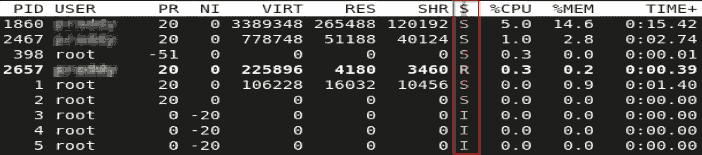
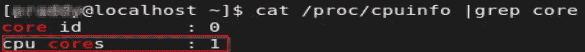
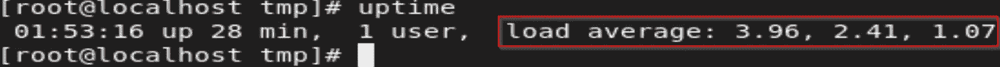
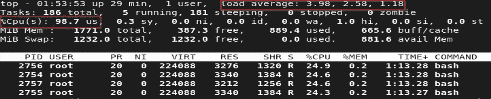

# Linux 中解码平均负载

> 原文：<https://medium.com/coinmonks/decoding-load-average-in-linux-cdc98b30e0c6?source=collection_archive---------16----------------------->

## 了解 Linux 命令输出中的平均负载，如 uptime 和 top。

Photo by [Olivier Collet](https://unsplash.com/@ocollet?utm_source=medium&utm_medium=referral) on [Unsplash](https://unsplash.com?utm_source=medium&utm_medium=referral)

## 介绍

如果您经常使用 Linux 及其命令行工具，您应该已经使用过 top 和 uptime 命令来检查系统 CPU 使用情况、内存和输入/输出统计信息。该输出的一个常见部分是平均负载。我一直以为我通过查看输出就明白了，这似乎是不言自明的。但是，我错了！它不是我最初想的那样。在一次采访中，我被问及关于这个参数的更深层次的问题，当时我发现，我的假设没有达到平均负载的程度。这给了我动力去更深入地了解它，理解它到底是关于什么的。所以如果你和我一样，希望这篇文章能让你大开眼界。

## 那么什么是平均负载呢？

简单地说，它给出了过去 1 分钟、5 分钟和 15 分钟的系统平均负载。听起来很简单，直到你开始质疑，什么是系统负载，它是如何计算的？

Uptime Command Load Average

## 系统平均负载和进程

System Load average 是处于可运行或不可中断睡眠状态的平均进程数。系统中的每个流程都包含一个流程状态。为了管理一个进程，内核需要知道这个进程在做什么，例如:它是在 CPU 上运行还是被阻塞了。这个角色被分配给流程描述符，流程描述符是一个存储有关流程的所有信息的结构。流程状态是流程描述符中的一个这样的信息或字段。流程状态描述了流程当前发生的情况。**可运行**和**不可中断**睡眠就是两种这样的状态。让我们试着去理解它们。

## 运行与可运行状态

这两个州都有同一个国旗，就是“R”。那么区别在哪里呢？在特定时刻正在执行和使用 CPU 的进程是正在运行的进程。一个进程正在等待 CPU，但是有其他所有的资源可以运行，这就是可运行进程。当 CPU 可用时，可运行的进程(在运行队列中)在被执行时变成运行中的进程。虽然，它们是不同的状态，但它们是集体分组的。因此，这两种状态下的进程都被考虑用于平均负载计算。下图显示了进程处于不同状态时的 **top** 命令输出，如 S-Sleep、R-Running 或 Runnable、I- Idle 等。

Top Command Output Indicating State

## 可中断与不可中断睡眠状态

当进程等待特定事件发生时，它可能处于可中断的睡眠状态。这意味着它可以通过满足条件/事件或发送信号来唤醒。由 **top** 命令中的“S”输出指示。

与可中断类似的是不可中断的睡眠状态。这些可能是不响应 SIGTERM 或 SIGKILL 等信号的系统调用。一个例子是设备驱动程序发出的访问硬件资源的调用，它需要资源可用才能从睡眠状态中出来。否则，它可能会使硬件处于不可预知的状态。处于这种状态的进程也被考虑用于平均负载计算。这些由顶部命令输出中的“D”标志指示。

## 那么，如何解释负载平均值呢？

为了解释负载平均输出，您需要确定您拥有什么样的 CPU。是多处理器还是多核系统？

How To Find Out Number Of CPU Cores

如果系统有一个 CPU，平均负载为 0，这意味着没有活动进程正在使用该 CPU。值 1 表示 CPU 利用率为 100 %, CPU 很忙。在这种情况下，平均负载为 2 意味着 CPU 很忙，并且有活动的进程在等待 CPU。这种情况偶尔会发生，但是如果这种情况持续一段时间，就意味着出现了问题。这就是为什么查看 15 分钟时间范围内的负载平均输出中的最后一个值可以很好地指示系统上的负载。在多核系统上，您需要考虑可用的内核数量，例如，在一个具有两个内核的 CPU 上，平均负载为 1 大约是 50%的利用率。根据机器上可用的处理器或内核数量，该值会有所不同。下图显示了 uptime 命令的平均负载输出。负载平均值跨越 1 分钟、5 分钟和 15 分钟的时间段。因此，对于单核 CPU 来说，在 1 分钟和 5 分钟的时间框架内，这些值很高，分别达到 4 和 2.5，活动进程正在等待 CPU。在过去 15 分钟内，CPU 利用率超过 1，这对于单核 CPU 来说仍然很高，如果不加控制，随着时间的推移，它可能会增加并影响系统性能。

High Load Average Uptime Command

下图是同一时间的 **top** 命令输出，您可以看到平均负载在增加，CPU 利用率也很高，徘徊在 98–99%左右。

Top Command Load Average and High CPU Usage

## 结论

希望本文能让您对如何计算平均负载以及如何解释其输出来跟踪 CPU 使用情况有所了解。它确实是一个非常有用的工具，当与其他性能指标结合使用时，可以提供系统性能的度量。让我知道你对评论的宝贵反馈。

> 交易新手？试试[密码交易机器人](/coinmonks/crypto-trading-bot-c2ffce8acb2a)或者[复制交易](/coinmonks/top-10-crypto-copy-trading-platforms-for-beginners-d0c37c7d698c)