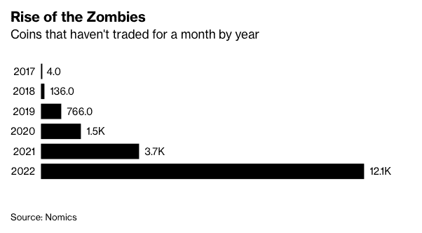
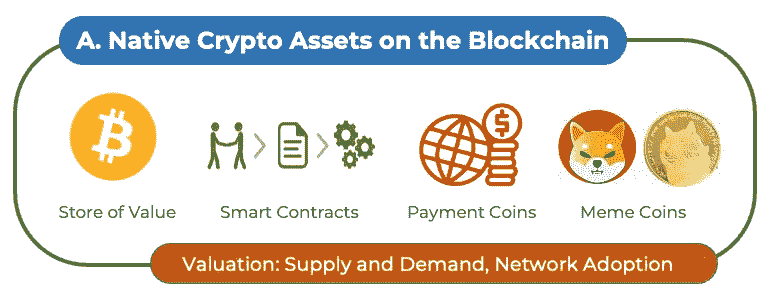
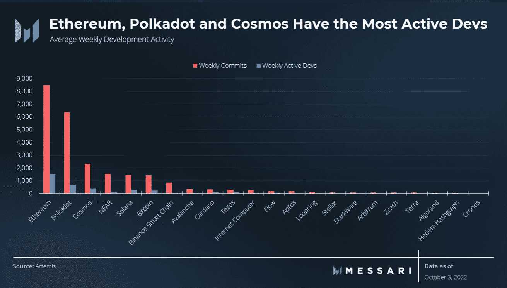
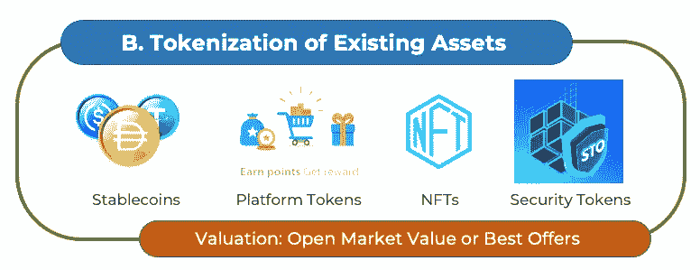
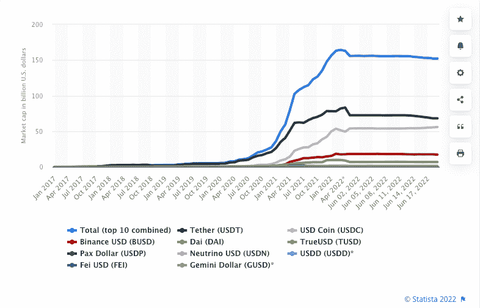
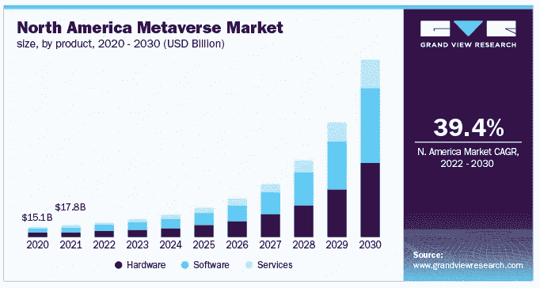
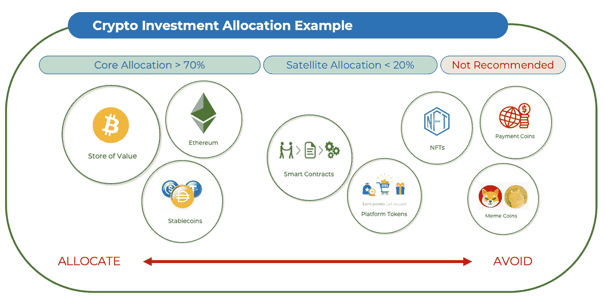
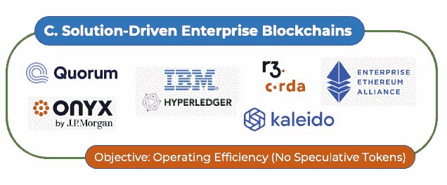

# 解密加密经济

> 原文：<https://medium.com/coinmonks/decrypting-the-crypto-economy-18c02e2d547a?source=collection_archive---------8----------------------->

*了解代币类别及其投资价值*

Source: iStock Photo

加密投资者最常见的问题之一是如何区分不同的加密资产。在目前可用的成千上万的加密资产中，理解它们的所有功能和目的是一项艰巨的任务。这种困惑往往会阻止投资者参与这一新兴资产类别，并导致他们错过投资组合中的指数增长潜力。

进行这种分析的最佳时机莫过于熊市中期。随着流动性枯竭，许多加密代币挣扎着维持运转。随着所谓的“僵尸硬币”的兴起，明智的做法是问一问:这些硬币有什么用途？它们如何具有投资价值？在本文中，我们旨在回答这两个问题。

技术进步是快节奏的。我们见证了过去 30 年互联网如何改变了我们的日常生活；不难想象，作为互联网基础设施之上的价值转移协议，区块链技术也可以遵循类似的创新模式。可能会有成千上万的加密硬币，就像你智能手机上的应用程序一样。一旦我们理解了每个代币的用途，并选择了能给我们的生活增加价值的代币，我们就不应该困惑了。

为了提供一个简单的分类，我们首先根据如何确定它们的价值将所有加密资产分为两种类型。A 类包括区块链上的**原生加密资产，其价值主要由效用和网络效应驱动，B 类是现有资产**的**令牌化，其价值与现实世界(或虚拟)资产直接相关。**

随后，每种类型又可分为四类:

Source: Tokenomy Research

A 类:区块链本土资产，价值由效用和采用驱动

1.  价值储存手段
2.  智能合同
3.  支付硬币
4.  迷因硬币

1.  **数字储值**

价值类别赢家的数字商店归比特币所有。作为第一种去中心化的点对点加密货币，比特币运行在最安全、分布最广的无许可区块链支付网络上。和大宗商品一样，比特币的价值是由供求关系驱动的。因此，它的价值与它的采用直接相关。尽管批评者经常关注比特币在短期内的高价格波动性，但其历史长期价格升值是不容忽视的。自 2008 年发明以来，比特币已经成为 CFA 学院课程中的一种替代数字资产类别。最新研究强调，在传统投资组合中分配 5%的比特币(从 2014 年到 2020 年)可以将总回报提高 50%，而风险调整后的回报(夏普比率)可以增加 0.36 [ [2](https://www.cfainstitute.org/-/media/documents/article/rf-brief/rfbr-cryptoassets.pdf) ]。

Source: CFA Institute

随着通货膨胀成为大流行后经济中的一个全球性问题，投资者正在寻找替代资产来维持他们的购买力。华尔街主要银行高盛预测，作为价值的数字存储手段，比特币将与黄金展开竞争。彭博提出，比特币可能比黄金更好[ [4](https://assets.bbhub.io/promo/sites/12/979267_Crypto-Jan2021Outlook.pdf) ]。包括养老基金、保险公司和主权财富基金在内的许多金融机构报告称，近年来增加了对这一数字资产类别的分配。

随着供应的有限和需求的增长，比特币的价格预计会随着时间的推移而上涨。假设是数字经济的进步将驱使更多人“持有”比特币作为长期投资和价值的数字储存手段。**假设比特币的总价值达到黄金的市值 11 万亿美元，一个比特币的价值将达到 40 万美元。**要了解更多比特币的内在价值，请参考[本文](/coinmonks/uncovering-the-intrinsic-value-of-crypto-assets-fdbb7c0b185d)。

**2。智能合约**

这是最大的类别之一，因为许多加密资产的目标是在分布式网络上构建分散的解决方案。作为第二大加密资产，以太坊是类别赢家。

以太坊是一个支持智能合约的分散式软件，允许在其网络基础设施上构建各种应用程序。它的功能就像一台全球超级计算机和一个巨大的应用程序商店。以太是推动以太坊网络上所有交易的本地资产，它充当可编程货币，为网络引擎及其所有应用程序提供燃料。

许多去中心化的项目，如去中心化自治组织(DAO)和去中心化金融(DeFi)，都是建立在以太坊基础设施上的，包括许多 NFT 项目和 stablecoins。这些项目还可能有自己的区块链基础设施或第 1 层网络，以促进不同的共识机制、互操作性特性、更好的数据架构或更快的交易速度。这些数字资产的供应通常是无限的，因为目标是构建可扩展的软件解决方案。因此，这些资产的投资价值是基于有多少人在数字经济中“使用”它们，而不是像比特币那样简单地“持有”它们。

绝大多数区块链项目都属于这一类。然而，这些新项目可能需要数年甚至数十年才能实现其宏伟目标。简单来说，建立一个中心化的业务已经够有挑战性了，更不用说去中心化的了。投资者应该将这类资产视为早期科技企业，并特别关注每条链上活跃开发者的数量[ [6](https://twitter.com/dunleavy89/status/1576943086583758848) ]。除了以太坊之外，Cardano、Solana、EOS、Cosmos、Polka Dot、MakerDAO 和 Filecoin 也是这个领域中的一些流行项目。

Source: Messari

**3。支付硬币**

最初的比特币白皮书将比特币描述为一种点对点电子现金系统。但目前的网络每秒只能处理 7 笔交易，相对于 Visa 网络每秒 65000 笔交易的输出[ [7](https://www.visa.co.uk/dam/VCOM/download/corporate/media/visanet-technology/aboutvisafactsheet.pdf) ]来说是不够的。这一限制促使早期的技术人员创造出替代的加密货币，作为区块链更好的支付手段。它们比比特币更快，交易费用更低，有些甚至具有隐私功能，以规避审查和监控。众所周知的专注于支付的项目包括莱特币、比特币现金、Ripple、Stellar、Dash、Monero 和 Zcash 等。

将比特币与 Visa 的交易处理吞吐量进行比较并不是一个简单的比较，因为比特币区块链是一个结算层。相比之下，Visa 是传统结算层之上的支付网络。类似的比特币解决方案正在开发中，如闪电网络(LN)，这是一种“第二层”解决方案，位于原始区块链之上，每秒钟可处理 100 万笔交易，远远超过 Visa 网络的吞吐量。

然而，主要的争论超出了交易速度或处理能力。加密资产价格波动太大，不能用作结算货币。自 2014 年推出 stablecoins 以来，大多数加密交易商更喜欢使用 stablecoins 作为区块链的结算货币。Ripple 和 Stellar 等公司正专注于为金融机构建设先进的支付轨道，以提高跨境交易效率。他们的本国硬币，XRP 和 XLM，功能是交易收据，而不是用来构成投资价值的。因此，如果支付硬币收藏家只是出于投资目的持有这些硬币，而不是用它们来促进交易，他们可能会失望。

**4。迷因币**

模因是通过社交媒体平台在互联网上创造和传播的文化表达方式。在区块链空间看到它们的存在并不奇怪。**迷因币通常很幽默，并不代表任何现实世界的价值。它在年轻一代中很受欢迎，他们把它作为表达观点和新观念的一种方式。Dogecoin 是 2013 年作为一个纯粹的笑话而创造的第一个 meme 硬币，它仍然是一个受大型在线社区支持的受欢迎的硬币。**

默认情况下，迷因来来去去，因为它们的保质期很短。一个例子是受网飞大受欢迎的鱿鱼游戏启发的迷因硬币——鱿鱼硬币在一天内交易了 30，000%，交易量超过 1，100 万美元，不久后暴跌为零。很难说硬币的创造者在开始时是否有不良意图，但买家应该已经吸取了教训，即炒作随时可能消失。

随着互联网文化继续孕育创意和潮流主题，更多的迷因币有望被创造出来。由于迷因的目的从一开始就很明确，这些币没有投资价值，如果不想亏钱，还是远离这一类的好。

Source: Tokenomy Research

类型 B:价值与现有资产相关联的资产的令牌化

5.稳定的硬币

6.平台令牌

7.不可替换令牌(NFT)

8.安全令牌

**5。稳定的噪音**

稳定货币是特定法定货币的符号化价值。最受欢迎的是美元稳定货币。它们最早发明于 2014 年，允许加密货币交易者在区块链进行即时结算，因为在传统银行系统中进出美元过于繁琐和耗时。在跨境或小额支付交易中，Stablecoins 尤其有用。它可以用最少的费用在几秒钟内解决问题，全天候服务。这就是 stablecoins 如此受欢迎的原因。USDT 是交易量最大的加密货币，平均每天交易量为 500 亿美元，超过了比特币和以太坊的交易量。

美元稳定币有很多版本。除了之外，、和戴是交易量最大的，总市值超过 1500 亿美元，并且还在增长。我们也看到与其他货币挂钩的稳定货币，但在这一点上，它们都不足以与美元稳定货币的受欢迎程度相竞争。

世界各国政府对中央银行数字货币(CBDC)的潜力越来越感兴趣。国际清算银行(BIS)最近的一项调查显示，10 家央行中有 9 家正在探索 CBDCs，超过一半的央行正在进行实施实验[ [10](https://www.visualcapitalist.com/visualized-the-state-of-central-bank-digital-currencies/) ]。潜在的可能性是，依赖商品的发展中国家可以与私人银行共存，并促进更好的国际金融交易。美国美联储最近的讨论也暗示，稳定货币的存在强化了美元作为全球储备货币的重要性。

对于加密投资者来说，在投资组合中保留一些稳定的点数是有益的，主要有两个原因。首先，它是一种方便的结算货币，可以不时地重新平衡加密组合，并在各种加密资产之间切换。第二，稳定债券提供了优于银行存款的收益率，因为收益率受到加密市场参与者之间蓬勃发展的借贷活动的支持。由于没有中央银行设定基准利率，稳定的货币收益率完全由市场驱动，美元稳定货币的年收益率可高达 8%至 10%。请记住，由于没有联邦政府批准的存款保险范围，因此在向非银行实体存款时会出现交易对手风险。

**6。平台代币(区块链上的忠诚度积分)**

平台代币在最初的硬币发行(ICO)时代开始流行。在 2017-2018 年期间，ICO 是创业公司轻松进行众筹的创新方式，但它也吸引了许多骗子和骗子，最终戳破了泡沫[ [13](https://www.investopedia.com/news/80-icos-are-scams-report/) ]。由于股权众筹涉及安全法规，大部分 ico 都将其项目代币作为会员特权进行预售，如独享权限或产品折扣。它类似于 Kickstarter 或 Indigogo 活动，但以区块链代币的形式出现。在某种程度上，这些代币就像是为未来公司预先发放的忠诚度积分。

忠诚度积分是有价值的，因为它们可以根据发行者设定的规则兑换特定的商品和服务，但一般来说，它们不被视为投资。平台代币的功能类似于折扣券，并且由于缺乏标准的价值衡量标准，无法与其他平台代币互换。例如，很难计算出兑换一张机票需要多少餐券，这就是为什么易货系统在几个世纪前就被货币取代了。

象征性的忠诚度积分还处于早期试验阶段。大型加密交易所正在使其平台令牌更加透明，通过回购减少流通供应，并增加折扣优惠以推动进一步采用。星巴克(Starbucks)和 Reddit 等传统公司也公开宣布了他们在区块链将奖励制度令牌化的计划。我们可能会看到这一令牌类别的加速增长，特别是游戏、Web3 和元宇宙公司，它们将区块链应用程序带入虚拟现实世界。然而，**最近 Terra/Luna 和 FTX 的落尘带来了这方面的严重担忧**。两家加密公司都使用平台令牌为其快速扩张提供资金，由于过度杠杆化和不当的风险管理实践，纸牌屋最终倒塌。投资者应该记住，这些代币不是股票。即使代币供应可能是有限的，稀缺性也适用于代币本身，而不是它所代表的东西。它们最多只能被视为私人代金券或收藏品，而不是投资品。

随着区块链上平台令牌的丰富，可互换性将是一个持续的问题。因此，我们可以预测，这一现象将进一步加强比特币、以太坊和 stablecoins 作为更好的通用价值衡量标准的使用。

**7。不可替换令牌(NFT)**

发明了一种不可替代的令牌(NFT)来证明区块链的真实性和所有权。与其他加密令牌组不同，每个 NFT 都是唯一的数字标识符。2020 年，它开始广泛流行于代表特定的艺术品、音乐或游戏角色。根据 Dune Analytics 的数据，NFT 交易总额在 2022 年 4 月达到峰值时超过了 1460 亿美元。随着区块链创意产业的数字化，许多艺术家、词曲作者、设计师和收藏家都欣然接受了这一新趋势。最著名的 NFT 收藏是无聊猿游艇俱乐部(BAYC)和加密朋克。

除了在艺术作品中的应用，NFT 还可以用作任何物理对象的数字身份，包括个人。想象一个全球数字身份网络已经到位；身份验证将变得更加容易，特别是对于跨境或 Web3 门户访问认证。电子投票也可以实现更透明的选举结果。然而，要实现这一点，需要公共部门和私营部门进行大量的协调努力。隐私问题、实施风险和技术集成只是比应用程序本身更大的挑战。

NFT 的炒作在 2022 年 5 月开始出现下降迹象，交易量在 2022 年下半年迅速减少，比峰值下降了 97%。**与 ICO 泡沫类似，这种下跌表明了收藏品市场的流动性不足，并证明了区块链交易解决方案无法维持或创造额外的交易量。**尽管区块链的数字认证是一项值得关注的创新，但投资者不应该对其潜在影响过于热情。非技术转让所传达的包括版权、商业许可和知识产权在内的合法权利仍然没有与法律制度挂钩。就目前而言，将它们视为数字收藏品而非投资资产可能更安全。

**8。安全令牌**

安全令牌是区块链上真实世界资产的令牌化(或常规术语中的“证券化”)。这些代币代表了股票、债券、房地产和黄金、石油或碳信用等贵重商品的所有权。在互联网时代，这些资产大部分已经以数字形式存在；因此，将它们放在区块链的目的尚待证明。安全令牌的支持者主张部分所有权和分散的可访问性是这种新资产类别的潜在好处，但我们已经看到了证明这种说法无效的证据。

支持部分所有权的概念并不新鲜。公共股票市场是一个明显的例子。各种资产类别的共同基金或房地产投资信托基金(REITs)也是部分所有权的形式。大多数私人公司和财产没有被证券化的原因可以归结为估值困难和这些资产的非流动性。将它们符号化不会神奇地解决这些基本障碍。以分时度假为例；转售或交换度假房产部分所有权的能力已经被证明是困难的[ [19](https://www.thenationalnews.com/business/money/us-timeshare-investors-suffer-buyer-s-remorse-as-fees-pile-up-1.1245731) ]。区块链技术不会在缺乏流动性的市场中实现突然的流动性。

通过向所有人开放来实现金融民主化，也会给金融体系带来不稳定。1933 年大萧条后启动的合格投资者规则今天仍然有价值，因为所有投资都有内在风险，并且不是所有参与者，特别是散户投资者，都能够管理这些风险的复杂性。ICO 现象提供了一个很好的例子；当每个人都可以自由参与一个开放的、低门槛的代币市场时，混乱和操纵就会出现。无数的骗局用他们狡猾的营销活动淹没了生态系统，破坏了寻求真正增长资本的合法公司。结果是毁灭性的，受害者将永远是散户投资者。

幸运的是，对于安全产品已经有了严格的规定。区块链技术当然可以应用于提高现有金融基础设施的效率(见下文企业区块链部分)，但不能发行更多代币供公众交易。就目前而言，将你的投资放在传统场馆可能比投资于这种象征性的场馆更容易。

**结论**

上述分类绝非完美，因为许多多用途代币可以归入其他类别。然而，本文旨在简化代币群体特征，分析其投资价值。

**第一类(价值储存)、第二类(智能合约)和第五类(稳定账户)应被视为加密投资组合的核心配置**，无论是直接持有还是通过私募基金工具持有。第六类(平台代币)和第七类(NFT)可以根据投资者的个人喜好而定。第三类(支付代币)和第四类(meme 币)没有明显的投资价值，第八类(安全代币)与传统市场已经提供的相比被认为是多余的。

Source: Tokenomy Research

直接持有 crypto 并不是投资这一资产类别的唯一途径。跟踪比特币或主要加密资产组的传统基金工具或交易所交易产品在许多市场都可以公开获得。投资比特币基地、迦南(比特币采矿)、特斯拉或 MicroStrategy 等持有比特币作为国库资产的上市公司，可能是获得敞口的另一种简单方法。投资者不必担心自我保管或在区块链转移资产的麻烦。

**附录**

类型 C:无令牌类别

**企业区块链**

企业区块链是纯粹的解决方案驱动的，没有任何投机，因为这些项目没有公开可用的令牌进行交易。对这些区块链的访问仅限于企业参与者，因此它们通常被称为“许可区块链”或分布式账本技术(DLT)项目。

采用 DLT 技术的最大金融机构是摩根大通。该银行成立了一个业务部门 Onyx，负责监管所有区块链发展项目，以改善现有的金融基础设施。这包括跨境支付、实时外汇和证券结算、多币种流动性管理、数字身份以及资金和证券的令牌化。摩根大通的银行间信息网络 Liik 拥有来自 38 个国家的 400 多家银行参与者。如果证明成功，该项目将被视为对近 50 年前推出的传统 SWIFT 系统的升级。

分布式分类帐技术不仅有益于金融结算。IBM 和微软正在将企业区块链解决方案集成到供应链、数据管理、酒店预订、物流和货运跟踪的业务流程中。沃尔玛是区块链改进食品可追溯性的早期采用者。它还利用 DLT 来统一其第三方货运跟踪系统和自动化支付，以实现更高的运营效率。

Source: Tokenomy Research

除了 IBM、微软和 J.P .摩根的区块链项目，其他已知的企业区块链参与者包括企业以太坊联盟(EEA)、Hyperledger 和 R3。然而，除了持有这些大型上市公司的公众股份，投资者不太可能从这些企业技术升级中获得直接投资敞口。

**与上述第二类智能合同项目相比，区块链企业更有可能实现预期的解决方案，因为它们具有集中的性质和高效的实施。**值得密切关注企业区块链的发展，以预测以分散方式实施的类似软件解决方案。

关于作者:Christian Hsieh 是加密金融服务和投资管理平台 [Tokenomy](https://tokenomy.com/) 的联合创始人兼首席执行官。

参考资料:

1.  2022 年，[彭博](https://www.bloomberg.com/news/articles/2022-10-03/more-than-12-000-crypto-coins-become-zombies-in-digital-asset-slump)，加密暴跌导致 12100 枚硬币陷入僵尸交易的困境。
2.  加密资产:投资专业人士比特币、区块链和加密货币指南， [CFA Institute](https://www.cfainstitute.org/-/media/documents/article/rf-brief/rfbr-cryptoassets.pdf) ，2021。
3.  高盛称比特币将与黄金竞争“价值储存”，路透社，2022。
4.  彭博加密展望，[彭博](https://assets.bbhub.io/promo/sites/12/979267_Crypto-Jan2021Outlook.pdf)，2021 年。
5.  机构对密码的需求超过了零售，[金融评论](https://www.afr.com/companies/financial-services/crypto-demand-from-institutions-outstrips-retail-20220516-p5aln8)，2022。
6.  汤姆邓利维，梅萨里分析师，[推特](https://twitter.com/dunleavy89/status/1576943086583758848)，2022。
7.  签证情况说明书，[签证](https://www.visa.co.uk/dam/VCOM/download/corporate/media/visanet-technology/aboutvisafactsheet.pdf)，2018。
8.  一个乌贼游戏如何逃脱数百万的秘密骗局
9.  2017 年 1 月至 2022 年 6 月 19 日最稳定的 10 家公司市值， [Statista](https://www.statista.com/statistics/1255835/stablecoin-market-capitalization/) ，2022。
10.  可视化:央行数字货币的状态，[可视化资本家](https://www.visualcapitalist.com/visualized-the-state-of-central-bank-digital-currencies/)，2022。
11.  美联储关于美元国际角色的首次会议，[美联储](https://www.federalreserve.gov/econres/notes/feds-notes/the-feds-inaugural-conference-on-the-international-roles-of-the-us-dollar-20220705.html)，2022 年。
12.  LoanScan:比较高息账户， [LinenApp](https://linen.app/interest-rates/) ，2022。
13.  80%的 ico 都是骗局， [Investopedia](https://www.investopedia.com/news/80-icos-are-scams-report/) ，2018。
14.  2022 年，星巴克详细介绍了其位于区块链的忠诚度平台和 NFT 社区。
15.  Reddit 社区积分， [Reddit](https://www.reddit.com/community-points/#token) ，2022。
16.  FTX 泄露的资产负债表，[视觉资本家](https://www.visualcapitalist.com/ftx-leaked-balance-sheet-visualized/)，2022。
17.  NFT 市场概览，[沙丘分析](https://dune.com/thomas_m/NFT-stats)，2022 年。
18.  2022 年 1 月，[彭博](https://www.bloomberg.com/news/articles/2022-09-28/nft-volumes-tumble-97-from-2022-highs-as-frenzy-fades-chart)，NFT 交易量从峰值暴跌 97%
19.  随着费用堆积，美国分时度假投资者遭受买方悔恨。
20.  公开交易公司的比特币国债。
21.  摩根大通的缟玛瑙，[摩根大通](https://www.jpmorgan.com/onyx/liink.htm)，2022。
22.  沃尔玛案例研究， [Hyperledger](https://www.hyperledger.org/learn/publications/walmart-case-study) ，2018。
23.  沃尔玛加拿大如何利用区块链解决供应链挑战，[《哈佛商业评论》](https://hbr.org/2022/01/how-walmart-canada-uses-blockchain-to-solve-supply-chain-challenges)，2022 年。

> 交易新手？尝试[加密交易机器人](/coinmonks/crypto-trading-bot-c2ffce8acb2a)或[复制交易](/coinmonks/top-10-crypto-copy-trading-platforms-for-beginners-d0c37c7d698c)