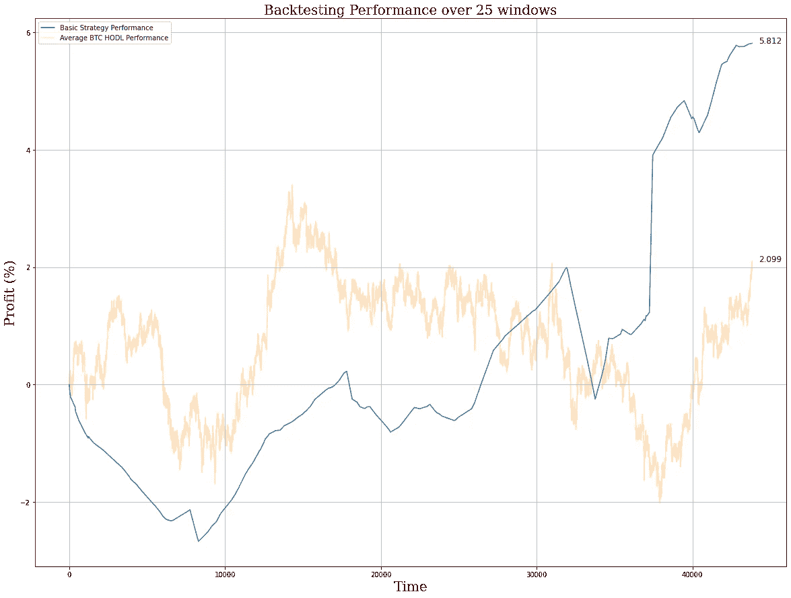
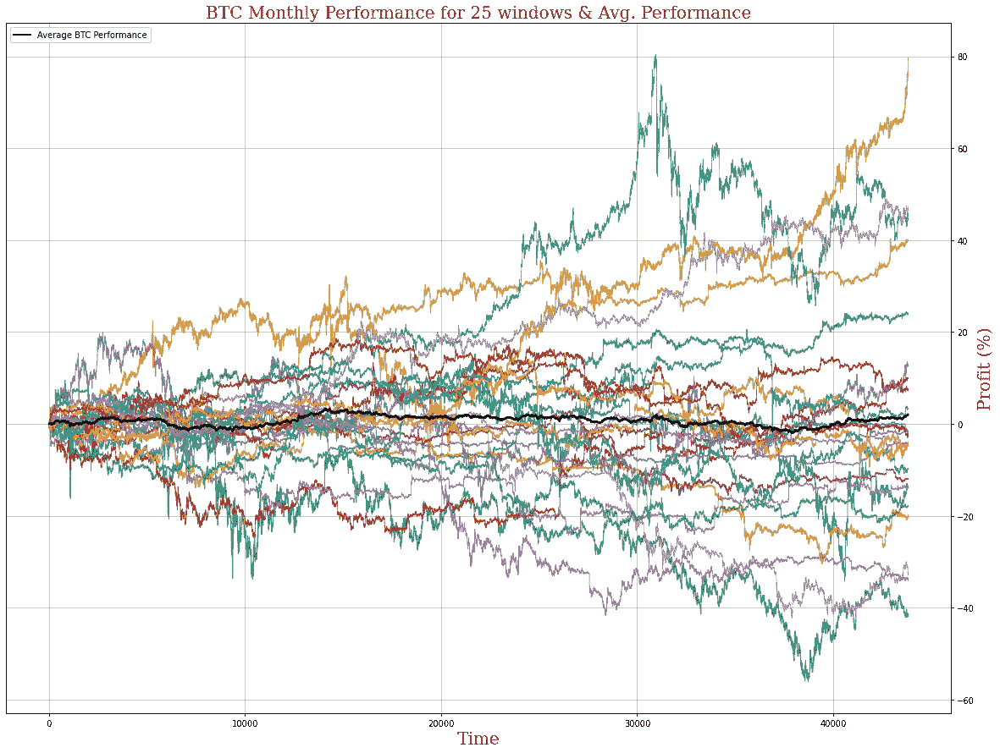

# 深入探讨(第 1 部分)——用统计数据分析你的交易表现

> 原文：<https://medium.com/coinmonks/deep-dive-analyzing-your-trading-performance-with-statistics-part-1-d8150e64e829?source=collection_archive---------11----------------------->

回溯测试你的交易策略，分析你的 PNL 是决定你策略表现的一种方法，但是任何专业交易者都会告诉你，过去的表现并不能代表未来的成功。

你如何确定你的策略中哪些部分是好的，应该被强调，哪些是不好的，应该被最小化？此外，你如何确定你的策略实际上是盈利的，而不是仅仅依赖于过去牛市的历史上升趋势？

在这一系列的文章中，我们将深入探讨一些统计分析和常用工具，您无需具备数据科学的高级学位也能使用它们来理解和实现。

今天，在第 1 部分中，我们将讨论回溯测试策略的一些复杂细节，以及在准备部署新策略时如何评估回溯测试。

# 回溯测试多个时间框架

我们可用的最简单也是最有用的工具之一是在各种时间框架和窗口内对我们的策略进行回溯测试。最重要的是，我们要对大量较小的窗口进行回溯测试，而不是对整个历史数据集进行一次大的回溯测试。

通过将我们的数据集分成离散的时间段，并对每个时间段进行回溯测试，我们可以显著减少数据本身带来的偏差。如上所述，任何包含过去 14 年数据的广泛金融资产(如股票市场指数(甚至更糟，加密货币)的历史数据集都会看到*巨大的*年回报率，因为这 14 年见证了美国历史上最大的牛市。

将数据集分割成更小的窗口不会消除这种偏见，但它会降低“买入并持有”策略的平均回报，这是我们测试的指数。

让我们来看一个示例策略:

An average monthly return of 5.8% is insane, even for Bitcoin. What is the likelihood that this strategy actually continues to perform this well in live deployment? Future chapters of this Deep Dive blog will provide robust statistical tools to determine just exactly how likely this strategy will continue to perform as well in the future.

在这个策略示例中，我们在过去 5 年的 BTC 烛台数据中，对一个相对基本的策略进行了回溯测试。上图显示，平均而言，持有 BTC 一个月将产生大约 2%的投资回报率，而我们的策略平均回报率为 5.8%。

在我们继续之前，我必须说 5.8%的月回报率令人难以置信，任何聪明的基金经理都会乞求这种策略——然而，*只是因为它在回溯测试* *中表现良好，并不意味着它在实际部署中也会表现良好。*我们将在这一深度探索系列的未来版本中深入探讨为什么会出现这种情况的细节。

现在，让我们从表面价值来看这个示例策略——我们有一个比买入并持有策略强近三倍的策略。然而，我们也知道，持有 BTC 的某些月份会比平均水平好或差。

在这 25 个测试窗口中，比特币的表现如何？

Bitcoin obviously has some wildly volatile months, and depending on the month can see enormous gains (or losses). Devising a strategy that can consistently beat the average return is our goal.

我们可以看到，在某些月份，BTC 上升了近 80%，而在其他月份，它下降了 40%以上。然而，平均而言，它的表现大约只有 2%的涨幅。

相比之下，我们的模型表现如何？

Our example strategy seems to swing wildly between profits and losses, which is to be expected considering it is a relatively basic model. However, over time the performance evens out. POP QUIZ: What major weakness does the average performance have? Find out in Part 2!

我们的模型在测试窗口中波动很大，有些月份经历了超过 20%的下降，而在其他月份结束时超过 60%。然而平均下来，我们可以看到它是如何达到 5.8%的平均值的。

也就是说，与 BTC 的-40%相比，我们的最大降幅为-20%，即使在最糟糕的几个月，我们的策略似乎也优于 BTC，这令人印象深刻。然而，我们的策略的缺点是，它在利润和损失之间剧烈波动，这意味着它将不得不部署很长时间，以最小化这种波动。

# 特定窗口选择

通过在我们的整个数据集上选择 25 个均匀间隔的窗口，我们能够在某种程度上减少资产的总体上升趋势对我们的策略带来的偏差。

然而，可以通过选择一组均匀分布的回测窗口来进一步减少这种偏差，使得一半的窗口看到上升趋势，而一半的窗口看到下降趋势。如果要这样做，您最好选择一组窗口，使“好”和“坏”窗口的平均性能均匀分布。

在这一深度探讨的下一部分中，我们将深入探讨更高级的回溯测试窗口选择技术，所以请继续关注更多内容！本系列的每一篇新文章都将继续建立在以前的文章之上，越来越深入到交易策略评估的分析中。

与此同时，一定要看看 arc Taurus——一个用于构建加密货币交易机器人的自动化无代码解决方案。我们允许您构建和部署定制策略，而无需编写一行代码！查看我们的[网站](http://www.arctaurus.com/)和我们的[链接树](http://www.linktr.ee/arctaurus)了解更多信息。

> 交易新手？试试[密码交易机器人](/coinmonks/crypto-trading-bot-c2ffce8acb2a)或[复制交易](/coinmonks/top-10-crypto-copy-trading-platforms-for-beginners-d0c37c7d698c)