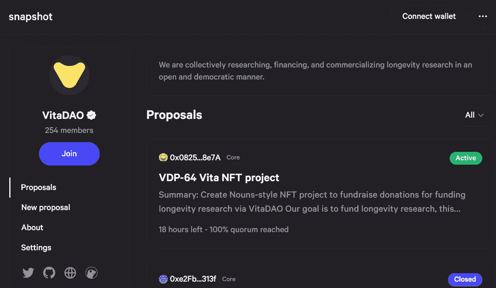
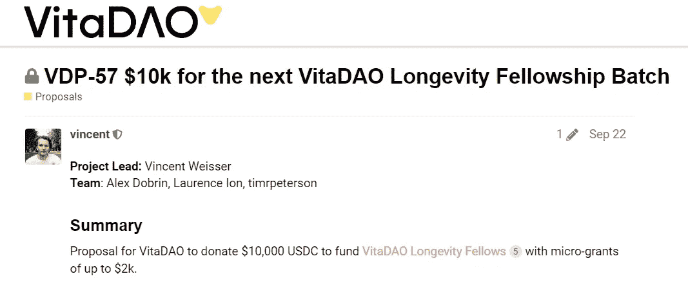
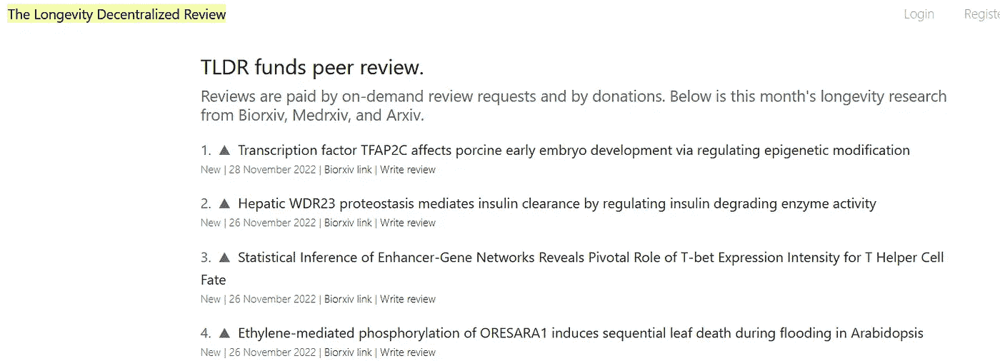
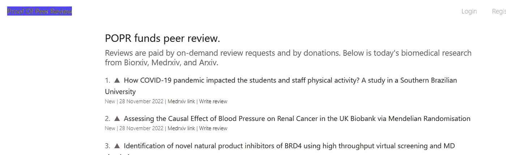

# 深入维他岛——引领德西景观

> 原文：<https://medium.com/coinmonks/deep-dive-into-vita-dao-leading-the-desci-landscape-1bfa2bbea9dc?source=collection_archive---------16----------------------->

VITA DAO logo

2021 年，我们看到了由政府刺激检查和其他几个因素引发的主要去金融化热潮，许多 web3 交易和投资成为头条新闻，显示了资本流动效应。在 2021 年末，我们看到 NFT 接管了市场，然后游戏工作室进入了这个领域，寻找带来更多效用的方法。很快，这股狂热停止了，随后在 2022 年年中发生了崩盘。

自始至终——有一个领域默默耕耘，带来了稳定的效用，并且在熊市中依然坚挺。这是 DeSci domaij，它试图利用区块链来进一步完成分布式“用户所有— xyz”的使命。

想象一下——你遇到一些人患有主流媒体不关注的疾病。它每年影响数百万人，而受影响者在治疗和药物上花费了数百万美元。出于很多原因，制药公司没有动力资助寻找这种疾病的治疗方法的研究——但你有动力，你想找到解决方案，同时也想在成功后得到回报。

你遇到了一群有着相似愿景的人，你提出了一个集体资助研究的计划。在这一点上，去中心化社区(DAOs——去中心化自治组织)和令牌化的本质开始浮现。

以前面的例子为例——同一组人组成一个 DAO 并分享单词 forward，其他几个匿名的人也加入进来支持这个任务。DAO 制定了一个计划，象征着整个研究和管理——资源和研究人员涌入，实验室出租——几个月后，一种可能有助于减少疾病影响的突破性药物被发现——DAO 申请了专利。接下来，由于对这种疾病的治疗有需求，制药公司希望使用专利药物来大规模生产它，因此需要从 DAO 获得许可。这种药物的每一次销售都会有大量的钱进入道的金库，早期的代币持有者会按照他们最初贡献的比例得到奖励。

这就是我们所说的分散化科学或 DeSci。DeSci 是一个很好的正和博弈的例子，每个人都从最终结果中受益，与传统的研究方法相比，区块链使整个过程更加有效。

这一领域的先驱之一是维他道。DAO 汇集了一群研究人员和投资者，他们有着不同层次的见解和经验，分享着同一个愿景——让人类长寿的治疗方法民主化。这是一个社区管理和分散药物开发的集体。生物制药领域已经被过度垄断，因此 R&D 更多的是利润驱动，而不是解决重大问题。除此之外，目前生物制药领域的领导者控制着大量专利，这使他们在管理市场上的药品价格方面拥有最终发言权。一种去中心化的方法是当下需要在更明智的人之间分配这种权利，这些人受到众多目标而不仅仅是利润的驱动。

传统的融资方式从来没有被让世界变得更美好或延长人类寿命的意愿所驱动，而是更倾向于以最具成本效益的方式大规模生产更稳定的治疗方法。它为大多数人服务，但同时也让这些制药公司在行业中占据上风，从而在其他较小的竞争对手面前确立自己的地位。

历史上，专利总是给选定行业的少数公司带来垄断权力，但 Dao 是这种情况的解决方案——一群远见卓识的人，他们不仅仅是为了金钱或权力，而是为了让每个人都更好。

Vita DAO 是不分等级的，允许任何有相似想法的人加入。这个集体孕育了思想的多样性和自由，这有助于轻松地从不同的角度重复不同的主题和建议。

Vita DAO 可以被视为一个理想的 DAO，所有与大小决策相关的资金流动或投票都是通过连锁投票完成的，在这里$VITA 持有者可以行使他们的权利来操纵 DAO。所有提案的快照可以在这里找到——[https://snapshot.org/#/vote.vitadao.eth](https://snapshot.org/#/vote.vitadao.eth)

Vita DAO snapshot page

最近的一项提议——VDP-64 维他 NFT 项目——旨在创建名词式的 NFT 项目，通过维他道为长寿研究筹集捐款。收益将只用于资助研究，根据快照，大约。70%用于此，30%用于小额奖学金、奖金等。所有收益将储存在一个单独的 multisig nft.vitadao.eth。

类似地，几个创新的和新的提议不断在 VitaDAO 快照页面上发布。其中一个很好的例子是 Logetivity 奖学金，例如，这张快照旨在为研究奖学金提供 1 万美元的资金，每个奖学金从 100 美元到 2000 美元不等。Vita 奖学金是由 Gitcoin 赠款发起的，其中许多著名的 web3 人物为二次基金捐款，包括 Vitalik、Stefan George 和许多其他人。这里是维他道团契页面——【https://www.vitadao.com/fellowship】T2

Vita DAO 还每月发布长寿研究通讯，旨在与订阅者分享研究和发现。11 月刊包括对 Gero 首席执行官 Peter Fedichev 博士的采访、长寿文献热点、长寿工作委员会和临床试验更新。你可以在这里阅读并订阅它们[。](https://vitadao.medium.com/)

TLDR — the Longetivity Decentralised review

Proof of Peer Review

DAO 还利用其社区开展按需付费同行审查服务:长寿分散审查( [TLDR](https://longevity.review) )和长寿研究和普通生物医学研究同行审查证明( [PoP 审查](https://proofofpeer.review))。

Vita DAO 也是其他 DeSci DAOs 的领导者，一些著名的名字包括 CRISPR DAO，Lab DAO，Athena DAO，genomes DAO，psy DAO，Bio DAO，Hair DAO 等等。"一体行动"对研究和研究资金的态度是一致的，同时在让成员参与倡议和"一体行动"提案方面也具有创造性。

所有与维他道相关的链接都可以在这里找到——https://barracuda.io/vitadao

快照—[https://snapshot.org/#/vote.vitadao.eth](https://snapshot.org/#/vote.vitadao.eth)

网站—[https://www.vitadao.com/](https://www.vitadao.com/)

> 交易新手？尝试[加密交易机器人](/coinmonks/crypto-trading-bot-c2ffce8acb2a)或[复制交易](/coinmonks/top-10-crypto-copy-trading-platforms-for-beginners-d0c37c7d698c)