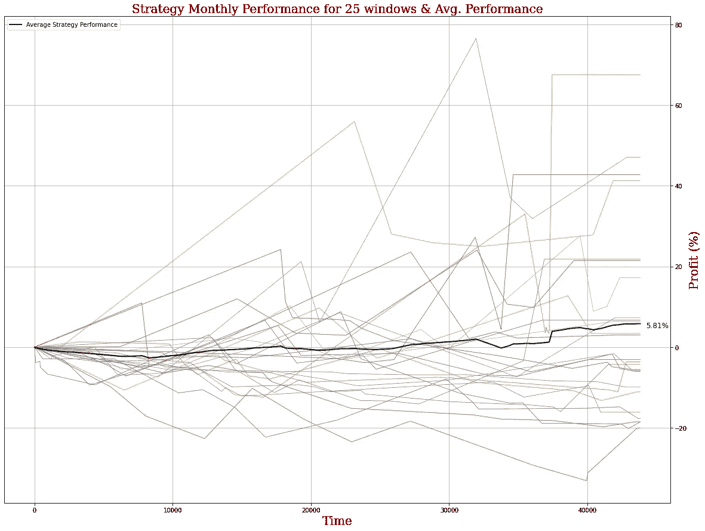
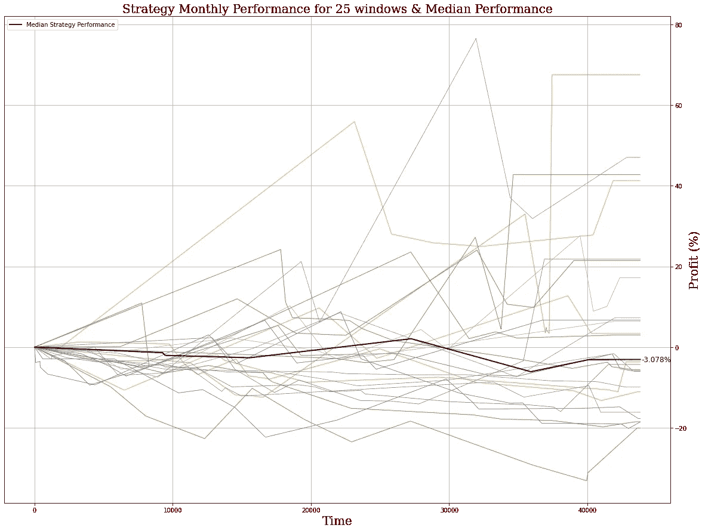
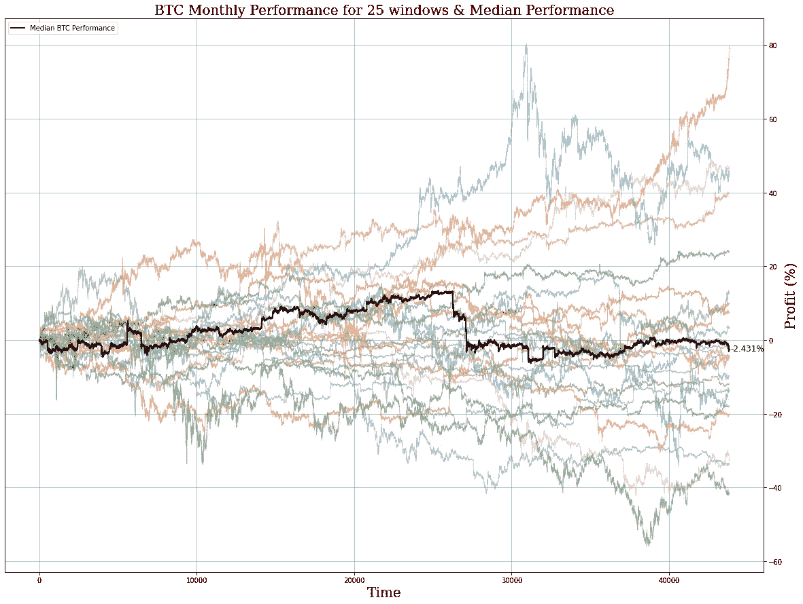
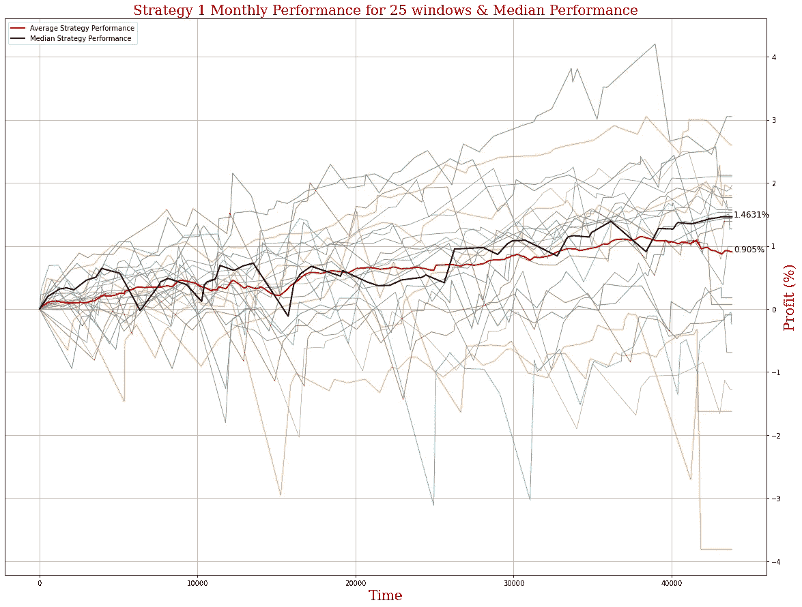
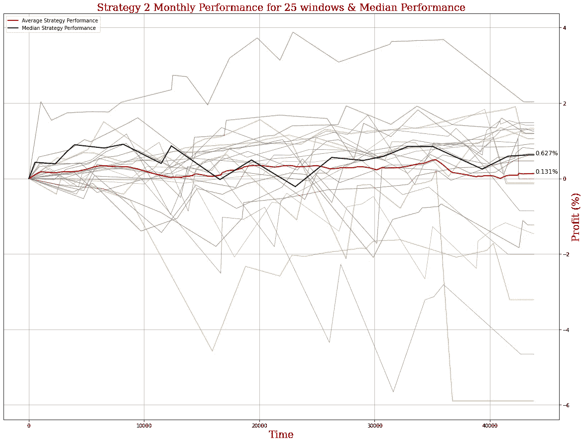

# 深入探讨(第二部分)——用统计数据分析你的交易表现

> 原文：<https://medium.com/coinmonks/deep-dive-part-2-analyzing-your-trading-performance-with-statistics-904ca152213c?source=collection_archive---------15----------------------->

这是评估交易策略系列的第二部分。对于第 1 部分，点击[这里](/coinmonks/deep-dive-analyzing-your-trading-performance-with-statistics-part-1-d8150e64e829)。

第 2 部分将讨论交易者在回测时犯的一些常见错误，哪些指标是“噪音”而不是“信号”，以及如何正确使用它们。

*注意:本博客中的任何信息都不应被视为财务建议。不要投资超过你愿意承受的损失。*

# **指标及其作用**

为了衡量我们的交易业绩，我们需要从任意数量的可用指标中进行选择，但是哪些指标最能说明问题呢？在之前的博客系列中，我们讨论了风险管理以及如何确定一笔交易是否值得进行，其中我们讨论了评估风险的几个指标。如果你还没有看过，这绝对值得一看。

但是当涉及到回测和评估性能时，我们需要的不仅仅是风险度量——我们需要性能度量。

这些指标需要告诉我们的不仅仅是我们假设的风险——我们需要知道我们的模型随着时间的推移表现如何，测试期间最好和最坏的情况是什么，它是否优于“购买并持有”方法，策略的波动性如何，等等。

正如第 1 部分所讨论的，跨多个时间框架和窗口进行回溯测试，以确保我们的模型不会因市场的长期上升趋势而产生内在偏差，这一点很重要。**从你的模型在众多窗口中的平均性能开始很诱人，但是使用平均值有一个很大的缺点。**

# 平均绩效与中值绩效

你们中的许多人已经知道这一点，但是一个系列的平均值会受到异常值的影响。例如，人们通常认为人口平均收入是评估“正常”个人一年收入的糟糕指标，因为一些人失业了，年收入为 0 美元，而另一些人足够幸运，年收入数百万、数千万甚至数亿美元。

这些异常值强烈影响平均值，但是为了了解“中间值”实际上是什么，我们想使用中位数*来代替。中值就像它听起来的那样——给定许多回溯测试结果，如果您将它们从最差到最佳性能排序，中值就是正好在中间的结果。*

在第 1 部分中，我们调查了我们策略的平均性能:

然而，我们取了所有策略的平均表现，它受到我们的策略获利的几次影响。即使用我们的眼睛，我们也只能看到有大量的窗口，在这些窗口中，我们的策略返回了回测窗口的损失。

当我们强调中值绩效与平均值绩效时会发生什么？

我们可以看到，如果您将所有结果从最低到最高排列，中间结果仍然是大约-3%的投资回报率。换句话说，模型有一半时间表现差于-3%，有一半时间表现更好。

这是什么意思？首先，这意味着我们在第 1 部分中谈到的“令人印象深刻的”5%的投资回报率实际上在我们开始进一步研究后就远没有那么令人印象深刻了。

"但是 BTC 的平均表现如何呢？"我能听到你在问。让我们来看看:

当着眼于 BTC 业绩的中位数时，买入并持有仍然是比我们的策略更好的选择。那么，我们的交易策略还有挽回的余地吗？

# 波动性作为一种衡量标准

让我们假设有一天你醒来，喝了一杯完美的咖啡，制定了一个出色的策略，其*中值*表现远远超过指数——是时候部署了吗？

嗯，取决于你的时间框架和你计划让你的机器人存活多久，你的策略的**波动性将对性能产生重大影响。**

如果你发现你的中值表现非常好，但是你的策略在盈利和亏损之间摇摆不定，你可能还不想部署。交易策略回报的波动性通常用标准差来衡量。

对于那些不熟悉的人来说，标准差是一组值中的变化量。为了计算一组回溯测试的标准偏差，我们首先确定一系列回溯测试的平均回报。

一旦我们有了平均表现，我们从每个窗口的结果中减去平均回报，然后求平方。

有了这些结果，我们将它们相加，除以回测窗口的总数(即取上述结果的平均值)，然后取平均值的平方根，得到标准偏差。**这个指标的好处在于，标准差与贡献数据的单位相同，因此，如果您以投资回报率百分比来衡量战略绩效的标准差，您的标准差也将以投资回报率百分比来衡量。**

如果你的策略标准差低，说明它的表现相对稳定，反之标准差高，说明表现无处不在。**让我们来看看前所未见的回测两种不同策略的中位数。**这些策略与我们之前见过的策略有着根本的不同，但在性能上却更加稳定。

Strategy 1’s median performance outperformed the mean, albeit only slightly, largely due to a few bad trades made towards the end of a few backtesting windows, weighing down the average performance.

Strategy 2’s performance was lower than Strategy 1, but was it more volatile?

我们可以看到，一种策略的大部分结果都集中在一个特定的范围内，而另一种则相当不稳定。这两种策略在运作方式上有着根本的不同，但其中一种似乎不仅表现更好，而且更不稳定。

策略 1 在 25 个窗口中的回溯测试性能的平均性能为 0.9%，标准差为 1.50%，而策略 2 的平均性能为 0.62%，标准差为 1.95%

但是这到底意味着什么呢？这意味着，对于策略 1，您可以假设大部分(如果您假设每个回溯测试的性能符合钟形曲线，则大约为 70%)回溯测试结果(因此可能是未来的结果)将是平均值的正负 1.50%，给出每月-0.60%到+2.40%的 ROI 窗口。

对于策略 2，窗口更宽，从-1.33%一直到 2.57%，这可能表明策略 1 将比策略 2 有更持续的正回报。

**在这种情况下，应该部署哪个？**这是你必须自己决定的事情，因为你必须决定你的风险偏好是什么([点击此处](/coinmonks/trading-journal-2-risk-management-part-1-764936e2d708)了解更多关于风险管理的信息)以及你的时间框架是什么。

在下一篇文章中，我们将开始更深入地探讨正确的回溯测试窗口选择，是否应该用替换进行回溯测试，以及这将如何产生我们最强大的工具之一:二项式测试，并估计未来的性能。

敬请期待！

与此同时，一定要看看 arc Taurus——一个用于构建加密货币交易机器人的自动化无代码解决方案。我们允许您构建和部署定制策略，而无需编写一行代码！查看我们的[网站](http://www.arctaurus.com/)和 [Linktree](http://www.linktr.ee/arctaurus) 获取更多信息，今天就开始建立强大的交易策略吧！

> 交易新手？尝试[加密交易机器人](/coinmonks/crypto-trading-bot-c2ffce8acb2a)或[复制交易](/coinmonks/top-10-crypto-copy-trading-platforms-for-beginners-d0c37c7d698c)