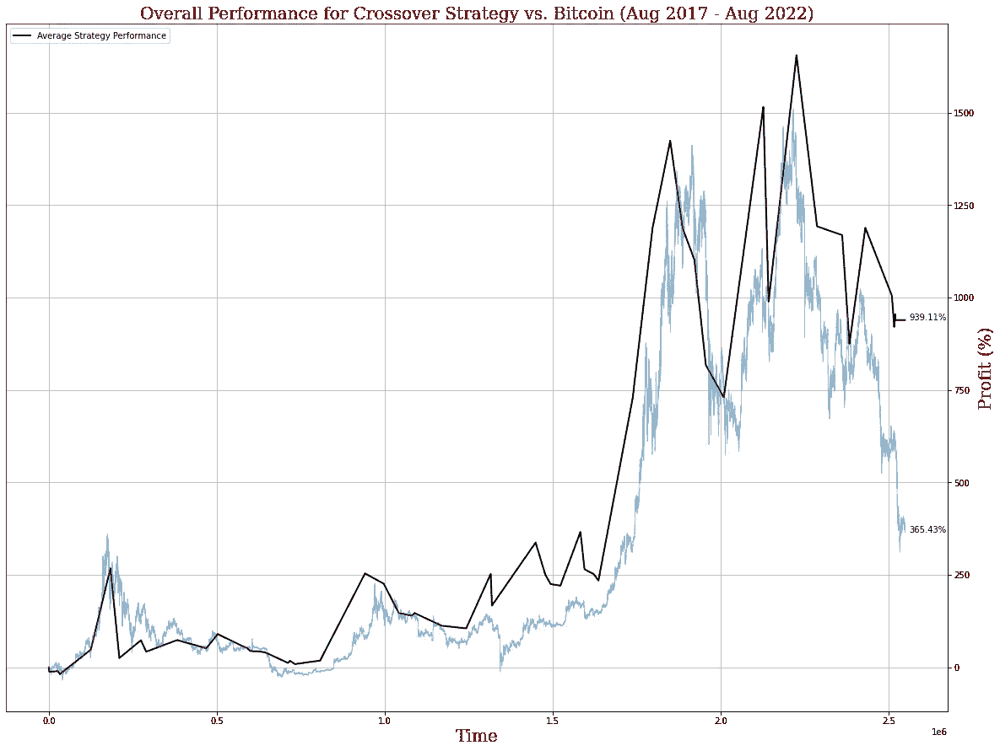
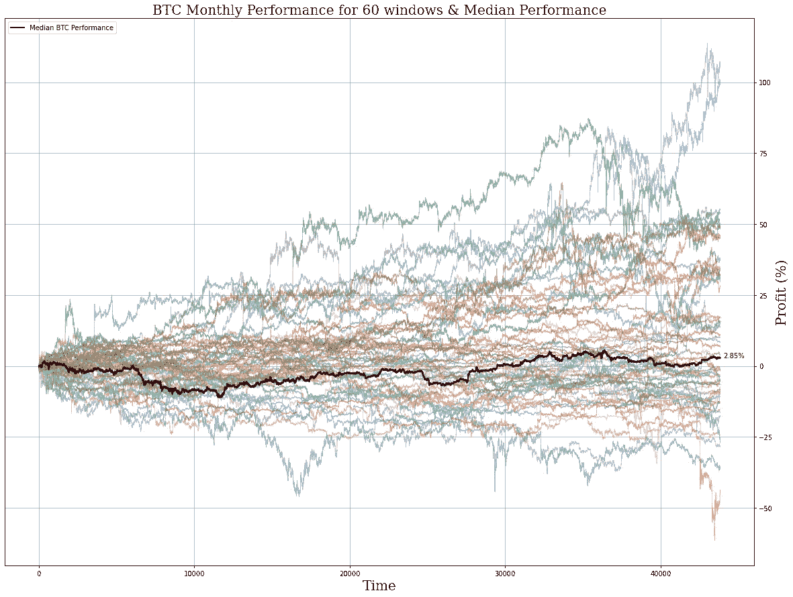
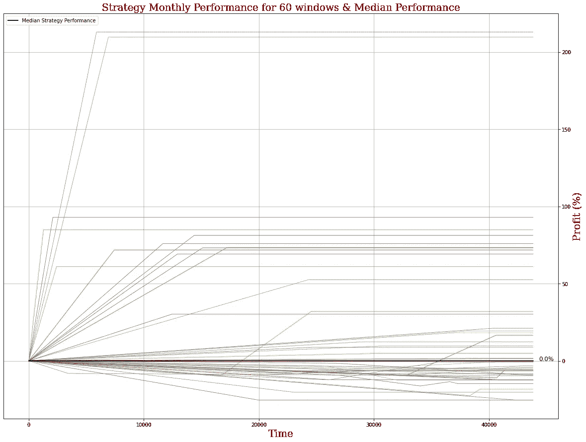
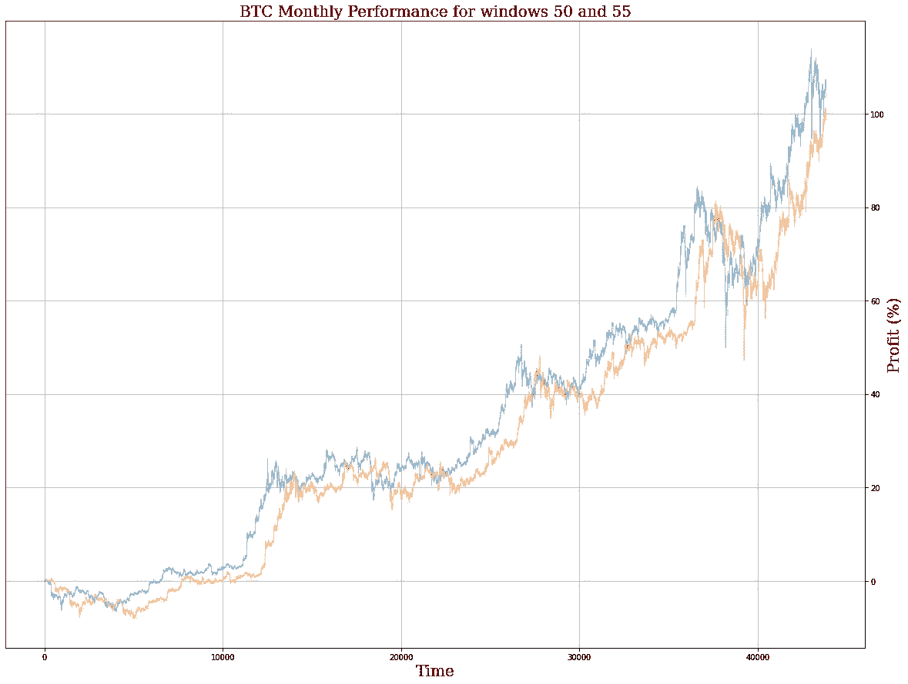
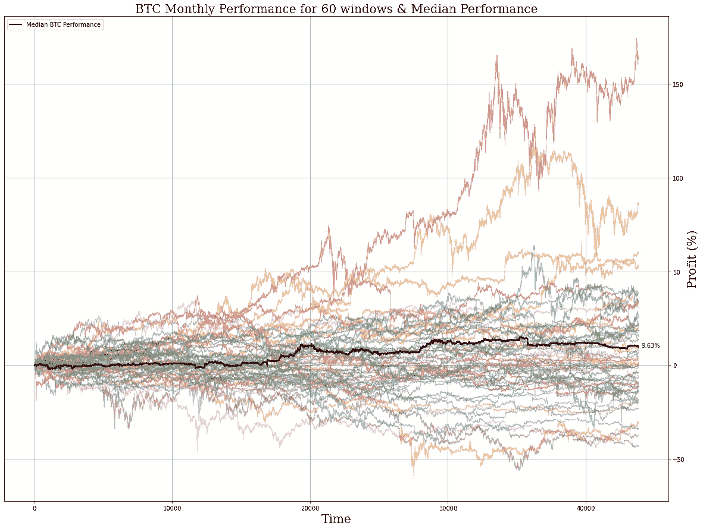

# 深入探讨(第 3 部分)——用统计数据分析你的交易表现

> 原文：<https://medium.com/coinmonks/deep-dive-part-3-analyzing-your-trading-performance-with-statistics-5d921d4aae23?source=collection_archive---------8----------------------->

第三部分——如何为你的交易机器人正确选择回溯测试窗口。

在这个深入探讨系列的第 3 部分中，我们将基于我们在第 1 部分和第 2 部分中所学的知识，特别是数据工程和选择。不，它远没有交易中有趣的策略设计元素性感，但它同样重要——如果你没有正确地回测你的策略，那么你的策略再优雅也没用。

在第 3 部分中，我们将讨论一个相对简单的概念——如何选择回溯测试窗口，以及每种方法的优缺点。

# 对整个数据集进行回溯测试

新算法交易者最常犯的一个错误是在他们的整个数据集上回测他们的策略。这乍一看似乎很聪明，因为想要了解你的策略在长期内的表现是很自然的。

然而，在有法定货币和内在通胀的资本主义市场中，我们知道，嗯，*所有东西*的价格从长期来看都会上涨——资本市场也不例外。换句话说，市场长期上涨。

**通过在很长的时间框架内进行回溯测试，你将资本市场的内在上升轨迹引入到你的测试环境中**，这比你在短期内看到的更有可能给你带来更好的结果。

例如，一个相对简单的基于移动平均线交叉的策略在过去 5 年中对比特币的表现出人意料地好:

然而，比特币固有的向上偏差传递到了模型上，除非你预计比特币在未来 5 年内有接近 400%的投资回报率，否则你可能不会让你的机器人运行那么长时间，在这种情况下，你会想在更短的时间内进行回测。

# 对随机选择的窗口进行回溯测试

在回溯测试中，下一个最常见的错误是从较大的数据集中随机选择较小的窗口。这确实比在整个数据集上进行回溯测试要好，但是**如果您使用统一的随机选择，您最终可能会遇到两个或更多窗口相互重叠的情况**，将该窗口趋势的偏差引入到您的模型中。

例如，我们的 BTC 数据集追溯到 5 年前，即 60 个月。让我们看一个例子，我们在随机选择的 60 个月中回测相同的策略，没有防止重叠。

Easter egg: since 60 is an even number, there is no median in this series. In this case, we took the “middle” two performances, and took the average of these two. It’s not an “exact” median but it serves for this example.

在本例中，我们将看到所有这些窗口的模型性能中值与 BTC 性能中值的对比。(参见上面链接的第 2 部分，了解我们为什么更喜欢中值性能的更多信息)

正如你所看到的，当我们开始将时间框架分解成更小的块时，我们的交叉策略的表现开始有很大的不同。有些 windows it 甚至根本不交易，你可以看到我们的中值性能是 0.0%。

然而，一些窗口显示单月投资回报率超过 200%,并且时间非常相似，表明一个非常有利可图的交叉事件几乎在同一时间发生。这两个窗口有明显的重叠吗？让我们检查这两个窗口的 BTC 性能:

正如我们所怀疑的，对窗口的随机选择导致我们对两个非常相似的窗口进行回溯测试，这两个窗口仅相隔几个小时。

为了消除这种风险，我们可以执行…

# 对均匀分布的窗口进行回溯测试

如标题所述，我们不是从数据集中随机选择窗口，而是选择需要多少个窗口，然后选择均匀间隔的窗口进行回溯测试。

通过均匀间隔我们的窗口，我们可以消除窗口重叠的风险——假设我们选择的窗口数量等于或小于我们数据集中此类时间帧的数量。

例如，我们的数据集包含 60 个月的 BTC 数据，因此我们不能超过 60 个月的时间窗来进行回溯测试，否则这些重叠将对我们的实验产生巨大的影响。

相反，让我们看看相同的策略与具有 60 个均匀间隔的窗口的 BTC 相比表现如何:

令人惊讶的是，BTC 实际上在 60 个均匀间隔的窗口中表现得更好，这表明实际上有更多的重叠窗口表现不佳。

我们的战略表现如何？

我们的策略仍然只有 0.0%的中值分数。当然，这是一个非常基本的策略，但是如果您将它与随机窗口进行比较，**您将会看到大多数窗口在性能方面的方差要低得多，这表明我们的策略之前受到了重叠窗口的影响。**

因此，我们可以肯定地说，选择非重叠窗口将使我们更准确地了解模型的真实性能。通过均匀地间隔回测窗口，使零重叠发生，您仍然可以在整个数据集上测试您的策略，同时更清楚地了解它在更短的时间内将如何执行。

在我们的下一篇文章中，我们将开始深入研究统计分析的一些原则，以及我们如何在更准确地解释回溯测试结果的同时，构建更稳健的实验。

**与此同时，一定要看看 ArcTaurus，**这是一个用于构建加密货币交易机器人的自动化无代码解决方案。我们允许您构建和部署定制策略，而无需编写一行代码！查看我们的[网站](http://www.arctaurus.com/)和我们的 [Linktree](http://www.linktr.ee/arctaurus) 了解更多信息。

> 交易新手？尝试[加密交易机器人](/coinmonks/crypto-trading-bot-c2ffce8acb2a)或[复制交易](/coinmonks/top-10-crypto-copy-trading-platforms-for-beginners-d0c37c7d698c)