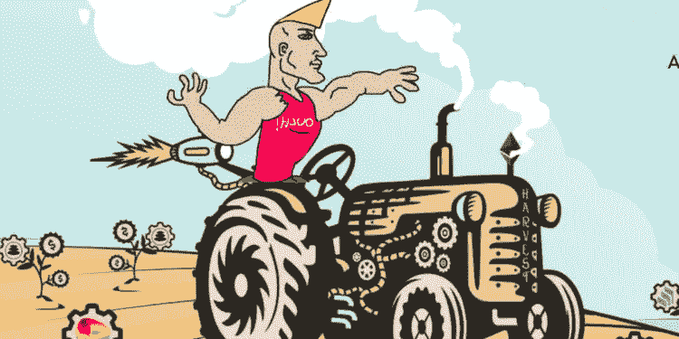
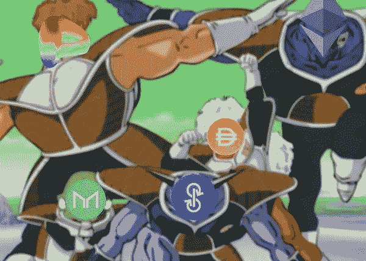
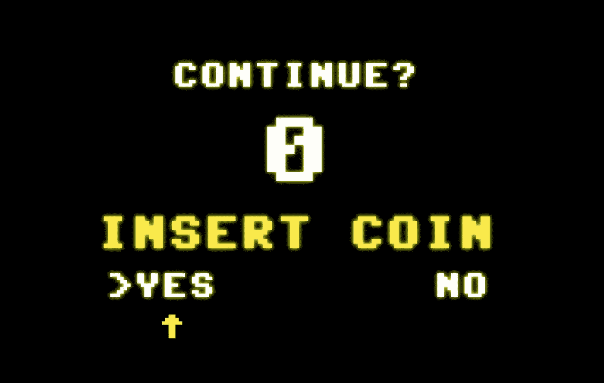

# DeFi 101:象征性奖励和高产农业

> 原文：<https://medium.com/coinmonks/defi-101-token-rewards-and-yield-farming-e0b1c99c4059?source=collection_archive---------22----------------------->

# DeFi 初学者指南

*迪法研究公司分析师吉姆·佛朗哥*

## **什么是 DeFi？**

DeFi 是“分散金融”的缩写，指的是 Web3 中的一个新的金融行业。

DeFi 协议为用户提供了你期望从银行或经纪公司获得的所有金融服务，除了没有集中的管理机构。这包括用户存款计息、借贷等功能。DeFi dApps(去中心化应用)使用智能合约来促进交易，而不是银行家或经纪人。

DeFi 也不会要求用户提供 KYC(了解你的客户)信息。相反，这些协议根据不同的加密钱包地址来识别用户。要使用 DeFi dApp，您需要做的只是连接您的加密钱包，以利用各种服务。

**听起来不可思议，对吧？但是有什么问题呢？**

嗯，这不是很直观。单独创建一个 metamask 钱包对初学者来说是一个挑战，大多数人仍然不熟悉传统的金融服务。

它有一个陡峭的学习曲线。然而，我们相信 DeFi 是 Web3 经济的一个关键支柱，并且可能会影响我们未来如何转移价值。

但是为什么要 DeFi 呢？

最近集中密码交易所(FTX)的恶作剧表明，DeFi 是正确的道路。由于信任像银行这样的中央集权实体，人们已经损失了数十亿甚至数百万美元。请记住，如果您不拥有自己的私钥，它们就不是您的资产。传统上，银行完全控制你的钱和账户。

秘密精神试图将我们从这种现代奴役中解放出来。人类不是被设计来每天为某人工作 8-10 个小时的。人生苦短。我们应该花更多的时间和家人在一起，追求我们的激情。

这就是为什么我们想让人们加入 DeFi。

*   获得银行和企业对我们隐瞒的强大金融服务。
*   完全控制我们的资产，任何人都不能拿走。

**什么是 DeFi 令牌？**

它与迷因币、比特币等有何不同。🤔

DeFi 代币是与特定 DeFi 项目相关联的加密货币。这些令牌通常服务于每个 DeFi 协议生态系统中的特定使用情况，将其归类为**“实用令牌”**

与硬币或安全令牌不同，实用令牌应该在各自的协议中服务于特定的目的。另一方面，DeFi 令牌通常在其相关联的 dApp 中服务于一个目的。

**插入硬币/代币**

Wait, you mean I can use these tokens to gain something through dApps?

是啊！DeFi 代币就像你用来玩街机游戏的硬币。

每个 dApp 由其本机实用程序令牌提供支持，这些令牌主要用于以下应用:

*   **流动性池奖励**
*   **交易费用**
*   **治理权限**
*   **抵押品**
*   **通过赌注分享收入**

DeFi dApps 或协议，也被称为“金钱乐高”，是开源的，允许它们相互通信。由于这种性质，这些协议可以从彼此的代码和实用程序中获益，从而产生协同效应。

而且，你猜怎么着？实用令牌加强了这些协议之间的联系。

**DeFi 协议的类型**

DeFi 协议在响应智能合约功能方面是独特的。也就是说，每种协议都有不同的用途。

现有的大多数解决方案都集中在:[指数](https://defillama.com/protocols/Dexes)、[借贷](https://defillama.com/protocols/Lending)、[收益](https://defillama.com/protocols/Yield)、[液体赌注](https://defillama.com/protocols/Liquid%20Staking)、[收益集合器](https://defillama.com/protocols/Yield%20Aggregator)、[算法稳定器](https://defillama.com/protocols/Algo-Stables)、[合成品](https://defillama.com/protocols/Synthetics)、[博彩](https://defillama.com/protocols/Gaming)、[衍生品](https://defillama.com/protocols/Derivatives)、[交叉链](https://defillama.com/protocols/Cross%20Chain)、 [NFT 市场](https://defillama.com/protocols/NFT%20Marketplace)等等，等等，等等，有太多太多的事情要谈。让我们把它留到下一篇文章中吧！

现在回到农场..

## 产量农业是什么鬼？

农业是 DeFi 中常用的一个术语，特别是在与稳定币相关的类别中，指的是在协议中的资本投资，以赚取被动收入。

大多数 DeFi 协议通常在协议收入的基础上提供额外的激励来吸引新用户。这鼓励用户采用，并成为 DeFi 行业标准。

我可以在哪里获得奖励？

*   **在流动性池中—** 作为流动性提供者，您通常会获得由 LP-Token 代表的流动性池份额。在许多协议中，如 Uniswap 和 Curve Finance，除了正常的 LP 费用之外，您还将获得协议令牌奖励。
*   **在借贷市场—** 作为对出借资产的激励，协议以治理令牌的形式分发额外的奖励。在一些协议(如 Comp 和 Aave)中借出时，您会收到一个计息令牌，如 cDAI 或 aUSDC。
*   **通过赌注—** 赌注意味着将您的加密资产委托给智能合同，以换取奖励和被动收入。可替代代币或不可替代代币(NFT)是可以下注的资产，回报通常对应于赚更多的钱。

如果你是一个空间的新手，你必须谨慎从事，当谈到农业令牌奖励。

象征性激励不会产生收入或收益。相反，这是一种膨胀机制，大多数协议都牺牲这种机制来吸引和留住用户。

最后一节，我们来讨论 DeFi 中最热门的趋势。

## 什么是真实收益率？

DeFi 协议已经产生了数百万美元的收入，并且在过去几年中，其使用和采用有了惊人的增长。然而，我们已经看到了对某些协议的令牌经济学的怀疑，这导致了以散户投资者为代价的大规模价值破坏。

这产生了改进的令牌设计，例如真实产量。

符合“实际收益”的项目不需要通胀排放来保持相关性。专注于实际收益的加密项目的增长取决于它们积累新用户和随着时间的推移增加收入以回报代币持有者的能力。

**实际收益率类似于股票分红，用户可以获得直接的经济利益，比如获得现金流的权利。具有费用共享或收入共享机制的协议有助于用户对一般的加密空间，尤其是 DeFi 有更积极的看法。**

**如何确定真实收益率？**

一个真正的收益协议产生的收入比它在令牌发行和运营成本上花费的要多。像任何可持续发展的商业模式一样，该协议的收入应该大于支出。

要确定哪些项目会产生实际回报，您必须使用像 Token Terminal 这样的 DeFi 财务分析工具。

我已经写了一个导航平台的指南，以找到具有实际收益的协议，并与令牌持有者分享收益。[https://bit.ly/tokenterminal](https://bit.ly/tokenterminal)

# 好的，现在就这些。我们在 DeFi 世界再见！

