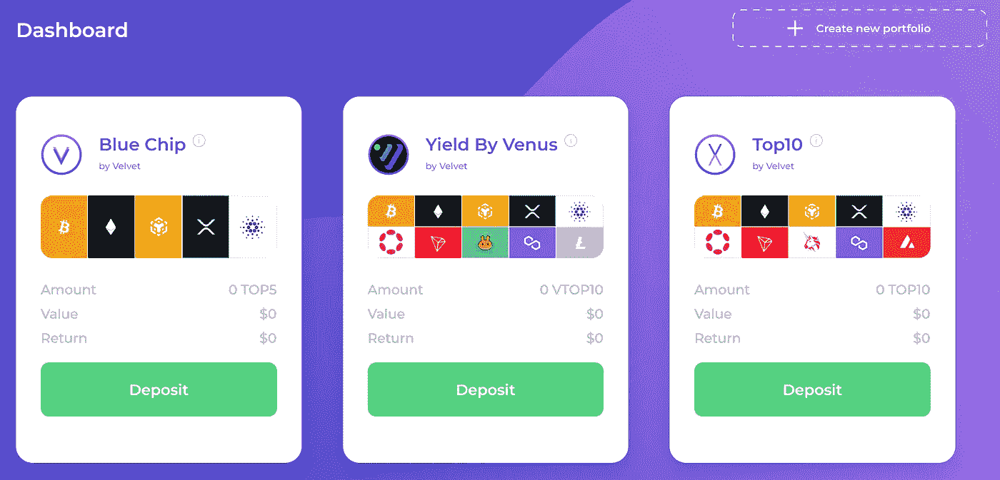
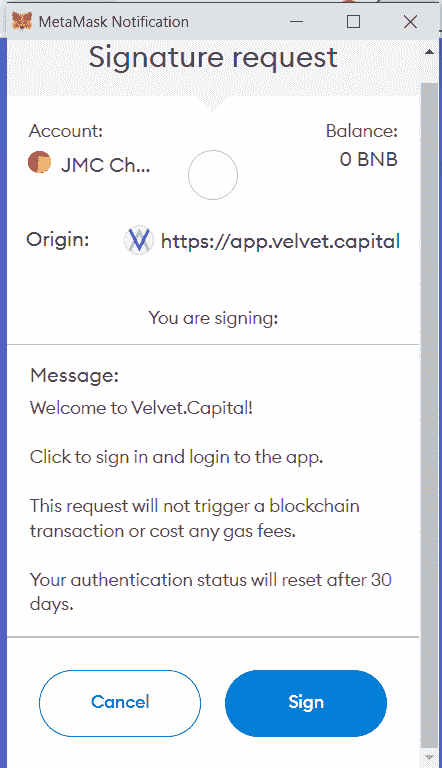
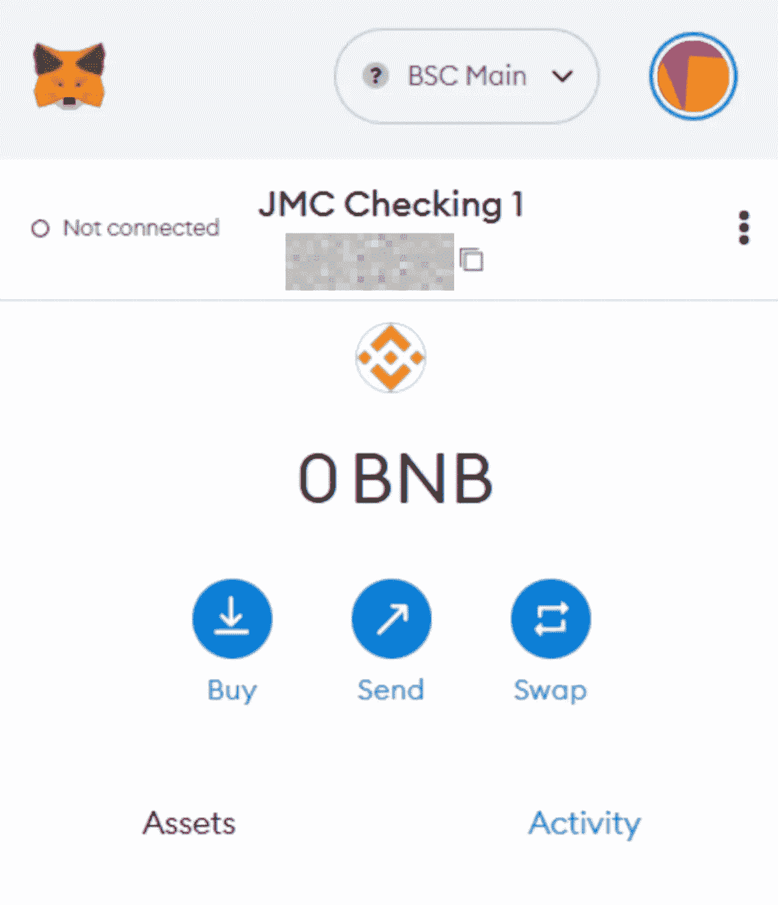
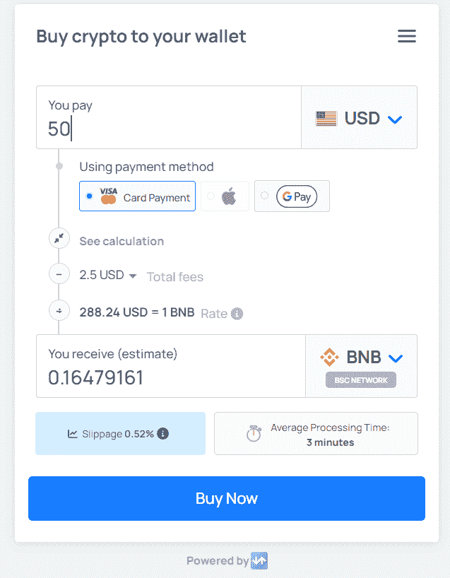
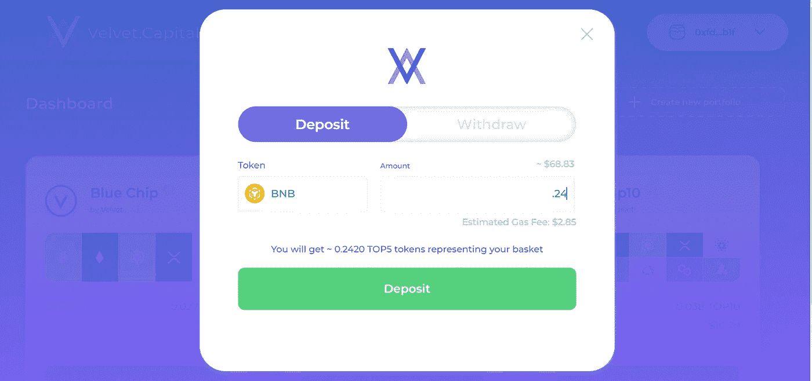
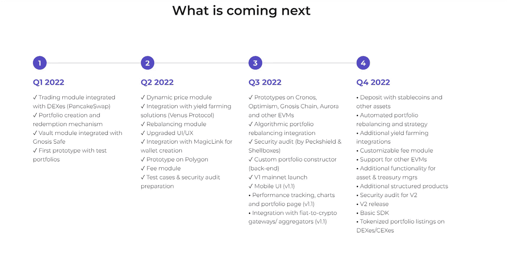

# DeFi 资产管理:天鹅绒入门。资本

> 原文：<https://medium.com/coinmonks/defi-asset-management-getting-started-with-velvet-capital-7bc24697e687?source=collection_archive---------5----------------------->

Getting Started Demo

# 问候:朋友，敌人，友敌&外星人！

## 我们带来了来自天鹅绒之国的消息。资本！

对每个人来说，从新手到新手，再到 Chads 中的 Chaddest-DeFi 可能会很难，有点吓人！这就是为什么在[天鹅绒。Capital](https://velvet.capital/) 我们的使命是让 DeFi 比以往更简单、更安全、更直观。我们上周和我们的 V1 一起去了[现场，并且想要开始登上你们所有美丽的面孔。](/velvet-capital/velvet-capital-goes-live-defi-just-got-a-whole-lot-simpler-safer-cf509c86ce7d)

我们努力使您的投资组合管理尽可能直观和交钥匙。然而，我们知道入职是多么令人生畏，尤其是对新手来说。这就是为什么我们为所有的 DeFi 先锋伙伴创建了这个简短的指南(包括一个关于如何用 Metamask 购买 BNB 的有奖游戏)。

点击这里，深入了解我们提供的第一批产品[。](/@velvetcapital/7e2901a1220d)

# 希望本教程能有所帮助:

1.  前往[https://velvet.capital/](https://velvet.capital/)并点击主屏幕上的“启动应用程序”按钮。这应该会将您重定向到[https://app.velvet.capital/](https://app.velvet.capital/)。
2.  在左上角，你应该会看到一个“仪表板”，上面有三个独特的投资产品:“蓝筹股”、“Venus Yield”和“前 10 名”(很快会有更多的介绍😊).

3.要存款，首先，你需要连接你的钱包。在同一页面上，点击右上角的“连接钱包”。我们目前集成了“Metamask”(更多选项即将推出😊).如果您还没有元掩码钱包，可以使用下面提供的链接来创建它。

4.应该会出现一个弹出窗口，显示“使用元掩码连接”单击此按钮会将您重定向到一个弹出窗口。选择“签名”选项将元掩码连接到 dApp。

**5。提示:如果您没有元掩码，请点击此链接下载:**[**https://metamask.io/download/**](https://metamask.io/download/)**。**

# 如何在 Metamask 上购买 BNB

1.  既然您的钱包已经设置/连接，您将需要 BNB 存款。

2.现在，您应该在 web 浏览器上安装了元掩码钱包插件。

3.在你的钱包里，点击“购买”从下拉菜单中，你会看到三个选项:“交易、月付和直接存款。”您可以使用 Transak 或 Moonpay 通过信用卡/借记卡购买 BNB，并存入您的 Metamask。

4.对于 Transak，您将被重定向到他们的网站。将金额放入您想要购买的首选货币中，并将其转换为您选择的货币。例如，我可以购买价值 50 美元的 BNB。

5.交易确认后，您将收到钱包中的 BNB。

6.从仪表板中选择您要存入的一只或多只基金。输入您要存入的 BNB 金额，然后点击“存款”

# &你们都完了，法国人！像 A-B C 一样简单，1–2–3。

They said it — not us.

# 加入我们建设 DeFi 的未来！

别忘了在 [Twitter](https://twitter.com/Velvet_Capital) 、 [LinkedIn](https://www.linkedin.com/company/31423126/admin/) 上关注我们，并加入我们的[Discord](https://discord.gg/heXYgFZuGw)&[Telegram](https://t.me/velvetcapital)了解更多更新！我们希望听到你的声音，不要害羞。

直到下一次，

干杯！

天鹅绒。Capital 是一个跨链的 DeFi 资产管理协议，帮助个人和机构(DeFi 即服务)创建令牌化的指数基金、投资组合和其他具有额外收益的金融产品。我们的可定制投资组合跨链和生态系统运作，以提供最广泛的市场暴露。我们利用现代投资组合理论和高度审查的产量农业来放大你的回报。

欲了解更多信息，请访问[https://velvet.capital/](https://velvet.capital/)，或发送电子邮件至 info@velvet.capital

###

> 交易新手？尝试[加密交易机器人](/coinmonks/crypto-trading-bot-c2ffce8acb2a)或[复制交易](/coinmonks/top-10-crypto-copy-trading-platforms-for-beginners-d0c37c7d698c)