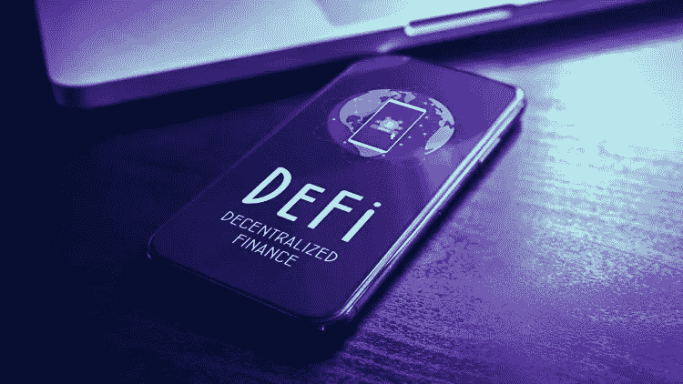
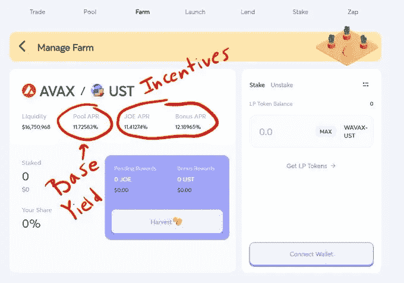
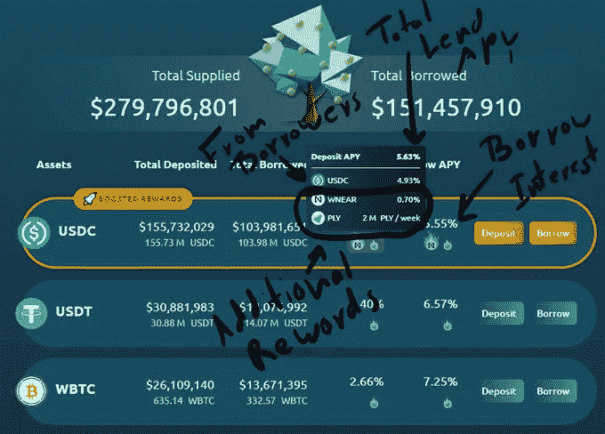
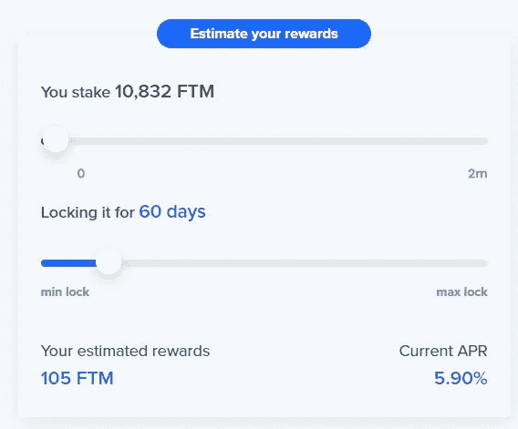

# DeFi 课程:初级(第 1 部分)

> 原文：<https://medium.com/coinmonks/defi-course-beginner-level-873870d74400?source=collection_archive---------38----------------------->

在我的上一篇文章中，我为集中化和分散化之间的主要区别奠定了基础。

现在，我想更进一步，为大家提供一个关于 DeFi 的课程，从最低到最高级。我们将发布一系列文章，涵盖进入分散化金融所需了解的每个概念，因此让我们开始吧。

在本文中，我们将介绍要解决的前两点:

1.  **什么是高产农业？**
2.  **DeFi 的收益率从何而来？**

> **什么是高产农业？**

在它最纯粹的形式中，收益农业就是:管理被动策略，通过将资金借给第三方来从加密货币中赚取回报。在这一节中，我们通过一个基本的经济学解释来考察产量农业。我们特别要问两个问题:

➖ *收益率农民创造了哪些核心价值，他们因此得到了补偿？* ➖ *谁来支付报酬，是明示还是暗示？*

大多数产量耕作战略以被动和授权的方式从事五种基本类型的经济活动:

*➖他们支持网络运营，比如交易验证。
➖用户向交易商提供贷款。
➖用户向代币持有者提供流动性。
➖他们参与协议的管理和治理。
➖用户增强协议的营销力度。*

下面，我们将详细介绍其中的每一项:

1.  **操作网络:**密码学最基本的功能就是正确、安全地操作网络。这是由节点运营商(通常称为验证者)完成的，他们处理交易以交换网络本地令牌上的支付。反过来，第一种重要的收益耕种形式是用户将代币委托给高质量的验证者，即具有可靠和诚实表现的验证者，以换取收益分成。
2.  **向交易者放贷:**21 世纪 20 年代中期，被称为“Defi Summer”的分散式协议爆发，极大地改变了加密货币的放贷活动。在此之前，贷款主要依赖于大型集中机构，但自 2020 年以来，一波新的分散化协议浪潮允许个体商户参与广泛的贷款活动。因此，第二种主要形式的产量农业是第一种的推广。交易员可以将加密货币头寸借给任何人，而不仅仅是借给验证者。具体而言，收益率较高的农户将代币投入资金池，借款人使用适当的抵押品自动从资金池中借款。
3.  **提供流动性:**这是产量耕作的第三种主要形式。用户将加密货币头寸存入流动性池(称为“自动做市商”或 AMMs)。因此，这里的回报来自交易费(直接从兑换 dex 上的代币收取的佣金中收取)，因为由于成为流动性提供商，你有助于用户能够以完全分散的方式兑换代币。
4.  **管理和治理:**用户可以通过驱动以被动和授权方式管理令牌的集群系统来提高性能。例如，凸协议在通过流动性基金引导曲线平台上的流动性方面取得了巨大成功。收益农民可以直接在曲线上提供流动性，也可以通过凸曲线提供流动性。在这两种情况下，他都会因为提供流动性而获得回报，但在后一种情况下，他会因为更高效地提供流动性而获得额外的回报。
5.  **营销:**最后，产量农业让协议利用了一个关键而实用的想法:大数字就是大营销。特别是，协议的 TVL(“总锁定价值”，即分配的资产)越多，它吸引的关注就越多，获得的信任就越多，它就越有可能成为拥挤领域的领导者。LTV 也可以影响协议的感知价值。为了在系统内保持这种价值，协议通常会用一些激励措施来奖励非流动性。例如，协议要求用户购买和阻塞令牌以换取令牌分发，阻塞时间越长奖励越高。

尽管有许多不同的方法和风险，产量农业本质上是一个简单的概念:用户被动地为协议提供价值，以换取直接和间接的补偿。

> **DEFI 中的收益率从何而来？**

Defi 的性能来自于底层协议的价值。用一个产生性能的协议锁定你的钱，就是赌这个协议本身是有价值的。

*➖性能机制:*

➡ **Dex/AMM:** 分散式交易所(Dex)和自动做市商(AMM)是收益率生成协议最成熟的例子。从根本上说，这些协议中的流动性池的表现来自交易费用。他们的工作方式如下:
流动性提供者将其有限合伙人存入流动性池。这里的目的是让交易者在没有中介的情况下交换代币，并且通过促进这种交换，他们可以获得协议为此类交换产生的交易费用的一部分。

⚫ **Dex/AMM 示例:**曲线、Uniswap、平衡器、Pancakeswap 等。

Platforms generally offer proprietary tokens in addition to trading fees to incentivize the provision of liquidity for particular groups. Farm tokens (such as JOE, TraderJoe token, a Dex on the Avalanche network) are inflationary and tend to decline as they are sold for maximum yield.

➡ **借贷协议:**与 DEX/AMMs 不同，这里的流动性是以债务的形式提供的，而不是销售。用户可以将资金存入贷款池，以换取固定或可变的利息。另一方面，借款人可以将他们的资产作为抵押品，并以任何其他资产为抵押借款。

**⚫借贷协议示例:** Aave、Maker、Compound 等。

Lending platforms generate yield from borrowers, but can also pay in a proprietary token (such as JOE above). Borrowers pay interest on their loans, a portion of which is paid to lenders.

➡ **下注:**下注，从真正的意义上来说，就是冒着资产价值损失的风险来换取潜在的价值增长。赌注如何产生回报的一个最佳例子是 ADA、SOLANA、ATOM 和 FANTOM 等连锁店采用的赌注证明(POS)机制。

By locking your assets with a validator you get returns by contributing to the security of the network.

➡ **收益优化器:**收益优化器使用一些机制来获取你的资产，执行各种操作，并最终返还给你更多的资产。

**⚫优化者的例子有:**牛肉金融，渴望金融，Yieldwolf。

➡ **衍生产品:**在衍生产品的情况下，回报来自于对一项资产交易的风险承担，该交易预计会出现某种价格波动(期货就是一个明显的例子)。

**⚫衍生产品的例子:** Dopex，Dydx，Gmx

➡ **治理:**治理令牌授权协议持有者通过提案和投票参与 defi 协议的治理。治理令牌类似于公司的股份。理论上，他们有权分享协议的现金流，并对协议拥有决策权。

> **结论**
> 
> 由于 Defi 中的性能来自协议的价值，因此您在这里的工作是确定协议的内在价值。

> 交易新手？试试[加密交易机器人](/coinmonks/crypto-trading-bot-c2ffce8acb2a)或者[复制交易](/coinmonks/top-10-crypto-copy-trading-platforms-for-beginners-d0c37c7d698c)