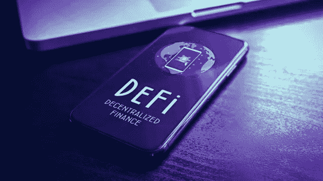
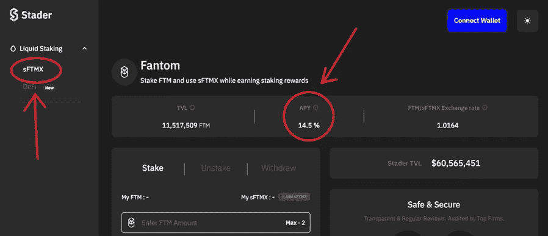
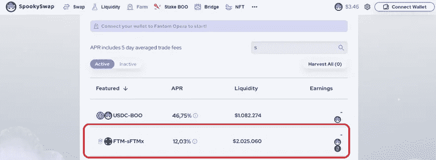
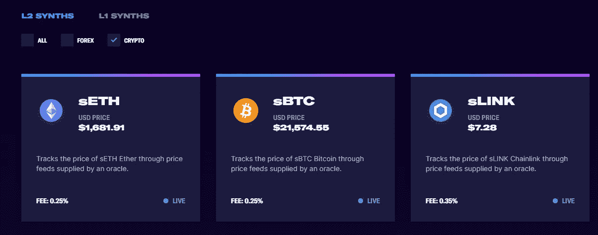

# DeFi 课程:中级

> 原文：<https://medium.com/coinmonks/defi-course-intermediate-level-b7dbda69c46e?source=collection_archive---------20----------------------->

大家好！我最近开始了一个名为“DeFi 课程”的系列，其中我们已经涵盖了“初级水平”。

在本文中，我们将更进一步，涵盖“中级”水平。我们接下来将讨论的概念是:

1.  **包裹代币**
2.  **液体打桩**
3.  **合成代币**
4.  如何跟踪你的 DeFi 投资？
5.  **有用的网站**

> **包裹代币**

包装令牌是另一种加密货币的令牌化版本，它锚定于它所代表的资产的价值。它通常代表一种不存在于发行区块链上的资产。包装令牌通过允许非一个区块链本地的资产在另一个上可用来提高区块链的互操作性。

## 包装令牌是如何工作的？

包装令牌通常需要托管人(持有相当于“包装”版本的资产数量的实体)，该托管人可以是多签名钱包、DAO 甚至智能合约。因此，在 WBTC(BTC 的“包装”版本)的情况下，托管人必须为每个铸造的 WBTC 拥有 1 个 BTC。
假设您要向 ETH 网络发送比特币，创建包装令牌的流程工作方式如下:

*➖* 用户将 BTC 从原产地链发送给保管人(在本例中是智能合同)。
*➖* 智能合约在目的网络 ETH 网络上阻塞原始 BTC 和‘mints’(mints)wbtc。

要反向执行该过程，即“解开”WBTC 以将其从以太网网络再次发送到 BTC 网络，该过程将如下:

*➖* 用户向托管人(智能合约)发送“刻录”请求。
*➖* 一旦“烧录”请求完成，WBTC 就会被发送到智能合约。
*➖最后，原始 BTC 在起源链上被释放(先前为了在 ETH 网络上“铸造”令牌而被阻止)。*

*原则上，整个过程可能看起来非常复杂，这是对该过程如何在技术层面上工作的解释，但我们作为用户不必担心手动执行整个过程，有 dapp 来处理它，最终我们要做的就是使用 dapp 来执行整个过程，并简单地将我们想要发送的令牌量从一个链发送到另一个链。*

> ***液体打桩***

*流动赌注是用于赌注的代币数量的表示。流动赌注为赌注者开辟了一系列投资机会，因为它允许创造额外的令牌化资本，这些资本可以在其他 DeFi 协议中重新部署，例如用于产量农业。为了更好地理解 Stader Labs 协议，我们在 Fantom 网络上看一个例子:*

**

*When staking Fantom on this platform, as we can see in the image, we will get an Apy of 14.5%, in turn, if we look at the left panel, below liquid staking, we can see the name ‘sFTMX’.*

*sFTMX 是我们在这个平台上下注 Fantom 获得的流动令牌。我们得到了什么？好吧，一方面，我们得到 14.5%的年利率，仅仅是因为下注 Fantom。另一方面，sFTMX 是一个流动令牌(代表我们在平台上下注 Fantom 的令牌数量)，我们将能够将其转到另一个 dapp，允许我们使用它来产生额外的性能，例如，spooky swap(Fantom 网络中的一个 Dex)。*

**

*As we can see, in this platform, with sFTMX we could form a FTM-sFTMX LP and obtain an extra 12% APR, in other words, performance over performance. This is just an example of what liquid staking allows us to do, as we have seen, it is an excellent way to take advantage of the capital we have in staking and be able to get a superior performance.*

> ***合成代币***

*合成资产本质上允许投资者标记和交易任何东西。通过使用衍生工具将价值与现有资产联系起来，然后为这种衍生工具创建一个令牌，投资者可以很容易地在区块链交易任何东西。
这些资产旨在促进对不同资产或商品的风险敞口，而不必处理诸如保管、维护或管理所代表的资产的其他需要等问题。所有这些都没有放弃所代表的资产的潜力，如其价值、流动性或在世界范围内的广泛接受度。*

**

*Synthetix is perhaps the best known platform for the issuance of synthetic tokens, as shown in the image, we can expose you to the price of different assets without buying them directly.*

> ***如何跟踪您的 DEFI 投资？***

*DeFi 市场是最有利可图的投资场所之一，但对于新手来说，这个空间可能是巨大的。研究和跟踪你的投资可能会很困难。这就是为什么建议使用各种可用的 DeFi 工具。在 DeFi 协议中监控资金是至关重要的。因此，让我们来看看投资者应该知道的一些最好的 DeFi 工具。*

*⚫ **Zapper**
Zapper 是一款为 DeFi 打造的简单仪表盘。DeFi 工具允许通过一个界面轻松查看和跟踪所有 DeFi 资产和负债。本质上，它侧重于产量农业和流动性。*

## **显著特点:**

*➡使用协议分配工具查看 DeFi 的位置百分比。
➡更容易跟踪 DeFi 产品的债务，并了解哪些头寸需要补充。
➡允许用户通过投资回报评估来跟踪职位绩效。*

*⚫ **德班克**
德班克也是一个钱包追踪器。该工具专注于 DeFi 协议的数据部分。它向用户提供有关他们参与的每个交换和协议的信息。*

## *显著特征:*

*➡ It 允许用户通过大量区块链和数百种 DeFi 协议监控他们的钱包。
➡该平台提供各种 DeFi 资产的实时价值。
➡ It 提供广泛的资产数据和分析。它包括有关贷款协议、不同的 DeFi 交易所、稳定货币和保证金交易平台的信息。*

*⚫ **Apy。视觉***

*APY。Vision 旨在成为流动性池提供商和收益农民的基准分析和监控工具。*

## *显著特征:*

*➡它提供投资流入和流出头寸的信息分析。
➡ It 可以生成数据来分析非永久性损失与持有收益。*

> ***有用的网页***

***⚫**[**https://defillama.com**](https://defillama.com)*

*在 DeFi 指标方面被认为是卓越的网站，Defillama 是一个提供全球最大连锁企业概况、DeFi 市场总价值及其 Dapps 整体以及许多其他数据的网站。*

***https://coindix.com**[**⚫**](https://coindix.com/)*

*它被许多人认为是过滤 DeFi 中不同协议提供的 apy 的最佳网页。*

***https://dailydefi.org/tools/impermanent-loss-calculator**[**⚫**](https://dailydefi.org/tools/impermanent-loss-calculator/)*

*这是一个网页，允许我们以简单的方式计算 IL。我们可以进入不同的场景来估计在某些场景中 IL 会如何影响我们。*

***[**https://www.aprtoapy.com**](https://www.aprtoapy.com/)***

***一个允许我们将 APR 转换成 APY 的网页(记住 APY 考虑了复利)。***

*****https://www.apeoclock.com**[**⚫**](https://www.apeoclock.com/)***

***这个网页使我们能够及时了解 Defi 协议的最新版本。***

> ***我希望你喜欢这篇文章，最重要的是，你学到了一些有用的东西，我会感谢任何评论，它可能对未来的文章非常有用。***
> 
> ***话不多说，今天我要说再见了，提醒你这只是冰山一角，DeFi 是一个不断增长的行业。本系列的下一部分将是**【高级】**级别，我们将尝试引入一些实用的策略。***

> ***交易新手？试试[加密交易机器人](/coinmonks/crypto-trading-bot-c2ffce8acb2a)或者[复制交易](/coinmonks/top-10-crypto-copy-trading-platforms-for-beginners-d0c37c7d698c)***